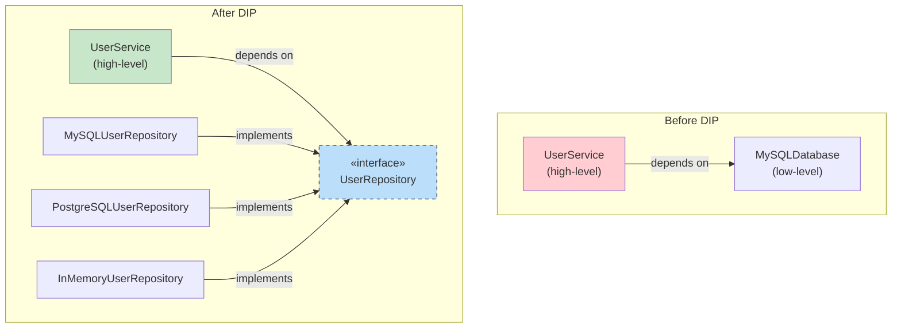
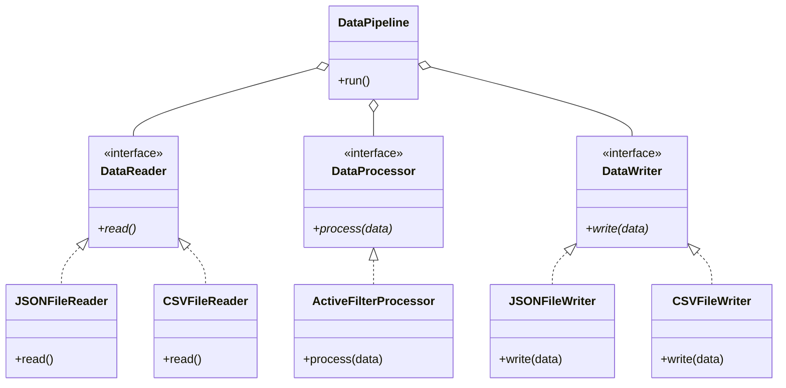
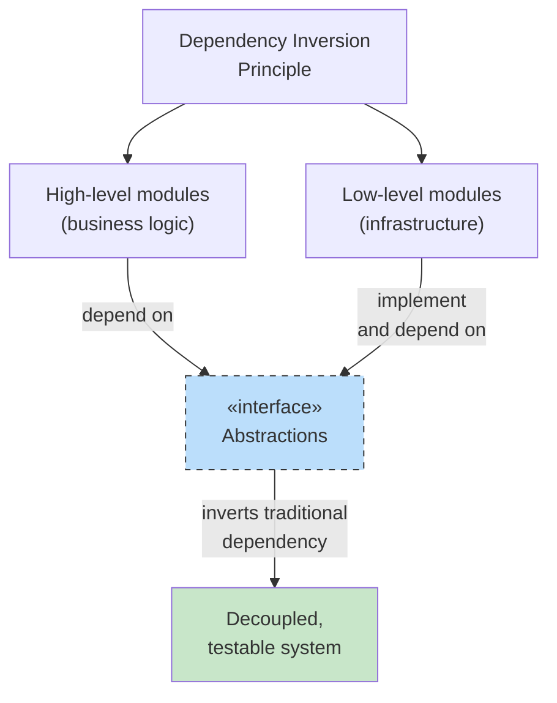

# Dependency Inversion Principle (DIP)

> **High-level modules should not depend on low-level modules. Both should depend on abstractions.**
> **Abstractions should not depend on details. Details should depend on abstractions.**

The Dependency Inversion Principle is the fifth and final SOLID principle. It inverts the traditional dependency direction: instead of high-level code depending on low-level implementation details, both depend on abstract interfaces.

## The Problem: Tight Coupling

When high-level business logic directly depends on low-level implementations (database drivers, file systems, external APIs), any change to those low-level details forces changes in the high-level logic.

### BEFORE: DIP Violation

```python
import sqlite3
from pathlib import Path
from typing import Any

class MySQLDatabase:
    """Low-level module — concrete implementation."""

    def __init__(self, connection_string: str):
        self.connection_string = connection_string
        self._conn: Any = None

    def connect(self) -> None:
        print(f"Connecting to MySQL: {self.connection_string}")
        # In real code: self._conn = mysql.connector.connect(...)

    def save_user(self, user_id: int, name: str, email: str) -> None:
        print(f"MySQL: INSERT INTO users ({user_id}, {name}, {email})")
        # self._conn.execute("INSERT INTO users ...")

    def get_user(self, user_id: int) -> dict | None:
        print(f"MySQL: SELECT * FROM users WHERE id = {user_id}")
        # row = self._conn.execute("SELECT ...")
        return {"id": user_id, "name": "Alice", "email": "alice@example.com"}

class UserService:
    """High-level module — directly depends on MySQLDatabase."""

    def __init__(self):
        self.db = MySQLDatabase("mysql://localhost:3306/mydb")

    def register_user(self, user_id: int, name: str, email: str) -> dict:
        print("Validating user data...")
        if not name or not email:
            raise ValueError("Name and email are required")
        self.db.connect()
        self.db.save_user(user_id, name, email)
        return {"id": user_id, "name": name, "email": email}

    def get_user_profile(self, user_id: int) -> dict | None:
        self.db.connect()
        return self.db.get_user(user_id)
```

> [!WARNING]
> `UserService` (high-level) depends directly on `MySQLDatabase` (low-level). If you want to switch to PostgreSQL, MongoDB, or a mock for testing, you must change `UserService`.

```python
# Problem: What if we want to test without a real database?
service = UserService()
result = service.register_user(1, "Alice", "alice@example.com")
# This hits the real database or crashes if MySQL isn't running!
```

### Problems with this design:

| Problem | Impact |
|---------|--------|
| **Tight coupling** | High-level code tied to specific database |
| **Hard to test** | Can't unit test without real database |
| **No swapping** | Changing database requires changing business logic |
| **Violates SRP** | Business logic knows about database connection details |

### AFTER: DIP-Compliant Refactoring

```python
from abc import ABC, abstractmethod
from typing import Optional

# --- Abstraction (the "inversion") ---

class UserRepository(ABC):
    """Abstraction — both high and low level depend on this."""

    @abstractmethod
    def connect(self) -> None:
        pass

    @abstractmethod
    def save(self, user_id: int, name: str, email: str) -> None:
        pass

    @abstractmethod
    def find_by_id(self, user_id: int) -> Optional[dict]:
        pass

# --- Low-level implementations depend on abstraction ---

class MySQLUserRepository(UserRepository):
    def __init__(self, connection_string: str):
        self.connection_string = connection_string

    def connect(self) -> None:
        print(f"Connecting to MySQL: {self.connection_string}")

    def save(self, user_id: int, name: str, email: str) -> None:
        print(f"MySQL: INSERT INTO users ({user_id}, {name}, {email})")

    def find_by_id(self, user_id: int) -> Optional[dict]:
        print(f"MySQL: SELECT * FROM users WHERE id = {user_id}")
        return {"id": user_id, "name": "Alice", "email": "alice@example.com"}

class PostgreSQLUserRepository(UserRepository):
    def __init__(self, connection_string: str):
        self.connection_string = connection_string

    def connect(self) -> None:
        print(f"Connecting to PostgreSQL: {self.connection_string}")

    def save(self, user_id: int, name: str, email: str) -> None:
        print(f"PostgreSQL: INSERT INTO users ({user_id}, {name}, {email})")

    def find_by_id(self, user_id: int) -> Optional[dict]:
        print(f"PostgreSQL: SELECT * FROM users WHERE id = {user_id}")
        return {"id": user_id, "name": "Alice", "email": "alice@example.com"}

class InMemoryUserRepository(UserRepository):
    """Mock repository for testing — no real database needed."""

    def __init__(self):
        self._users: dict[int, dict] = {}

    def connect(self) -> None:
        pass  # No connection needed

    def save(self, user_id: int, name: str, email: str) -> None:
        self._users[user_id] = {"id": user_id, "name": name, "email": email}
        print(f"InMemory: Saved user {user_id}")

    def find_by_id(self, user_id: int) -> Optional[dict]:
        return self._users.get(user_id)

# --- High-level module depends only on abstraction ---

class UserService:
    """Business logic depends on UserRepository abstraction, not on MySQL."""

    def __init__(self, repo: UserRepository):
        self._repo = repo

    def register_user(self, user_id: int, name: str, email: str) -> dict:
        print("Validating user data...")
        if not name or not email:
            raise ValueError("Name and email are required")
        self._repo.connect()
        self._repo.save(user_id, name, email)
        return {"id": user_id, "name": name, "email": email}

    def get_user_profile(self, user_id: int) -> dict | None:
        self._repo.connect()
        return self._repo.find_by_id(user_id)

# --- Usage ---

# Production: MySQL
mysql_repo = MySQLUserRepository("mysql://localhost:3306/mydb")
service = UserService(mysql_repo)
service.register_user(1, "Alice", "alice@example.com")

# Testing: In-memory
test_repo = InMemoryUserRepository()
test_service = UserService(test_repo)
test_service.register_user(1, "Bob", "bob@example.com")
profile = test_service.get_user_profile(1)
print(profile)  # {"id": 1, "name": "Bob", "email": "bob@example.com"}

# Future: PostgreSQL
pg_repo = PostgreSQLUserRepository("postgresql://localhost:5432/mydb")
new_service = UserService(pg_repo)
new_service.register_user(2, "Charlie", "charlie@example.com")
```

> [!SUCCESS]
> `UserService` no longer depends on `MySQLUserRepository`. Both depend on the `UserRepository` abstraction. You can swap implementations without changing business logic — perfect for testing, migration, or supporting multiple databases.



## Dependency Injection: The Mechanism for DIP

Dependency Injection (DI) is the primary technique to achieve DIP. Instead of a class creating its dependencies, they are "injected" from the outside:

```python
# Without DI (hard-coded dependency)
class EmailService:
    def __init__(self):
        self.smtp = SmtpClient("smtp.company.com")  # Created internally

# With DI (dependencies injected)
class EmailService:
    def __init__(self, smtp: SmtpClient):  # Injected
        self.smtp = smtp
```

### Three Forms of Dependency Injection

```python
from abc import ABC, abstractmethod

class Logger(ABC):
    @abstractmethod
    def log(self, message: str) -> None:
        pass

class ConsoleLogger(Logger):
    def log(self, message: str) -> None:
        print(f"[LOG] {message}")

class FileLogger(Logger):
    def __init__(self, path: str = "app.log"):
        self.path = path

    def log(self, message: str) -> None:
        from pathlib import Path
        Path(self.path).write_text(f"{message}\n")

# 1. Constructor Injection (most common)
class PaymentService:
    def __init__(self, logger: Logger):  # Injected via constructor
        self.logger = logger

    def process(self, amount: float) -> None:
        self.logger.log(f"Processing payment: ${amount:.2f}")

# 2. Setter Injection
class ShoppingCart:
    def __init__(self):
        self.logger: Logger | None = None

    def set_logger(self, logger: Logger) -> None:  # Injected via setter
        self.logger = logger

    def checkout(self) -> None:
        if self.logger:
            self.logger.log("Checkout completed")

# 3. Method Injection (parameter)
class OrderProcessor:
    def process_order(self, order_id: int, logger: Logger) -> None:  # Injected via method
        logger.log(f"Processing order: {order_id}")

# Usage
logger = ConsoleLogger()
service = PaymentService(logger)  # Constructor injection
service.process(100.0)

cart = ShoppingCart()
cart.set_logger(logger)  # Setter injection
cart.checkout()

processor = OrderProcessor()
processor.process_order(42, logger)  # Method injection
```

## Example 2: Notification System with DIP

**BEFORE: High-level depends on low-level**

```python
class TwilioSMSProvider:
    def send(self, phone: str, msg: str) -> None:
        print(f"Twilio: Sending SMS to {phone}")

class NotificationService:
    def __init__(self):
        self.sms = TwilioSMSProvider()  # Direct dependency!

    def notify(self, user_phone: str, message: str) -> None:
        self.sms.send(user_phone, message)
```

**AFTER: DIP applied**

```python
from abc import ABC, abstractmethod

class MessageProvider(ABC):
    @abstractmethod
    def send(self, recipient: str, message: str) -> None:
        pass

class TwilioSMSProvider(MessageProvider):
    def send(self, recipient: str, message: str) -> None:
        print(f"Twilio: Sending SMS to {recipient}: {message}")

class SendGridEmailProvider(MessageProvider):
    def send(self, recipient: str, message: str) -> None:
        print(f"SendGrid: Sending email to {recipient}: {message}")

class SlackWebhookProvider(MessageProvider):
    def send(self, recipient: str, message: str) -> None:
        print(f"Slack: Sending message to channel {recipient}: {message}")

class NotificationService:
    def __init__(self, provider: MessageProvider):
        self._provider = provider  # Depends on abstraction

    def notify(self, recipient: str, message: str) -> None:
        self._provider.send(recipient, message)

# Easy to switch providers
sms_notifier = NotificationService(TwilioSMSProvider())
sms_notifier.notify("+1234567890", "Hello via SMS!")

email_notifier = NotificationService(SendGridEmailProvider())
email_notifier.notify("user@example.com", "Hello via Email!")
```

## Example 3: File Processing Pipeline

**BEFORE: Rigid architecture**

```python
import json
from pathlib import Path

class DataPipeline:
    def __init__(self):
        self.input_path = "data.json"
        self.output_path = "output.json"

    def run(self) -> None:
        raw = Path(self.input_path).read_text()
        data = json.loads(raw)
        processed = [item for item in data if item.get("active")]
        Path(self.output_path).write_text(json.dumps(processed, indent=2))
        print(f"Processed {len(processed)} records")
```

**AFTER: Flexible with DIP**

```python
from abc import ABC, abstractmethod
from typing import Any

class DataReader(ABC):
    @abstractmethod
    def read(self) -> list[dict[str, Any]]:
        pass

class DataWriter(ABC):
    @abstractmethod
    def write(self, data: list[dict[str, Any]]) -> None:
        pass

class DataProcessor(ABC):
    @abstractmethod
    def process(self, data: list[dict[str, Any]]) -> list[dict[str, Any]]:
        pass

class JSONFileReader(DataReader):
    def __init__(self, path: str):
        self.path = path

    def read(self) -> list[dict[str, Any]]:
        import json
        from pathlib import Path
        return json.loads(Path(self.path).read_text())

class CSVFileReader(DataReader):
    def __init__(self, path: str):
        self.path = path

    def read(self) -> list[dict[str, Any]]:
        import csv
        with open(self.path) as f:
            return list(csv.DictReader(f))

class JSONFileWriter(DataWriter):
    def __init__(self, path: str):
        self.path = path

    def write(self, data: list[dict[str, Any]]) -> None:
        import json
        from pathlib import Path
        Path(self.path).write_text(json.dumps(data, indent=2))

class CSVFileWriter(DataWriter):
    def __init__(self, path: str):
        self.path = path

    def write(self, data: list[dict[str, Any]]) -> None:
        import csv
        if not data:
            return
        with open(self.path, "w", newline="") as f:
            writer = csv.DictWriter(f, fieldnames=data[0].keys())
            writer.writeheader()
            writer.writerows(data)

class ActiveFilterProcessor(DataProcessor):
    def process(self, data: list[dict[str, Any]]) -> list[dict[str, Any]]:
        return [item for item in data if item.get("active")]

class DataPipeline:
    def __init__(self, reader: DataReader, processor: DataProcessor,
                 writer: DataWriter):
        self._reader = reader
        self._processor = processor
        self._writer = writer

    def run(self) -> None:
        raw = self._reader.read()
        processed = self._processor.process(raw)
        self._writer.write(processed)
        print(f"Pipeline: processed {len(processed)} records")

# Usage
pipeline = DataPipeline(
    reader=JSONFileReader("input.json"),
    processor=ActiveFilterProcessor(),
    writer=JSONFileWriter("output.json")
)
pipeline.run()
```



## DIP without Frameworks: Manual Wiring

You can implement DIP without any dependency injection framework:

```python
# composition_root.py — the single place where the dependency graph is built

from abc import ABC, abstractmethod

class Cache(ABC):
    @abstractmethod
    def get(self, key: str) -> str | None: pass
    @abstractmethod
    def set(self, key: str, value: str, ttl: int = 300) -> None: pass

class RedisCache(Cache):
    def __init__(self, host: str = "localhost", port: int = 6379):
        self.host = host
        self.port = port
    def get(self, key: str) -> str | None:
        print(f"Redis GET {key}")
        return None
    def set(self, key: str, value: str, ttl: int = 300) -> None:
        print(f"Redis SET {key} = {value} (ttl={ttl})")

class InMemoryCache(Cache):
    def __init__(self):
        self._store: dict[str, tuple[str, int]] = {}
    def get(self, key: str) -> str | None:
        import time
        if key in self._store:
            value, expiry = self._store[key]
            if time.time() < expiry:
                return value
            del self._store[key]
        return None
    def set(self, key: str, value: str, ttl: int = 300) -> None:
        import time
        self._store[key] = (value, time.time() + ttl)

class UserRepository(ABC):
    @abstractmethod
    def find_by_id(self, user_id: int) -> dict | None: pass

class PostgresUserRepository(UserRepository):
    def __init__(self, conn_string: str, cache: Cache):
        self.conn_string = conn_string
        self.cache = cache
    def find_by_id(self, user_id: int) -> dict | None:
        cached = self.cache.get(f"user:{user_id}")
        if cached:
            return {"id": user_id, "name": "Cached", "email": cached}
        print(f"PostgreSQL: SELECT * FROM users WHERE id = {user_id}")
        return {"id": user_id, "name": "Alice", "email": "alice@example.com"}

class AnalyticsService:
    def __init__(self, repo: UserRepository):
        self.repo = repo
    def get_user_summary(self, user_id: int) -> dict:
        user = self.repo.find_by_id(user_id)
        return {"user_id": user_id, "exists": user is not None}

# --- Composition Root ---
def create_production_services() -> AnalyticsService:
    cache = RedisCache("redis.prod.com", 6379)
    repo = PostgresUserRepository("postgresql://prod/db", cache)
    return AnalyticsService(repo)

def create_test_services() -> AnalyticsService:
    cache = InMemoryCache()
    repo = PostgresUserRepository("postgresql://test/db", cache)
    return AnalyticsService(repo)

# Usage
analytics = create_production_services()
print(analytics.get_user_summary(1))
```

> [!TIP]
> The **Composition Root** is the single place in your application where you wire up all dependencies. This is typically at application startup. Everything else in your codebase depends on abstractions.

## DIP and Testing

One of the biggest benefits of DIP is testability:

```python
from unittest.mock import Mock

# Without DIP — hard to test
class PaymentHandler:
    def __init__(self):
        self.gateway = StripeGateway()  # Can't mock this easily

    def charge(self, amount: float) -> bool:
        return self.gateway.charge(amount)

# With DIP — easy to test
class PaymentHandler:
    def __init__(self, gateway: PaymentGateway):
        self.gateway = gateway  # Can inject mock

    def charge(self, amount: float) -> bool:
        return self.gateway.charge(amount)

# Test
def test_payment_handler():
    mock_gateway = Mock()
    mock_gateway.charge.return_value = True
    handler = PaymentHandler(mock_gateway)
    assert handler.charge(100.0) == True
    mock_gateway.charge.assert_called_once_with(100.0)
```

## DIP Violations: Warning Signs

| Warning Sign | Problem |
|-------------|---------|
| `new` keyword in business logic | Creating concrete dependencies directly |
| Static method calls on concrete classes | Tight coupling to implementation |
| Using `import` for concrete implementations in high-level modules | Dependency on details |
| Hard to test without real infrastructure | High-level depends on low-level |
| Swapping implementations requires code changes | Missing abstraction layer |
| Changes in infrastructure force changes in business logic | Dependency direction is wrong |

## Comparing Approaches

| Aspect | Without DIP | With DIP |
|--------|------------|----------|
| **Dependency direction** | High-level → low-level | Both → abstraction |
| **Code reuse** | Low (tied to specific implementation) | High (swap any implementation) |
| **Testability** | Hard (needs real dependencies) | Easy (mock abstractions) |
| **Flexibility** | Low (monolithic) | High (pluggable architecture) |
| **Complexity** | Simple initially | Slightly more boilerplate |
| **Change impact** | Cascading changes | Isolated changes |

> [!NOTE]
> DIP adds some initial complexity (abstract classes, dependency injection), but it pays off dramatically as your application grows. For very small scripts, it may be overkill — use judgment.

## Relationship Between DIP and Other SOLID Principles

| Principle | Relationship |
|-----------|-------------|
| **SRP** | DIP helps achieve SRP by separating creation (wiring) from business logic |
| **OCP** | DIP enables OCP — you can add new implementations without modifying clients |
| **LSP** | DIP relies on LSP — injected implementations must be substitutable |
| **ISP** | DIP interfaces should be small (ISP) to minimize coupling between clients and implementations |



## Practice Exercises

1. Identify the DIP violation in this code and refactor it:
   ```python
   class OrderService:
       def __init__(self):
           self.email = SendGridEmailService()
           self.pdf = PDFSharpGenerator()
       def process_order(self, order_id):
           self.email.send_confirmation(order_id)
           self.pdf.generate_invoice(order_id)
   ```

2. Apply DIP to this class hierarchy:
   ```python
   class WeatherApp:
       def __init__(self):
           self.api = OpenWeatherMapAPI()
       def get_forecast(self, city):
           return self.api.fetch(city)
   ```

3. Create a `Cache` abstraction and implement `RedisCache` and `InMemoryCache`. Then use DIP to make a `ProductService` depend on the abstraction.

4. What is the Composition Root and why is it important for DIP? Where should it be placed in an application?

5. Implement a simple dependency injection container that can register and resolve services by their abstractions.

6. Refactor the following to follow DIP and enable unit testing:
   ```python
   class ReportGenerator:
       def __init__(self):
           self.db = MySQLConnection("localhost", "root", "pass")
       def generate(self, report_id):
           data = self.db.query(f"SELECT * FROM reports WHERE id={report_id}")
           html = f"<h1>Report {report_id}</h1><p>{data}</p>"
           with open(f"report_{report_id}.html", "w") as f:
               f.write(html)
   ```

7. Explain the difference between Dependency Inversion and Dependency Injection. How do they relate?

8. Design a notification system where `AlertService` depends on a `Notifier` abstraction. Implement `EmailNotifier`, `SMSNotifier`, and `SlackNotifier`. Show how DIP makes it easy to add `TeamsNotifier` later.

## Summary

- **DIP**: High-level modules should not depend on low-level modules. Both should depend on abstractions
- **Mechanism**: Dependency Injection — pass dependencies in via constructor, setter, or method parameter
- **Composition Root**: Single place to wire up the entire dependency graph
- **Benefits**: Testability, flexibility, swapability, reduced coupling
- **Testing**: Mock abstractions, not concrete classes
- **DIP + Other SOLID**: DIP enables OCP (new implementations without modifying clients) and relies on LSP/ISP for the abstractions
- **Trade-off**: More interfaces, but far more maintainable as the system grows

> [!SUCCESS]
> DIP is the cornerstone of clean architecture. By inverting dependencies toward abstractions, you create a system where business logic is independent of infrastructure — making it testable, flexible, and resilient to change.
