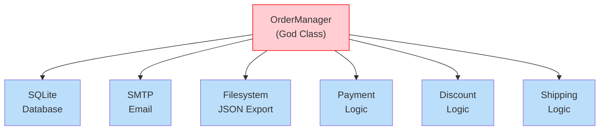
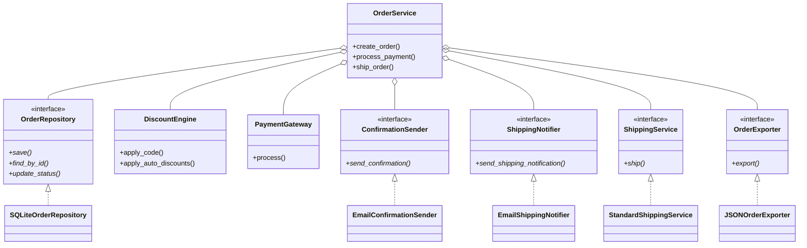

# SOLID in Practice

This lesson brings all five SOLID principles together in a realistic case study. You'll see a messy, tightly-coupled order management system and refactor it step by step using SOLID principles.

## The Case Study: Order Management System

We have a legacy system that processes e-commerce orders. It's functional but suffers from every SOLID violation imaginable. Let's analyze it, identify problems, and refactor systematically.

### BEFORE: The Legacy Monolith

```python
import json
import smtplib
import sqlite3
from email.message import EmailMessage
from pathlib import Path
from typing import Any

class OrderManager:
    def __init__(self):
        self.db_path = "orders.db"
        self._init_db()

    def _init_db(self) -> None:
        with sqlite3.connect(self.db_path) as conn:
            conn.execute("""
                CREATE TABLE IF NOT EXISTS orders (
                    id INTEGER PRIMARY KEY AUTOINCREMENT,
                    customer_email TEXT NOT NULL,
                    items TEXT NOT NULL,
                    total REAL NOT NULL,
                    status TEXT DEFAULT 'pending',
                    discount_code TEXT
                )
            """)

    def create_order(self, customer_email: str,
                     items: list[dict[str, Any]],
                     discount_code: str | None = None) -> int:
        total = 0.0
        for item in items:
            total += item["price"] * item["quantity"]

        if discount_code:
            if discount_code == "SAVE10":
                total *= 0.9
            elif discount_code == "SAVE20":
                total *= 0.8
            elif discount_code == "FREESHIP":
                pass
            else:
                raise ValueError(f"Unknown discount code: {discount_code}")

        if total > 1000:
            total *= 0.95

        items_json = json.dumps(items)
        with sqlite3.connect(self.db_path) as conn:
            cur = conn.execute(
                "INSERT INTO orders (customer_email, items, total, discount_code) VALUES (?, ?, ?, ?)",
                (customer_email, items_json, total, discount_code)
            )
            order_id = cur.lastrowid

        html = f"""<html><body>
<h1>Order #{order_id} Confirmation</h1>
<p>Thank you for your order!</p>
<p>Total: ${total:.2f}</p>
</body></html>"""
        msg = EmailMessage()
        msg["Subject"] = f"Order #{order_id} Confirmation"
        msg["From"] = "orders@store.com"
        msg["To"] = customer_email
        msg.set_content(html, subtype="html")

        with smtplib.SMTP("smtp.store.com") as server:
            server.send_message(msg)

        with open(f"order_{order_id}.json", "w") as f:
            json.dump({
                "order_id": order_id,
                "customer": customer_email,
                "items": items,
                "total": total,
                "status": "pending"
            }, f, indent=2)

        print(f"Order {order_id} created. Total: ${total:.2f}")
        return order_id

    def process_payment(self, order_id: int, payment_type: str,
                        payment_details: dict[str, Any]) -> str:
        with sqlite3.connect(self.db_path) as conn:
            row = conn.execute(
                "SELECT total, status FROM orders WHERE id = ?", (order_id,)
            ).fetchone()
            if not row:
                raise ValueError(f"Order {order_id} not found")
            total, status = row
            if status == "paid":
                raise ValueError(f"Order {order_id} already paid")

        if payment_type == "credit_card":
            card = payment_details.get("card_number", "")
            if len(str(card)) != 16:
                raise ValueError("Invalid card number")
            txn = f"cc_{hash(card)}_{order_id}"
            print(f"Processing credit card payment: ${total:.2f}")

        elif payment_type == "paypal":
            email = payment_details.get("email", "")
            if "@" not in email:
                raise ValueError("Invalid PayPal email")
            txn = f"pp_{hash(email)}_{order_id}"
            print(f"Processing PayPal payment: ${total:.2f}")

        elif payment_type == "bank_transfer":
            acct = payment_details.get("account_number", "")
            if len(str(acct)) < 8:
                raise ValueError("Invalid account number")
            txn = f"bt_{hash(acct)}_{order_id}"
            print(f"Processing bank transfer: ${total:.2f}")

        else:
            raise ValueError(f"Unknown payment type: {payment_type}")

        with sqlite3.connect(self.db_path) as conn:
            conn.execute(
                "UPDATE orders SET status = 'paid' WHERE id = ?",
                (order_id,)
            )
        return txn

    def ship_order(self, order_id: int) -> str:
        with sqlite3.connect(self.db_path) as conn:
            row = conn.execute(
                "SELECT status, customer_email FROM orders WHERE id = ?",
                (order_id,)
            ).fetchone()
            if not row:
                raise ValueError(f"Order {order_id} not found")
            status, email = row
            if status != "paid":
                raise ValueError(f"Order {order_id} not paid yet")

        tracking = f"TRACK{order_id:06d}"
        with sqlite3.connect(self.db_path) as conn:
            conn.execute(
                "UPDATE orders SET status = 'shipped' WHERE id = ?",
                (order_id,)
            )

        msg = EmailMessage()
        msg["Subject"] = f"Order #{order_id} Shipped!"
        msg["From"] = "orders@store.com"
        msg["To"] = email
        msg.set_content(f"Your order #{order_id} has been shipped. Tracking: {tracking}")
        with smtplib.SMTP("smtp.store.com") as server:
            server.send_message(msg)

        print(f"Order {order_id} shipped. Tracking: {tracking}")
        return tracking

manager = OrderManager()
order_id = manager.create_order("alice@example.com", [
    {"name": "Laptop", "price": 1200, "quantity": 1},
    {"name": "Mouse", "price": 25, "quantity": 2},
], "SAVE10")
manager.process_payment(order_id, "credit_card", {"card_number": 1234567812345678})
manager.ship_order(order_id)
```

> [!WARNING]
> This `OrderManager` class violates ALL five SOLID principles. Let's identify each violation.

### Identifying SOLID Violations

| Principle | Violation | Evidence |
|-----------|-----------|----------|
| **SRP** | 5+ responsibilities | Database, discounts, email, file export, payment, shipping — all in one class |
| **OCP** | if/elif chains for payment types and discounts | Adding a new payment type or discount requires modifying existing code |
| **LSP** | Not directly applicable yet, but potential if we create naive subclasses | Any subclass of this monolith would be impossible |
| **ISP** | All clients depend on the entire interface | A "read-only order reporter" would need all methods |
| **DIP** | High-level logic depends on SQLite, SMTP, filesystem directly | Can't test business logic without a real database or email server |



## Step 1: Apply SRP — Separate Responsibilities

```python
from abc import ABC, abstractmethod
from dataclasses import dataclass, field
from typing import Any, Optional
from pathlib import Path
import json

# --- Domain Models ---

@dataclass
class OrderItem:
    name: str
    price: float
    quantity: int

    def total(self) -> float:
        return self.price * self.quantity

@dataclass
class Order:
    id: Optional[int] = None
    customer_email: str = ""
    items: list[OrderItem] = field(default_factory=list)
    total: float = 0.0
    status: str = "pending"
    discount_code: Optional[str] = None

    def add_item(self, name: str, price: float, quantity: int) -> None:
        self.items.append(OrderItem(name, price, quantity))

    def calculate_total(self) -> float:
        return sum(item.total() for item in self.items)

# --- Responsibility 1: Repository (Persistence) ---

class OrderRepository(ABC):
    @abstractmethod
    def save(self, order: Order) -> int:
        pass

    @abstractmethod
    def find_by_id(self, order_id: int) -> Optional[Order]:
        pass

    @abstractmethod
    def update_status(self, order_id: int, status: str) -> None:
        pass

class SQLiteOrderRepository(OrderRepository):
    def __init__(self, db_path: str = "orders.db"):
        self.db_path = db_path
        self._init_db()

    def _init_db(self) -> None:
        import sqlite3
        with sqlite3.connect(self.db_path) as conn:
            conn.execute("""
                CREATE TABLE IF NOT EXISTS orders (
                    id INTEGER PRIMARY KEY AUTOINCREMENT,
                    customer_email TEXT NOT NULL,
                    items TEXT NOT NULL,
                    total REAL NOT NULL,
                    status TEXT DEFAULT 'pending',
                    discount_code TEXT
                )
            """)

    def save(self, order: Order) -> int:
        import sqlite3
        items_json = json.dumps([
            {"name": i.name, "price": i.price, "quantity": i.quantity}
            for i in order.items
        ])
        with sqlite3.connect(self.db_path) as conn:
            cur = conn.execute(
                "INSERT INTO orders (customer_email, items, total, discount_code) VALUES (?, ?, ?, ?)",
                (order.customer_email, items_json, order.total, order.discount_code)
            )
            return cur.lastrowid

    def find_by_id(self, order_id: int) -> Optional[Order]:
        import sqlite3
        with sqlite3.connect(self.db_path) as conn:
            row = conn.execute(
                "SELECT id, customer_email, items, total, status, discount_code FROM orders WHERE id = ?",
                (order_id,)
            ).fetchone()
            if not row:
                return None
            items_data = json.loads(row[2])
            items = [OrderItem(**i) for i in items_data]
            return Order(
                id=row[0], customer_email=row[1], items=items,
                total=row[3], status=row[4], discount_code=row[5]
            )

    def update_status(self, order_id: int, status: str) -> None:
        import sqlite3
        with sqlite3.connect(self.db_path) as conn:
            conn.execute(
                "UPDATE orders SET status = ? WHERE id = ?",
                (status, order_id)
            )

# --- Responsibility 2: Discounts (strategy pattern, OCP) ---

class DiscountStrategy(ABC):
    @abstractmethod
    def apply(self, total: float) -> float:
        pass

    @abstractmethod
    def code(self) -> str:
        pass

class Save10Discount(DiscountStrategy):
    def code(self) -> str:
        return "SAVE10"

    def apply(self, total: float) -> float:
        return total * 0.9

class Save20Discount(DiscountStrategy):
    def code(self) -> str:
        return "SAVE20"

    def apply(self, total: float) -> float:
        return total * 0.8

class FreeShipDiscount(DiscountStrategy):
    def code(self) -> str:
        return "FREESHIP"

    def apply(self, total: float) -> float:
        return total  # Free shipping — no discount on items

class BulkDiscount(DiscountStrategy):
    """Discount for orders over $1000."""

    def code(self) -> str:
        return "BULK5"

    def apply(self, total: float) -> float:
        return total * 0.95 if total > 1000 else total

class DiscountEngine:
    def __init__(self):
        self._strategies: dict[str, DiscountStrategy] = {}
        self._auto_discounts: list[DiscountStrategy] = []

    def register(self, strategy: DiscountStrategy) -> None:
        self._strategies[strategy.code()] = strategy

    def add_auto_discount(self, strategy: DiscountStrategy) -> None:
        self._auto_discounts.append(strategy)

    def apply_code(self, code: str, total: float) -> float:
        strategy = self._strategies.get(code.upper())
        if not strategy:
            raise ValueError(f"Unknown discount code: {code}")
        return strategy.apply(total)

    def apply_auto_discounts(self, total: float) -> float:
        for strategy in self._auto_discounts:
            total = strategy.apply(total)
        return total
```

> [!SUCCESS]
> **SRP satisfied**: Each class has one responsibility. **OCP satisfied**: New discounts are added by creating new strategy classes, not by modifying existing code.

## Step 2: Apply OCP — Payment Methods

```python
# --- Responsibility 3: Payment (OCP, strategy pattern) ---

class PaymentMethod(ABC):
    @abstractmethod
    def charge(self, amount: float, details: dict[str, Any]) -> str:
        pass

    @abstractmethod
    def validate(self, details: dict[str, Any]) -> None:
        pass

class CreditCardPayment(PaymentMethod):
    def validate(self, details: dict[str, Any]) -> None:
        card = details.get("card_number")
        if not card or len(str(card)) != 16:
            raise ValueError("Invalid card number")
        if not details.get("cvv"):
            raise ValueError("Missing CVV")

    def charge(self, amount: float, details: dict[str, Any]) -> str:
        self.validate(details)
        card = str(details["card_number"])
        print(f"Charging ${amount:.2f} to card ending in {card[-4:]}")
        return f"cc_{hash(card)}"

class PayPalPayment(PaymentMethod):
    def validate(self, details: dict[str, Any]) -> None:
        email = details.get("email", "")
        if "@" not in email:
            raise ValueError("Invalid PayPal email")

    def charge(self, amount: float, details: dict[str, Any]) -> str:
        self.validate(details)
        print(f"Processing ${amount:.2f} via PayPal for {details['email']}")
        return f"pp_{hash(details['email'])}"

class BankTransferPayment(PaymentMethod):
    def validate(self, details: dict[str, Any]) -> None:
        acct = details.get("account_number", "")
        if len(str(acct)) < 8:
            raise ValueError("Invalid account number")

    def charge(self, amount: float, details: dict[str, Any]) -> str:
        self.validate(details)
        print(f"Transferring ${amount:.2f} from {details['account_number'][-4:]}")
        return f"bt_{hash(str(details['account_number']))}"

class PaymentGateway:
    def __init__(self):
        self._methods: dict[str, PaymentMethod] = {}

    def register_method(self, name: str, method: PaymentMethod) -> None:
        self._methods[name] = method

    def process(self, method_name: str, amount: float,
                details: dict[str, Any]) -> str:
        method = self._methods.get(method_name)
        if not method:
            raise ValueError(f"Unknown payment method: {method_name}")
        return method.charge(amount, details)
```

> [!SUCCESS]
> **OCP satisfied**: New payment methods are added by creating new subclasses and registering them. No existing code is modified.

## Step 3: Apply ISP — Segregated Interfaces

```python
# --- Responsibility 4: Notifications (ISP) ---

class ConfirmationSender(ABC):
    @abstractmethod
    def send_confirmation(self, order: Order) -> None:
        pass

class ShippingNotifier(ABC):
    @abstractmethod
    def send_shipping_notification(self, order: Order, tracking: str) -> None:
        pass

class EmailConfirmationSender(ConfirmationSender):
    def __init__(self, smtp_host: str = "smtp.store.com",
                 from_addr: str = "orders@store.com"):
        self.smtp_host = smtp_host
        self.from_addr = from_addr

    def send_confirmation(self, order: Order) -> None:
        import smtplib
        from email.message import EmailMessage
        msg = EmailMessage()
        msg["Subject"] = f"Order #{order.id} Confirmation"
        msg["From"] = self.from_addr
        msg["To"] = order.customer_email
        items_html = "".join(
            f"<tr><td>{i.name}</td><td>{i.quantity}</td><td>${i.price:.2f}</td></tr>"
            for i in order.items
        )
        html = f"""<html><body>
<h1>Order #{order.id} Confirmation</h1>
<p>Thank you for your order!</p>
<table><tr><th>Item</th><th>Qty</th><th>Price</th></tr>{items_html}</table>
<p><strong>Total: ${order.total:.2f}</strong></p>
</body></html>"""
        msg.set_content(html, subtype="html")
        with smtplib.SMTP(self.smtp_host) as server:
            server.send_message(msg)

class EmailShippingNotifier(ShippingNotifier):
    def __init__(self, smtp_host: str = "smtp.store.com",
                 from_addr: str = "orders@store.com"):
        self.smtp_host = smtp_host
        self.from_addr = from_addr

    def send_shipping_notification(self, order: Order, tracking: str) -> None:
        import smtplib
        from email.message import EmailMessage
        msg = EmailMessage()
        msg["Subject"] = f"Order #{order.id} Shipped!"
        msg["From"] = self.from_addr
        msg["To"] = order.customer_email
        msg.set_content(
            f"Your order #{order.id} has been shipped!\n"
            f"Tracking number: {tracking}"
        )
        with smtplib.SMTP(self.smtp_host) as server:
            server.send_message(msg)

# --- Responsibility 5: File Export (ISP, SRP) ---

class OrderExporter(ABC):
    @abstractmethod
    def export(self, order: Order) -> None:
        pass

class JSONOrderExporter(OrderExporter):
    def __init__(self, output_dir: str = "."):
        self.output_dir = Path(output_dir)

    def export(self, order: Order) -> None:
        data = {
            "order_id": order.id,
            "customer": order.customer_email,
            "items": [
                {"name": i.name, "price": i.price, "quantity": i.quantity}
                for i in order.items
            ],
            "total": order.total,
            "status": order.status
        }
        path = self.output_dir / f"order_{order.id}.json"
        path.write_text(json.dumps(data, indent=2))
        print(f"Order exported to {path}")

# --- Responsibility 6: Shipping ---

class ShippingService(ABC):
    @abstractmethod
    def ship(self, order: Order) -> str:
        pass

class StandardShippingService(ShippingService):
    def ship(self, order: Order) -> str:
        tracking = f"TRACK{order.id:06d}"
        print(f"Shipping order {order.id} via standard. Tracking: {tracking}")
        return tracking
```

> [!SUCCESS]
> **ISP satisfied**: Each interface is small and focused. Notification senders and exporters each have exactly the methods they need.

## Step 4: Apply DIP — Compose Everything

```python
# --- Responsibility 7: Business Logic (high-level, depends on abstractions) ---

class OrderService:
    """High-level business logic — depends only on abstractions."""

    def __init__(
        self,
        repo: OrderRepository,
        discount_engine: DiscountEngine,
        payment_gateway: PaymentGateway,
        confirmation_sender: ConfirmationSender,
        shipping_notifier: ShippingNotifier,
        shipping_service: ShippingService,
        exporter: OrderExporter,
    ):
        self._repo = repo
        self._discounts = discount_engine
        self._payment = payment_gateway
        self._confirmation = confirmation_sender
        self._shipping_notifier = shipping_notifier
        self._shipping = shipping_service
        self._exporter = exporter

    def create_order(
        self,
        customer_email: str,
        items_data: list[dict[str, Any]],
        discount_code: str | None = None,
    ) -> Order:
        order = Order(customer_email=customer_email, discount_code=discount_code)
        for item in items_data:
            order.add_item(item["name"], item["price"], item["quantity"])

        total = order.calculate_total()
        total = self._discounts.apply_auto_discounts(total)
        if discount_code:
            total = self._discounts.apply_code(discount_code, total)
        order.total = total

        order.id = self._repo.save(order)
        self._exporter.export(order)
        self._confirmation.send_confirmation(order)
        print(f"Order {order.id} created. Total: ${order.total:.2f}")
        return order

    def process_payment(self, order_id: int, method: str,
                        details: dict[str, Any]) -> str:
        order = self._repo.find_by_id(order_id)
        if not order:
            raise ValueError(f"Order {order_id} not found")
        if order.status == "paid":
            raise ValueError(f"Order {order_id} already paid")

        txn_id = self._payment.process(method, order.total, details)
        self._repo.update_status(order_id, "paid")
        print(f"Order {order_id} paid (txn: {txn_id})")
        return txn_id

    def ship_order(self, order_id: int) -> str:
        order = self._repo.find_by_id(order_id)
        if not order:
            raise ValueError(f"Order {order_id} not found")
        if order.status != "paid":
            raise ValueError(f"Order {order_id} not paid yet")

        tracking = self._shipping.ship(order)
        self._repo.update_status(order_id, "shipped")
        self._shipping_notifier.send_shipping_notification(order, tracking)
        return tracking
```

> [!SUCCESS]
> **DIP satisfied**: `OrderService` depends only on abstractions (interfaces/ABCs), never on concrete implementations.



## Step 5: Wire Everything Together (Composition Root)

```python
def create_order_system() -> OrderService:
    """Composition Root — the single place where we wire dependencies."""

    # Infrastructure
    repo = SQLiteOrderRepository("orders.db")
    payment_gateway = PaymentGateway()
    payment_gateway.register_method("credit_card", CreditCardPayment())
    payment_gateway.register_method("paypal", PayPalPayment())
    payment_gateway.register_method("bank_transfer", BankTransferPayment())

    confirmation_sender = EmailConfirmationSender("smtp.store.com")
    shipping_notifier = EmailShippingNotifier("smtp.store.com")
    shipping_service = StandardShippingService()
    exporter = JSONOrderExporter(".")

    # Discounts
    discount_engine = DiscountEngine()
    discount_engine.register(Save10Discount())
    discount_engine.register(Save20Discount())
    discount_engine.register(FreeShipDiscount())
    discount_engine.register(BulkDiscount())

    return OrderService(
        repo=repo,
        discount_engine=discount_engine,
        payment_gateway=payment_gateway,
        confirmation_sender=confirmation_sender,
        shipping_notifier=shipping_notifier,
        shipping_service=shipping_service,
        exporter=exporter,
    )

# --- Usage ---
order_system = create_order_system()

order = order_system.create_order(
    customer_email="alice@example.com",
    items_data=[
        {"name": "Laptop", "price": 1200, "quantity": 1},
        {"name": "Mouse", "price": 25, "quantity": 2},
    ],
    discount_code="SAVE10",
)

order_system.process_payment(order.id, "credit_card", {
    "card_number": 1234567812345678,
    "cvv": "123",
})

order_system.ship_order(order.id)
```

## Step 6: Testing with DIP

```python
# test_order_service.py — testing with mock implementations

def test_create_order_with_discount():
    # Arrange — use in-memory implementations
    repo = InMemoryOrderRepository()
    discount_engine = DiscountEngine()
    discount_engine.register(Save10Discount())

    payment_gateway = PaymentGateway()
    mock_sender = MockConfirmationSender()
    mock_notifier = MockShippingNotifier()
    mock_shipping = MockShippingService()
    mock_exporter = MockOrderExporter()

    service = OrderService(
        repo=repo,
        discount_engine=discount_engine,
        payment_gateway=payment_gateway,
        confirmation_sender=mock_sender,
        shipping_notifier=mock_notifier,
        shipping_service=mock_shipping,
        exporter=mock_exporter,
    )

    # Act
    order = service.create_order("test@example.com", [
        {"name": "Item", "price": 100, "quantity": 2},
    ], "SAVE10")

    # Assert
    assert order.total == 180.0  # 200 * 0.9
    assert order.status == "pending"
    assert mock_sender.sent_count == 1
    assert mock_exporter.exported_count == 1

# Mock implementations (in-memory + recording)
class InMemoryOrderRepository(OrderRepository):
    def __init__(self):
        self._orders: dict[int, Order] = {}
        self._next_id = 1

    def save(self, order: Order) -> int:
        order_id = self._next_id
        self._next_id += 1
        order.id = order_id
        self._orders[order_id] = order
        return order_id

    def find_by_id(self, order_id: int) -> Optional[Order]:
        return self._orders.get(order_id)

    def update_status(self, order_id: int, status: str) -> None:
        if order_id in self._orders:
            self._orders[order_id].status = status

class MockConfirmationSender(ConfirmationSender):
    def __init__(self):
        self.sent_count = 0
    def send_confirmation(self, order: Order) -> None:
        self.sent_count += 1

class MockShippingNotifier(ShippingNotifier):
    def __init__(self):
        self.sent_count = 0
    def send_shipping_notification(self, order: Order, tracking: str) -> None:
        self.sent_count += 1

class MockShippingService(ShippingService):
    def ship(self, order: Order) -> str:
        return f"MOCK{order.id:06d}"

class MockOrderExporter(OrderExporter):
    def __init__(self):
        self.exported_count = 0
    def export(self, order: Order) -> None:
        self.exported_count += 1
```

## Before and After Comparison

| Aspect | Before (Monolith) | After (SOLID) |
|--------|------------------|---------------|
| **Lines per class** | ~180 lines (one class) | ~20-40 lines each |
| **Testability** | Impossible without real DB/email | Full unit testing with mocks |
| **Adding payment methods** | Modify `OrderManager`, add elif | Create new `PaymentMethod` subclass, register |
| **Adding discount codes** | Modify `OrderManager`, add elif | Create new `DiscountStrategy` subclass, register |
| **Changing database** | Rewrite `OrderManager` | Implement new `OrderRepository` |
| **Changing email provider** | Rewrite `OrderManager` | Implement new `ConfirmationSender` |
| **Dependencies** | All hard-coded | All injected (DIP) |
| **Class count** | 1 class | 15+ focused classes |

> [!NOTE]
> The SOLID-refactored version has more classes but each is simpler, more focused, and independently testable. The total lines of code may be higher, but the cognitive load per class is dramatically lower.

## Adding New Features (Demonstrating OCP)

```python
# --- New payment method: no existing code changes ---
class ApplePayPayment(PaymentMethod):
    def validate(self, details: dict[str, Any]) -> None:
        if not details.get("device_token"):
            raise ValueError("Missing Apple Pay device token")

    def charge(self, amount: float, details: dict[str, Any]) -> str:
        self.validate(details)
        token = details["device_token"]
        print(f"Processing ${amount:.2f} via Apple Pay")
        return f"ap_{hash(token)}"

# Register it
order_system = create_order_system()
order_system._payment.register_method("apple_pay", ApplePayPayment())

# --- New discount code: no existing code changes ---
class FreeShippingDiscount(DiscountStrategy):
    def code(self) -> str:
        return "FREESHIPPING"
    def apply(self, total: float) -> float:
        return total  # Free shipping applied elsewhere

order_system._discounts.register(FreeShippingDiscount())
```

> [!SUCCESS]
> Adding `ApplePayPayment` and `FreeShippingDiscount` required zero changes to existing classes — just new subclasses and registration. This is the power of SOLID design.

## Practice Exercises

1. Refactor this code step by step using SOLID principles. Start with SRP, then OCP, then ISP, then DIP:
   ```python
   class DataExporter:
       def export(self, data, format, destination):
           if format == "csv":
               # convert to CSV
               pass
           elif format == "json":
               # convert to JSON
               pass
           if destination == "file":
               with open("output.txt", "w") as f:
                   f.write(data)
           elif destination == "email":
               # send via email
               pass
           elif destination == "s3":
               # upload to S3
               pass
   ```

2. Identify all SOLID violations in the legacy `OrderManager` class from this lesson. For each violation, explain which principle is violated and how.

3. In the refactored system, add a `CryptoPayment` method and a `SAVE50` discount. Show that no existing code needs modification.

4. Create a `PostgreSQLOrderRepository` that implements `OrderRepository`. What does this tell you about DIP?

5. Write a unit test for the `OrderService.create_order()` method that verifies the `ConfirmationSender.send_confirmation()` is called exactly once.

6. The current system uses email notifications. Add an `SMSConfirmationSender` using ISP — it should implement only the notification interfaces it needs.

7. How would you add an audit logging feature to the order system? Every order creation, payment, and shipment should be logged. Design it using SOLID principles.

8. Explain why the refactored system is more maintainable than the monolithic version. Give at least three concrete scenarios where the SOLID version would be easier to modify.

## Summary

- **SRP**: Separate database, discounts, payments, notifications, shipping, and export into distinct classes
- **OCP**: New payment methods and discount codes are added via new subclasses, not modification
- **ISP**: Each interface (`OrderRepository`, `ConfirmationSender`, `ShippingNotifier`) is lean and focused
- **DIP**: `OrderService` depends only on abstractions; concrete implementations are injected
- **Composition Root**: The single place where all dependencies are wired together
- **Testability**: Each component can be tested in isolation with mock implementations
- **Extensibility**: New features are added via extension, not modification

> [!SUCCESS]
> The SOLID principles aren't academic theory — they're practical tools that transform tangled monoliths into clean, maintainable, and extensible systems. This case study shows exactly how to apply them in real-world code.
