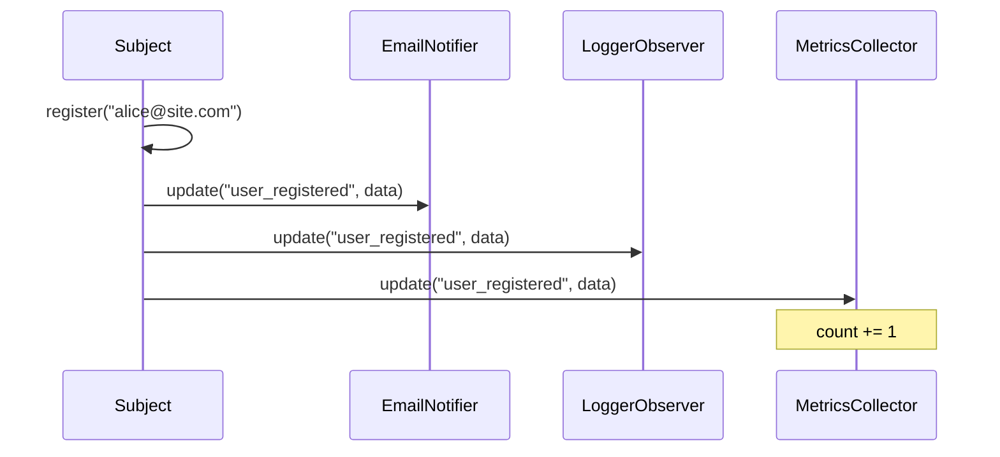

# OOP Design Best Practices

This final lesson covers essential OOP design best practices that build on the SOLID principles. You'll learn when to use (and not use) inheritance, how to apply design patterns, and principles for clean, maintainable object-oriented code.

## 1. Favor Composition Over Inheritance

Inheritance creates tight coupling — a child class is permanently tied to its parent. Composition lets you swap behaviors at runtime.

### Inheritance (Tight Coupling)

```python
class MailService:
    def send(self, to: str, subject: str, body: str) -> None:
        print(f"Sending mail to {to}: {subject}")

class WelcomeMailService(MailService):  # "Is-a" inheritance
    def send_welcome(self, email: str) -> None:
        self.send(email, "Welcome!", "Thanks for joining!")

# Problem: Can't reuse send logic without inheritance
```

### Composition (Flexible)

```python
class SmtpMailer:
    def __init__(self, host: str = "smtp.example.com"):
        self.host = host

    def send(self, to: str, subject: str, body: str) -> None:
        import smtplib
        from email.message import EmailMessage
        msg = EmailMessage()
        msg["Subject"] = subject
        msg["To"] = to
        msg.set_content(body)
        with smtplib.SMTP(self.host) as server:
            server.send_message(msg)

class WelcomeService:
    def __init__(self, mailer: SmtpMailer):  # "Has-a" composition
        self.mailer = mailer

    def send_welcome(self, email: str) -> None:
        self.mailer.send(email, "Welcome!", "Thanks for joining!")

class PasswordResetService:
    def __init__(self, mailer: SmtpMailer):
        self.mailer = mailer

    def send_reset(self, email: str, token: str) -> None:
        self.mailer.send(email, "Password Reset", f"Token: {token}")
```

| Aspect | Inheritance | Composition |
|--------|------------|-------------|
| **Relationship** | "Is-a" (Dog is-a Animal) | "Has-a" (Car has-a Engine) |
| **Coupling** | Tight (child knows parent) | Loose (depends on interface) |
| **Runtime change** | Impossible | Easy (swap components) |
| **Code reuse** | Via extension | Via delegation |
| **Testing** | Harder (parent state) | Easier (mock components) |
| **Flexibility** | Low | High |

> [!TIP]
> Use inheritance when there's a genuine "is-a" relationship AND the subclass truly needs the parent's behavior. Use composition when you just need to reuse functionality.

## 2. DRY (Don't Repeat Yourself)

Every piece of knowledge should have a single, unambiguous representation in the system.

### BEFORE: Duplication

```python
class OrderProcessor:
    def validate_order(self, order: dict) -> bool:
        if not order.get("customer_email"):
            raise ValueError("Email required")
        if "@" not in order.get("customer_email", ""):
            raise ValueError("Invalid email")
        if order.get("total", 0) <= 0:
            raise ValueError("Total must be positive")
        return True

class CustomerProcessor:
    def validate_customer(self, customer: dict) -> bool:
        if not customer.get("email"):
            raise ValueError("Email required")
        if "@" not in customer.get("email", ""):
            raise ValueError("Invalid email")
        if not customer.get("name"):
            raise ValueError("Name required")
        return True
```

### AFTER: Single Responsibility

```python
import re

class EmailValidator:
    @staticmethod
    def validate(email: str) -> str:
        if not email:
            raise ValueError("Email is required")
        if not re.match(r"[^@]+@[^@]+\.[^@]+", email):
            raise ValueError(f"Invalid email format: {email}")
        return email

class OrderValidator:
    def __init__(self, email_validator: EmailValidator):
        self._email_validator = email_validator

    def validate(self, order: dict) -> bool:
        self._email_validator.validate(order.get("customer_email", ""))
        if order.get("total", 0) <= 0:
            raise ValueError("Total must be positive")
        return True

class CustomerValidator:
    def __init__(self, email_validator: EmailValidator):
        self._email_validator = email_validator

    def validate(self, customer: dict) -> bool:
        self._email_validator.validate(customer.get("email", ""))
        if not customer.get("name"):
            raise ValueError("Name is required")
        return True
```

## 3. KISS (Keep It Simple, Stupid)

Simple code is easier to understand, test, and maintain.

### BEFORE: Over-engineered

```python
from typing import Any
from abc import ABC, abstractmethod

class NameFormatter(ABC):
    @abstractmethod
    def format(self, first: str, last: str) -> str:
        pass

class FullNameFormatter(NameFormatter):
    def format(self, first: str, last: str) -> str:
        return f"{first} {last}"

class LastNameFirstFormatter(NameFormatter):
    def format(self, first: str, last: str) -> str:
        return f"{last}, {first}"

class NameFormatterFactory:
    def __init__(self):
        self._formatters = {
            "full": FullNameFormatter(),
            "last_first": LastNameFirstFormatter(),
        }

    def get_formatter(self, style: str) -> NameFormatter:
        return self._formatters.get(style, FullNameFormatter())

class Person:
    def __init__(self, first: str, last: str, formatter: NameFormatterFactory):
        self.first = first
        self.last = last
        self.formatter = formatter

    def display_name(self, style: str = "full") -> str:
        fmt = self.formatter.get_formatter(style)
        return fmt.format(self.first, self.last)
```

### AFTER: Simple

```python
class Person:
    def __init__(self, first: str, last: str):
        self.first = first
        self.last = last

    def full_name(self) -> str:
        return f"{self.first} {self.last}"

    def last_first_name(self) -> str:
        return f"{self.last}, {self.first}"
```

> [!WARNING]
> Over-engineering is a common trap. Don't add abstractions until you actually need them. YAGNI applies here too.

## 4. YAGNI (You Ain't Gonna Need It)

Don't add functionality until it's necessary.

```python
# BAD: Adding features "just in case"
class Config:
    def __init__(self):
        self.values = {}
        self.backends = ["file", "database", "redis", "s3"]  # YAGNI!
        self.encryption = ["aes256", "blowfish", "twofish"]  # YAGNI!
        self.cache_strategies = ["lru", "ttl", "fifo"]       # YAGNI!

# GOOD: Add as needed
class Config:
    def __init__(self):
        self.values = {}

    def get(self, key: str, default=None):
        return self.values.get(key, default)

    def set(self, key: str, value):
        self.values[key] = value
```

> [!NOTE]
> YAGNI doesn't mean don't plan ahead. It means don't pay the cost of building, testing, and maintaining features you don't currently need.

## 5. Design Patterns Overview

Design patterns are proven solutions to common OOP problems. Here are the most important ones:

### Strategy Pattern (Behavioral)

```python
from abc import ABC, abstractmethod
from typing import Any

class SortStrategy(ABC):
    @abstractmethod
    def sort(self, data: list[int]) -> list[int]:
        pass

class BubbleSort(SortStrategy):
    def sort(self, data: list[int]) -> list[int]:
        arr = data[:]
        n = len(arr)
        for i in range(n):
            for j in range(0, n - i - 1):
                if arr[j] > arr[j + 1]:
                    arr[j], arr[j + 1] = arr[j + 1], arr[j]
        return arr

class QuickSort(SortStrategy):
    def sort(self, data: list[int]) -> list[int]:
        if len(data) <= 1:
            return data
        pivot = data[0]
        left = [x for x in data[1:] if x <= pivot]
        right = [x for x in data[1:] if x > pivot]
        return self.sort(left) + [pivot] + self.sort(right)

class Sorter:
    def __init__(self, strategy: SortStrategy):
        self._strategy = strategy

    def sort(self, data: list[int]) -> list[int]:
        return self._strategy.sort(data)

    def set_strategy(self, strategy: SortStrategy) -> None:
        self._strategy = strategy

sorter = Sorter(BubbleSort())
data = [3, 1, 4, 1, 5, 9, 2, 6]
print(sorter.sort(data))
sorter.set_strategy(QuickSort())
print(sorter.sort(data))
```

### Observer Pattern (Behavioral)

```python
from abc import ABC, abstractmethod
from typing import Any

class Observer(ABC):
    @abstractmethod
    def update(self, event: str, data: Any) -> None:
        pass

class Subject:
    def __init__(self):
        self._observers: list[Observer] = []

    def attach(self, observer: Observer) -> None:
        if observer not in self._observers:
            self._observers.append(observer)

    def detach(self, observer: Observer) -> None:
        self._observers.remove(observer)

    def notify(self, event: str, data: Any = None) -> None:
        for observer in self._observers:
            observer.update(event, data)

class EmailNotifier(Observer):
    def __init__(self, email: str):
        self.email = email

    def update(self, event: str, data: Any) -> None:
        print(f"[Email to {self.email}] Event: {event} - {data}")

class LoggerObserver(Observer):
    def update(self, event: str, data: Any) -> None:
        print(f"[LOG] {event}: {data}")

class MetricsCollector(Observer):
    def __init__(self):
        self.event_counts: dict[str, int] = {}

    def update(self, event: str, data: Any) -> None:
        self.event_counts[event] = self.event_counts.get(event, 0) + 1

    def report(self) -> dict:
        return dict(self.event_counts)

class UserService(Subject):
    def register(self, email: str, name: str) -> None:
        print(f"Registering user: {name} ({email})")
        self.notify("user_registered", {"email": email, "name": name})

    def delete(self, user_id: int) -> None:
        print(f"Deleting user: {user_id}")
        self.notify("user_deleted", {"user_id": user_id})

service = UserService()
service.attach(EmailNotifier("admin@site.com"))
log_obs = LoggerObserver()
service.attach(log_obs)
metrics = MetricsCollector()
service.attach(metrics)
service.register("alice@example.com", "Alice")
service.register("bob@example.com", "Bob")
service.delete(42)
print(f"Metrics: {metrics.report()}")
```



### Factory Pattern (Creational)

```python
from abc import ABC, abstractmethod

class DatabaseConnection(ABC):
    @abstractmethod
    def connect(self) -> str: pass
    @abstractmethod
    def query(self, sql: str) -> list: pass

class MySQLConnection(DatabaseConnection):
    def connect(self) -> str:
        return "Connected to MySQL"
    def query(self, sql: str) -> list:
        return [f"MySQL result: {sql}"]

class PostgreSQLConnection(DatabaseConnection):
    def connect(self) -> str:
        return "Connected to PostgreSQL"
    def query(self, sql: str) -> list:
        return [f"PostgreSQL result: {sql}"]

class DatabaseFactory:
    @staticmethod
    def create(db_type: str, **kwargs) -> DatabaseConnection:
        factories = {
            "mysql": MySQLConnection,
            "postgresql": PostgreSQLConnection,
        }
        cls = factories.get(db_type.lower())
        if not cls:
            raise ValueError(f"Unknown database type: {db_type}")
        return cls(**{k: v for k, v in kwargs.items()
                      if k in cls.__init__.__code__.co_varnames})

db = DatabaseFactory.create("mysql")
print(db.connect())
print(db.query("SELECT 1"))
```

### Decorator Pattern (Structural)

```python
from abc import ABC, abstractmethod

class Coffee(ABC):
    @abstractmethod
    def cost(self) -> float: pass
    @abstractmethod
    def description(self) -> str: pass

class SimpleCoffee(Coffee):
    def cost(self) -> float:
        return 2.0
    def description(self) -> str:
        return "Simple coffee"

class CoffeeDecorator(Coffee):
    def __init__(self, coffee: Coffee):
        self._coffee = coffee

class MilkDecorator(CoffeeDecorator):
    def cost(self) -> float:
        return self._coffee.cost() + 0.5
    def description(self) -> str:
        return f"{self._coffee.description()} + milk"

class SugarDecorator(CoffeeDecorator):
    def cost(self) -> float:
        return self._coffee.cost() + 0.25
    def description(self) -> str:
        return f"{self._coffee.description()} + sugar"

class WhippedCreamDecorator(CoffeeDecorator):
    def cost(self) -> float:
        return self._coffee.cost() + 0.75
    def description(self) -> str:
        return f"{self._coffee.description()} + whipped cream"

coffee = SimpleCoffee()
coffee = MilkDecorator(coffee)
coffee = SugarDecorator(coffee)
coffee = WhippedCreamDecorator(coffee)
print(f"{coffee.description()}: ${coffee.cost():.2f}")
# Simple coffee + milk + sugar + whipped cream: $3.50
```

## 6. Law of Demeter (Principle of Least Knowledge)

A method should only call methods on:
1. Itself
2. Its parameters
3. Objects it creates
4. Its own direct components

### BEFORE: Violation (Chain of Dots)

```python
class Customer:
    def __init__(self):
        self.wallet = Wallet()

class Wallet:
    def __init__(self):
        self.balance = 100

class Store:
    def process_purchase(self, customer: Customer, amount: float) -> bool:
        if customer.wallet.balance >= amount:  # Violation!
            customer.wallet.balance -= amount
            return True
        return False
```

### AFTER: Law of Demeter

```python
class Customer:
    def __init__(self):
        self._wallet = Wallet()

    def can_afford(self, amount: float) -> bool:
        return self._wallet.has_funds(amount)

    def deduct(self, amount: float) -> None:
        self._wallet.withdraw(amount)

class Wallet:
    def __init__(self):
        self._balance = 100

    def has_funds(self, amount: float) -> bool:
        return self._balance >= amount

    def withdraw(self, amount: float) -> None:
        if not self.has_funds(amount):
            raise ValueError("Insufficient funds")
        self._balance -= amount

class Store:
    def process_purchase(self, customer: Customer, amount: float) -> bool:
        if customer.can_afford(amount):
            customer.deduct(amount)
            return True
        return False
```

## 7. Dependency Injection Patterns

### Constructor Injection (Preferred)

```python
class DatabaseService:
    def __init__(self, host: str, port: int, username: str, password: str):
        self.host = host
        self.port = port
        self.username = username
        self.password = password

class UserService:
    def __init__(self, db: DatabaseService):  # Constructor injection
        self.db = db
```

### Service Locator (Use Sparingly)

```python
class ServiceLocator:
    _services: dict = {}

    @classmethod
    def register(cls, name: str, service) -> None:
        cls._services[name] = service

    @classmethod
    def resolve(cls, name: str):
        service = cls._services.get(name)
        if not service:
            raise KeyError(f"Service not found: {name}")
        return service

ServiceLocator.register("db", DatabaseService("localhost", 5432, "user", "pass"))
ServiceLocator.register("user", UserService(ServiceLocator.resolve("db")))

class OrderController:
    def __init__(self):
        self.user_service = ServiceLocator.resolve("user")  # Service locator
```

> [!WARNING]
> Service Locator can hide dependencies and make testing harder. Prefer constructor injection.

## 8. Tell, Don't Ask

Don't ask an object for its data and then make decisions — tell the object what to do.

### BEFORE: Asking

```python
class Order:
    def __init__(self):
        self.items = []
        self.shipped = False

def process_shipping(order: Order) -> None:
    if order.shipped:  # Asking!
        return
    if sum(item.price for item in order.items) > 100:  # Asking!
        order.shipped = True  # Telling
```

### AFTER: Telling

```python
class Order:
    def __init__(self):
        self._items = []
        self._shipped = False

    def add_item(self, name: str, price: float) -> None:
        self._items.append(Item(name, price))

    def ship(self) -> bool:
        if self._shipped:
            return False
        if self._total() < 100:
            return False
        self._shipped = True
        return True

    def _total(self) -> float:
        return sum(item.price for item in self._items)

def process_shipping(order: Order) -> None:
    if order.ship():
        print("Shipped!")
    else:
        print("Cannot ship")
```

## 9. Immutability

Immutable objects are safer, easier to reason about, and thread-safe by default.

```python
from dataclasses import dataclass

@dataclass(frozen=True)  # Immutable!
class Point:
    x: float
    y: float

    def distance_to(self, other: "Point") -> float:
        import math
        return math.sqrt((self.x - other.x) ** 2 + (self.y - other.y) ** 2)

    def translated(self, dx: float, dy: float) -> "Point":
        """Returns a new Point — does not modify self."""
        return Point(self.x + dx, self.y + dy)

p1 = Point(3.0, 4.0)
p2 = p1.translated(1.0, 2.0)
print(p1)  # Point(x=3.0, y=4.0) — unchanged
print(p2)  # Point(x=4.0, y=6.0) — new instance
```

```python
# BEFORE: Mutable mess
class Color:
    def __init__(self, r: int, g: int, b: int):
        self.r = r
        self.g = g
        self.b = b
    def darken(self) -> None:
        self.r = max(0, self.r - 30)
        self.g = max(0, self.g - 30)
        self.b = max(0, self.b - 30)

c = Color(100, 100, 100)
c.darken()  # Modifies in place — side effects!
print(c.r)  # 70

# AFTER: Immutable
@dataclass(frozen=True)
class ImmutableColor:
    r: int
    g: int
    b: int

    def darkened(self) -> "ImmutableColor":
        return ImmutableColor(
            max(0, self.r - 30),
            max(0, self.g - 30),
            max(0, self.b - 30),
        )

ic = ImmutableColor(100, 100, 100)
ic2 = ic.darkened()
print(ic.r)   # 100 — unchanged
print(ic2.r)  # 70 — new instance
```

## 10. Code Smells and Refactoring Guide

| Smell | Problem | SOLID Fix |
|-------|---------|-----------|
| **Long class** | Multiple responsibilities | SRP — extract classes |
| **Long method** | Doing too much | SRP — extract methods |
| **Switch/elif chain** | Adding requires modification | OCP — strategy pattern |
| **isinstance checks** | LSP violation | Polymorphism |
| **Empty method bodies** | ISP violation | Split interface |
| **Hard-coded `new`** | DIP violation | Constructor injection |
| **Feature envy** | Method uses another class's data | Move method |
| **Shotgun surgery** | One change, many edits | SRP — consolidate |
| **Data class** | Only fields, no behavior | Add methods |
| **Refused bequest** | Subclass doesn't use parent methods | Composition instead |

## Practice Exercises

1. Refactor this code using the Strategy pattern:
   ```python
   class TaxCalculator:
       def calculate(self, amount, country):
           if country == "US":
               return amount * 0.07
           elif country == "UK":
               return amount * 0.20
           elif country == "BR":
               return amount * 0.60
   ```

2. Apply DRY to this code:
   ```python
   def validate_user(name, email, age):
       if not name: raise ValueError("Name required")
       if len(name) < 2: raise ValueError("Name too short")
       if "@" not in email: raise ValueError("Invalid email")
       if age < 18: raise ValueError("Must be 18+")
       return True
   def validate_order(product, quantity, price):
       if not product: raise ValueError("Product required")
       if quantity < 1: raise ValueError("Invalid quantity")
       if "@" not in email: raise ValueError("Invalid email")  # Bug: email undefined
       if price < 0: raise ValueError("Invalid price")
       return True
   ```

3. Identify which design pattern would be appropriate for each scenario:
   - A document editor where you can add bold, italic, underline formatting in any combination
   - A notification system that needs to send alerts via email, SMS, and push when an event occurs
   - A database connection where you don't know the database type until runtime

4. Explain the Law of Demeter and why "chain of dots" (e.g., `obj.getX().getY().doZ()`) is considered a code smell.

5. Rewrite the following code to follow "Tell, Don't Ask":
   ```python
   def process_invoice(invoice):
       if invoice.status == "paid":
           return
       if invoice.balance <= 0:
           return
       invoice.status = "paid"
       invoice._balance = 0
   ```

6. Convert the following mutable class to an immutable one:
   ```python
   class ShoppingCart:
       def __init__(self):
           self.items = []
       def add_item(self, name, price):
           self.items.append({"name": name, "price": price})
       def remove_item(self, index):
           del self.items[index]
       def total(self):
           return sum(i["price"] for i in self.items)
   ```

7. What is the difference between constructor injection and service locator? When would you use each?

8. Create a clean architecture for a simple blog system with `PostService`, `PostRepository` (interface), `SQLitePostRepository`, and `PostController`. Draw the dependency direction according to DIP.

## Summary

- **Composition over inheritance**: Prefer "has-a" over "is-a"
- **DRY**: Don't repeat logic — extract and reuse
- **KISS**: Simpler code is better code
- **YAGNI**: Don't build what you don't need
- **Design Patterns**: Strategy, Observer, Factory, Decorator solve common problems
- **Law of Demeter**: Talk to friends, not strangers
- **Tell, Don't Ask**: Tell objects what to do, don't interrogate them
- **Immutability**: Frozen objects are safer and easier to reason about
- **Constructor Injection**: The preferred way to wire dependencies

> [!SUCCESS]
> You've completed the SOLID Principles & OOP course. These principles and best practices will serve you throughout your career. Remember: great OOP design is not about following rules — it's about creating code that is easy to understand, test, and change.
