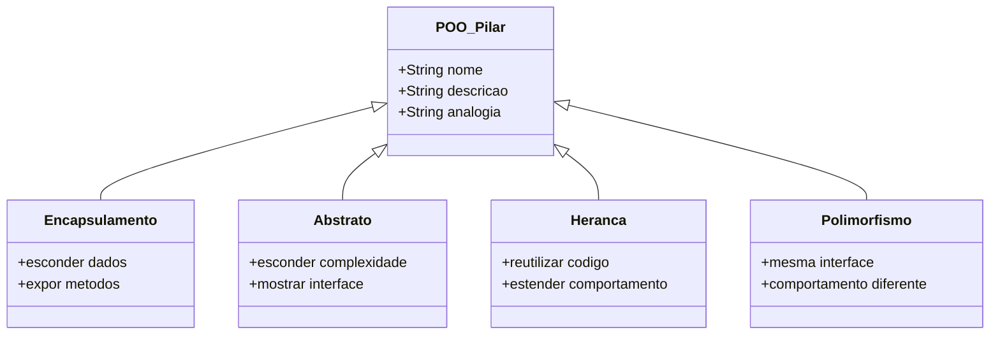
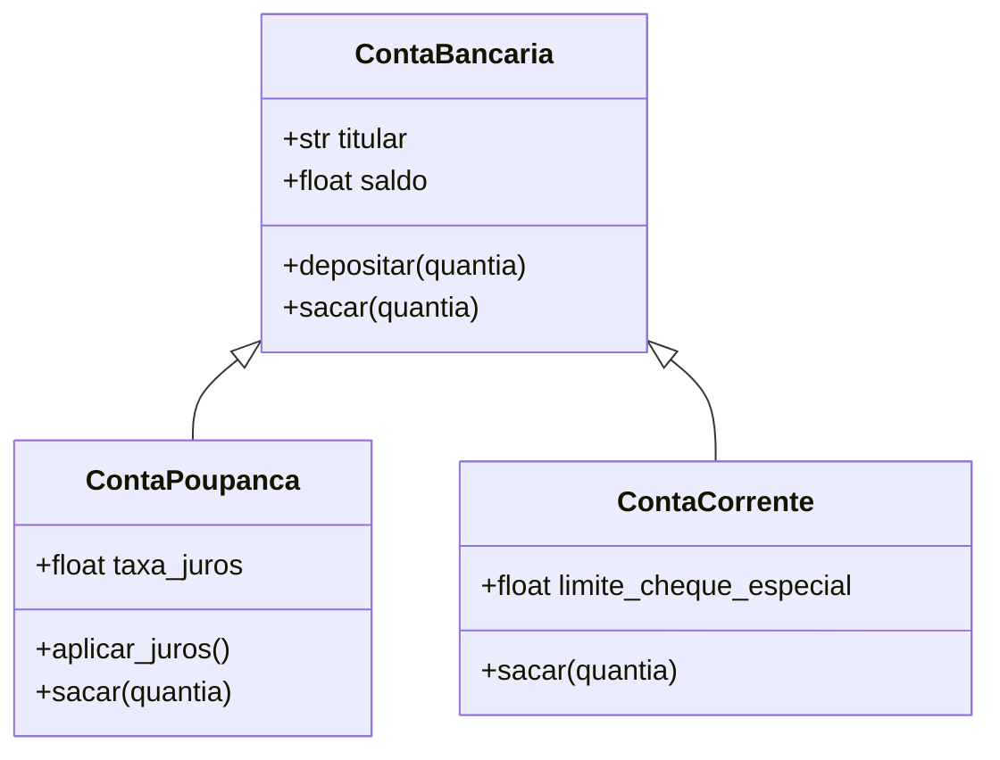

# Revisão de Fundamentos de POO

Antes de mergulhar nos princípios SOLID, vamos solidificar seu entendimento sobre Programação Orientada a Objetos. Esta lição revisa os quatro pilares da POO e os mecanismos de classe específicos do Python.

## Os Quatro Pilares da POO

A Programação Orientada a Objetos se apoia em quatro conceitos fundamentais:

| Pilar | Descrição | Analogia do Mundo Real |
|-------|-----------|------------------------|
| **Encapsulamento** | Agrupar dados e comportamento; esconder estado interno | Uma máquina de venda: você aperta botões, não toca nos mecanismos internos |
| **Abstração** | Expor apenas detalhes essenciais | Um controle remoto: botões importam, circuitos não |
| **Herança** | Reutilizar comportamento de uma classe pai | Filhos herdam características dos pais |
| **Polimorfismo** | Objetos de tipos diferentes respondem à mesma interface | Um gato e um cachorro respondem a `.speak()` |



## 1. Classes e Objetos

Uma **classe** é um molde. Um **objeto** é uma instância desse molde.

```python
class Produto:
    def __init__(self, nome: str, preco: float, quantidade: int = 0):
        self.nome = nome
        self.preco = preco
        self.quantidade = quantidade

    def valor_total(self) -> float:
        return self.preco * self.quantidade

    def reabastecer(self, quantia: int) -> None:
        if quantia <= 0:
            raise ValueError("Quantia de reabastecimento deve ser positiva")
        self.quantidade += quantia

    def vender(self, quantia: int) -> None:
        if quantia <= 0:
            raise ValueError("Quantia de venda deve ser positiva")
        if quantia > self.quantidade:
            raise ValueError("Estoque insuficiente")
        self.quantidade -= quantia

    def __repr__(self) -> str:
        return f"Produto({self.nome!r}, {self.preco!r}, qtd={self.quantidade!r})"

laptop = Produto("Laptop", 1200.00, 10)
laptop.vender(2)
laptop.reabastecer(5)
print(laptop)                 # Produto('Laptop', 1200.0, qtd=13)
print(laptop.valor_total())   # 15600.0
```

> [!NOTE]
> `__init__` é o construtor. Ele é chamado automaticamente quando você cria um objeto. O parâmetro `self` se refere à instância atual e deve ser o primeiro parâmetro de todo método de instância.

## 2. Atributos de Instância vs Classe

```python
class Funcionario:
    empresa = "Acme Corp"        # Atributo de classe — compartilhado por todas as instâncias
    periodos_pagamento = 26       # Atributo de classe

    def __init__(self, nome: str, salario: float):
        self.nome = nome          # Atributo de instância — único por instância
        self.salario = salario

    def valor_pagamento(self) -> float:
        return self.salario / self.periodos_pagamento

alice = Funcionario("Alice", 78000)
bob = Funcionario("Bob", 65000)

print(alice.valor_pagamento())  # 3000.0
print(bob.valor_pagamento())    # 2500.0
print(alice.empresa)            # "Acme Corp"

alice.empresa = "Startup Inc"   # Sobreposição — apenas para Alice
print(alice.empresa)            # "Startup Inc"
print(bob.empresa)              # "Acme Corp" — inalterado
print(Funcionario.empresa)      # "Acme Corp" — inalterado
```

> [!WARNING]
> Quando você atribui a um atributo via `self` ou uma instância, Python cria um atributo de instância que *sobrescreve* o atributo de classe. Isso pode levar a bugs sutis se você não tomar cuidado.

## 3. Herança

Herança cria um relacionamento "é-um" entre classes.

```python
class ContaBancaria:
    def __init__(self, titular: str, saldo: float = 0.0):
        self.titular = titular
        self.saldo = saldo

    def depositar(self, quantia: float) -> None:
        if quantia <= 0:
            raise ValueError("A quantia deve ser positiva")
        self.saldo += quantia

    def sacar(self, quantia: float) -> None:
        if quantia <= 0:
            raise ValueError("A quantia deve ser positiva")
        if quantia > self.saldo:
            raise ValueError("Saldo insuficiente")
        self.saldo -= quantia

    def __repr__(self) -> str:
        return f"{type(self).__name__}({self.titular!r}, {self.saldo!r})"

class ContaPoupanca(ContaBancaria):
    taxa_juros = 0.04

    def aplicar_juros(self) -> None:
        juros = self.saldo * self.taxa_juros
        self.depositar(juros)

    def sacar(self, quantia: float) -> None:
        if quantia > self.saldo * 0.8:
            raise ValueError("Não pode sacar mais de 80% do saldo")
        super().sacar(quantia)

class ContaCorrente(ContaBancaria):
    limite_cheque_especial = 500.0

    def sacar(self, quantia: float) -> None:
        if quantia <= 0:
            raise ValueError("A quantia deve ser positiva")
        if quantia > self.saldo + self.limite_cheque_especial:
            raise ValueError("Limite de cheque especial excedido")
        self.saldo -= quantia

cp = ContaPoupanca("Alice", 10000)
cp.aplicar_juros()
print(cp.saldo)  # 10400.0

cc = ContaCorrente("Bob", 1000)
cc.sacar(1200)
print(cc.saldo)  # -200.0
```



> [!SUCCESS]
> `super()` delega para a classe pai. Sempre chame `super().__init__()` em classes filhas para garantir que os atributos do pai sejam inicializados corretamente.

## 4. Ordem de Resolução de Métodos (MRO)

Python usa o algoritmo C3 de linearização para determinar qual método chamar:

```python
class A:
    def identificar(self):
        return "A"

class B(A):
    def identificar(self):
        return "B"

class C(A):
    def identificar(self):
        return "C"

class D(B, C):
    pass

d = D()
print(d.identificar())  # "B"
print(D.__mro__)
# (<class 'D'>, <class 'B'>, <class 'C'>, <class 'A'>, <class 'object'>)
```

## 5. Polimorfismo via ABCs

Classes Base Abstratas (ABCs) impõem um contrato entre diferentes implementações:

```python
from abc import ABC, abstractmethod
import math

class Forma(ABC):
    @abstractmethod
    def area(self) -> float:
        pass

    @abstractmethod
    def perimetro(self) -> float:
        pass

class Retangulo(Forma):
    def __init__(self, largura: float, altura: float):
        self.largura = largura
        self.altura = altura

    def area(self) -> float:
        return self.largura * self.altura

    def perimetro(self) -> float:
        return 2 * (self.largura + self.altura)

class Circulo(Forma):
    def __init__(self, raio: float):
        self.raio = raio

    def area(self) -> float:
        return math.pi * self.raio ** 2

    def perimetro(self) -> float:
        return 2 * math.pi * self.raio

def imprimir_info(forma: Forma) -> None:
    print(f"{type(forma).__name__}: area={forma.area():.2f}, perimetro={forma.perimetro():.2f}")

formas: list[Forma] = [Retangulo(5, 3), Circulo(4)]
for f in formas:
    imprimir_info(f)
```

## 6. Encapsulamento com Propriedades

Use `@property` para controlar acesso a atributos:

```python
class Temperatura:
    def __init__(self, celsius: float = 0.0):
        self._celsius = celsius

    @property
    def celsius(self) -> float:
        return self._celsius

    @celsius.setter
    def celsius(self, valor: float) -> None:
        if valor < -273.15:
            raise ValueError("Temperatura abaixo do zero absoluto")
        self._celsius = valor

    @property
    def fahrenheit(self) -> float:
        return self._celsius * 9 / 5 + 32

    @fahrenheit.setter
    def fahrenheit(self, valor: float) -> None:
        self.celsius = (valor - 32) * 5 / 9

    @property
    def kelvin(self) -> float:
        return self._celsius + 273.15

t = Temperatura(25)
print(t.fahrenheit)  # 77.0
t.fahrenheit = 100
print(t.celsius)     # 37.777...
```

## 7. Composição sobre Herança

Relacionamentos "tem-um" são frequentemente mais flexíveis que "é-um":

```python
class Motor:
    def __init__(self, cavalos: int):
        self.cavalos = cavalos
    def ligar(self) -> str:
        return "Motor ligado"
    def desligar(self) -> str:
        return "Motor desligado"

class Transmissao:
    def __init__(self, marchas: int = 6):
        self.marchas = marchas
        self.marcha = 0
    def subir_marcha(self) -> str:
        if self.marcha < self.marchas:
            self.marcha += 1
        return f"Marcha {self.marcha}"
    def descer_marcha(self) -> str:
        if self.marcha > 0:
            self.marcha -= 1
        return f"Marcha {self.marcha}"

class Carro:
    def __init__(self, marca: str, modelo: str, cavalos: int):
        self.marca = marca
        self.modelo = modelo
        self.motor = Motor(cavalos)
        self.transmissao = Transmissao()
    def dirigir(self) -> str:
        return f"{self.motor.ligar()} | {self.transmissao.subir_marcha()}"
    def estacionar(self) -> str:
        return f"{self.transmissao.descer_marcha()} | {self.motor.desligar()}"

carro = Carro("Honda", "Civic", 158)
print(carro.dirigir())  # Motor ligado | Marcha 1
```

> [!TIP]
> Prefira composição sobre herança. Herança cria acoplamento forte; composição permite trocar partes em tempo de execução.

## 8. Métodos Especiais (Dunder)

Métodos especiais permitem que objetos se integrem com a sintaxe Python:

```python
from typing import Any

class Vetor:
    def __init__(self, x: float, y: float):
        self.x = x
        self.y = y

    def __repr__(self) -> str:
        return f"Vetor({self.x!r}, {self.y!r})"

    def __add__(self, outro: "Vetor") -> "Vetor":
        if not isinstance(outro, Vetor):
            return NotImplemented
        return Vetor(self.x + outro.x, self.y + outro.y)

    def __sub__(self, outro: "Vetor") -> "Vetor":
        if not isinstance(outro, Vetor):
            return NotImplemented
        return Vetor(self.x - outro.x, self.y - outro.y)

    def __mul__(self, escalar: float) -> "Vetor":
        return Vetor(self.x * escalar, self.y * escalar)

    def __abs__(self) -> float:
        import math
        return math.sqrt(self.x ** 2 + self.y ** 2)

    def __eq__(self, outro: object) -> bool:
        if not isinstance(outro, Vetor):
            return NotImplemented
        return self.x == outro.x and self.y == outro.y

    def __bool__(self) -> bool:
        return self.x != 0 or self.y != 0

v1 = Vetor(3, 4)
v2 = Vetor(1, 2)
print(v1 + v2)       # Vetor(4, 6)
print(v1 * 2)        # Vetor(6, 8)
print(abs(v1))       # 5.0
print(v1 == Vetor(3, 4))  # True
print(bool(Vetor(0, 0)))  # False
```

## 9. Antes e Depois: Código Procedural para POO

### Antes: Código Procedural (Violação)

```python
def criar_conta(titular, saldo=0.0):
    return {"titular": titular, "saldo": saldo}

def depositar(conta, quantia):
    if quantia <= 0:
        raise ValueError("A quantia deve ser positiva")
    conta["saldo"] += quantia

def sacar(conta, quantia):
    if quantia <= 0:
        raise ValueError("A quantia deve ser positiva")
    if quantia > conta["saldo"]:
        raise ValueError("Saldo insuficiente")
    conta["saldo"] -= quantia

def transferir(de_conta, para_conta, quantia):
    sacar(de_conta, quantia)
    depositar(para_conta, quantia)

acc1 = criar_conta("Alice", 1000)
acc2 = criar_conta("Bob", 500)
depositar(acc1, 200)
transferir(acc1, acc2, 300)
print(acc1["saldo"])  # 900
print(acc2["saldo"])  # 800
```

### Depois: POO Refatorado

```python
class Conta:
    def __init__(self, titular: str, saldo: float = 0.0):
        self.titular = titular
        self._saldo = saldo

    @property
    def saldo(self) -> float:
        return self._saldo

    def depositar(self, quantia: float) -> None:
        if quantia <= 0:
            raise ValueError("A quantia deve ser positiva")
        self._saldo += quantia

    def sacar(self, quantia: float) -> None:
        if quantia <= 0:
            raise ValueError("A quantia deve ser positiva")
        if quantia > self._saldo:
            raise ValueError("Saldo insuficiente")
        self._saldo -= quantia

    def transferir_para(self, destino: "Conta", quantia: float) -> None:
        self.sacar(quantia)
        destino.depositar(quantia)

    def __repr__(self) -> str:
        return f"Conta({self.titular!r}, saldo={self._saldo!r})"

acc1 = Conta("Alice", 1000)
acc2 = Conta("Bob", 500)
acc1.depositar(200)
acc1.transferir_para(acc2, 300)
print(acc1.saldo)  # 900
print(acc2.saldo)  # 800
```

## 10. Armadilhas Comuns de POO

```python
# ARMADILHA 1: Argumentos padrão mutáveis
class CarrinhoCompras:
    def __init__(self, itens: list = []):  # RUIM: lista compartilhada!
        self.itens = itens

a = CarrinhoCompras()
b = CarrinhoCompras()
a.itens.append("maçã")
print(b.itens)  # ['maçã'] — compartilhada!

# CORREÇÃO:
class CarrinhoCompras:
    def __init__(self, itens: list | None = None):
        self.itens = itens if itens is not None else []
```

## Exercícios Práticos

1. Crie uma classe `Livro` com `titulo`, `autor`, `isbn` e `_disponivel` (bool). Adicione métodos `emprestar()`, `devolver()` e uma propriedade `disponivel`.

2. Construa uma classe base `ItemEstoque` com `nome`, `preco`, `quantidade`. Crie `ItemPerecivel` (adicione `data_validade`) e `ItemEletronico` (adicione `meses_garantia`). Sobrescreva `__repr__` em ambos.

3. Escreva uma hierarquia de classes `Logger`: `Logger` (base, abstrata), `FileLogger` (escreve em arquivo), `ConsoleLogger` (imprime no stdout). Cada um implementa `log(nivel, mensagem)`.

4. Crie uma classe `Fracao` que implementa `__add__`, `__sub__`, `__mul__`, `__eq__` e `__repr__`. Garanta que as frações sejam sempre reduzidas (use `math.gcd`).

5. Refatore este código procedural para POO:
   ```python
   estudantes = {}
   def adicionar_nota(id_estudante, curso, nota):
       if id_estudante not in estudantes:
           estudantes[id_estudante] = {}
       estudantes[id_estudante][curso] = nota
   def cr(id_estudante):
       notas = estudantes[id_estudante].values()
       return sum(notas) / len(notas)
   ```

6. Qual é o MRO para `class E(A, B, C)` onde `A` estende `object`, `B` estende `A`, e `C` estende `object`? Use `ClassName.__mro__` para verificar.

7. Implemente uma classe `Playlist` com `__len__`, `__getitem__`, `__add__` (mesclar duas playlists) e `__repr__`. Armazene músicas como tuplas `(titulo, artista)`.

8. Explique por que o código a seguir viola encapsulamento e corrija-o usando propriedades:
   ```python
   class ContaBancaria:
       def __init__(self, titular, saldo):
           self.titular = titular
           self.saldo = saldo
   ```

## Resumo

- **Classes** são moldes; **objetos** são instâncias
- **Encapsulamento** esconde estado interno via propriedades
- **Abstração** expõe apenas o necessário (ABCs, interfaces)
- **Herança** permite reuso de código mas cria acoplamento
- **Polimorfismo** permite que tipos diferentes compartilhem a mesma interface
- **Composição** ("tem-um") é geralmente melhor que herança ("é-um")

> [!SUCCESS]
> Você revisou seus conhecimentos de POO. Agora está pronto para aplicar os princípios SOLID para construir sistemas orientados a objetos sustentáveis e escaláveis.
