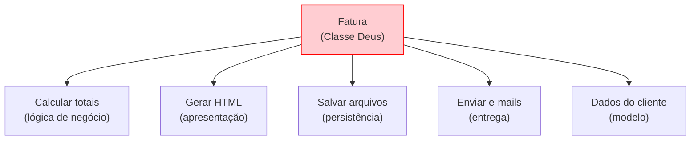
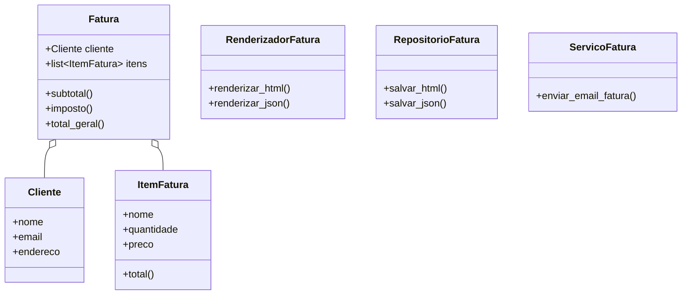
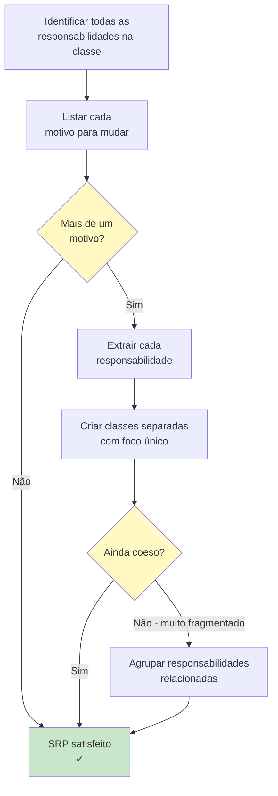

# Princípio da Responsabilidade Única (SRP)

> **Uma classe deve ter um, e apenas um, motivo para mudar.**

O Princípio da Responsabilidade Única é o primeiro dos princípios SOLID. Ele afirma que toda classe deve ter exatamente uma responsabilidade — um trabalho para fazer, um motivo para mudar. Quando uma classe assume múltiplas responsabilidades, ela se torna frágil, difícil de testar e difícil de manter.

## O Problema: Classes Deus

Uma classe com muitas responsabilidades é frequentemente chamada de "classe deus". Ela sabe demais e faz demais.

### ANTES: Violação do SRP

```python
import json
import smtplib
from email.message import EmailMessage
from pathlib import Path
from typing import Any

class Fatura:
    def __init__(self, email_cliente: str, itens: list[dict[str, Any]]):
        self.email_cliente = email_cliente
        self.itens = itens

    def calcular_total(self) -> float:
        return sum(item["preco"] * item["quantidade"] for item in self.itens)

    def calcular_imposto(self, aliquota: float = 0.08) -> float:
        return self.calcular_total() * aliquota

    def gerar_html(self) -> str:
        total = self.calcular_total()
        imposto = self.calcular_imposto()
        itens_html = "".join(
            f"<tr><td>{i['nome']}</td><td>{i['quantidade']}</td>"
            f"<td>${i['preco']:.2f}</td><td>${i['preco'] * i['quantidade']:.2f}</td></tr>"
            for i in self.itens
        )
        return f"""<html><body>
<h1>Fatura</h1>
<table><tr><th>Item</th><th>Qtd</th><th>Preço</th><th>Total</th></tr>
{itens_html}
<tr><td colspan="3">Subtotal</td><td>${total:.2f}</td></tr>
<tr><td colspan="3">Imposto (8%)</td><td>${imposto:.2f}</td></tr>
<tr><td colspan="3">Total Geral</td><td>${total + imposto:.2f}</td></tr>
</table></body></html>"""

    def salvar_arquivo(self, nome_arquivo: str = "fatura.html") -> None:
        html = self.gerar_html()
        Path(nome_arquivo).write_text(html)

    def enviar_email(self) -> None:
        html = self.gerar_html()
        msg = EmailMessage()
        msg["Subject"] = "Sua Fatura"
        msg["From"] = "faturamento@empresa.com"
        msg["To"] = self.email_cliente
        msg.set_content(html, subtype="html")
        with smtplib.SMTP("smtp.empresa.com") as servidor:
            servidor.send_message(msg)
```

> [!WARNING]
> Esta classe `Fatura` faz **cinco** coisas: calcula totais, gera HTML, salva arquivos, envia e-mails e gerencia dados do cliente. São cinco motivos para mudar!



### Problemas com este design:

| Responsabilidade | Por que é um Problema |
|-----------------|----------------------|
| **Lógica de negócio** (cálculos) | Muda quando as regras fiscais mudam |
| **Apresentação** (HTML) | Muda quando o design muda |
| **Persistência** (salvar arquivo) | Muda quando o armazenamento muda |
| **Entrega** (e-mail) | Muda quando a lógica de e-mail muda |
| **Dados** (info do cliente) | Muda quando campos do cliente mudam |

### DEPOIS: Refatorado com SRP

Cada classe tem exatamente uma responsabilidade:

```python
from dataclasses import dataclass
from typing import Any
from pathlib import Path
import json

@dataclass
class ItemFatura:
    nome: str
    quantidade: int
    preco: float

    def total(self) -> float:
        return self.quantidade * self.preco

@dataclass
class Cliente:
    nome: str
    email: str
    endereco: str

class Fatura:
    def __init__(self, cliente: Cliente, itens: list[ItemFatura]):
        self.cliente = cliente
        self.itens = itens

    def subtotal(self) -> float:
        return sum(item.total() for item in self.itens)

    def imposto(self, aliquota: float = 0.08) -> float:
        return self.subtotal() * aliquota

    def total_geral(self, aliquota: float = 0.08) -> float:
        return self.subtotal() + self.imposto(aliquota)

class RenderizadorFatura:
    @staticmethod
    def renderizar_html(fatura: Fatura) -> str:
        itens = "".join(
            f"<tr><td>{i.nome}</td><td>{i.quantidade}</td>"
            f"<td>${i.preco:.2f}</td><td>${i.total():.2f}</td></tr>"
            for i in fatura.itens
        )
        return f"""<html><body>
<h1>Fatura para {fatura.cliente.nome}</h1>
<table><tr><th>Item</th><th>Qtd</th><th>Preço</th><th>Total</th></tr>
{itens}
<tr><td colspan="3">Subtotal</td><td>${fatura.subtotal():.2f}</td></tr>
<tr><td colspan="3">Imposto</td><td>${fatura.imposto():.2f}</td></tr>
<tr><td colspan="3">Total Geral</td><td>${fatura.total_geral():.2f}</td></tr>
</table></body></html>"""

    @staticmethod
    def renderizar_json(fatura: Fatura) -> str:
        return json.dumps({
            "cliente": fatura.cliente.nome,
            "email": fatura.cliente.email,
            "itens": [
                {"nome": i.nome, "qtd": i.quantidade,
                 "preco": i.preco, "total": i.total()}
                for i in fatura.itens
            ],
            "subtotal": fatura.subtotal(),
            "imposto": fatura.imposto(),
            "total_geral": fatura.total_geral(),
        }, indent=2)

class RepositorioFatura:
    @staticmethod
    def salvar_html(fatura: Fatura, caminho: str = "fatura.html") -> None:
        html = RenderizadorFatura.renderizar_html(fatura)
        Path(caminho).write_text(html)

    @staticmethod
    def salvar_json(fatura: Fatura, caminho: str = "fatura.json") -> None:
        dados = RenderizadorFatura.renderizar_json(fatura)
        Path(caminho).write_text(dados)

class ServicoFatura:
    def __init__(self, host_smtp: str = "smtp.empresa.com"):
        self.host_smtp = host_smtp

    def enviar_email_fatura(self, fatura: Fatura,
                            destinatario: str | None = None) -> None:
        import smtplib
        from email.message import EmailMessage
        html = RenderizadorFatura.renderizar_html(fatura)
        msg = EmailMessage()
        msg["Subject"] = f"Fatura para {fatura.cliente.nome}"
        msg["From"] = "faturamento@empresa.com"
        msg["To"] = destinatario or fatura.cliente.email
        msg.set_content(html, subtype="html")
        with smtplib.SMTP(self.host_smtp) as servidor:
            servidor.send_message(msg)
```



> [!SUCCESS]
> Agora cada classe tem exatamente uma responsabilidade. `Fatura` lida com lógica de negócio. `RenderizadorFatura` lida com apresentação. `RepositorioFatura` lida com persistência. `ServicoFatura` lida com entrega. Cada uma tem um motivo para mudar.

## Exemplo Adicional: Gerenciador de Relatórios

**ANTES: Uma classe que faz tudo**

```python
from pathlib import Path
import json, csv

class GerenciadorRelatorios:
    def __init__(self, caminho: str):
        self.caminho = caminho
        self.dados = []

    def carregar_csv(self) -> None:
        with open(self.caminho) as f:
            reader = csv.DictReader(f)
            self.dados = list(reader)

    def carregar_json(self) -> None:
        self.dados = json.loads(Path(self.caminho).read_text())

    def filtrar(self, chave: str, valor) -> None:
        self.dados = [d for d in self.dados if d.get(chave) == valor]

    def calcular_total(self, chave: str = "valor") -> float:
        return sum(float(d.get(chave, 0)) for d in self.dados)

    def exportar_csv(self, saida: str) -> None:
        if not self.dados:
            return
        with open(saida, "w", newline="") as f:
            writer = csv.DictWriter(f, fieldnames=self.dados[0].keys())
            writer.writeheader()
            writer.writerows(self.dados)

    def exportar_json(self, saida: str) -> None:
        Path(saida).write_text(json.dumps(self.dados, indent=2))

    def exibir_tabela(self) -> None:
        if not self.dados:
            print("Sem dados")
            return
        headers = list(self.dados[0].keys())
        print(" | ".join(headers))
        print("-" * 40)
        for d in self.dados:
            print(" | ".join(str(d.get(h, "")) for h in headers))
```

> [!WARNING]
> `GerenciadorRelatorios` lida com carregamento (CSV/JSON), filtragem, cálculo, exportação (CSV/JSON) e exibição. São **seis** responsabilidades diferentes!

**DEPOIS: Responsabilidades separadas**

```python
from abc import ABC, abstractmethod
from pathlib import Path
from typing import Any

class CarregadorDados(ABC):
    @abstractmethod
    def carregar(self, caminho: str) -> list[dict[str, Any]]:
        pass

class CarregadorCSV(CarregadorDados):
    def carregar(self, caminho: str) -> list[dict[str, Any]]:
        import csv
        with open(caminho) as f:
            return list(csv.DictReader(f))

class CarregadorJSON(CarregadorDados):
    def carregar(self, caminho: str) -> list[dict[str, Any]]:
        import json
        return json.loads(Path(caminho).read_text())

class FiltroDados:
    @staticmethod
    def filtrar(dados: list[dict], chave: str, valor) -> list[dict]:
        return [d for d in dados if d.get(chave) == valor]

class CalculadoraTotal:
    @staticmethod
    def calcular(dados: list[dict], chave: str = "valor") -> float:
        return sum(float(d.get(chave, 0)) for d in dados)

class ExportadorCSV:
    @staticmethod
    def exportar(dados: list[dict], saida: str) -> None:
        if not dados:
            return
        import csv
        with open(saida, "w", newline="") as f:
            writer = csv.DictWriter(f, fieldnames=dados[0].keys())
            writer.writeheader()
            writer.writerows(dados)

class ExportadorJSON:
    @staticmethod
    def exportar(dados: list[dict], saida: str) -> None:
        import json
        Path(saida).write_text(json.dumps(dados, indent=2))

class ExibidorTabela:
    @staticmethod
    def exibir(dados: list[dict]) -> None:
        if not dados:
            print("Sem dados")
            return
        headers = list(dados[0].keys())
        print(" | ".join(headers))
        print("-" * 40)
        for d in dados:
            print(" | ".join(str(d.get(h, "")) for h in headers))
```

> [!SUCCESS]
> Agora cada classe tem uma única responsabilidade. O sistema é mais fácil de testar, manter e estender. Quer adicionar suporte a XML? Basta criar `CarregadorXML` e `ExportadorXML`.

## Como Identificar Violações de SRP

Faça estas perguntas sobre sua classe:

| Pergunta | Se Sim... |
|----------|-----------|
| Esta classe tem mais de um "motivo para mudar"? | SRP violado |
| Consigo descrever o que esta classe faz em uma frase sem "e"? | SRP violado |
| Esta classe depende de múltiplos subsistemas não relacionados? | SRP violado |
| Eu precisaria modificar esta classe para diferentes solicitações de funcionalidades? | SRP violado |
| Esta classe é difícil de testar por causa de responsabilidades misturadas? | SRP violado |

## Quando Aplicar SRP

| Cenário | Aplicar SRP? | Por quê |
|---------|-------------|---------|
| Classe com método único | Não | Apenas use uma função |
| Classe de dados (dataclass) | Geralmente não | Ela armazena dados, um trabalho |
| Classe com persistência + lógica | Sim | Dois motivos para mudar |
| Classe fazendo cálculos + renderização | Sim | Lógica != apresentação |
| Classe lidando com autenticação + logging | Sim | Preocupações diferentes |



## Exercícios Práticos

1. Identifique as violações de SRP nesta classe e refatore-a:
   ```python
   class Pedido:
       def __init__(self, itens, cliente):
           self.itens = itens
           self.cliente = cliente
       def total(self): ...
       def imprimir_pedido(self): ...
       def salvar_no_db(self): ...
       def enviar_confirmacao(self): ...
       def aplicar_desconto(self, codigo): ...
       def gerar_etiqueta(self): ...
   ```

2. Uma classe `ProcessadorDados` lê arquivos CSV, limpa dados, executa modelos de ML, gera gráficos e envia relatórios por e-mail. Como você dividiria usando SRP? Liste as novas classes.

3. Refatore o código a seguir para seguir SRP:
   ```python
   class PostBlog:
       def __init__(self, titulo, corpo, autor):
           self.titulo = titulo
           self.corpo = corpo
           self.autor = autor
           self.comentarios = []
       def adicionar_comentario(self, texto, usuario): ...
       def para_html(self): ...
       def salvar(self): ...
       def enviar_notificacao(self): ...
       def validar(self): ...
   ```

4. Qual é o "um motivo para mudar" para cada uma destas classes: `Fatura`, `RenderizadorFatura`, `RepositorioFatura`, `ServicoFatura`?

5. Uma classe `ConfiguracoesUsuario` gerencia carregar/salvar configurações em um arquivo DE APLICAR essas configurações na interface. Isso é uma violação de SRP? Por quê? Como você corrigiria?

6. Crie um sistema simples de calculadora onde a lógica da calculadora, a análise de entrada e a exibição do resultado estão em classes separadas seguindo SRP.

7. Revise seu próprio código e encontre uma classe que viole SRP. Descreva quais responsabilidades ela tem e proponha uma refatoração.

8. Explique com suas palavras: como SRP melhora a testabilidade? Dê um exemplo concreto.

## Resumo

- **SRP**: Uma classe deve ter um, e apenas um, motivo para mudar
- **Classes Deus** com múltiplas responsabilidades são difíceis de manter
- **Sinais de violação**: nomes com "E" ou "Gerenciador", métodos não relacionados, ampla superfície de teste
- **Refatoração**: extrair cada responsabilidade em sua própria classe, depois compô-las
- **Benefício de teste**: cada classe pequena é testável independentemente

> [!SUCCESS]
> SRP é a base do design limpo de POO. Quando toda classe tem um trabalho, seu código se torna modular, testável e um prazer de trabalhar.
