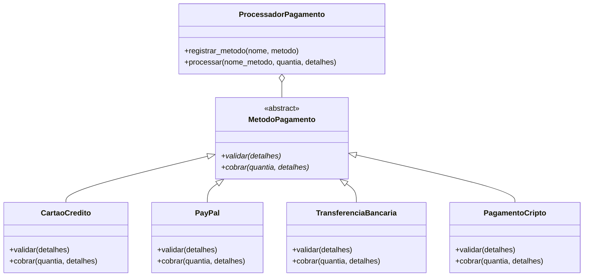

# Princípio Aberto-Fechado (OCP)

> **Entidades de software (classes, módulos, funções) devem estar abertas para extensão, mas fechadas para modificação.**

O Princípio Aberto-Fechado é o segundo princípio SOLID. Significa que você deve ser capaz de adicionar nova funcionalidade sem alterar o código existente. Em vez de modificar uma classe para suportar novo comportamento, você a estende através de herança, composição ou arquiteturas de plugin.

## O Problema: Cascatas de Modificação

Quando o código não está fechado para modificação, cada nova funcionalidade exige alteração no código existente. Isso leva a bugs, regressões e conflitos de merge.

### ANTES: Violação do OCP

```python
from typing import Any

class ProcessadorPagamento:
    def processar_pagamento(self, metodo: str, quantia: float,
                            detalhes: dict[str, Any]) -> str:
        if metodo == "cartao_credito":
            return self._processar_cartao_credito(quantia, detalhes)
        elif metodo == "paypal":
            return self._processar_paypal(quantia, detalhes)
        elif metodo == "transferencia_bancaria":
            return self._processar_transferencia(quantia, detalhes)
        else:
            raise ValueError(f"Método de pagamento desconhecido: {metodo}")
```

> [!WARNING]
> Cada vez que um novo método de pagamento é necessário, você deve modificar a classe `ProcessadorPagamento`. Isso viola o OCP — a classe não está fechada para modificação.

### DEPOIS: Refatoração Compatível com OCP

Use uma classe base abstrata e despacho polimórfico:

```python
from abc import ABC, abstractmethod
from typing import Any

class MetodoPagamento(ABC):
    @abstractmethod
    def cobrar(self, quantia: float, detalhes: dict[str, Any]) -> str:
        pass

    @abstractmethod
    def validar(self, detalhes: dict[str, Any]) -> None:
        pass

class CartaoCredito(MetodoPagamento):
    def validar(self, detalhes: dict[str, Any]) -> None:
        cartao = detalhes.get("numero_cartao")
        cvv = detalhes.get("cvv")
        if not cartao or not cvv:
            raise ValueError("Detalhes do cartão ausentes")
        if len(str(cartao)) != 16:
            raise ValueError("Número de cartão inválido")

    def cobrar(self, quantia: float, detalhes: dict[str, Any]) -> str:
        self.validar(detalhes)
        cartao = str(detalhes["numero_cartao"])
        print(f"Cobrando ${quantia:.2f} no cartão final {cartao[-4:]}")
        return f"cc_txn_{hash(cartao)}"

class PayPal(MetodoPagamento):
    def validar(self, detalhes: dict[str, Any]) -> None:
        if not detalhes.get("email") or not detalhes.get("senha"):
            raise ValueError("Credenciais PayPal ausentes")

    def cobrar(self, quantia: float, detalhes: dict[str, Any]) -> str:
        self.validar(detalhes)
        email = detalhes["email"]
        print(f"Processando ${quantia:.2f} via PayPal para {email}")
        return f"pp_txn_{hash(email)}"

class TransferenciaBancaria(MetodoPagamento):
    def validar(self, detalhes: dict[str, Any]) -> None:
        if not detalhes.get("agencia") or not detalhes.get("conta"):
            raise ValueError("Detalhes bancários ausentes")

    def cobrar(self, quantia: float, detalhes: dict[str, Any]) -> str:
        self.validar(detalhes)
        conta = str(detalhes["conta"])
        print(f"Transferindo ${quantia:.2f} para conta {conta[-4:]}")
        return f"bt_txn_{hash(conta)}"

class ProcessadorPagamento:
    def __init__(self):
        self._metodos: dict[str, MetodoPagamento] = {}

    def registrar_metodo(self, nome: str, metodo: MetodoPagamento) -> None:
        self._metodos[nome] = metodo

    def processar(self, nome_metodo: str, quantia: float,
                  detalhes: dict[str, Any]) -> str:
        metodo = self._metodos.get(nome_metodo)
        if not metodo:
            raise ValueError(f"Método de pagamento desconhecido: {nome_metodo}")
        return metodo.cobrar(quantia, detalhes)
```

> [!NOTE]
> A classe `ProcessadorPagamento` está **fechada para modificação** — seu código nunca muda quando novos métodos de pagamento são adicionados. Está **aberta para extensão** — novos métodos são adicionados criando novas subclasses `MetodoPagamento` e registrando-as.

```python
# Uso — adicionar criptomoeda não altera código existente!
processador = ProcessadorPagamento()
processador.registrar_metodo("cartao_credito", CartaoCredito())
processador.registrar_metodo("paypal", PayPal())
processador.registrar_metodo("transferencia_bancaria", TransferenciaBancaria())

class PagamentoCripto(MetodoPagamento):
    def validar(self, detalhes: dict[str, Any]) -> None:
        if not detalhes.get("carteira"):
            raise ValueError("Endereço de carteira ausente")
    def cobrar(self, quantia: float, detalhes: dict[str, Any]) -> str:
        self.validar(detalhes)
        print(f"Enviando ${quantia:.2f} em cripto...")
        return f"crypto_txn_{hash(detalhes['carteira'])}"

processador.registrar_metodo("cripto", PagamentoCripto())
```



## Exemplo 2: Calculadora de Descontos

**ANTES**

```python
class CalculadoraDesconto:
    def calcular(self, tipo_cliente: str, quantia: float) -> float:
        if tipo_cliente == "regular":
            return quantia * 0.05
        elif tipo_cliente == "prata":
            return quantia * 0.10
        elif tipo_cliente == "ouro":
            return quantia * 0.20
```

**DEPOIS**

```python
from abc import ABC, abstractmethod

class EstrategiaDesconto(ABC):
    @abstractmethod
    def aplicar(self, quantia: float) -> float:
        pass

class DescontoRegular(EstrategiaDesconto):
    def aplicar(self, quantia: float) -> float:
        return quantia * 0.05

class DescontoPrata(EstrategiaDesconto):
    def aplicar(self, quantia: float) -> float:
        return quantia * 0.10

class DescontoOuro(EstrategiaDesconto):
    def aplicar(self, quantia: float) -> float:
        return quantia * 0.20

class MotorDescontos:
    def __init__(self):
        self._descontos: dict[str, EstrategiaDesconto] = {}
    def registrar(self, tipo: str, estrategia: EstrategiaDesconto) -> None:
        self._descontos[tipo] = estrategia
    def calcular(self, tipo: str, quantia: float) -> float:
        estrategia = self._descontos.get(tipo)
        return estrategia.aplicar(quantia) if estrategia else 0.0
```

## Sinais de Violação do OCP

| Sinal de Alerta | Descrição |
|----------------|-----------|
| Cadeias `if/elif/else` baseadas em tipo | Novos tipos exigem novos ramos |
| `match/case` em códigos de tipo | Mesmo problema que if/elif |
| Verificações `isinstance()` | Polimorfismo deve substituir estas |
| Instruções switch grandes | Geralmente indicam abstração ausente |
| Flags de funcionalidade espalhadas no código | Considere padrão strategy |

## Exercícios Práticos

1. Identifique a violação de OCP neste código e refatore-o:
   ```python
   class Logger:
       def log(self, mensagem, tipo_saida="console"):
           if tipo_saida == "console":
               print(mensagem)
           elif tipo_saida == "arquivo":
               with open("log.txt", "a") as f:
                   f.write(mensagem + "\n")
           elif tipo_saida == "db":
               pass
   ```

2. Projete um sistema de notificações que siga OCP. Os usuários devem poder adicionar novos canais de notificação (email, SMS, push, Slack, Teams) sem modificar código existente.

3. Um `CalculadorFrete` atualmente lida com frete "terrestre", "aéreo" e "marítimo". Aplique OCP para que novos métodos de frete possam ser adicionados sem modificar o calculador.

4. Implemente uma classe abstrata `RegraValidacao` e um `Validador` que executa regras registradas. Adicione regras para `RegraEmail`, `RegraObrigatorio`, `RegraComprimentoMinimo` e `RegraIntervalo`.

5. O que é o padrão Strategy e como ele ajuda a alcançar OCP? Desenhe o diagrama UML de classes.

6. Refatore este código usando OCP:
   ```python
   class GeradorRelatorio:
       def gerar(self, dados, formato):
           if formato == "pdf": ...
           elif formato == "html": ...
           elif formato == "xlsx": ...
   ```

7. Explique a diferença entre "fechado para modificação" e "congelado/imutável". Quando é aceitável modificar código existente?

8. Crie uma arquitetura estilo plugin usando OCP onde um `ProcessadorTexto` aceita plugins registrados que podem transformar texto (ex: `PluginMaiusculo`, `PluginMinusculo`, `PluginRemoverPontuacao`).

## Resumo

- **OCP**: Classes devem estar abertas para extensão, fechadas para modificação
- **Objetivo**: Adicionar novas funcionalidades sem alterar código testado existente
- **Técnica principal**: Classes base abstratas + despacho polimórfico (Strategy)
- **Benefício**: Risco reduzido de regressão, teste mais fácil, pontos de extensão claros

> [!SUCCESS]
> OCP transforma seu código de um monólito frágil em um framework extensível. Quando feito corretamente, adicionar novas funcionalidades parece conectar um componente, não reescrever código existente.

## OCP com Padrão Template Method

O padrão Template Method permite que o esqueleto de um algoritmo seja fechado para modificação, enquanto passos específicos são abertos para extensão:

```python
from abc import ABC, abstractmethod
from pathlib import Path

class ExportadorDados(ABC):
    """Template Method — esqueleto fechado, passos abertos."""

    def exportar(self, dados: list[dict], caminho_saida: str) -> Path:
        validados = self._validar(dados)
        transformados = self._transformar(validados)
        conteudo = self._serializar(transformados)
        caminho = Path(caminho_saida)
        caminho.write_text(conteudo)
        print(f"Exportados {len(dados)} registros para {caminho}")
        return caminho

    def _validar(self, dados: list[dict]) -> list[dict]:
        if not dados:
            raise ValueError("Sem dados para exportar")
        return dados

    def _transformar(self, dados: list[dict]) -> list[dict]:
        return dados

    @abstractmethod
    def _serializar(self, dados: list[dict]) -> str:
        pass

class ExportadorCSV(ExportadorDados):
    def _serializar(self, dados: list[dict]) -> str:
        import csv, io
        saida = io.StringIO()
        escritor = csv.DictWriter(saida, fieldnames=dados[0].keys())
        escritor.writeheader()
        escritor.writerows(dados)
        return saida.getvalue()

class ExportadorJSON(ExportadorDados):
    def _serializar(self, dados: list[dict]) -> str:
        import json
        return json.dumps(dados, indent=2)

class ExportadorHTML(ExportadorDados):
    def _transformar(self, dados: list[dict]) -> list[dict]:
        for item in dados:
            for chave, valor in item.items():
                if isinstance(valor, str):
                    item[chave] = str(valor).replace("&", "&amp;").replace("<", "&lt;")
        return dados
    def _serializar(self, dados: list[dict]) -> str:
        if not dados:
            return "<html><body><p>Sem dados</p></body></html>"
        headers = list(dados[0].keys())
        linhas = []
        for item in dados:
            linhas.append("<tr>" + "".join(f"<td>{item.get(h, '')}</td>" for h in headers) + "</tr>")
        return f"""<html><body>
<h1>Relatório</h1>
<table><tr>{"".join(f'<th>{h}</th>' for h in headers)}</tr>
{''.join(linhas)}
</table></body></html>"""

exportador = ExportadorCSV()
exportador.exportar([{"nome": "Alice", "idade": "30"}], "dados.csv")
```

> [!TIP]
> O Template Method é ideal quando você tem um algoritmo com passos fixos, mas alguns passos precisam de implementações diferentes. O esqueleto fica fechado para modificação, enquanto os passos abstratos estão abertos para extensão.

## OCP com Decorator Pattern

```python
from abc import ABC, abstractmethod

class FonteDados(ABC):
    @abstractmethod
    def ler(self) -> str: pass
    @abstractmethod
    def escrever(self, dados: str) -> None: pass

class FonteArquivo(FonteDados):
    def __init__(self, caminho: str):
        self.caminho = caminho
    def ler(self) -> str:
        return Path(self.caminho).read_text()
    def escrever(self, dados: str) -> None:
        Path(self.caminho).write_text(dados)

class DecoradorCriptografia(FonteDados):
    def __init__(self, fonte: FonteDados):
        self._fonte = fonte
    def ler(self) -> str:
        return self._descriptografar(self._fonte.ler())
    def escrever(self, dados: str) -> None:
        self._fonte.escrever(self._criptografar(dados))
    def _criptografar(self, dados: str) -> str:
        import base64
        return base64.b64encode(dados.encode()).decode()
    def _descriptografar(self, dados: str) -> str:
        import base64
        return base64.b64decode(dados.encode()).decode()

fonte = DecoradorCriptografia(FonteArquivo("dados.txt"))
fonte.escrever("Conteúdo secreto")
print(fonte.ler())
```

## Comparação: Antes vs Depois do OCP

| Aspecto | Sem OCP (if/elif) | Com OCP (Strategy) |
|---------|-------------------|--------------------|
| Adicionar novo comportamento | Modificar classe existente | Criar nova subclasse |
| Risco de regressão | Alto | Baixo |
| Superfície de teste | Classe inteira | Nova classe isolada |
| Reuso de código | Baixo (condicionais duplicados) | Alto (abstrações compartilhadas) |
| Direção da dependência | Concreto depende de concreto | Ambos dependem de abstração |
| Legibilidade | Piora linearmente | Permanece constante |

## Sinais de Violação do OCP

| Sinal de Alerta | Descrição |
|----------------|-----------|
| Cadeias `if/elif/else` baseadas em tipo | Novos tipos exigem novos ramos |
| `match/case` em códigos de tipo | Mesmo problema que if/elif |
| Verificações `isinstance()` | Polimorfismo deve substituir estas |
| Instruções switch grandes | Geralmente indicam abstração ausente |

## Exercícios Práticos

1. Identifique a violação de OCP neste código e refatore-o:
   ```python
   class Logger:
       def log(self, mensagem, tipo_saida="console"):
           if tipo_saida == "console":
               print(mensagem)
           elif tipo_saida == "arquivo":
               with open("log.txt", "a") as f:
                   f.write(mensagem + "\n")
           elif tipo_saida == "db":
               pass  # salvar no banco
   ```

2. Projete um sistema de notificações que siga OCP. Os usuários devem poder adicionar novos canais de notificação (email, SMS, push, Slack, Teams) sem modificar código existente.

3. Um `CalculadorFrete` atualmente lida com frete "terrestre", "aéreo" e "marítimo". Aplique OCP para que novos métodos de frete possam ser adicionados sem modificar o calculador.

4. Implemente uma classe abstrata `RegraValidacao` e um `Validador` que executa regras registradas. Adicione regras para `RegraEmail`, `RegraObrigatorio`, `RegraComprimentoMinimo` e `RegraIntervalo`.

5. O que é o padrão Strategy e como ele ajuda a alcançar OCP? Desenhe o diagrama UML de classes.

6. Refatore este código usando OCP:
   ```python
   class GeradorRelatorio:
       def gerar(self, dados, formato):
           if formato == "pdf": ...
           elif formato == "html": ...
           elif formato == "xlsx": ...
   ```

7. Explique a diferença entre "fechado para modificação" e "congelado/imutável". Quando é aceitável modificar código existente?

8. Crie uma arquitetura estilo plugin usando OCP onde um `ProcessadorTexto` aceita plugins registrados que podem transformar texto (ex: `PluginMaiusculo`, `PluginMinusculo`, `PluginRemoverPontuacao`).

## Resumo

- **OCP**: Classes devem estar abertas para extensão, fechadas para modificação
- **Objetivo**: Adicionar novas funcionalidades sem alterar código testado existente
- **Técnica principal**: Classes base abstratas + despacho polimórfico (Strategy)
- **Outros padrões**: Template Method, Decorator, Observer
- **Benefício**: Risco reduzido de regressão, teste mais fácil, pontos de extensão claros
- **Sinais de violação**: Cadeias if/elif longas, condicionais de tipo, checks isinstance

> [!SUCCESS]
> OCP transforma seu código de um monólito frágil em um framework extensível. Quando feito corretamente, adicionar novas funcionalidades parece conectar um componente, não reescrever código existente.
