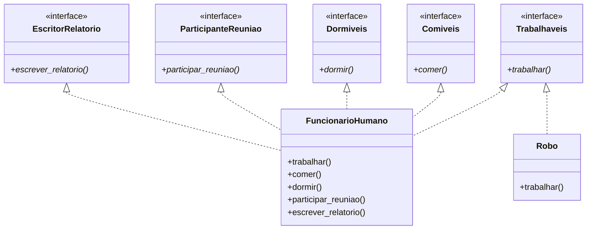

# Princípio da Segregação de Interfaces (ISP)

> **Clientes não devem ser forçados a depender de interfaces que não usam.**

O Princípio da Segregação de Interfaces é o quarto princípio SOLID. Ele afirma que nenhum cliente deve ser forçado a implementar métodos que não usa. Interfaces grandes e "gordas" devem ser divididas em interfaces menores e mais específicas, para que os clientes conheçam apenas os métodos relevantes para eles.

## O Problema: Interfaces Gordas

Quando uma interface tem muitos métodos, as classes implementadoras são forçadas a fornecer corpos para métodos de que não precisam. Isso leva a implementações vazias, stubs `NotImplementedError` e código confuso.

### ANTES: Violação do ISP — Interface Gorda

```python
from abc import ABC, abstractmethod

class Trabalhador(ABC):
    @abstractmethod
    def trabalhar(self) -> str:
        pass
    @abstractmethod
    def comer(self) -> str:
        pass
    @abstractmethod
    def dormir(self) -> str:
        pass
    @abstractmethod
    def participar_reuniao(self) -> str:
        pass
    @abstractmethod
    def escrever_relatorio(self) -> str:
        pass
```

```python
class FuncionarioHumano(Trabalhador):
    def trabalhar(self) -> str:
        return "Escrevendo código"
    def comer(self) -> str:
        return "Almoçando"
    def dormir(self) -> str:
        return "Dormindo 8 horas"
    def participar_reuniao(self) -> str:
        return "Participando da daily"
    def escrever_relatorio(self) -> str:
        return "Escrevendo relatório semanal"

class Robo(Trabalhador):
    def trabalhar(self) -> str:
        return "Montando peças"
    def comer(self) -> str:
        raise NotImplementedError("Robôs não comem")
    def dormir(self) -> str:
        raise NotImplementedError("Robôs não dormem")
    def participar_reuniao(self) -> str:
        raise NotImplementedError("Robôs não participam de reuniões")
    def escrever_relatorio(self) -> str:
        raise NotImplementedError("Robôs não escrevem relatórios")
```

> [!WARNING]
> `Robo` é forçado a implementar quatro métodos de que não precisa. Isso viola o ISP. A interface gorda `Trabalhador` força clientes a depender de métodos que não usam.

### DEPOIS: Interfaces Segregadas

```python
from abc import ABC, abstractmethod

class Trabalhaveis(ABC):
    @abstractmethod
    def trabalhar(self) -> str:
        pass

class Comiveis(ABC):
    @abstractmethod
    def comer(self) -> str:
        pass

class Dormiveis(ABC):
    @abstractmethod
    def dormir(self) -> str:
        pass

class ParticipanteReuniao(ABC):
    @abstractmethod
    def participar_reuniao(self) -> str:
        pass

class EscritorRelatorio(ABC):
    @abstractmethod
    def escrever_relatorio(self) -> str:
        pass

class FuncionarioHumano(Trabalhaveis, Comiveis, Dormiveis,
                         ParticipanteReuniao, EscritorRelatorio):
    def trabalhar(self) -> str:
        return "Escrevendo código"
    def comer(self) -> str:
        return "Almoçando"
    def dormir(self) -> str:
        return "Dormindo 8 horas"
    def participar_reuniao(self) -> str:
        return "Participando da daily"
    def escrever_relatorio(self) -> str:
        return "Escrevendo relatório semanal"

class Robo(Trabalhaveis):
    def trabalhar(self) -> str:
        return "Montando peças"
```



> [!SUCCESS]
> Cada interface tem uma responsabilidade única e clara. `Robo` implementa apenas o que precisa. Nenhuma classe é forçada a depender de métodos que não usa.

## Exemplo 2: Processamento de Documentos

**ANTES: Interface gorda**

```python
class ProcessadorDocumento(ABC):
    @abstractmethod
    def ler(self, caminho: str) -> str: pass
    @abstractmethod
    def escrever(self, caminho: str, conteudo: str) -> None: pass
    @abstractmethod
    def formatar_pdf(self) -> bytes: pass
    @abstractmethod
    def formatar_html(self) -> str: pass
    @abstractmethod
    def verificar_ortografia(self) -> list[str]: pass
    @abstractmethod
    def traduzir(self, idioma: str) -> str: pass
```

**DEPOIS: Interfaces segregadas**

```python
class Leitura(ABC):
    @abstractmethod
    def ler(self, caminho: str) -> str: pass

class Escrita(ABC):
    @abstractmethod
    def escrever(self, caminho: str, conteudo: str) -> None: pass

class FormatavelPDF(ABC):
    @abstractmethod
    def formatar_pdf(self) -> bytes: pass

class FormatavelHTML(ABC):
    @abstractmethod
    def formatar_html(self) -> str: pass

class VerificavelOrtografia(ABC):
    @abstractmethod
    def verificar_ortografia(self) -> list[str]: pass

class Traduzivel(ABC):
    @abstractmethod
    def traduzir(self, idioma: str) -> str: pass

class DocumentoSomenteLeitura(Leitura):
    def ler(self, caminho: str) -> str:
        from pathlib import Path
        return Path(caminho).read_text()

class DocumentoEditavel(Leitura, Escrita, VerificavelOrtografia):
    def ler(self, caminho: str) -> str:
        from pathlib import Path
        return Path(caminho).read_text()
    def escrever(self, caminho: str, conteudo: str) -> None:
        from pathlib import Path
        Path(caminho).write_text(conteudo)
    def verificar_ortografia(self) -> list[str]:
        return ["palavra1"]
```

## ISP com Protocols do Python

O `typing.Protocol` do Python torna o ISP natural:

```python
from typing import Protocol

class Desenhaveis(Protocol):
    def desenhar(self) -> str: ...

class Salvaveis(Protocol):
    def salvar(self, caminho: str) -> None: ...

class Circulo:
    def desenhar(self) -> str:
        return "Desenhando um círculo"
    def salvar(self, caminho: str) -> None:
        from pathlib import Path
        Path(caminho).write_text("Círculo")

class DocumentoTexto:
    def salvar(self, caminho: str) -> None:
        from pathlib import Path
        Path(caminho).write_text("Conteúdo")

def renderizar(coisa: Desenhaveis) -> None:
    print(coisa.desenhar())

def persistir(coisa: Salvaveis) -> None:
    coisa.salvar("output.dat")

renderizar(Circulo())
persistir(Circulo())
persistir(DocumentoTexto())
```

## ISP e o Padrão Adapter

Quando você precisa trabalhar com uma interface gorda existente, o padrão Adapter pode ajudar:

```python
from abc import ABC, abstractmethod

# Interface gorda existente (não pode mudar)
class TrabalhadorLegado(ABC):
    @abstractmethod
    def trabalhar(self): pass
    @abstractmethod
    def comer(self): pass
    @abstractmethod
    def dormir(self): pass

# Nossa interface fina
class Trabalhaveis(ABC):
    @abstractmethod
    def realizar_trabalho(self) -> str: pass

# Adapter
class AdaptadorRobo(Trabalhaveis):
    def __init__(self, robo: TrabalhadorLegado):
        self.robo = robo
    def realizar_trabalho(self) -> str:
        return self.robo.trabalhar()
```

## Sinais de Violação do ISP

| Sinal | Problema | Correção |
|-------|----------|----------|
| Corpo de método vazio | Forçado a implementar método não usado | Dividir interface |
| `raise NotImplementedError` | Não deveria estar na interface | Dividir interface |
| `pass` como implementação | No-op para método obrigatório | Dividir interface |
| Interface gorda com muitos métodos | Provavelmente múltiplas preocupações | Extrair em interfaces menores |

## Exercícios Práticos

1. Identifique a violação de ISP neste código e refatore-o:
   ```python
   class ImpressoraMultifuncional(ABC):
       @abstractmethod
       def imprimir(self, doc): pass
       @abstractmethod
       def digitalizar(self, doc): pass
       @abstractmethod
       def fax(self, doc): pass
   class ImpressoraSimples(ImpressoraMultifuncional):
       def imprimir(self, doc): ...
       def digitalizar(self, doc): raise NotImplementedError
       def fax(self, doc): raise NotImplementedError
   ```

2. Divida a seguinte interface seguindo ISP:
   ```python
   class ServicoUsuario(ABC):
       @abstractmethod
       def criar_usuario(self, dados): pass
       @abstractmethod
       def atualizar_usuario(self, id, dados): pass
       @abstractmethod
       def deletar_usuario(self, id): pass
       @abstractmethod
       def enviar_email_boas_vindas(self, email): pass
       @abstractmethod
       def enviar_recuperacao_senha(self, email): pass
       @abstractmethod
       def gerar_relatorio(self): pass
       @abstractmethod
       def exportar_usuarios_csv(self): pass
   ```

3. Qual é a diferença entre ISP e SRP? Como eles se complementam?

4. Refatore para usar Protocols do Python com ISP:
   ```python
   class PlayerMidia(ABC):
       @abstractmethod
       def reproduzir(self): pass
       @abstractmethod
       def pausar(self): pass
       @abstractmethod
       def parar(self): pass
       @abstractmethod
       def gravar(self): pass
   ```

5. Uma interface `BancoDeDados` tem `conectar()`, `consultar()`, `inserir()`, `atualizar()`, `deletar()`, `backup()`, `restaurar()`. Um `BancoSomenteLeitura` só usa `conectar()` e `consultar()`. Aplique ISP.

6. Explique como ISP se relaciona com o padrão Adapter. Quando você usaria um adapter em vez de refatorar a interface?

7. Projete interfaces para um sistema de casa inteligente onde controladores de luz, termostatos e câmeras de segurança precisam de diferentes subconjuntos de capacidades (ligar/desligar, definir temperatura, gravar vídeo, detectar movimento).

8. Como a segregação excessiva de interfaces pode se tornar um problema? Qual é o equilíbrio entre ISP e pragmatismo?

## Resumo

- **ISP**: Clientes não devem ser forçados a depender de interfaces que não usam
- **Interfaces gordas** forçam classes implementadoras a fornecer métodos não utilizados
- **Solução**: Dividir interfaces grandes em outras menores e específicas por função
- **Protocols do Python** (subtipagem estrutural) naturalmente incentivam ISP
- **ISP + SRP**: ISP é sobre design de interfaces para clientes; SRP é sobre design de classes para responsabilidades

> [!SUCCESS]
> ISP mantém suas interfaces enxutas e suas implementações honestas. Cada cliente depende exatamente do que precisa — nada mais, nada menos.
