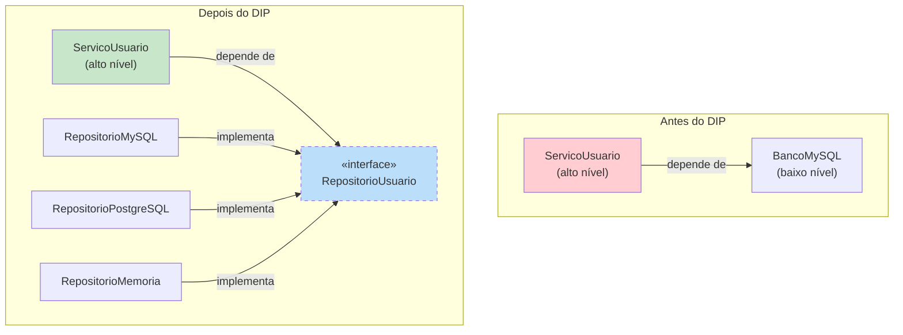

# Princípio da Inversão de Dependência (DIP)

> **Módulos de alto nível não devem depender de módulos de baixo nível. Ambos devem depender de abstrações.**
> **Abstrações não devem depender de detalhes. Detalhes devem depender de abstrações.**

O Princípio da Inversão de Dependência é o quinto e último princípio SOLID. Ele inverte a direção tradicional da dependência: em vez do código de alto nível depender de detalhes de implementação de baixo nível, ambos dependem de interfaces abstratas.

## O Problema: Acoplamento Forte

Quando a lógica de negócio de alto nível depende diretamente de implementações de baixo nível (drivers de banco de dados, sistemas de arquivos, APIs externas), qualquer mudança nesses detalhes de baixo nível força mudanças na lógica de alto nível.

### ANTES: Violação do DIP

```python
from typing import Any

class BancoMySQL:
    def __init__(self, string_conexao: str):
        self.string_conexao = string_conexao

    def conectar(self) -> None:
        print(f"Conectando ao MySQL: {self.string_conexao}")

    def salvar_usuario(self, id: int, nome: str, email: str) -> None:
        print(f"MySQL: INSERT INTO usuarios ({id}, {nome}, {email})")

    def buscar_usuario(self, id: int) -> dict | None:
        print(f"MySQL: SELECT * FROM usuarios WHERE id = {id}")
        return {"id": id, "nome": "Alice", "email": "alice@exemplo.com"}

class ServicoUsuario:
    def __init__(self):
        self.db = BancoMySQL("mysql://localhost:3306/mydb")

    def registrar_usuario(self, id: int, nome: str, email: str) -> dict:
        print("Validando dados do usuário...")
        if not nome or not email:
            raise ValueError("Nome e email são obrigatórios")
        self.db.conectar()
        self.db.salvar_usuario(id, nome, email)
        return {"id": id, "nome": nome, "email": email}
```

> [!WARNING]
> `ServicoUsuario` (alto nível) depende diretamente de `BancoMySQL` (baixo nível). Se você quiser mudar para PostgreSQL, MongoDB ou um mock para teste, precisa alterar `ServicoUsuario`.

### DEPOIS: Refatoração Compatível com DIP

```python
from abc import ABC, abstractmethod
from typing import Optional

class RepositorioUsuario(ABC):
    @abstractmethod
    def conectar(self) -> None:
        pass
    @abstractmethod
    def salvar(self, id: int, nome: str, email: str) -> None:
        pass
    @abstractmethod
    def buscar_por_id(self, id: int) -> Optional[dict]:
        pass

class RepositorioUsuarioMySQL(RepositorioUsuario):
    def __init__(self, string_conexao: str):
        self.string_conexao = string_conexao
    def conectar(self) -> None:
        print(f"Conectando ao MySQL: {self.string_conexao}")
    def salvar(self, id: int, nome: str, email: str) -> None:
        print(f"MySQL: INSERT INTO usuarios ({id}, {nome}, {email})")
    def buscar_por_id(self, id: int) -> Optional[dict]:
        return {"id": id, "nome": "Alice", "email": "alice@exemplo.com"}

class RepositorioUsuarioPostgreSQL(RepositorioUsuario):
    def __init__(self, string_conexao: str):
        self.string_conexao = string_conexao
    def conectar(self) -> None:
        print(f"Conectando ao PostgreSQL: {self.string_conexao}")
    def salvar(self, id: int, nome: str, email: str) -> None:
        print(f"PostgreSQL: INSERT INTO usuarios ({id}, {nome}, {email})")
    def buscar_por_id(self, id: int) -> Optional[dict]:
        return {"id": id, "nome": "Alice", "email": "alice@exemplo.com"}

class RepositorioUsuarioMemoria(RepositorioUsuario):
    def __init__(self):
        self._usuarios: dict[int, dict] = {}
    def conectar(self) -> None:
        pass
    def salvar(self, id: int, nome: str, email: str) -> None:
        self._usuarios[id] = {"id": id, "nome": nome, "email": email}
    def buscar_por_id(self, id: int) -> Optional[dict]:
        return self._usuarios.get(id)

class ServicoUsuario:
    def __init__(self, repo: RepositorioUsuario):
        self._repo = repo

    def registrar_usuario(self, id: int, nome: str, email: str) -> dict:
        print("Validando dados do usuário...")
        if not nome or not email:
            raise ValueError("Nome e email são obrigatórios")
        self._repo.conectar()
        self._repo.salvar(id, nome, email)
        return {"id": id, "nome": nome, "email": email}

    def buscar_perfil(self, id: int) -> dict | None:
        self._repo.conectar()
        return self._repo.buscar_por_id(id)

# Uso em produção
repo_mysql = RepositorioUsuarioMySQL("mysql://localhost/mydb")
servico = ServicoUsuario(repo_mysql)
servico.registrar_usuario(1, "Alice", "alice@exemplo.com")

# Teste com memória
repo_teste = RepositorioUsuarioMemoria()
servico_teste = ServicoUsuario(repo_teste)
servico_teste.registrar_usuario(1, "Bob", "bob@exemplo.com")
```



## Injeção de Dependência: O Mecanismo para DIP

Injeção de Dependência (DI) é a principal técnica para alcançar DIP:

```python
from abc import ABC, abstractmethod

class Logger(ABC):
    @abstractmethod
    def log(self, mensagem: str) -> None:
        pass

class LoggerConsole(Logger):
    def log(self, mensagem: str) -> None:
        print(f"[LOG] {mensagem}")

# Injeção via construtor (mais comum)
class ServicoPagamento:
    def __init__(self, logger: Logger):
        self.logger = logger

    def processar(self, quantia: float) -> None:
        self.logger.log(f"Processando pagamento: ${quantia:.2f}")

# Injeção via setter
class CarrinhoCompras:
    def __init__(self):
        self.logger: Logger | None = None

    def set_logger(self, logger: Logger) -> None:
        self.logger = logger

# Injeção via método (parâmetro)
class ProcessadorPedido:
    def processar(self, id_pedido: int, logger: Logger) -> None:
        logger.log(f"Processando pedido: {id_pedido}")
```

## Exemplo 2: Pipeline de Processamento de Arquivos

**ANTES: Arquitetura rígida**

```python
import json
from pathlib import Path

class PipelineDados:
    def __init__(self):
        self.caminho_entrada = "dados.json"
        self.caminho_saida = "saida.json"

    def executar(self) -> None:
        raw = Path(self.caminho_entrada).read_text()
        data = json.loads(raw)
        processados = [item for item in data if item.get("ativo")]
        Path(self.caminho_saida).write_text(json.dumps(processados))
```

**DEPOIS: Flexível com DIP**

```python
from abc import ABC, abstractmethod
from typing import Any

class LeitorDados(ABC):
    @abstractmethod
    def ler(self) -> list[dict[str, Any]]: pass

class EscritorDados(ABC):
    @abstractmethod
    def escrever(self, dados: list[dict[str, Any]]) -> None: pass

class ProcessadorDados(ABC):
    @abstractmethod
    def processar(self, dados: list[dict[str, Any]]) -> list[dict[str, Any]]: pass

class LeitorJSON(LeitorDados):
    def __init__(self, caminho: str):
        self.caminho = caminho
    def ler(self) -> list[dict[str, Any]]:
        import json
        return json.loads(Path(self.caminho).read_text())

class EscritorJSON(EscritorDados):
    def __init__(self, caminho: str):
        self.caminho = caminho
    def escrever(self, dados: list[dict[str, Any]]) -> None:
        import json
        Path(self.caminho).write_text(json.dumps(dados, indent=2))

class FiltroAtivos(ProcessadorDados):
    def processar(self, dados: list[dict[str, Any]]) -> list[dict[str, Any]]:
        return [item for item in dados if item.get("ativo")]

class PipelineDados:
    def __init__(self, leitor: LeitorDados, processador: ProcessadorDados,
                 escritor: EscritorDados):
        self._leitor = leitor
        self._processador = processador
        self._escritor = escritor
    def executar(self) -> None:
        raw = self._leitor.ler()
        processados = self._processador.processar(raw)
        self._escritor.escrever(processados)
```

## DIP e Testes

Um dos maiores benefícios do DIP é a testabilidade:

```python
from unittest.mock import Mock

# Sem DIP — difícil de testar
class ManipuladorPagamento:
    def __init__(self):
        self.gateway = GatewayStripe()  # Não pode mockar facilmente

# Com DIP — fácil de testar
class ManipuladorPagamento:
    def __init__(self, gateway: GatewayPagamento):
        self.gateway = gateway  # Pode injetar mock

# Teste
def test_manipulador_pagamento():
    mock_gateway = Mock()
    mock_gateway.cobrar.return_value = True
    handler = ManipuladorPagamento(mock_gateway)
    assert handler.cobrar(100.0) == True
    mock_gateway.cobrar.assert_called_once_with(100.0)
```

## Sinais de Violação do DIP

| Sinal de Alerta | Problema |
|----------------|----------|
| Palavra-chave `new` na lógica de negócio | Criando dependências concretas diretamente |
| Chamadas de métodos estáticos em classes concretas | Acoplamento à implementação |
| Import de implementações concretas em módulos de alto nível | Dependência de detalhes |
| Difícil testar sem infraestrutura real | Alto nível depende de baixo nível |
| Trocar implementações exige mudanças de código | Camada de abstração ausente |

## Exercícios Práticos

1. Identifique a violação de DIP neste código e refatore-o:
   ```python
   class ServicoPedido:
       def __init__(self):
           self.email = ServicoEmailSendGrid()
           self.pdf = GeradorPDFSharp()
       def processar_pedido(self, id_pedido):
           self.email.enviar_confirmacao(id_pedido)
           self.pdf.gerar_fatura(id_pedido)
   ```

2. Aplique DIP a esta hierarquia de classes:
   ```python
   class AppClima:
       def __init__(self):
           self.api = APIOpenWeatherMap()
       def obter_previsao(self, cidade):
           return self.api.buscar(cidade)
   ```

3. Crie uma abstração `Cache` e implemente `CacheRedis` e `CacheMemoria`. Depois use DIP para fazer um `ServicoProduto` depender da abstração.

4. O que é o Composition Root e por que é importante para o DIP? Onde ele deve ser colocado em uma aplicação?

5. Implemente um contêiner simples de injeção de dependência que possa registrar e resolver serviços por suas abstrações.

6. Refatore o seguinte para seguir DIP e permitir testes unitários:
   ```python
   class GeradorRelatorio:
       def __init__(self):
           self.db = ConexaoMySQL("localhost", "root", "senha")
       def gerar(self, id_relatorio):
           dados = self.db.consultar(f"SELECT * FROM relatorios WHERE id={id_relatorio}")
           html = f"<h1>Relatório {id_relatorio}</h1><p>{dados}</p>"
           with open(f"relatorio_{id_relatorio}.html", "w") as f:
               f.write(html)
   ```

7. Explique a diferença entre Inversão de Dependência e Injeção de Dependência. Como eles se relacionam?

8. Projete um sistema de notificação onde `ServicoAlerta` depende de uma abstração `Notificador`. Implemente `NotificadorEmail`, `NotificadorSMS`, e `NotificadorSlack`. Mostre como DIP facilita adicionar `NotificadorTeams` depois.

## Resumo

- **DIP**: Módulos de alto nível não devem depender de módulos de baixo nível. Ambos devem depender de abstrações
- **Mecanismo**: Injeção de Dependência — passe dependências via construtor, setter ou parâmetro de método
- **Composition Root**: Único lugar para montar todo o grafo de dependências
- **Benefícios**: Testabilidade, flexibilidade, capacidade de troca, acoplamento reduzido
- **Testes**: Mock abstrações, não classes concretas
- **DIP + Outros SOLID**: DIP habilita OCP (novas implementações sem modificar clientes) e depende de LSP/ISP para as abstrações

> [!SUCCESS]
> DIP é a pedra angular da arquitetura limpa. Ao inverter dependências em direção a abstrações, você cria um sistema onde a lógica de negócio é independente da infraestrutura — tornando-o testável, flexível e resiliente a mudanças.

## Additional Content

More content here...


## DIP sem Frameworks: Composition Root

```python
from abc import ABC, abstractmethod

class Cache(ABC):
    @abstractmethod
    def get(self, chave: str) -> str | None: pass
    @abstractmethod
    def set(self, chave: str, valor: str, ttl: int = 300) -> None: pass

class CacheRedis(Cache):
    def __init__(self, host: str = "localhost", port: int = 6379):
        self.host = host; self.port = port
    def get(self, chave: str) -> str | None:
        print(f"Redis GET {chave}"); return None
    def set(self, chave: str, valor: str, ttl: int = 300) -> None:
        print(f"Redis SET {chave}")

class CacheMemoria(Cache):
    def __init__(self):
        self._store: dict[str, tuple[str, float]] = {}
    def get(self, chave: str) -> str | None:
        import time
        if chave in self._store:
            v, exp = self._store[chave]
            if time.time() < exp: return v
            del self._store[chave]
        return None
    def set(self, chave: str, valor: str, ttl: int = 300) -> None:
        import time
        self._store[chave] = (valor, time.time() + ttl)

class RepositorioUsuario(ABC):
    @abstractmethod
    def buscar_por_id(self, id: int) -> dict | None: pass

class RepoUsuarioPostgres(RepositorioUsuario):
    def __init__(self, conn: str, cache: Cache):
        self.conn = conn; self.cache = cache
    def buscar_por_id(self, id: int) -> dict | None:
        c = self.cache.get(f"user:{id}")
        if c: return {"id": id, "nome": "Cacheado", "email": c}
        return {"id": id, "nome": "Alice", "email": "a@ex.com"}

def criar_repo_teste():
    return RepoUsuarioPostgres("pg://test/db", CacheMemoria())

repo = criar_repo_teste()
print(repo.buscar_por_id(1))
```

## DIP e Testabilidade

```python
from unittest.mock import Mock
from abc import ABC, abstractmethod

class GatewayPagamento(ABC):
    @abstractmethod
    def cobrar(self, quantia: float) -> bool: pass

class ManipuladorPagamento:
    def __init__(self, gateway: GatewayPagamento):
        self.gateway = gateway
    def processar(self, quantia: float) -> bool:
        return self.gateway.cobrar(quantia)

def test_manipulador():
    mock = Mock()
    mock.cobrar.return_value = True
    h = ManipuladorPagamento(mock)
    assert h.processar(100.0) == True
    mock.cobrar.assert_called_once_with(100.0)
```

## DIP e Outros Principios SOLID

| Principio | Relacao com DIP |
|-----------|-----------------|
| **SRP** | DIP separa criacao (wiring) da logica de negocio |
| **OCP** | Novas implementacoes sem modificar clientes |
| **LSP** | Implementacoes injetadas devem ser substituiveis |
| **ISP** | Interfaces DIP devem ser pequenas |

## Exercicios Praticos

1. Refatore para DIP: classe `ServicoPedido` que cria `ServicoEmailSendGrid` e `GeradorPDF` internamente.

2. Aplique DIP a `AppClima` que depende diretamente de `APIOpenWeatherMap`.

3. Crie abstracao `Cache` com `CacheRedis` e `CacheMemoria`.

4. O que e Composition Root? Por que e importante?

5. Implemente um container simples de injecao de dependencia.

6. Refatore para DIP: `GeradorRelatorio` que cria `ConexaoMySQL` internamente.

7. Diferenca entre Inversao de Dependencia e Injecao de Dependencia?

8. Projete `ServicoAlerta` que depende de `Notificador` (abstracao).

## Resumo

- **DIP**: Modulos de alto nivel nao dependem de baixo nivel
- **Ambos** dependem de abstracoes
- **Mecanismo**: Injecao de Dependencia
- **Composition Root**: Montagem centralizada
- **Beneficios**: Testabilidade, flexibilidade, baixo acoplamento

> [!SUCCESS]
> DIP e a pedra angular da arquitetura limpa.
