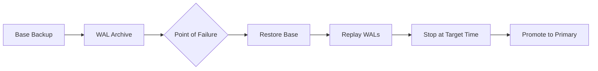

# Backup, Recovery, and High Availability

## Backup Strategies

A backup strategy balances **Recovery Point Objective (RPO)** — how much data you can lose — against **Recovery Time Objective (RTO)** — how fast you recover.

| Strategy | RPO | RTO | Storage | Typical Use |
|---|---|---|---|---|
| Full backup only | Last backup | Long | High | Small databases |
| Full + differential | Last differential | Medium | Medium | Medium databases |
| Full + incremental | Last WAL/xlogs | Short | Low | Large databases |
| Continuous archiving | Seconds | Short | Low | Mission-critical |

## Full Backup

### pg_dump (Logical Backup)

```bash
# Dump a single database
pg_dump -h localhost -U admin -d mydb > /backups/mydb_$(date +%Y%m%d).sql

# Custom format (compressed, parallel restore)
pg_dump -h localhost -U admin -Fc -d mydb > /backups/mydb_$(date +%Y%m%d).dump

# Parallel dump (faster for large DBs)
pg_dump -h localhost -U admin -j 4 -Fd -d mydb -f /backups/mydb_dir/
```

### pg_dumpall (Cluster-Level)

```bash
# Backup all databases + global objects (roles, tablespaces)
pg_dumpall -h localhost -U postgres > /backups/full_cluster.sql

# Globals only (roles, tablespaces)
pg_dumpall -h localhost -U postgres --globals-only > /backups/globals.sql
```

### Physical Backup (pg_basebackup)

```bash
# Create physical base backup (for PITR)
pg_basebackup -h localhost -D /backups/base_$(date +%Y%m%d) -X stream -P -v

# With replication slot
pg_basebackup -h localhost -D /backups/base_$(date +%Y%m%d) \
    -X stream -P -v --slot=backup_slot
```

[!NOTE]
Logical backups (`pg_dump`) are portable across PostgreSQL versions and architectures. Physical backups (`pg_basebackup`) are faster for large databases but tied to the specific server version.

## Incremental and Differential Backups

| Type | Scope | Backup Size | Restore Steps |
|---|---|---|---|
| Full | Entire database | Largest | 1 step |
| Differential | Changes since last full | Medium | Full + latest differential |
| Incremental | Changes since last any backup | Smallest | Full + all incrementals in order |

### WAL Archiving (Continuous Archiving)

WAL (Write-Ahead Log) archiving enables point-in-time recovery and incremental backups.

```bash
# postgresql.conf
wal_level = replica           # or 'logical' for logical replication
archive_mode = on
archive_command = 'cp %p /backups/wal/%f'
archive_timeout = 60          # force archive every 60 seconds
```

```bash
# Restore using WAL files
# 1. Restore base backup
# 2. Create recovery.conf or use pg_rewind
# 3. Set restore_command
restore_command = 'cp /backups/wal/%f %p'
recovery_target_time = '2024-06-15 14:30:00 UTC'
```

### pgBackRest (Advanced Backup Tool)

```bash
# stanza: defines a database cluster
pgbackrest --stanza=mydb stanza-create

# Full backup
pgbackrest --stanza=mydb --type=full backup

# Incremental backup
pgbackrest --stanza=mydb --type=incr backup

# Differential backup
pgbackrest --stanza=mydb --type=diff backup

# Restore to specific point in time
pgbackrest --stanza=mydb --type=time \
    --target="2024-06-15 14:30:00+00" restore
```

[!IMPORTANT]
Always test your backups. A backup that cannot be restored is worthless. Schedule regular restore drills.

## Point-in-Time Recovery (PITR)

PITR allows restoring to any moment within the WAL archive timeline.

```sql
-- PostgreSQL: create recovery.signal (PG 12+) and set:
restore_command = 'cp /backups/wal/%f %p'
recovery_target_time = '2024-06-15 14:30:00 UTC'
-- or
recovery_target_xid = '1234567'
-- or
recovery_target_lsn = '0/1ABCDEF0'
```

```bash
# Using pgBackRest
pgbackrest --stanza=mydb --type=time \
    --target="2024-06-15 14:30:00+00" \
    --target-action=promote restore

# Using barman
barman recover mydb /var/lib/postgresql/data \
    --remote-ssh-command="ssh postgres@db-host" \
    --target-time "2024-06-15 14:30:00"
```

### PITR Workflow



## Replication

### Streaming Replication

```ini
# Primary: postgresql.conf
wal_level = replica
max_wal_senders = 5
wal_keep_size = 1024  # MB

# Replica: postgresql.conf
hot_standby = on
primary_conninfo = 'host=primary-host port=5432 user=replicator password=xxx'
```

```bash
# Create replica
pg_basebackup -h primary-host -D /var/lib/postgresql/data \
    -X stream -P -v -R  # -R creates standby.signal

# Monitor replication
SELECT * FROM pg_stat_replication;
```

| Replication Type | Sync Mode | Data Loss on Failover | Latency |
|---|---|---|---|
| Synchronous | Confirm write to primary + replica | Zero | Higher |
| Asynchronous | Confirm write to primary only | Possible (up to WAL lag) | Lower |
| Semi-synchronous | At least one replica confirms | Minimal | Medium |

### Logical Replication

Replicates at the row level — can filter, transform, or replicate subsets.

```sql
-- Publisher
CREATE PUBLICATION mypub FOR TABLE orders, customers;
CREATE PUBLICATION mypub_filtered FOR TABLE orders WHERE (status = 'active');

-- Subscriber
CREATE SUBSCRIPTION mysub CONNECTION 'host=primary-host dbname=mydb'
    PUBLICATION mypub;
```

| Aspect | Streaming (Physical) | Logical |
|---|---|---|
| Granularity | Entire cluster | Per-table |
| Version compatibility | Same major version | Cross-version possible |
| DDL replication | Automatic | Manual |
| Conflict resolution | Not applicable | Configurable |
| Use case | HA, failover | Migration, data warehouse |

## High Availability Architectures

### Active-Passive (Hot Standby)

```
Primary → Replica (standby, accepting reads)
         → Replica (standby, accepting reads)

Failover: Promote replica → old primary becomes standby
Tools: Patroni, repmgr, pg_auto_failover
```

### Active-Active (Multi-Master)

```
Node A ↔ Node B (bidirectional replication)
Both accept writes, conflicts resolved via application logic
Tools: PostgreSQL BDR, Citus (read-only scale-out)
```

### Patroni (HA with DCS)

```yaml
# patroni.yml
scope: mycluster
namespace: /db/
name: pg1

restapi:
  listen: 0.0.0.0:8008
  connect_address: 192.168.1.10:8008

etcd:
  host: 192.168.1.100:2379

bootstrap:
  dcs:
    ttl: 30
    loop_wait: 10
    retry_timeout: 10
    maximum_lag_on_failover: 1048576
    postgresql:
      use_pg_rewind: true
      parameters:
        wal_level: replica
        hot_standby: "on"

postgresql:
  listen: 0.0.0.0:5432
  connect_address: 192.168.1.10:5432
  data_dir: /var/lib/postgresql/data
  pg_hba:
    - host replication replicator 192.168.1.0/24 md5
  replication:
    username: replicator
    password: secure_password
  parameters:
    unix_socket_directories: '.'
```

## Backup Automation Script

```bash
#!/bin/bash
# Automated backup script

BACKUP_DIR="/backups/$(date +%Y-%m-%d)"
DB_NAME="mydb"
RETENTION_DAYS=30

mkdir -p "$BACKUP_DIR"

# Full backup on Sunday, incremental otherwise
if [ "$(date +%u)" -eq 7 ]; then
    pgbackrest --stanza="$DB_NAME" --type=full backup
else
    pgbackrest --stanza="$DB_NAME" --type=incr backup
fi

# Cleanup old backups
pgbackrest --stanza="$DB_NAME" --retention-full=$RETENTION_DAYS expire

# Test backup integrity
pgbackrest --stanza="$DB_NAME" check

# Copy to offsite
rsync -avz /backups/ backup@offsite:/backups/
```

## Disaster Recovery Testing

```sql
-- Create a test scenario
CREATE TABLE dr_test AS SELECT * FROM important_table;

-- Simulate failure: DROP TABLE important_table;
-- Practice recovery:
-- 1. Identify the time of drop
-- 2. Restore base backup to a different directory
-- 3. Replay WAL to just before the DROP
-- 4. Extract the table and import it back
```

## Comparison Matrix

| Tool/Method | RPO | RTO | Complexity | Cost |
|---|---|---|---|---|
| pg_dump (logical) | 1 day | Hours | Low | Low |
| pg_basebackup + WAL | Seconds | Minutes | Medium | Medium |
| pgBackRest | Seconds | Minutes | Medium | Low |
| Streaming replication | Near-zero | Seconds | High | Medium |
| Patroni + etcd | Near-zero | < 30s | High | High |
| Cloud-managed (RDS) | Seconds | Minutes | None | Pay-per-use |

[!TIP]
The best backup strategy is the one you've actually tested. Run quarterly recovery drills to ensure your RPO/RTO targets are met.

## Practice Questions

1. What is the difference between a logical backup (`pg_dump`) and a physical backup (`pg_basebackup`)? When would you use each?
2. Configure WAL archiving in PostgreSQL and explain the purpose of `archive_command` and `archive_timeout`.
3. Write a `pgBackRest` command sequence to create a full backup, then an incremental backup, then restore to a specific time.
4. Explain RPO and RTO. What are acceptable values for a financial transactions database?
5. How does synchronous replication differ from asynchronous replication? What are the trade-offs?
6. Set up a Patroni HA cluster with three nodes. What components are required? How does failover work?
7. What is Point-in-Time Recovery (PITR) and what files are required to perform it?
8. Create a backup retention policy: weekly full backups, daily differentials, and hourly WAL archiving. Write the cron schedule.
9. How does logical replication differ from streaming replication? Give a use case for each.
10. You accidentally DROP a table at 14:32:15. Describe step-by-step how to recover it using PITR without restoring the entire database.
