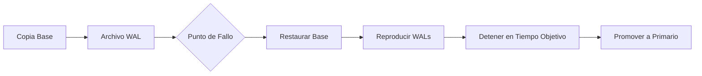

# Copia de Seguridad, Recuperación y Alta Disponibilidad

## Estrategias de Copia de Seguridad

Una estrategia de copia de seguridad equilibra el **Objetivo de Punto de Recuperación (RPO)** — cuántos datos puedes perder — contra el **Objetivo de Tiempo de Recuperación (RTO)** — qué tan rápido te recuperas.

| Estrategia | RPO | RTO | Almacenamiento | Uso Típico |
|---|---|---|---|---|
| Solo copia completa | Última copia | Largo | Alto | Bases pequeñas |
| Completa + diferencial | Última diferencial | Medio | Medio | Bases medianas |
| Completa + incremental | Último WAL/xlogs | Corto | Bajo | Bases grandes |
| Archivado continuo | Segundos | Corto | Bajo | Misión crítica |

## Copia de Seguridad Completa

### pg_dump (Copia Lógica)

```bash
# Volcar una sola base de datos
pg_dump -h localhost -U admin -d mydb > /backups/mydb_$(date +%Y%m%d).sql

# Formato personalizado (comprimido, restauración paralela)
pg_dump -h localhost -U admin -Fc -d mydb > /backups/mydb_$(date +%Y%m%d).dump

# Volcado paralelo (más rápido para bases grandes)
pg_dump -h localhost -U admin -j 4 -Fd -d mydb -f /backups/mydb_dir/
```

### pg_dumpall (Nivel de Clúster)

```bash
# Copia de todas las bases + objetos globales (roles, tablespaces)
pg_dumpall -h localhost -U postgres > /backups/full_cluster.sql

# Solo objetos globales (roles, tablespaces)
pg_dumpall -h localhost -U postgres --globals-only > /backups/globals.sql
```

### Copia Física (pg_basebackup)

```bash
# Crear copia física base (para PITR)
pg_basebackup -h localhost -D /backups/base_$(date +%Y%m%d) -X stream -P -v

# Con slot de replicación
pg_basebackup -h localhost -D /backups/base_$(date +%Y%m%d) \
    -X stream -P -v --slot=backup_slot
```

[!NOTE]
Las copias lógicas (`pg_dump`) son portátiles entre versiones y arquitecturas de PostgreSQL. Las copias físicas (`pg_basebackup`) son más rápidas para bases grandes pero vinculadas a la versión específica del servidor.

## Copias Incremental y Diferencial

| Tipo | Alcance | Tamaño de Copia | Pasos para Restaurar |
|---|---|---|---|
| Completa | Base entera | Mayor | 1 paso |
| Diferencial | Cambios desde última completa | Medio | Completa + diferencial más reciente |
| Incremental | Cambios desde cualquier última copia | Menor | Completa + todas incrementales en orden |

### Archivado WAL (Archivado Continuo)

El archivado WAL (Write-Ahead Log) permite recuperación puntual y copias incrementales.

```bash
# postgresql.conf
wal_level = replica           # o 'logical' para replicación lógica
archive_mode = on
archive_command = 'cp %p /backups/wal/%f'
archive_timeout = 60          # forzar archivado cada 60 segundos
```

```bash
# Restaurar usando archivos WAL
# 1. Restaurar copia base
# 2. Crear recovery.conf o usar pg_rewind
# 3. Configurar restore_command
restore_command = 'cp /backups/wal/%f %p'
recovery_target_time = '2024-06-15 14:30:00 UTC'
```

### pgBackRest (Herramienta Avanzada de Copia)

```bash
# stanza: define un clúster de base de datos
pgbackrest --stanza=mydb stanza-create

# Copia completa
pgbackrest --stanza=mydb --type=full backup

# Copia incremental
pgbackrest --stanza=mydb --type=incr backup

# Copia diferencial
pgbackrest --stanza=mydb --type=diff backup

# Restaurar a un punto específico en el tiempo
pgbackrest --stanza=mydb --type=time \
    --target="2024-06-15 14:30:00+00" restore
```

[!IMPORTANT]
Siempre prueba tus copias de seguridad. Una copia que no se puede restaurar no vale nada. Programa ejercicios regulares de restauración.

## Recuperación Puntual (PITR)

PITR permite restaurar a cualquier momento dentro de la línea de tiempo del archivo WAL.

```sql
-- PostgreSQL: crear recovery.signal (PG 12+) y configurar:
restore_command = 'cp /backups/wal/%f %p'
recovery_target_time = '2024-06-15 14:30:00 UTC'
-- o
recovery_target_xid = '1234567'
-- o
recovery_target_lsn = '0/1ABCDEF0'
```

```bash
# Usando pgBackRest
pgbackrest --stanza=mydb --type=time \
    --target="2024-06-15 14:30:00+00" \
    --target-action=promote restore

# Usando barman
barman recover mydb /var/lib/postgresql/data \
    --remote-ssh-command="ssh postgres@db-host" \
    --target-time "2024-06-15 14:30:00"
```

### Flujo de Trabajo PITR



## Replicación

### Replicación en Stream

```ini
# Primario: postgresql.conf
wal_level = replica
max_wal_senders = 5
wal_keep_size = 1024  # MB

# Réplica: postgresql.conf
hot_standby = on
primary_conninfo = 'host=primary-host port=5432 user=replicator password=xxx'
```

```bash
# Crear réplica
pg_basebackup -h primary-host -D /var/lib/postgresql/data \
    -X stream -P -v -R  # -R crea standby.signal

# Monitorear replicación
SELECT * FROM pg_stat_replication;
```

| Tipo de Replicación | Modo Síncrono | Pérdida de Datos en Failover | Latencia |
|---|---|---|---|
| Síncrona | Confirmar escritura en primario + réplica | Cero | Mayor |
| Asíncrona | Confirmar escritura solo en primario | Posible (hasta lag WAL) | Menor |
| Semisíncrona | Al menos una réplica confirma | Mínima | Media |

### Replicación Lógica

Replica a nivel de fila — puede filtrar, transformar o replicar subconjuntos.

```sql
-- Publicador
CREATE PUBLICATION mypub FOR TABLE orders, customers;
CREATE PUBLICATION mypub_filtered FOR TABLE orders WHERE (status = 'active');

-- Suscriptor
CREATE SUBSCRIPTION mysub CONNECTION 'host=primary-host dbname=mydb'
    PUBLICATION mypub;
```

| Aspecto | Stream (Física) | Lógica |
|---|---|---|
| Granularidad | Clúster entero | Por tabla |
| Compatibilidad de versión | Misma versión principal | Entre versiones posible |
| Replicación DDL | Automática | Manual |
| Resolución de conflictos | No aplicable | Configurable |
| Caso de uso | HA, failover | Migración, data warehouse |

## Arquitecturas de Alta Disponibilidad

### Activo-Pasivo (Hot Standby)

```
Primario → Réplica (standby, aceptando lecturas)
         → Réplica (standby, aceptando lecturas)

Failover: Promover réplica → antiguo primario se vuelve standby
Herramientas: Patroni, repmgr, pg_auto_failover
```

### Activo-Activo (Multi-Maestro)

```
Nodo A ↔ Nodo B (replicación bidireccional)
Ambos aceptan escrituras, conflictos resueltos vía lógica de la aplicación
Herramientas: PostgreSQL BDR, Citus (escalado de lectura)
```

### Patroni (HA con DCS)

```yaml
# patroni.yml
scope: mycluster
namespace: /db/
name: pg1

restapi:
  listen: 0.0.0.0:8008
  connect_address: 192.168.1.10:8008

etcd:
  host: 192.168.1.100:2379

bootstrap:
  dcs:
    ttl: 30
    loop_wait: 10
    retry_timeout: 10
    maximum_lag_on_failover: 1048576
    postgresql:
      use_pg_rewind: true
      parameters:
        wal_level: replica
        hot_standby: "on"

postgresql:
  listen: 0.0.0.0:5432
  connect_address: 192.168.1.10:5432
  data_dir: /var/lib/postgresql/data
  pg_hba:
    - host replication replicator 192.168.1.0/24 md5
  replication:
    username: replicator
    password: secure_password
  parameters:
    unix_socket_directories: '.'
```

## Script de Automatización de Copia

```bash
#!/bin/bash
# Script de copia automatizada

BACKUP_DIR="/backups/$(date +%Y-%m-%d)"
DB_NAME="mydb"
RETENTION_DAYS=30

mkdir -p "$BACKUP_DIR"

# Copia completa el domingo, incremental los demás días
if [ "$(date +%u)" -eq 7 ]; then
    pgbackrest --stanza="$DB_NAME" --type=full backup
else
    pgbackrest --stanza="$DB_NAME" --type=incr backup
fi

# Limpiar copias antiguas
pgbackrest --stanza="$DB_NAME" --retention-full=$RETENTION_DAYS expire

# Probar integridad de la copia
pgbackrest --stanza="$DB_NAME" check

# Copiar a ubicación remota
rsync -avz /backups/ backup@offsite:/backups/
```

## Prueba de Recuperación ante Desastres

```sql
-- Crear un escenario de prueba
CREATE TABLE dr_test AS SELECT * FROM important_table;

-- Simular fallo: DROP TABLE important_table;
-- Practicar recuperación:
-- 1. Identificar el momento de la eliminación
-- 2. Restaurar copia base en un directorio diferente
-- 3. Reproducir WAL hasta justo antes del DROP
-- 4. Extraer la tabla e importarla de vuelta
```

## Matriz de Comparación

| Herramienta/Método | RPO | RTO | Complejidad | Costo |
|---|---|---|---|---|
| pg_dump (lógico) | 1 día | Horas | Baja | Bajo |
| pg_basebackup + WAL | Segundos | Minutos | Media | Medio |
| pgBackRest | Segundos | Minutos | Media | Bajo |
| Replicación en stream | Casi cero | Segundos | Alta | Medio |
| Patroni + etcd | Casi cero | < 30s | Alta | Alto |
| Gestionado en nube (RDS) | Segundos | Minutos | Ninguna | Pago por uso |

[!TIP]
La mejor estrategia de copia de seguridad es aquella que realmente has probado. Realiza ejercicios trimestrales de recuperación para asegurar que tus objetivos de RPO/RTO se cumplen.

## Preguntas de Práctica

1. ¿Cuál es la diferencia entre una copia lógica (`pg_dump`) y una copia física (`pg_basebackup`)? ¿Cuándo usarías cada una?
2. Configura el archivado WAL en PostgreSQL y explica el propósito de `archive_command` y `archive_timeout`.
3. Escribe una secuencia de comandos `pgBackRest` para crear una copia completa, luego una copia incremental, y luego restaurar a una hora específica.
4. Explica RPO y RTO. ¿Cuáles son valores aceptables para una base de datos de transacciones financieras?
5. ¿Cómo difiere la replicación síncrona de la asíncrona? ¿Cuáles son los trade-offs?
6. Configura un clúster HA Patroni con tres nodos. ¿Qué componentes se requieren? ¿Cómo funciona el failover?
7. ¿Qué es la Recuperación Puntual (PITR) y qué archivos se requieren para realizarla?
8. Crea una política de retención de copias: copias completas semanales, diferenciales diarias y archivado WAL por hora. Escribe el cronograma cron.
9. ¿Cómo difiere la replicación lógica de la replicación en stream? Da un caso de uso para cada una.
10. Accidentalmente ejecutas DROP TABLE a las 14:32:15. Describe paso a paso cómo recuperarla usando PITR sin restaurar toda la base de datos.
