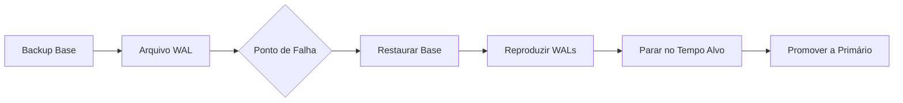

# Backup, Recuperação e Alta Disponibilidade

## Estratégias de Backup

Uma estratégia de backup equilibra o **Objetivo de Ponto de Recuperação (RPO)** — quantos dados você pode perder — contra o **Objetivo de Tempo de Recuperação (RTO)** — quão rápido você recupera.

| Estratégia | RPO | RTO | Armazenamento | Uso Típico |
|---|---|---|---|---|
| Apenas backup completo | Último backup | Longo | Alto | Bancos pequenos |
| Completo + diferencial | Último diferencial | Médio | Médio | Bancos médios |
| Completo + incremental | Último WAL/xlogs | Curto | Baixo | Bancos grandes |
| Arquivamento contínuo | Segundos | Curto | Baixo | Missão crítica |

## Backup Completo

### pg_dump (Backup Lógico)

```bash
# Despejar um único banco de dados
pg_dump -h localhost -U admin -d mydb > /backups/mydb_$(date +%Y%m%d).sql

# Formato personalizado (comprimido, restauração paralela)
pg_dump -h localhost -U admin -Fc -d mydb > /backups/mydb_$(date +%Y%m%d).dump

# Despejo paralelo (mais rápido para bancos grandes)
pg_dump -h localhost -U admin -j 4 -Fd -d mydb -f /backups/mydb_dir/
```

### pg_dumpall (Nível de Cluster)

```bash
# Backup de todos os bancos + objetos globais (funções, tablespaces)
pg_dumpall -h localhost -U postgres > /backups/full_cluster.sql

# Apenas objetos globais (funções, tablespaces)
pg_dumpall -h localhost -U postgres --globals-only > /backups/globals.sql
```

### Backup Físico (pg_basebackup)

```bash
# Criar backup físico base (para PITR)
pg_basebackup -h localhost -D /backups/base_$(date +%Y%m%d) -X stream -P -v

# Com slot de replicação
pg_basebackup -h localhost -D /backups/base_$(date +%Y%m%d) \
    -X stream -P -v --slot=backup_slot
```

[!NOTE]
Backups lógicos (`pg_dump`) são portáteis entre versões e arquiteturas do PostgreSQL. Backups físicos (`pg_basebackup`) são mais rápidos para bancos grandes, mas vinculados à versão específica do servidor.

## Backups Incremental e Diferencial

| Tipo | Escopo | Tamanho do Backup | Passos para Restaurar |
|---|---|---|---|
| Completo | Banco inteiro | Maior | 1 passo |
| Diferencial | Mudanças desde o último completo | Médio | Completo + diferencial mais recente |
| Incremental | Mudanças desde qualquer último backup | Menor | Completo + todos incrementais em ordem |

### Arquivamento WAL (Arquivamento Contínuo)

O arquivamento WAL (Write-Ahead Log) permite recuperação pontual e backups incrementais.

```bash
# postgresql.conf
wal_level = replica           # ou 'logical' para replicação lógica
archive_mode = on
archive_command = 'cp %p /backups/wal/%f'
archive_timeout = 60          # forçar arquivamento a cada 60 segundos
```

```bash
# Restaurar usando arquivos WAL
# 1. Restaurar backup base
# 2. Criar recovery.conf ou usar pg_rewind
# 3. Definir restore_command
restore_command = 'cp /backups/wal/%f %p'
recovery_target_time = '2024-06-15 14:30:00 UTC'
```

### pgBackRest (Ferramenta Avançada de Backup)

```bash
# stanza: define um cluster de banco de dados
pgbackrest --stanza=mydb stanza-create

# Backup completo
pgbackrest --stanza=mydb --type=full backup

# Backup incremental
pgbackrest --stanza=mydb --type=incr backup

# Backup diferencial
pgbackrest --stanza=mydb --type=diff backup

# Restaurar para um ponto específico no tempo
pgbackrest --stanza=mydb --type=time \
    --target="2024-06-15 14:30:00+00" restore
```

[!IMPORTANT]
Sempre teste seus backups. Um backup que não pode ser restaurado não vale nada. Agende exercícios regulares de restauração.

## Recuperação Pontual (PITR)

PITR permite restaurar para qualquer momento dentro da linha do tempo do arquivo WAL.

```sql
-- PostgreSQL: criar recovery.signal (PG 12+) e definir:
restore_command = 'cp /backups/wal/%f %p'
recovery_target_time = '2024-06-15 14:30:00 UTC'
-- ou
recovery_target_xid = '1234567'
-- ou
recovery_target_lsn = '0/1ABCDEF0'
```

```bash
# Usando pgBackRest
pgbackrest --stanza=mydb --type=time \
    --target="2024-06-15 14:30:00+00" \
    --target-action=promote restore

# Usando barman
barman recover mydb /var/lib/postgresql/data \
    --remote-ssh-command="ssh postgres@db-host" \
    --target-time "2024-06-15 14:30:00"
```

### Fluxo de Trabalho PITR



## Replicação

### Replicação em Stream

```ini
# Primário: postgresql.conf
wal_level = replica
max_wal_senders = 5
wal_keep_size = 1024  # MB

# Réplica: postgresql.conf
hot_standby = on
primary_conninfo = 'host=primary-host port=5432 user=replicator password=xxx'
```

```bash
# Criar réplica
pg_basebackup -h primary-host -D /var/lib/postgresql/data \
    -X stream -P -v -R  # -R cria standby.signal

# Monitorar replicação
SELECT * FROM pg_stat_replication;
```

| Tipo de Replicação | Modo Síncrono | Perda de Dados em Failover | Latência |
|---|---|---|---|
| Síncrona | Confirmar escrita no primário + réplica | Zero | Maior |
| Assíncrona | Confirmar escrita apenas no primário | Possível (até lag WAL) | Menor |
| Semissíncrona | Pelo menos uma réplica confirma | Mínima | Média |

### Replicação Lógica

Replica em nível de linha — pode filtrar, transformar ou replicar subconjuntos.

```sql
-- Publicador
CREATE PUBLICATION mypub FOR TABLE orders, customers;
CREATE PUBLICATION mypub_filtered FOR TABLE orders WHERE (status = 'active');

-- Assinante
CREATE SUBSCRIPTION mysub CONNECTION 'host=primary-host dbname=mydb'
    PUBLICATION mypub;
```

| Aspecto | Streaming (Física) | Lógica |
|---|---|---|
| Granularidade | Cluster inteiro | Por tabela |
| Compatibilidade de versão | Mesma versão principal | Entre versões possível |
| Replicação DDL | Automática | Manual |
| Resolução de conflitos | Não aplicável | Configurável |
| Caso de uso | HA, failover | Migração, data warehouse |

## Arquiteturas de Alta Disponibilidade

### Ativo-Passivo (Hot Standby)

```
Primário → Réplica (standby, aceitando leituras)
         → Réplica (standby, aceitando leituras)

Failover: Promover réplica → antigo primário vira standby
Ferramentas: Patroni, repmgr, pg_auto_failover
```

### Ativo-Ativo (Multi-Mestre)

```
Nó A ↔ Nó B (replicação bidirecional)
Ambos aceitam escritas, conflitos resolvidos via lógica da aplicação
Ferramentas: PostgreSQL BDR, Citus (escalonamento de leitura)
```

### Patroni (HA com DCS)

```yaml
# patroni.yml
scope: mycluster
namespace: /db/
name: pg1

restapi:
  listen: 0.0.0.0:8008
  connect_address: 192.168.1.10:8008

etcd:
  host: 192.168.1.100:2379

bootstrap:
  dcs:
    ttl: 30
    loop_wait: 10
    retry_timeout: 10
    maximum_lag_on_failover: 1048576
    postgresql:
      use_pg_rewind: true
      parameters:
        wal_level: replica
        hot_standby: "on"

postgresql:
  listen: 0.0.0.0:5432
  connect_address: 192.168.1.10:5432
  data_dir: /var/lib/postgresql/data
  pg_hba:
    - host replication replicator 192.168.1.0/24 md5
  replication:
    username: replicator
    password: secure_password
  parameters:
    unix_socket_directories: '.'
```

## Script de Automação de Backup

```bash
#!/bin/bash
# Script de backup automatizado

BACKUP_DIR="/backups/$(date +%Y-%m-%d)"
DB_NAME="mydb"
RETENTION_DAYS=30

mkdir -p "$BACKUP_DIR"

# Backup completo no domingo, incremental nos outros dias
if [ "$(date +%u)" -eq 7 ]; then
    pgbackrest --stanza="$DB_NAME" --type=full backup
else
    pgbackrest --stanza="$DB_NAME" --type=incr backup
fi

# Limpar backups antigos
pgbackrest --stanza="$DB_NAME" --retention-full=$RETENTION_DAYS expire

# Testar integridade do backup
pgbackrest --stanza="$DB_NAME" check

# Copiar para local remoto
rsync -avz /backups/ backup@offsite:/backups/
```

## Teste de Recuperação de Desastres

```sql
-- Criar um cenário de teste
CREATE TABLE dr_test AS SELECT * FROM important_table;

-- Simular falha: DROP TABLE important_table;
-- Praticar recuperação:
-- 1. Identificar o momento da exclusão
-- 2. Restaurar backup base em um diretório diferente
-- 3. Reproduzir WAL até antes do DROP
-- 4. Extrair a tabela e importá-la de volta
```

## Matriz de Comparação

| Ferramenta/Método | RPO | RTO | Complexidade | Custo |
|---|---|---|---|---|
| pg_dump (lógico) | 1 dia | Horas | Baixa | Baixo |
| pg_basebackup + WAL | Segundos | Minutos | Média | Médio |
| pgBackRest | Segundos | Minutos | Média | Baixo |
| Replicação em stream | Quase zero | Segundos | Alta | Médio |
| Patroni + etcd | Quase zero | < 30s | Alta | Alto |
| Gerenciado em nuvem (RDS) | Segundos | Minutos | Nenhuma | Pagamento por uso |

[!TIP]
A melhor estratégia de backup é aquela que você realmente testou. Realize exercícios trimestrais de recuperação para garantir que suas metas de RPO/RTO sejam atingidas.

## Perguntas de Prática

1. Qual é a diferença entre um backup lógico (`pg_dump`) e um backup físico (`pg_basebackup`)? Quando você usaria cada um?
2. Configure o arquivamento WAL no PostgreSQL e explique o propósito de `archive_command` e `archive_timeout`.
3. Escreva uma sequência de comandos `pgBackRest` para criar um backup completo, depois um backup incremental e depois restaurar para um horário específico.
4. Explique RPO e RTO. Quais são valores aceitáveis para um banco de dados de transações financeiras?
5. Como a replicação síncrona difere da replicação assíncrona? Quais são os trade-offs?
6. Configure um cluster HA Patroni com três nós. Quais componentes são necessários? Como funciona o failover?
7. O que é Recuperação Pontual (PITR) e quais arquivos são necessários para realizá-la?
8. Crie uma política de retenção de backup: backups completos semanais, diferenciais diários e arquivamento WAL por hora. Escreva o agendamento cron.
9. Como a replicação lógica difere da replicação em stream? Dê um caso de uso para cada.
10. Você acidentalmente executa DROP TABLE às 14:32:15. Descreva passo a passo como recuperá-la usando PITR sem restaurar o banco de dados inteiro.
