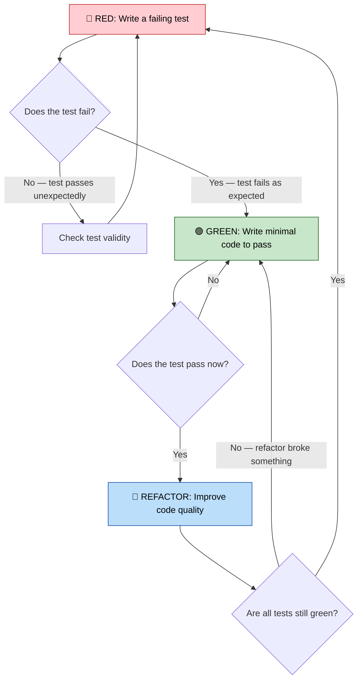
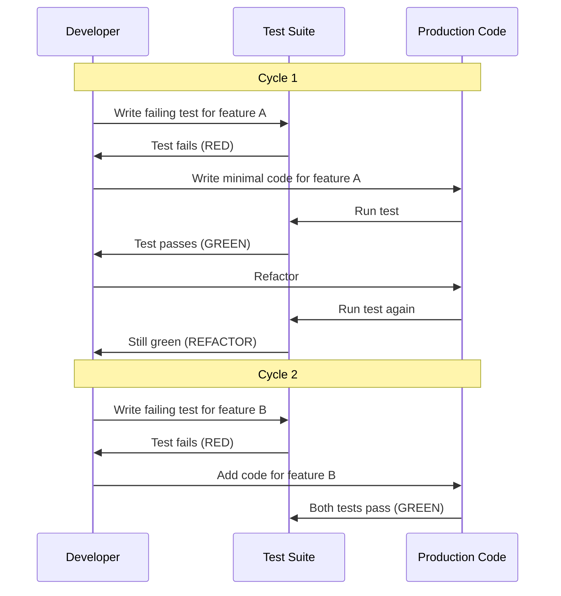
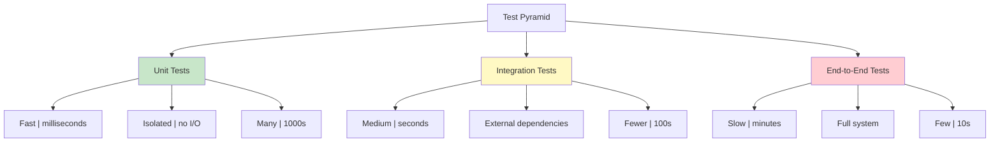

# Introduction to TDD

Test-Driven Development (TDD) is a software development approach where you write tests **before** writing the production code. This inverted workflow — test first, code second — fundamentally changes how you design, implement, and verify software.

## The TDD Mantra: Red-Green-Refactor

TDD follows a tight, fast loop with three phases:

| Phase | Action | What Happens |
|-------|--------|-------------|
| 🔴 **Red** | Write a failing test | Think about desired behavior first. The test fails because no code exists yet. |
| 🟢 **Green** | Write the simplest code to pass | Make the test pass as quickly as possible. No over-engineering. |
| 🔵 **Refactor** | Improve the code | Clean up duplication, rename variables, extract methods. Tests keep you safe. |



> [!NOTE]
> Each TDD cycle should last **30 seconds to 5 minutes**. If you're spending hours in a single cycle, your tests are too large. Break the problem into smaller steps.

## Why TDD? The Iceberg of Benefits

The visible benefit of TDD is **fewer bugs**, but the deeper, more valuable benefits lie beneath the surface:

| Layer | Benefit | Why It Matters |
|-------|---------|---------------|
| **Surface** | Fewer defects | Tests catch regressions immediately |
| **Design** | Better architecture | Testability forces loose coupling |
| **Confidence** | Fearless refactoring | You can restructure code without worry |
| **Documentation** | Living specification | Tests describe how the system behaves |
| **Velocity** | Sustainable pace | Less debugging means more feature work |

```python
# Traditional approach: code first, maybe test later
def divide(a, b):
    return a / b  # Bug: no zero-division check

# TDD approach: test first, code second
def test_divide_by_zero():
    """Test that division by zero raises an error."""
    import pytest
    with pytest.raises(ZeroDivisionError):
        divide(10, 0)

def divide(a, b):
    if b == 0:
        raise ZeroDivisionError("Cannot divide by zero")
    return a / b
```

> [!SUCCESS]
> TDD isn't about testing — it's about **design**. Writing the test first forces you to think about the interface before the implementation.

## The Three Laws of TDD

Robert C. Martin (Uncle Bob) formalized TDD with three laws:

1. **Law 1**: You may not write any production code until you have written a **failing unit test**.
2. **Law 2**: You may not write more of a unit test than is sufficient to fail — and **not compiling is failing**.
3. **Law 3**: You may not write more production code than is sufficient to pass the **currently failing test**.



## Practical Example: TDD in Action

Let's build a `ShoppingCart` class using TDD, step by step.

### Cycle 1: Create an empty cart

```python
# test_shopping_cart.py
from shopping_cart import ShoppingCart

def test_empty_cart():
    """A new cart should be empty."""
    cart = ShoppingCart()
    assert cart.total_items() == 0
```

Run: **Red** — `ShoppingCart` doesn't exist yet.

```python
# shopping_cart.py
class ShoppingCart:
    def total_items(self) -> int:
        return 0
```

Run: **Green** — test passes.

### Cycle 2: Add items to the cart

```python
def test_add_item():
    """Adding an item increases the item count."""
    cart = ShoppingCart()
    cart.add_item("apple", 1.50)
    assert cart.total_items() == 1

def test_add_multiple_items():
    """Adding multiple items increases count accordingly."""
    cart = ShoppingCart()
    cart.add_item("apple", 1.50)
    cart.add_item("banana", 0.75)
    assert cart.total_items() == 2
```

Run: **Red** — `add_item` doesn't exist.

```python
class ShoppingCart:
    def __init__(self):
        self._items = []

    def add_item(self, name: str, price: float) -> None:
        self._items.append({"name": name, "price": price})

    def total_items(self) -> int:
        return len(self._items)
```

Run: **Green** — all tests pass.

### Cycle 3: Calculate the total price

```python
def test_total_price():
    """Total price should sum all item prices."""
    cart = ShoppingCart()
    cart.add_item("apple", 1.50)
    cart.add_item("banana", 0.75)
    assert cart.total_price() == pytest.approx(2.25)

def test_empty_cart_total():
    """Empty cart should have total of 0."""
    cart = ShoppingCart()
    assert cart.total_price() == 0.0
```

Run: **Red** — `total_price` doesn't exist.

```python
class ShoppingCart:
    def __init__(self):
        self._items = []

    def add_item(self, name: str, price: float) -> None:
        self._items.append({"name": name, "price": price})

    def total_items(self) -> int:
        return len(self._items)

    def total_price(self) -> float:
        return sum(item["price"] for item in self._items)
```

Run: **Green** — everything passes.

### Refactor: Improve the design

Now we refactor with confidence because tests guard us:

```python
from dataclasses import dataclass

@dataclass
class Item:
    name: str
    price: float

class ShoppingCart:
    def __init__(self):
        self._items: list[Item] = []

    def add_item(self, name: str, price: float) -> None:
        self._items.append(Item(name, price))

    def total_items(self) -> int:
        return len(self._items)

    def total_price(self) -> float:
        return sum(item.price for item in _items)
```

> [!TIP]
> Use `pytest.approx()` for floating-point comparisons. Never use `==` with floats due to precision issues.

## The TDD Mindset: Discipline Over Inspiration

TDD requires a shift in how you think about coding:

| Traditional Mindset | TDD Mindset |
|---------------------|-------------|
| Write code, then test | Write test, then code |
| Testing is a separate phase | Testing is part of development |
| Big design upfront | Emergent design through tests |
| Fear of refactoring | Confidence to refactor freely |
| Tests prove code works | Tests define what code should do |
| "I'll write tests later" | "I'll write the test now" |

### Common Objections and Responses

| Objection | Response |
|-----------|----------|
| "It slows me down" | Initially yes. After 2-3 weeks, you go faster because you debug less. |
| "I don't know what to test" | Test the behavior, not the implementation. Ask: "What should this function do?" |
| "My code isn't testable" | That's a design smell. TDD naturally drives you toward testable designs. |
| "Tests take too long to write" | A good TDD test takes 30-60 seconds. If it takes longer, you're testing at the wrong level. |
| "My manager won't allow it" | Don't announce it. Just do it. They'll notice fewer bugs. |

## Types of Tests in the TDD Ecosystem



| Test Type | Speed | Scope | TDD Role |
|-----------|-------|-------|----------|
| **Unit** | Milliseconds | Single function/class | Primary TDD target |
| **Integration** | Seconds | Module boundaries | Verify interactions |
| **End-to-End** | Minutes | Full system | Validate workflows |

> [!WARNING]
> Don't confuse TDD with "write lots of tests." TDD is about **writing the right test at the right time**. A single, well-written TDD cycle is worth a dozen tests written after the fact.

## The Red-Green-Refactor Rhythm in Practice

Let's trace a complete session building a `TemperatureConverter`:

```python
# --- 🔴 RED: Write failing test ---
def test_celsius_to_fahrenheit():
    converter = TemperatureConverter()
    result = converter.celsius_to_fahrenheit(100)
    assert result == 212.0

# Test fails: TemperatureConverter not defined

# --- 🟢 GREEN: Write minimal code ---
class TemperatureConverter:
    def celsius_to_fahrenheit(self, celsius):
        return celsius * 9 / 5 + 32

# Test passes

# --- 🔵 REFACTOR: Improve ---
# No refactoring needed yet. Move to next test.

# --- 🔴 RED: Write next test ---
def test_fahrenheit_to_celsius():
    converter = TemperatureConverter()
    result = converter.fahrenheit_to_celsius(212)
    assert result == 100.0

# Test fails: fahrenheit_to_celsius not defined

# --- 🟢 GREEN ---
class TemperatureConverter:
    def celsius_to_fahrenheit(self, celsius):
        return celsius * 9 / 5 + 32

    def fahrenheit_to_celsius(self, fahrenheit):
        return (fahrenheit - 32) * 5 / 9

# Both tests pass

# --- 🔴 RED: Test edge case ---
def test_absolute_zero():
    converter = TemperatureConverter()
    result = converter.celsius_to_fahrenheit(-273.15)
    assert result == -459.67

# --- 🟢 GREEN ---
# Already passes! Existing code handles negative values.

# --- 🔵 REFACTOR: Extract constant ---
ABSOLUTE_ZERO_C = -273.15
FREEZING_C = 0.0
BOILING_C = 100.0

class TemperatureConverter:
    def celsius_to_fahrenheit(self, celsius):
        return celsius * 9 / 5 + 32

    def fahrenheit_to_celsius(self, fahrenheit):
        return (fahrenheit - 32) * 5 / 9

    def is_above_absolute_zero(self, celsius):
        return celsius >= ABSOLUTE_ZERO_C
```

> [!SUCCESS]
> Each TDD cycle produced a clear, testable increment. After 3 cycles, we have a robust converter with 3 passing tests and clean code.

## Test Naming Conventions

Good test names communicate intent. Follow these patterns:

| Convention | Example |
|-----------|---------|
| `test_[feature]` | `test_add_item()` |
| `test_[scenario]_[expected]` | `test_empty_cart_returns_zero()` |
| `test_[method]_[condition]_[result]` | `test_divide_by_zero_raises_error()` |
| `test_given_[context]_when_[action]_then_[result]` | `test_given_negative_balance_when_withdraw_then_error()` |

```python
# Good test names — they tell a story
def test_authenticated_user_can_view_profile():
    pass

def test_unauthenticated_user_is_redirected_to_login():
    pass

def test_admin_user_sees_delete_button():
    pass

def test_normal_user_does_not_see_delete_button():
    pass
```

## Practice Exercises

1. **TDD a String Reverser**: Write tests first for a `reverse_string(s)` function. Start with empty string, then single char, then multiple chars, then palindrome.

2. **TDD a Prime Number Checker**: Use TDD to build `is_prime(n)`. Begin with the simplest case (`n=2`), then edge cases (`n=1`, `n=0`, negative numbers).

3. **TDD a FizzBuzz Implementation**: TDD the classic FizzBuzz. Write tests for multiples of 3, multiples of 5, multiples of both, and non-multiples.

4. **TDD Shopping Cart with Discount**: Extend the `ShoppingCart` class. Write tests for a 10% discount when total > $100, then implement to pass.

5. **Identify the Test Smell**: Given this test, identify what's wrong and fix it:
   ```python
   def test_add():
       result = add(2, 3)
       result = add(5, 7)
       assert result == 12
   ```

6. **Refactor Without Tests**: This function works but is poorly structured. Write tests first, then refactor:
   ```python
   def process_data(items):
       r = []
       for i in items:
           if i > 0:
               r.append(i * 2)
           else:
               r.append(i * -1)
       return r
   ```

7. **TDD a Simple Calculator**: Using TDD, build a `Calculator` class with `add`, `subtract`, `multiply`, `divide` methods. Test normal cases and edge cases (divide by zero, negative numbers).

8. **Mindset Reflection**: Describe how your approach to coding changes when you write tests first. What feels different? What's harder? What's easier?

## Summary

- **TDD = Red → Green → Refactor**: A disciplined, rapid cycle
- **Tests first, code second**: The test defines what "done" means
- **Three laws**: Write only enough test to fail, only enough code to pass
- **Benefits**: Better design, fewer bugs, fearless refactoring, living documentation
- **Mindset shift**: Testing is design, not verification
- **Test pyramid**: Unit tests are fast and plentiful; E2E tests are slow and few

> [!SUCCESS]
> TDD is a superpower. It transforms coding from "will this work?" to "I know this works." The discipline of writing tests first pays exponential dividends as your project grows.
