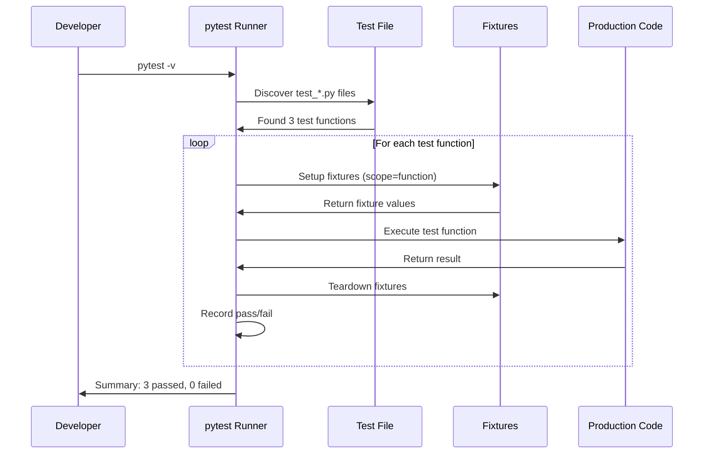
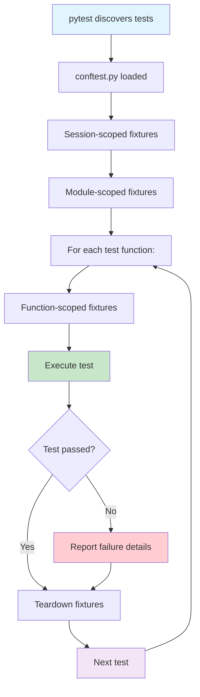

# Writing Your First Tests

Now that you understand the TDD mindset, it's time to write real tests. We'll use **pytest** — the most popular testing framework for Python — to build a solid testing foundation.

## Why pytest?

| Feature | pytest | unittest (built-in) |
|---------|--------|-------------------|
| Syntax | Plain `assert` statements | `self.assertEqual()`, `self.assertTrue()` |
| Fixtures | Modular, dependency-injected | `setUp()` / `tearDown()` methods |
| Test discovery | Automatic by naming convention | Manual test suite definition |
| Plugins | 1000+ ecosystem plugins | Limited built-in extensions |
| Parametrization | `@pytest.mark.parametrize` | `subTest()` or manual loops |
| Assertion introspection | Detailed failure messages | Basic pass/fail |

```python
# unittest style (built-in)
import unittest

class TestMath(unittest.TestCase):
    def test_add(self):
        self.assertEqual(add(2, 3), 5)
        self.assertEqual(add(-1, 1), 0)

# pytest style (cleaner)
def test_add():
    assert add(2, 3) == 5
    assert add(-1, 1) == 0
```

## Setting Up pytest

```bash
# Install pytest
pip install pytest

# Verify installation
pytest --version

# Run tests in current directory
pytest

# Run with verbose output
pytest -v

# Run a specific test file
pytest test_calculator.py -v

# Stop on first failure
pytest -x

# Run tests matching a pattern
pytest -k "calculator"
```

### Project Structure

Organize your tests clearly:

```
project/
├── src/
│   ├── __init__.py
│   ├── calculator.py
│   └── user_service.py
├── tests/
│   ├── __init__.py
│   ├── test_calculator.py
│   ├── test_user_service.py
│   └── conftest.py          # Shared fixtures
├── setup.py
└── pytest.ini               # pytest configuration
```

Create a `pytest.ini` file for configuration:

```ini
[pytest]
testpaths = tests
pythonpath = src
python_files = test_*.py
python_classes = Test*
python_functions = test_*
markers =
    slow: marks tests as slow (deselect with '-m "not slow"')
    integration: marks tests as integration tests
    smoke: marks tests as smoke tests
```

## Core Assertions in pytest

pytest uses Python's built-in `assert` with **rich introspection** — when an assertion fails, pytest shows you the values of all expressions involved.

```python
# test_assertions.py

def test_equality():
    """Test equality assertions."""
    assert 2 + 2 == 4
    assert "hello" == "hello"
    assert [1, 2, 3] == [1, 2, 3]

def test_inequality():
    """Test inequality assertions."""
    assert 2 + 2 != 5
    assert "hello" != "world"

def test_truthiness():
    """Test boolean assertions."""
    assert True
    assert 1            # Truthy
    assert [1, 2]       # Non-empty list
    assert not False
    assert not 0        # Falsy
    assert not ""       # Empty string
    assert not []       # Empty list

def test_none():
    """Test None assertions."""
    result = get_nothing()
    assert result is None
    assert result is not None  # Would fail

def test_comparisons():
    """Test comparison assertions."""
    assert 5 > 3
    assert 5 >= 5
    assert 10 < 20
    assert 10 <= 10
    assert 0 < len("hello") < 10

def test_container():
    """Test container assertions."""
    assert "world" in "hello world"
    assert 42 in [42, 43, 44]
    assert "key" in {"key": "value"}
    assert 99 not in [1, 2, 3]

def test_floats():
    """Test floating point assertions."""
    assert 0.1 + 0.2 == pytest.approx(0.3)
    assert 1.0 / 3.0 == pytest.approx(0.3333, rel=1e-3)

def test_exceptions():
    """Test exception assertions."""
    import pytest
    with pytest.raises(ZeroDivisionError):
        1 / 0

    with pytest.raises(ValueError) as exc_info:
        int("not_a_number")
    assert str(exc_info.value) == "invalid literal for int() with base 10: 'not_a_number'"

def get_nothing():
    return None
```

### Floating Point Precision

```python
import pytest

class TestFloatComparisons:
    def test_approx_default(self):
        """Default tolerance is 1e-6 relative."""
        assert 0.1 + 0.2 == pytest.approx(0.3)

    def test_approx_absolute(self):
        """Set absolute tolerance."""
        assert 0.12345 == pytest.approx(0.12346, abs=1e-4)

    def test_approx_relative(self):
        """Set relative tolerance."""
        assert 1000.0 == pytest.approx(1001.0, rel=1e-2)
```

> [!WARNING]
> Never use `==` for floating-point comparisons. Use `pytest.approx()` or `math.isclose()`. The classic `0.1 + 0.2 == 0.3` evaluates to `False` due to IEEE 754 floating-point representation.

## Test Flow with pytest



## Fixtures: Test Dependencies Done Right

Fixtures replace `setUp()` / `tearDown()` from unittest with a cleaner, more modular approach:

```python
# conftest.py — shared across all test files
import pytest
import tempfile
import os

@pytest.fixture
def sample_data():
    """Provide sample data for tests."""
    return {"name": "Alice", "age": 30, "email": "alice@example.com"}

@pytest.fixture
def temp_directory():
    """Create a temporary directory for file tests."""
    with tempfile.TemporaryDirectory() as tmpdir:
        yield tmpdir
    # Directory is automatically cleaned up

@pytest.fixture
def db_connection():
    """Setup and teardown a database connection."""
    conn = create_connection(":memory:")
    yield conn
    conn.close()

# test_fixtures.py
def test_sample_data(sample_data):
    """Using the fixture from conftest."""
    assert sample_data["name"] == "Alice"
    assert sample_data["age"] == 30

def test_temp_file_creation(temp_directory):
    """Using temp_directory fixture."""
    test_file = os.path.join(temp_directory, "test.txt")
    with open(test_file, "w") as f:
        f.write("hello")
    assert os.path.exists(test_file)
```

### Fixture Scopes

| Scope | When Created | When Destroyed | Use Case |
|-------|-------------|----------------|----------|
| `function` (default) | Before each test | After each test | Default, most common |
| `class` | Before first test in class | After last test in class | Shared class resources |
| `module` | Before first test in module | After last test in module | Module-level setup |
| `package` | Before first test in package | After last test in package | Package-level setup |
| `session` | Before first test in session | After last test in session | Expensive resources (DB) |

```python
@pytest.fixture(scope="session")
def database():
    """Create database once per test session."""
    db = Database(":memory:")
    db.initialize()
    yield db
    db.close()

@pytest.fixture(scope="module")
def api_client():
    """Create API client once per module."""
    return APIClient(base_url="https://api.example.com")

@pytest.fixture(scope="function")
def fresh_user(db_connection):
    """Create a fresh user for each test."""
    user = User.create(db_connection, "test_user")
    yield user
    User.delete(db_connection, user.id)
```

> [!TIP]
> Use `scope="session"` for resources that are expensive to create (database connections, API clients). Use `scope="function"` (default) for everything else to keep tests isolated.

### Fixture Composition

Fixtures can depend on other fixtures:

```python
@pytest.fixture
def user_data():
    """Base user data."""
    return {"username": "john_doe", "email": "john@example.com"}

@pytest.fixture
def admin_user(user_data):
    """Create admin user by extending base data."""
    data = user_data.copy()
    data["role"] = "admin"
    data["permissions"] = ["read", "write", "delete"]
    return data

@pytest.fixture
def guest_user(user_data):
    """Create guest user by extending base data."""
    data = user_data.copy()
    data["role"] = "guest"
    data["permissions"] = ["read"]
    return data

def test_admin_has_delete_permission(admin_user):
    assert "delete" in admin_user["permissions"]

def test_guest_read_only(guest_user):
    assert "delete" not in guest_user["permissions"]
```

## Parametrized Tests

Test multiple scenarios with a single test function:

```python
import pytest

# Single parameter
@pytest.mark.parametrize("input_value", [1, 2, 3, 4, 5])
def test_positive_numbers(input_value):
    assert input_value > 0

# Multiple parameters
@pytest.mark.parametrize("a, b, expected", [
    (1, 1, 2),
    (2, 3, 5),
    (-1, 1, 0),
    (0, 0, 0),
    (100, 200, 300),
])
def test_addition(a, b, expected):
    assert a + b == expected

# Combine with fixtures
@pytest.mark.parametrize("item, quantity, expected_total", [
    ("apple", 3, 3.00),
    ("banana", 2, 1.50),
    ("apple", 0, 0.00),
])
def test_cart_item_total(item, quantity, expected_total, price_map):
    cart = ShoppingCart(price_map)
    cart.add_item(item, quantity)
    assert cart.total() == pytest.approx(expected_total)

# Test a function with many edge cases
def is_even(n: int) -> bool:
    return n % 2 == 0

@pytest.mark.parametrize("n, expected", [
    (0, True),
    (1, False),
    (2, True),
    (3, False),
    (-2, True),
    (-3, False),
    (999, False),
    (1000, True),
])
def test_is_even(n, expected):
    assert is_even(n) == expected
```

### Parametrize with IDs for Readability

```python
@pytest.mark.parametrize("a, b, expected", [
    pytest.param(2, 3, 5, id="positive_positive"),
    pytest.param(-1, 1, 0, id="negative_positive"),
    pytest.param(0, 0, 0, id="zero_zero"),
])
def test_add(a, b, expected):
    assert a + b == expected

# Output:
# test_add[positive_positive] PASSED
# test_add[negative_positive] PASSED
# test_add[zero_zero] PASSED
```

## Markers: Categorize Tests

```python
import pytest

@pytest.mark.slow
def test_large_dataset_processing():
    """This test takes a long time."""
    data = generate_large_dataset(1_000_000)
    result = process_data(data)
    assert len(result) == 1_000_000

@pytest.mark.integration
def test_database_connection():
    """This test requires a database."""
    conn = connect_to_database()
    assert conn.is_connected

@pytest.mark.smoke
def test_critical_feature():
    """Smoke test for critical path."""
    assert critical_function() == "OK"

@pytest.mark.xfail(reason="Known bug #1234")
def test_known_issue():
    """Test expected to fail."""
    assert buggy_function() == 42

@pytest.mark.skip(reason="Not implemented yet")
def test_future_feature():
    """Test for future implementation."""
    assert future_function() == True

@pytest.mark.skipif(sys.version_info < (3, 10), reason="Requires Python 3.10+")
def test_python_10_feature():
    """Python 3.10+ specific feature."""
    match_statement_test()
```

```bash
# Run only slow tests
pytest -m slow

# Run everything except slow tests
pytest -m "not slow"

# Run smoke or integration tests
pytest -m "smoke or integration"

# Run tests that are not slow and not integration
pytest -m "not slow and not integration"
```

## Testing with External Dependencies

```python
# src/weather_service.py
import requests

class WeatherService:
    def __init__(self, api_key: str):
        self.api_key = api_key
        self.base_url = "https://api.weather.com"

    def get_temperature(self, city: str) -> float:
        response = requests.get(
            f"{self.base_url}/current",
            params={"city": city, "api_key": self.api_key},
        )
        response.raise_for_status()
        return response.json()["temperature"]
```

```python
# Using monkeypatch to mock requests
import pytest

def test_get_temperature(monkeypatch):
    """Mock external API call."""
    def mock_get(url, params=None):
        class MockResponse:
            def raise_for_status(self):
                pass

            def json(self):
                return {"temperature": 25.5}

        return MockResponse()

    monkeypatch.setattr(requests, "get", mock_get)

    service = WeatherService(api_key="test_key")
    temp = service.get_temperature("London")
    assert temp == 25.5
```

> [!NOTE]
> `monkeypatch` is a built-in pytest fixture. Use it to temporarily modify objects, dictionaries, or environment variables during tests.

## The conftest.py File

The `conftest.py` file is the central place for shared test configuration:

```python
# tests/conftest.py
import pytest
from typing import Generator

@pytest.fixture(autouse=True)
def setup_test_environment():
    """Runs before every test automatically."""
    print("\n--- Test Setup ---")
    yield
    print("--- Test Teardown ---")

@pytest.fixture
def price_map() -> dict:
    return {
        "apple": 1.00,
        "banana": 0.75,
        "orange": 1.25,
        "milk": 3.50,
    }

@pytest.fixture
def sample_cart(price_map) -> "ShoppingCart":
    from src.cart import ShoppingCart
    cart = ShoppingCart(price_map)
    cart.add_item("apple", 2)
    cart.add_item("banana", 3)
    return cart

# Hook to modify pytest output
def pytest_report_header():
    """Add custom info to pytest header."""
    return "Running tests for Shopping Cart project"

def pytest_runtest_setup(item):
    """Custom setup logic before each test."""
    if "slow" in item.keywords:
        print(f"\nRunning slow test: {item.name}")
```



## Running Tests: Common Patterns

```bash
# Basic run
pytest

# Verbose output
pytest -v

# Show local variables in tracebacks
pytest --showlocals

# No capture (see print statements)
pytest -s

# Stop after first 2 failures
pytest --maxfail=2

# Run tests by keyword
pytest -k "calculate"

# Run tests by marker
pytest -m "slow"

# Generate JUnit XML report
pytest --junitxml=report.xml

# Fail on warnings
pytest -W error

# Collect tests but don't run them
pytest --collect-only

# Re-run last failed tests first
pytest --ff

# Run tests in parallel (needs pytest-xdist)
pytest -n auto
```

### Configuration Files

Besides `pytest.ini`, you can use `pyproject.toml`:

```toml
[tool.pytest.ini_options]
testpaths = ["tests"]
pythonpath = ["src"]
python_files = "test_*.py"
python_functions = "test_*"
markers = [
    "slow: marks tests as slow",
    "integration: marks tests as integration",
]
filterwarnings = [
    "error",
    "ignore::DeprecationWarning",
]
```

## Practice Exercises

1. **Install and Configure**: Install pytest and create a `pytest.ini` that looks for tests in a `tests/` directory with `src/` on the Python path.

2. **Write Assertions**: Create a test file with tests for a `multiply(a, b)` function. Cover positive, negative, zero, and floating-point cases.

3. **Build a Calculator**: Write parametrized tests for a `Calculator` class with `add`, `subtract`, `multiply`, `divide`. Test at least 8 parameter combinations.

4. **File Fixture**: Write a fixture that creates a temporary file with specific content. Write a test that reads the file and verifies its contents.

5. **Mock API Service**: Create a `UserService` class that calls an external API. Write tests using `monkeypatch` to mock the API call.

6. **Categorize Tests**: Use markers to tag tests as `unit`, `integration`, or `slow`. Verify that `pytest -m "integration"` runs only the right tests.

7. **Test Exception Handling**: Write tests for a function `validate_age(age)` that raises `ValueError` for negative ages and `TypeError` for non-integer inputs. Test both error types.

8. **Build a Test Suite**: Given the following code, write a complete test suite:
   ```python
   class BankAccount:
       def __init__(self, owner: str, balance: float = 0.0):
           self.owner = owner
           self._balance = balance

       @property
       def balance(self) -> float:
           return self._balance

       def deposit(self, amount: float) -> float:
           if amount <= 0:
               raise ValueError("Amount must be positive")
           self._balance += amount
           return self._balance

       def withdraw(self, amount: float) -> float:
           if amount <= 0:
               raise ValueError("Amount must be positive")
           if amount > self._balance:
               raise ValueError("Insufficient funds")
           self._balance -= amount
           return self._balance
   ```

## Summary

- **pytest** uses plain `assert` statements with rich error reporting
- **Fixtures** replace `setUp()`/`tearDown()` with modular, scoped dependencies
- **Parametrize** reduces code duplication by testing multiple inputs
- **Markers** categorize tests for selective execution
- **conftest.py** centralizes shared fixtures and hooks
- **monkeypatch** replaces objects at runtime for isolated testing
- **Configuration** via `pytest.ini` or `pyproject.toml` controls test discovery

> [!SUCCESS]
> You now have all the pytest fundamentals: assertions, fixtures, parametrization, markers, and mocking. This toolbox will serve every TDD cycle you ever write.
