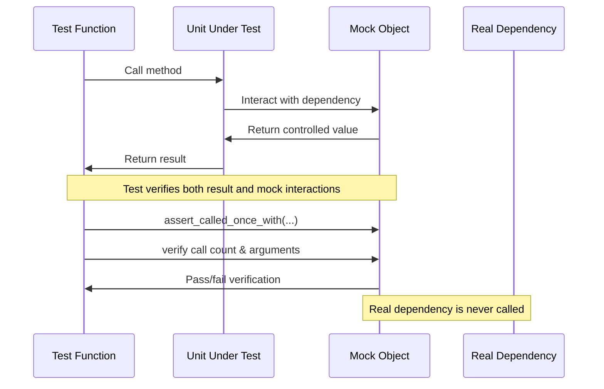
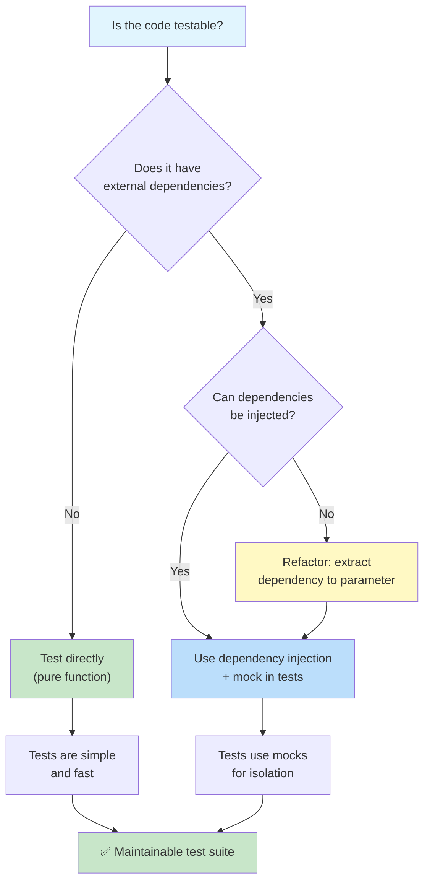

# Unit Testing Best Practices

Writing tests that pass is easy. Writing tests that are maintainable, reliable, and trustworthy is a craft. This lesson covers the patterns and practices that separate great test suites from mediocre ones.

## The AAA Pattern: Arrange-Act-Assert

Every test should follow three clear phases, separated by blank lines:

```python
# AAA Pattern in action
def test_withdraw_reduces_balance():
    # Arrange
    account = BankAccount("Alice", 1000.0)

    # Act
    account.withdraw(300.0)

    # Assert
    assert account.balance == 700.0

# Poor test — phases are mixed together
def test_withdraw():
    account = BankAccount("Alice", 1000.0)
    account.withdraw(300.0)
    assert account.balance == 700.0
    account.withdraw(100.0)
    assert account.balance == 500.0
```

### Why AAA Matters

| Aspect | With AAA | Without AAA |
|--------|----------|-------------|
| **Readability** | Clear story: Given → When → Then | Multiple scenarios blurred together |
| **Debugging** | Pinpoint which phase failed | Unclear if Arrange or Act is wrong |
| **Maintenance** | Change one phase independently | Changing input forces rewriting the test |
| **Reviewability** | Reviewer understands intent quickly | Reviewer must parse the entire test |

```python
# Good: One clear scenario per test
def test_deposit_increases_balance():
    """Given an account with $0, when I deposit $100, balance becomes $100."""
    account = BankAccount("Bob")
    account.deposit(100.0)
    assert account.balance == 100.0

def test_deposit_negative_amount_raises_error():
    """Given an account, when I deposit a negative amount, an error is raised."""
    account = BankAccount("Bob", 500.0)
    with pytest.raises(ValueError, match="Amount must be positive"):
        account.deposit(-50.0)

def test_deposit_multiple_times_accumulates():
    """Given an account, when I deposit multiple times, balance accumulates."""
    account = BankAccount("Bob")
    account.deposit(100.0)
    account.deposit(50.0)
    account.deposit(25.0)
    assert account.balance == 175.0
```

> [!TIP]
> If your test doesn't fit the AAA pattern naturally, it's a sign that the function under test is doing too much. Consider refactoring the production code.

## One Assertion Per Test? Not Quite

A common myth: "one assertion per test." The real rule is **one concept per test**:

```python
# BAD: Testing multiple unrelated behaviors
def test_account_operations():
    account = BankAccount("Alice", 1000.0)
    account.deposit(500.0)
    assert account.balance == 1500.0
    account.withdraw(200.0)
    assert account.balance == 1300.0
    assert account.owner == "Alice"

# GOOD: Group related assertions that test one behavior
def test_account_after_deposit():
    account = BankAccount("Alice", 1000.0)
    account.deposit(500.0)
    assert account.balance == 1500.0
    assert account.transaction_count == 1

# GOOD: Multiple assertions all confirming the same result
def test_user_creation_sets_all_fields():
    user = User(name="Alice", email="alice@test.com", age=30)
    assert user.name == "Alice"
    assert user.email == "alice@test.com"
    assert user.age == 30
    assert user.is_active is True
```

## Test Naming: Tell a Story

```python
# Descriptive test names
def test_given_empty_cart_when_add_item_then_item_count_is_one():
    cart = ShoppingCart()
    cart.add_item("apple", 1.50)
    assert cart.total_items() == 1

def test_given_item_in_cart_when_remove_item_then_item_count_is_zero():
    cart = ShoppingCart()
    cart.add_item("apple", 1.50)
    cart.remove_item("apple")
    assert cart.total_items() == 0

def test_given_expired_coupon_when_apply_discount_then_raises_error():
    cart = ShoppingCart()
    coupon = Coupon("SAVE10", expires_at=yesterday)
    with pytest.raises(CouponExpiredError):
        cart.apply_coupon(coupon)
```

| Naming Style | Example |
|-------------|---------|
| `test_[feature]` | `test_withdraw()` |
| `test_[scenario]_[expected]` | `test_overdraft_raises_error()` |
| `test_given_[context]_when_[action]_then_[result]` | `test_given_insufficient_funds_when_withdraw_then_error()` |
| `test_[method]_[condition]_[result]` | `test_divide_by_zero_raises_exception()` |

> [!SUCCESS]
> A good test name eliminates the need to read the test body. When a CI build fails, you should know roughly what broke just from the test name.

## Mocking: Isolating the Unit Under Test

Mocking replaces real dependencies with controlled substitutes:

```python
from unittest.mock import Mock, patch, MagicMock
import pytest

# Example: Payment processing
class PaymentProcessor:
    def __init__(self, gateway):
        self.gateway = gateway

    def process_payment(self, user_id: int, amount: float) -> dict:
        if amount <= 0:
            raise ValueError("Amount must be positive")

        user = self.gateway.get_user(user_id)
        if not user["active"]:
            raise RuntimeError("User is not active")

        charge = self.gateway.charge(user["card_token"], amount)
        return {"status": "success", "transaction_id": charge["id"]}

# Test with Mock
def test_process_payment_success():
    # Arrange
    mock_gateway = Mock()
    mock_gateway.get_user.return_value = {
        "id": 1, "active": True, "card_token": "tok_123"
    }
    mock_gateway.charge.return_value = {
        "id": "txn_abc", "amount": 50.0, "status": "captured"
    }

    processor = PaymentProcessor(mock_gateway)

    # Act
    result = processor.process_payment(1, 50.0)

    # Assert
    assert result["status"] == "success"
    assert result["transaction_id"] == "txn_abc"
    mock_gateway.get_user.assert_called_once_with(1)
    mock_gateway.charge.assert_called_once_with("tok_123", 50.0)
```

### Mock vs Patch vs MagicMock

```python
from unittest.mock import Mock, patch, MagicMock, PropertyMock

# Mock — basic mock object
mock_obj = Mock()
mock_obj.some_method.return_value = 42
mock_obj.some_method(1, 2, 3)
mock_obj.some_method.assert_called_once_with(1, 2, 3)

# MagicMock — Mock with "magic methods" pre-created
mm = MagicMock()
mm.__len__.return_value = 5
assert len(mm) == 5
mm.__iter__.return_value = iter([1, 2, 3])
assert list(mm) == [1, 2, 3]

# patch — context manager for replacing attributes
with patch("module.ClassName") as MockClass:
    MockClass.return_value.some_method.return_value = 42
    instance = MockClass()
    result = instance.some_method()
    assert result == 42

# patch as decorator
@patch("module.ClassName")
def test_something(MockClass):
    MockClass.return_value.method.return_value = "mocked"
    instance = MockClass()
    assert instance.method() == "mocked"
```



### When (and When Not) to Mock

| Mock When... | Don't Mock When... |
|-------------|-------------------|
| External API calls | Simple data transformations |
| Database operations | Pure functions (same input → same output) |
| File system access | Business logic validation |
| Network requests | String manipulation |
| Third-party SDKs | Math/algorithmic operations |
| Time-dependent code | Internal helper methods |

```python
# APPROPRIATE mock: external HTTP call
def test_get_weather():
    mock_response = Mock()
    mock_response.json.return_value = {"temp": 22.5}
    mock_response.raise_for_status.return_value = None

    with patch("requests.get", return_value=mock_response):
        service = WeatherService("fake_key")
        temp = service.get_temperature("London")
        assert temp == 22.5

# INAPPROPRIATE mock: simple math
def test_discount_calculation():
    # Don't mock this! It's a pure function
    result = calculate_discount(100.0, 0.1)
    assert result == 90.0

# BETTER: Don't mock pure logic, test it directly
def test_is_valid_email():
    assert is_valid_email("user@example.com") is True
    assert is_valid_email("not-an-email") is False
    assert is_valid_email("") is False
```

> [!WARNING]
> Over-mocking is a common antipattern. If you mock everything, your tests become brittle — they break when implementation changes, not when behavior breaks. Mock boundaries, not internals.

## Test Isolation: No Shared State

Tests must never depend on each other:

```python
# BAD: Tests share state through global variable
items = []

def test_add_item():
    items.append("apple")
    assert len(items) == 1

def test_add_another_item():
    items.append("banana")
    assert len(items) == 1  # Fails! items already has "apple"

# GOOD: Each test creates its own state
def test_add_item():
    cart = ShoppingCart()
    cart.add_item("apple")
    assert cart.total_items() == 1

def test_add_another_item():
    cart = ShoppingCart()
    cart.add_item("banana")
    assert cart.total_items() == 1  # Passes — fresh cart
```

### Isolation Rules

| Rule | Why |
|------|-----|
| No shared mutable state | Tests become order-dependent |
| No database records shared | Test A's data corrupts Test B |
| No global variables | One test pollutes state for another |
| No filesystem side effects | Test A's file creation breaks Test B |
| No time-dependent logic | Tests break at midnight or on Mondays |
| Fresh fixtures per test | `scope="function"` is your default |

```python
# BAD: Shared mutable fixture
test_users = []

@pytest.fixture
def user():
    test_users.append(User("Alice"))
    return test_users[-1]

# GOOD: Fresh state per test
@pytest.fixture
def user():
    return User("Alice")  # Fresh object every time

# BAD: Tests affect each other through DB
def test_create_user(db):
    db.execute("INSERT INTO users VALUES ('Alice')")
    assert db.query("SELECT count(*) FROM users")[0][0] == 1

def test_another_user(db):
    # This will FAIL if test_create_user ran first
    assert db.query("SELECT count(*) FROM users")[0][0] == 0
```

## Testing Edge Cases

The most valuable tests are often the edge cases:

```python
# Edge case patterns
def test_divide_by_zero():
    with pytest.raises(ZeroDivisionError):
        compute(10, 0)

def test_empty_input():
    assert process_list([]) == []

def test_single_element():
    assert process_list([42]) == [42]

def test_none_input():
    with pytest.raises(TypeError):
        process_list(None)

def test_boundary_values():
    assert validate_age(0) is False   # Boundary
    assert validate_age(1) is True    # Just above
    assert validate_age(17) is True   # Below threshold
    assert validate_age(18) is True   # At threshold
    assert validate_age(120) is True  # Upper limit
    assert validate_age(121) is False # Exceeded

def test_negative_values():
    assert process_transaction(-1) == "invalid"

def test_large_values():
    large_text = "a" * 10_000
    result = process_text(large_text)
    assert len(result) == 10_000

def test_special_characters():
    assert sanitize_input("<script>alert('xss')</script>") == ""

def test_unicode():
    assert process_name("José 💻") is not None
```

## The FIRST Principles of Good Unit Tests

| Principle | Meaning | How to Apply |
|-----------|---------|-------------|
| **F**ast | Tests execute quickly | Millisecond-range. No I/O in unit tests. |
| **I**solated | Tests don't depend on each other | Fresh fixtures, no shared state |
| **R**epeatable | Same result every time | No random values, no time dependence |
| **S**elf-validating | Pass or fail automatically | No manual output inspection |
| **T**horough | Cover edge cases, not just happy path | Boundary values, errors, nulls |

```python
import random
from datetime import datetime

# BAD: Non-repeatable test
def test_random_choice():
    result = random.choice([1, 2, 3])
    assert result > 0  # Weak assertion — always passes

# BAD: Time-dependent test
def test_good_morning_greeting():
    hour = datetime.now().hour
    greeting = get_greeting()
    if 5 <= hour < 12:
        assert greeting == "Good morning"
    else:
        assert greeting != "Good morning"

# GOOD: Controlled inputs
def test_random_choice_with_seed():
    random.seed(42)
    result = random.choice([1, 2, 3])
    assert result == 2  # Deterministic with seed

# GOOD: Inject the time
def test_greeting_at_specific_time():
    assert get_greeting_at(hour=9) == "Good morning"
    assert get_greeting_at(hour=14) == "Good afternoon"
    assert get_greeting_at(hour=20) == "Good evening"
```

## Refactoring Production Code for Testability

Sometimes code isn't testable. Here's how to fix it:

```python
# BEFORE: Untestable — hardcoded dependency
def send_welcome_email(user_email: str) -> None:
    import smtplib
    server = smtplib.SMTP("smtp.gmail.com", 587)
    server.login("user@gmail.com", "password")
    server.sendmail("from@test.com", user_email, "Welcome!")
    server.quit()

# AFTER: Testable — dependency injection
class EmailService:
    def __init__(self, smtp_client=None):
        self.smtp = smtp_client or self._default_smtp()

    def send_welcome(self, user_email: str) -> None:
        self.smtp.sendmail("from@test.com", user_email, "Welcome!")

    def _default_smtp(self):
        import smtplib
        server = smtplib.SMTP("smtp.gmail.com", 587)
        server.login("user@gmail.com", "password")
        return server

# Test
def test_send_welcome():
    mock_smtp = Mock()
    service = EmailService(smtp_client=mock_smtp)
    service.send_welcome("alice@test.com")
    mock_smtp.sendmail.assert_called_once_with(
        "from@test.com", "alice@test.com", "Welcome!"
    )
```



## Testing Exceptions and Error Paths

```python
import pytest

class Validator:
    def validate_user(self, user_data: dict) -> None:
        if not isinstance(user_data, dict):
            raise TypeError("user_data must be a dict")
        if "email" not in user_data:
            raise ValueError("email is required")
        if "@" not in user_data["email"]:
            raise ValueError("Invalid email format")
        if user_data.get("age", 0) < 0:
            raise ValueError("Age cannot be negative")
        if user_data.get("age", 0) > 150:
            raise ValueError("Age seems unrealistic")

class TestValidatorExceptions:
    def test_rejects_non_dict(self):
        with pytest.raises(TypeError, match="must be a dict"):
            Validator().validate_user("not a dict")

    def test_rejects_missing_email(self):
        with pytest.raises(ValueError, match="email is required"):
            Validator().validate_user({"name": "Alice"})

    def test_rejects_invalid_email(self):
        with pytest.raises(ValueError, match="Invalid email"):
            Validator().validate_user({"email": "not-an-email"})

    def test_rejects_negative_age(self):
        with pytest.raises(ValueError, match="negative"):
            Validator().validate_user({"email": "a@b.com", "age": -5})

    def test_rejects_unrealistic_age(self):
        with pytest.raises(ValueError, match="unrealistic"):
            Validator().validate_user({"email": "a@b.com", "age": 200})

    def test_accepts_valid_user(self):
        """Happy path — no exception raised."""
        result = Validator().validate_user({
            "email": "alice@example.com",
            "age": 30,
        })
        assert result is None
```

## Testing Asynchronous Code

```python
import pytest

# Async function to test
async def fetch_user_data(user_id: int) -> dict:
    await asyncio.sleep(0.1)
    return {"id": user_id, "name": "Alice"}

# Async test
@pytest.mark.asyncio
async def test_fetch_user_data():
    result = await fetch_user_data(1)
    assert result["id"] == 1
    assert result["name"] == "Alice"

# Async with mocking
@pytest.mark.asyncio
async def test_async_service():
    mock_db = AsyncMock()
    mock_db.get_user.return_value = {"id": 1, "name": "Alice"}

    service = UserService(mock_db)
    result = await service.get_user(1)
    assert result["name"] == "Alice"
    mock_db.get_user.assert_called_once_with(1)
```

## Common Test Code Smells

```python
# SMELL 1: Testing implementation details
def test_sort_uses_quicksort():
    """BAD: Tests how sort works, not what it does."""
    arr = [3, 1, 2]
    result = sort(arr)
    # Checking internal algorithm is fragile

# SMELL 2: Multiple logic paths in one test
def test_complex():
    """BAD: Tests too many things."""
    if some_condition:
        assert x == 1
    else:
        assert y == 2

# SMELL 3: Test uses production data
def test_with_real_data():
    """BAD: Depends on external, changing data."""
    data = fetch_from_production_api()
    assert len(data) > 0

# SMELL 4: Conditionals in tests
def test_conditional():
    """BAD: Tests should be deterministic."""
    if os.name == "nt":
        assert windows_specific()
    else:
        assert unix_specific()
```

| Smell | Symptom | Fix |
|-------|---------|-----|
| **Fragment Test** | Tests many unrelated behaviors | Split into focused tests |
| **Lazy Test** | Asserts too little | Test the actual output |
| **Subordinate Test** | Tests helper, not main | Identify the real unit |
| **Indecent Test** | Accesses private methods | Test via public interface |
| **Mystery Guest** | Uses global state | Inject dependencies |
| **Resource Optimist** | Tests don't clean up | Use fixtures with teardown |
| **Local Hero** | Tests depend on locale | Set locale explicitly |

## Practice Exercises

1. **Refactor to AAA**: Take this poorly structured test and refactor it into three separate AAA tests:
   ```python
   def test_cart():
       cart = ShoppingCart()
       cart.add_item("apple", 1.0)
       assert cart.total() == 1.0
       cart.add_item("banana", 2.0)
       assert cart.total() == 3.0
       cart.remove_item("apple")
       assert cart.total() == 2.0
   ```

2. **Write Mock Tests**: Create a `NewsletterService` that calls an email API. Write tests that mock the API call. Verify the correct data is sent.

3. **Identify Isolation Violations**: Find and fix the shared-state problems in this test suite:
   ```python
   users = []
   def test_create_user():
       users.append(User("Alice"))
       assert len(users) == 1
   def test_delete_user():
       users.clear()
       assert len(users) == 0
   ```

4. **Edge Case Coverage**: Write comprehensive edge-case tests for a function `parse_int(s: str) -> int` that handles regular numbers, negative numbers, zeros, leading zeros, empty strings, non-numeric strings, and whitespace.

5. **FIRST Audit**: Review a test suite from a real or sample project. For each test, evaluate it against the FIRST principles. Which tests violate which principles?

6. **Dependency Injection Refactor**: Take this untestable code and refactor it for testability, then write tests:
   ```python
   class ReportGenerator:
       def generate(self):
           import datetime
           now = datetime.datetime.now()
           with open("/var/log/app.log") as f:
               data = f.read()
           return f"Report generated at {now}: {len(data)} bytes"
   ```

7. **Test a Fibonacci Function**: Write tests for a `fibonacci(n)` function. Cover n=0, n=1, n=2, n=10, negative n, non-integer n, and large n. Use parametrize.

8. **Mocking a Payment Gateway**: A `PaymentService` has a `process_payment(user_id, amount)` method that calls a payment gateway. Write tests for success, declined card, insufficient funds, and timeout scenarios using mocks.

## Summary

- **AAA Pattern**: Arrange → Act → Assert — one clear story per test
- **One concept per test**: Not one assertion, but one behavior
- **Descriptive names**: `test_given_X_when_Y_then_Z` tells the full story
- **Mock boundaries**: Mock external dependencies, not internal logic
- **Isolation**: Fresh state per test, no sharing, no order dependence
- **Edge cases**: Empty, null, negative, boundary — test them all
- **FIRST**: Fast, Isolated, Repeatable, Self-validating, Thorough
- **Testability**: Design code so it can be tested (dependency injection)

> [!SUCCESS]
> Great testing is a design discipline. The AAA pattern, proper mocking, and strict isolation are not overhead — they are investments that make every future refactoring safe and every bug report solvable.
