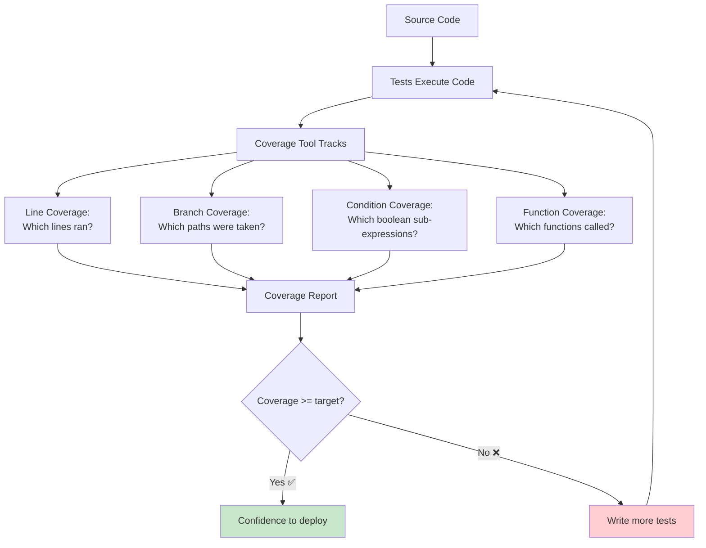
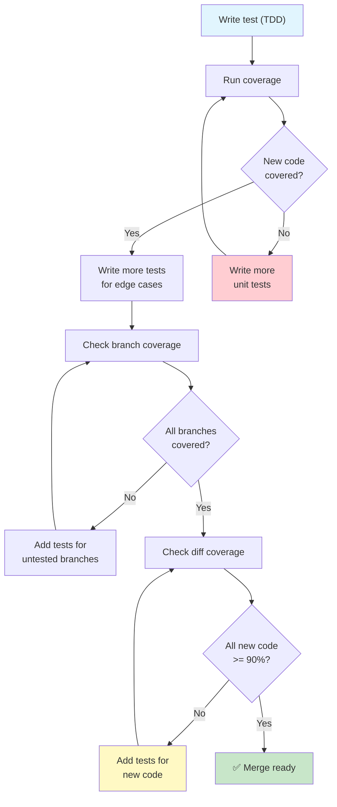

# Test Coverage & Quality

Coverage tells you what code your tests execute. It's a useful **negative indicator** — low coverage means you're definitely not testing enough — but high coverage doesn't guarantee good tests. This lesson covers how to measure, interpret, and act on coverage data.

## What is Code Coverage?

Code coverage measures the percentage of your codebase that is executed during testing.



## Types of Coverage Metrics

| Metric | What It Measures | Example |
|--------|-----------------|---------|
| **Line Coverage** | What percentage of lines executed | 80% of lines ran during tests |
| **Branch Coverage** | What percentage of if/else branches taken | 3 of 4 branches covered (75%) |
| **Condition Coverage** | Boolean sub-expressions evaluated | `A or B` — tested A=True, A=False |
| **Function Coverage** | Functions that were called | 45 of 50 functions invoked |
| **Statement Coverage** | Individual statements executed | 120 of 150 statements ran |
| **Path Coverage** | All possible paths through code | 8 of 16 possible paths tested |

```python
# Example showing different coverage types
def process_order(order: dict) -> str:
    """An order processing function to analyze coverage."""
    # Line 1 (always runs when called)
    if not order:                          # Branch 1: True / False
        return "empty_order"               # Line 2 (branch True)

    if order.get("amount", 0) > 100:       # Branch 2: True / False
        discount = order["amount"] * 0.1   # Line 4 (branch True)
        order["amount"] -= discount        # Line 5

    if order.get("loyalty_member"):        # Branch 3: True / False
        points = order["amount"] * 10      # Line 7 (branch True)
        order["loyalty_points"] = points   # Line 8

    if order.get("express_shipping"):      # Branch 4: True / False
        return "express"                   # Line 10 (branch True)

    return "standard"                      # Line 12
```

## Setting Up Coverage with pytest-cov

```bash
# Install coverage tools
pip install pytest-cov coverage

# Run tests with coverage
pytest --cov=src tests/

# Run with coverage report in terminal
pytest --cov=src --cov-report=term-missing tests/

# Generate HTML report (open htmlcov/index.html)
pytest --cov=src --cov-report=html tests/

# Generate XML report (for CI integration)
pytest --cov=src --cov-report=xml tests/

# Combine multiple coverage reports
pytest --cov=src --cov-report=term --cov-report=html:coverage_report tests/
```

### Configuration in pyproject.toml

```toml
[tool.coverage.run]
source = ["src"]
omit = ["*/tests/*", "*/migrations/*", "*/__init__.py"]
branch = true
parallel = true

[tool.coverage.report]
exclude_lines = [
    "pragma: no cover",
    "def __repr__",
    "if __name__ == .__main__.:",
    "raise NotImplementedError",
    "if False:",
    "def __str__",
]
fail_under = 80
show_missing = true
precision = 2

[tool.coverage.html]
directory = "coverage_html"
title = "My Project Coverage Report"
```

## Reading Coverage Reports

```python
# src/calculator.py
def add(a, b):
    return a + b

def subtract(a, b):
    return a - b

def multiply(a, b):
    return a * b

def divide(a, b):
    if b == 0:
        raise ValueError("Cannot divide by zero")
    return a / b

def power(a, b):
    return a ** b

def modulus(a, b):
    if b == 0:
        raise ValueError("Cannot mod by zero")
    return a % b
```

```python
# tests/test_calculator.py
from src.calculator import add, subtract, multiply, divide

def test_add():
    assert add(2, 3) == 5

def test_subtract():
    assert subtract(5, 3) == 2

def test_multiply():
    assert multiply(4, 3) == 12

# Missing tests: divide, power, modulus!
```

```bash
# Run coverage
pytest --cov=src --cov-report=term-missing tests/

# Output:
# Name                 Stmts   Miss  Cover   Missing
# --------------------------------------------------
# src/calculator.py       15      6    60%   12-20
# --------------------------------------------------
# TOTAL                  15      6    60%
#
# Lines 12-20 are: divide exception, power(), modulus()
```

> [!WARNING]
> 60% coverage with all green tests gives false confidence. The untested functions might be completely broken. Coverage tells you what you DIDN'T test.

## Branch Coverage: The Missing Piece

Line coverage can be misleading. Branch coverage reveals untested paths:

```python
def validate_age(age: int) -> str:
    if age < 0:          # Branch 1
        return "invalid"
    elif age < 18:       # Branch 2
        return "minor"
    elif age < 65:       # Branch 3
        return "adult"
    else:                # Branch 4
        return "senior"
```

```python
# Test with 100% line coverage but only 50% branch coverage
def test_validate_age():
    assert validate_age(25) == "adult"
    # Lines covered: all 8 lines
    # Branches covered: only "adult" path (branch 3)
    # Missed: age < 0, age < 18, age >= 65
```

```bash
# Enable branch coverage
pytest --cov=src --cov-branch --cov-report=term-missing tests/

# Output:
# Name                 Stmts   Miss  Branch BrPart  Cover   Missing
# ----------------------------------------------------------------
# src/validator.py        8      0      4      3    75%   4,6,10
# ----------------------------------------------------------------
```

> [!TIP]
> Always enable branch coverage with `--cov-branch`. Line coverage alone can give a dangerously false sense of security.

## Meaningful Coverage Targets

| Coverage Level | What It Means | When It's Enough |
|---------------|---------------|------------------|
| **< 40%** | Critical gaps | New project with no tests |
| **40-60%** | Core paths tested | Legacy code with partial coverage |
| **60-80%** | Most paths covered | Active development, regular releases |
| **80-90%** | Well-tested | Production services, libraries |
| **90-100%** | Thoroughly tested | Safety-critical, financial, medical |

```python
# High coverage doesn't mean good tests
def is_valid_user(user: dict) -> bool:
    return (
        "name" in user
        and "email" in user
        and "@" in user.get("email", "")
        and len(user.get("name", "")) > 2
        and user.get("age", 0) >= 18
    )
```

```python
# "Tests" that achieve 100% coverage but test nothing useful
def test_is_valid_user():
    user = {"name": "Alice", "email": "a@b.com", "age": 25}
    result = is_valid_user(user)
    assert result is True
    # 100% line coverage! But:
    # - Not testing missing name
    # - Not testing invalid email
    # - Not testing underage
    # - Not testing short name
    # - Not testing empty dict
```

```python
# Meaningful coverage tests
def test_is_valid_user_happy_path():
    assert is_valid_user({"name": "Alice", "email": "a@b.com", "age": 25}) is True

def test_is_valid_user_missing_name():
    assert is_valid_user({"email": "a@b.com", "age": 25}) is False

def test_is_valid_user_invalid_email():
    assert is_valid_user({"name": "Alice", "email": "invalid", "age": 25}) is False

def test_is_valid_user_underage():
    assert is_valid_user({"name": "Alice", "email": "a@b.com", "age": 16}) is False

def test_is_valid_user_empty():
    assert is_valid_user({}) is False

def test_is_valid_user_short_name():
    assert is_valid_user({"name": "A", "email": "a@b.com", "age": 25}) is False
```

## Coverage Configuration Files

### .coveragerc

```ini
[run]
source = src
omit =
    */tests/*
    */migrations/*
    */.eggs/*
    **/__init__.py
    **/settings.py
    manage.py
branch = True
parallel = True

[report]
exclude_lines =
    pragma: no cover
    def __repr__
    def __str__
    if __name__ == "__main__":
    raise NotImplementedError
    raise AssertionError
    pass
ignore_errors = True
precision = 2
show_missing = True
fail_under = 85
skip_covered = True
skip_empty = True

[html]
directory = coverage_html
title = Coverage Report
extra_css = custom.css

[xml]
output = coverage.xml
package_depth = 3
```

### Coverage in CI/CD

```yaml
# .github/workflows/tests.yml (partial)
name: Tests with Coverage

on: [push, pull_request]

jobs:
  test:
    runs-on: ubuntu-latest
    steps:
      - uses: actions/checkout@v4
      - uses: actions/setup-python@v5
        with:
          python-version: '3.12'

      - name: Install dependencies
        run: |
          pip install -r requirements.txt
          pip install pytest pytest-cov

      - name: Run tests with coverage
        run: |
          pytest --cov=src --cov-report=xml --cov-report=term-missing tests/

      - name: Upload coverage report
        uses: codecov/codecov-action@v4
        with:
          file: ./coverage.xml
          flags: unittests
          fail_ci_if_error: true
```

## Coverage Antipatterns

### 1. Chasing 100% Coverage

```python
# DON'T: Write tests just to hit coverage targets
def test_useless_getter():
    obj = MyClass()
    assert obj.get_name() is None  # Testing a getter that returns None

# DO: Test meaningful behavior
def test_get_name_after_setting():
    obj = MyClass()
    obj.set_name("Alice")
    assert obj.get_name() == "Alice"

def test_get_name_default():
    obj = MyClass()
    assert obj.get_name() == ""  # Meaningful default
```

### 2. Ignoring Complex Code

```python
# DON'T: Write tests for simple code, skip complex code
def test_simple_add():
    assert add(1, 2) == 3

# But no test for this complex logic:
def calculate_tax(income: float, deductions: list, filing_status: str) -> float:
    # Complex tax calculation with many branches
    pass  # Untested!
```

### 3. Integration Coverage Instead of Unit Coverage

```python
# DON'T: Cover code through integration tests only
def test_full_api():
    response = client.post("/api/users", json={"name": "Alice"})
    assert response.status_code == 201
    # This covers models, serializers, views, middleware, DB...
    # But you don't know WHICH part is tested

# DO: Also write unit tests for each layer
def test_user_creation_service():
    service = UserService(mock_repo)
    user = service.create_user({"name": "Alice"})
    assert user.name == "Alice"
```

## Coverage-Driven Development Workflow



## Using Coverage Exclusions Wisely

```python
# Legitimate exclusions from coverage

# 1. Debug-only code
if DEBUG:  # pragma: no cover
    logger.debug(f"Processing order {order_id}: {order_data}")

# 2. Platform-specific code
if sys.platform == "win32":  # pragma: no cover
    WINDOWS_HANDLER = ...
else:
    UNIX_HANDLER = ...

# 3. Dead code (intentionally kept)
# pragma: no cover
def deprecated_function():
    """Kept for backwards compatibility."""
    pass

# 4. __repr__ / __str__ (often tested indirectly)
def __repr__(self):  # pragma: no cover
    return f"User({self.name!r})"
```

> [!NOTE]
> Use `# pragma: no cover` sparingly. Each exclusion should have a comment explaining WHY. Overuse of exclusions makes your coverage report meaningless.

## Tools Integration

```bash
# Using coverage.py directly (without pytest)
coverage run -m pytest tests/
coverage report -m
coverage html
coverage xml

# Run coverage with specific configuration
coverage run --rcfile=.coveragerc -m pytest tests/

# Combine parallel runs
coverage combine
coverage report

# View annotated source
coverage annotate -d coverage_annotated/

# Erase previous coverage data
coverage erase
```

### Diff Coverage

Diff coverage measures coverage of only the lines changed in a pull request:

```bash
# Install diff-cover
pip install diff-cover

# Generate diff coverage report
diff-cover coverage.xml --compare-branch=main

# HTML output
diff-cover coverage.xml --compare-branch=main --html-report=diff_report.html

# Fail CI if diff coverage < 90%
diff-cover coverage.xml --compare-branch=main --fail-under=90
```

```bash
# Example diff-coverage output:
# ----------
# Diff Coverage
# Diff: origin/main...HEAD, created and modified lines: 45
# ----------
# src/calculator.py (90.0%): Missing line 42
# src/validator.py (100.0%)
# src/reports.py (66.7%): Missing lines 15, 23
# ----------
# Total:    Coverage: 85.7% (42 of 45 lines)
# FAILURE: Diff coverage (85.7%) is below threshold (90%)
```

## Practice Exercises

1. **Install and Configure**: Install pytest-cov and configure coverage to track `src/` directory with branch coverage enabled. Generate an HTML report.

2. **Line vs Branch Gap**: Write a function with nested if-else (at least 4 branches). Write a test that achieves 100% line coverage but only 50% branch coverage. Run `--cov-branch` to verify.

3. **Coverage-Driven TDD**: Pick a function with at least 6 branches. Use TDD to develop it while keeping coverage at 100% for both lines and branches. Show your coverage report.

4. **Improve Coverage**: Given this code, write tests to achieve 100% branch coverage:
   ```python
   def classify_number(n: int) -> str:
       if n <= 0:
           if n == 0:
               return "zero"
           return "negative"
       if n % 2 == 0:
           return "even" if n < 100 else "large even"
       return "odd" if n < 100 else "large odd"
   ```

5. **Set Coverage Gates**: Create a `.coveragerc` that fails if coverage drops below 80%. Create a test suite that passes initially, then add untested code to trigger the failure.

6. **Diff Coverage Setup**: Create a scenario where two branches have differing coverage. Run `diff-cover` to show only the coverage of changed lines.

7. **Coverage Antipattern Hunt**: Find examples in a real or sample codebase of coverage antipatterns: chasing 100% with trivial tests, ignoring complex code, or overusing `# pragma: no cover`.

8. **Configure CI Coverage**: Write a GitHub Actions workflow that runs tests with coverage, uploads to Codecov, and fails if coverage drops below 85% or diff coverage is below 90%.

## Summary

- **Coverage measures what code runs during tests**, not what code is correct
- **Line coverage** is the basic metric; **branch coverage** reveals untested paths
- **100% coverage ≠ 100% correctness** — you can have perfect coverage and still have bugs
- **Coverage targets**: 80%+ for production code, 90%+ for critical paths
- **Diff coverage** ensures new code is tested, not just total numbers
- **Exclusions** should be rare and well-documented
- **High coverage is a side effect** of good testing discipline, not the goal itself

> [!SUCCESS]
> Coverage is a compass, not a destination. It points you toward untested code, but reaching 100% doesn't mean you're done. Meaningful testing requires thought, not just metrics.
