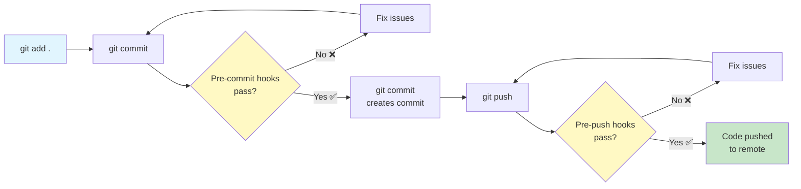
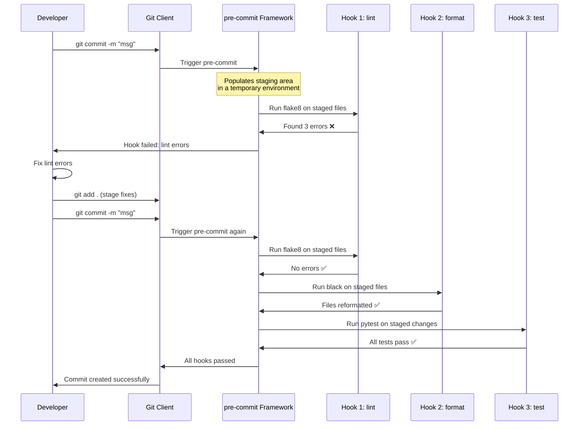

# Pre-Commit Hooks

Pre-commit hooks are automated checks that run **before** you commit code. They catch issues early — before they reach the repository — saving code review time and preventing bad code from being merged.

## What Are Git Hooks?

Git hooks are scripts that Git executes at specific points in the workflow:



| Hook Type | When It Runs | Common Uses |
|-----------|-------------|-------------|
| `pre-commit` | Before commit message editor | Lint, format, test, check secrets |
| `pre-push` | Before pushing to remote | Run full test suite, security scan |
| `commit-msg` | After commit message is written | Validate commit message format |
| `prepare-commit-msg` | Before commit message editor | Auto-generate commit messages |
| `post-commit` | After commit is created | Notify CI, update dashboards |

## Introducing the pre-commit Framework

The `pre-commit` framework makes hooks easy to install, configure, and share:

```bash
# Install the pre-commit framework
pip install pre-commit

# Verify installation
pre-commit --version

# Install hooks into your git repo
pre-commit install

# Run hooks on all files (useful for first setup)
pre-commit run --all-files

# Run a specific hook
pre-commit run flake8 --all-files

# Update hooks to latest versions
pre-commit autoupdate

# Uninstall hooks
pre-commit uninstall
```

### Basic .pre-commit-config.yaml

```yaml
# .pre-commit-config.yaml
repos:
  - repo: https://github.com/pre-commit/pre-commit-hooks
    rev: v4.6.0
    hooks:
      - id: trailing-whitespace
      - id: end-of-file-fixer
      - id: check-yaml
      - id: check-added-large-files
        args: ['--maxkb=500']
      - id: check-json
      - id: check-toml
      - id: check-merge-conflict
      - id: detect-private-key
      - id: mixed-line-ending
        args: ['--fix=lf']

  - repo: https://github.com/psf/black
    rev: 24.4.2
    hooks:
      - id: black

  - repo: https://github.com/pycqa/isort
    rev: 5.13.2
    hooks:
      - id: isort
        args: ['--profile', 'black']

  - repo: https://github.com/pycqa/flake8
    rev: 7.1.0
    hooks:
      - id: flake8
        args: ['--max-line-length=88', '--extend-ignore=E203,W503']
```

## How pre-commit Works



> [!NOTE]
> pre-commit runs hooks against **staged files only**. This keeps the feedback loop fast. Use `pre-commit run --all-files` to check the entire repository.

## Common Hook Categories

### 1. Formatting Hooks

```yaml
- repo: https://github.com/psf/black
  rev: 24.4.2
  hooks:
    - id: black
      language_version: python3.12
      args: ['--line-length=100']

- repo: https://github.com/pycqa/isort
  rev: 5.13.2
  hooks:
    - id: isort
      args: ['--profile', 'black']

- repo: https://github.com/pre-commit/mirrors-prettier
  rev: v4.0.0-alpha.8
  hooks:
    - id: prettier
      types_or: [javascript, typescript, css, json, yaml, markdown]
```

### 2. Linting Hooks

```yaml
- repo: https://github.com/astral-sh/ruff-pre-commit
  rev: v0.4.8
  hooks:
    - id: ruff
      args: [--fix, --exit-non-zero-on-fix]

- repo: https://github.com/pycqa/flake8
  rev: 7.1.0
  hooks:
    - id: flake8
      additional_dependencies:
        - flake8-docstrings
        - flake8-bugbear

- repo: https://github.com/pycqa/pylint
  rev: v3.2.2
  hooks:
    - id: pylint
      args: ['--max-line-length=100']
```

### 3. Security Hooks

```yaml
- repo: https://github.com/Yelp/detect-secrets
  rev: v1.5.0
  hooks:
    - id: detect-secrets
      args: ['--baseline', '.secrets.baseline']

- repo: https://github.com/PyCQA/bandit
  rev: 1.7.9
  hooks:
    - id: bandit
      args: ['-x', 'tests/', '-ll']

- repo: https://github.com/pre-commit/pre-commit-hooks
  rev: v4.6.0
  hooks:
    - id: detect-private-key
```

### 4. Type Checking Hooks

```yaml
- repo: https://github.com/pre-commit/mirrors-mypy
  rev: v1.10.0
  hooks:
    - id: mypy
      args: ['--strict']
      additional_dependencies: [types-requests, types-PyYAML]

- repo: https://github.com/pre-commit/pyright
  rev: v1.1.366
  hooks:
    - id: pyright
```

### 5. Testing Hooks

```yaml
- repo: local
  hooks:
    - id: pytest
      name: pytest
      entry: pytest
      language: system
      types: [python]
      pass_filenames: false
      always_run: true
      args: ['-x', '--ff', '--cov=src', 'tests/']

    - id: pytest-cov-threshold
      name: Check coverage threshold
      entry: pytest
      language: system
      pass_filenames: false
      always_run: true
      args: ['--cov=src', '--cov-fail-under=85']
```

> [!WARNING]
> Running the full test suite as a pre-commit hook can slow down commits significantly. Consider using `pre-push` for the full suite and keeping only fast unit tests in `pre-commit`.

## Advanced Configuration

### Conditional Hooks with Files/Exclude

```yaml
repos:
  - repo: https://github.com/psf/black
    rev: 24.4.2
    hooks:
      - id: black
        # Only run on Python files
        types: [python]
        # Exclude generated files
        exclude: |
          (?x)^(
            migrations/|
            .*_pb2\.py|
            build/
          )

  - repo: https://github.com/pre-commit/pre-commit-hooks
    rev: v4.6.0
    hooks:
      - id: check-added-large-files
        # Only check certain directories
        files: ^src/
        args: ['--maxkb=200']

  - repo: https://github.com/astral-sh/ruff-pre-commit
    rev: v0.4.8
    hooks:
      - id: ruff
        # Never run on test files
        exclude: ^tests/
        args: [--fix]
```

### Using Hook Arguments

```yaml
repos:
  - repo: https://github.com/pycqa/flake8
    rev: 7.1.0
    hooks:
      - id: flake8
        args:
          - --max-line-length=100
          - --extend-ignore=E203,W503
          - --per-file-ignores=__init__.py:F401
        additional_dependencies:
          - flake8-docstrings==1.7.0
          - flake8-bugbear==24.4.26

  - repo: https://github.com/pycqa/pylint
    rev: v3.2.2
    hooks:
      - id: pylint
        args:
          - --disable=C0111
          - --max-line-length=100
          - --score=n
        files: ^src/

  - repo: https://github.com/psf/black
    rev: 24.4.2
    hooks:
      - id: black
        args: ['--line-length=100', '--target-version=py312']
```

### Local Hooks: Running System Commands

```yaml
repos:
  - repo: local
    hooks:
      - id: pytest
        name: Run unit tests
        entry: pytest
        language: system
        pass_filenames: false
        always_run: true
        args: ['-x', 'tests/unit/']

      - id: check-requirements
        name: Check requirements files
        entry: python
        language: system
        files: ^requirements.*\.txt$
        args: ['-c', 'scripts/check_requirements.py']

      - id: shellcheck
        name: Shell script lint
        entry: shellcheck
        language: system
        types: [shell]

      - id: make
        name: Run make check
        entry: make
        language: system
        pass_filenames: false
        always_run: true
        args: ['check']
```

## The Pre-Commit Hooks Ecosystem

| Category | Hook | Purpose |
|----------|------|---------|
| **Basic** | `trailing-whitespace` | Remove trailing whitespace |
| **Basic** | `end-of-file-fixer` | Ensure files end with newline |
| **Basic** | `check-yaml` | Validate YAML files |
| **Basic** | `check-json` | Validate JSON files |
| **Basic** | `check-added-large-files` | Prevent large file commits |
| **Lint** | `ruff` | Fast Python linter |
| **Lint** | `flake8` | PEP 8 compliance checker |
| **Lint** | `pylint` | In-depth Python analysis |
| **Format** | `black` | Auto-formatter |
| **Format** | `isort` | Import sorter |
| **Format** | `prettier` | Multi-language formatter |
| **Type** | `mypy` | Static type checking |
| **Type** | `pyright` | Fast type checking |
| **Security** | `detect-secrets` | Find secrets in code |
| **Security** | `bandit` | Security vulnerability scanner |
| **Security** | `detect-private-key` | Find private keys |
| **Test** | `pytest` | Run test suite |
| **Coverage** | `pytest-cov` | Check coverage thresholds |
| **Doc** | `interrogate` | Check docstring coverage |

## Creating Custom Hooks

You can write your own hooks for project-specific checks:

```python
# .pre-commit-hooks/check_migration_names.py
"""
Custom hook to validate migration file naming convention.
"""
import re
import sys
from pathlib import Path

MIGRATION_PATTERN = re.compile(r'^\d{4}_[a-z0-9_]+\.py$')

def main():
    errors = []
    for file in Path('migrations').glob('*.py'):
        if not MIGRATION_PATTERN.match(file.name):
            errors.append(f"Invalid migration name: {file.name}")

    if errors:
        for error in errors:
            print(error)
        sys.exit(1)
    sys.exit(0)

if __name__ == '__main__':
    main()
```

```yaml
# .pre-commit-config.yaml (custom hook)
repos:
  - repo: local
    hooks:
      - id: migration-naming
        name: Validate migration names
        entry: python
        language: system
        files: ^migrations/
        args: ['.pre-commit-hooks/check_migration_names.py']

      - id: commit-message-length
        name: Check commit message length
        entry: python
        language: system
        stages: [commit-msg]
        args: ['.pre-commit-hooks/check_commit_msg.py']
```

## CI Integration

pre-commit can also run in CI pipelines using the `ci` stage:

```yaml
# .github/workflows/pre-commit.yml
name: Pre-commit Checks

on:
  pull_request:
  push:
    branches: [main]

jobs:
  pre-commit:
    runs-on: ubuntu-latest
    steps:
      - uses: actions/checkout@v4
      - uses: actions/setup-python@v5
        with:
          python-version: '3.12'

      - name: Install pre-commit
        run: pip install pre-commit

      - name: Run all pre-commit hooks
        run: pre-commit run --all-files

      - name: Run only security hooks
        run: pre-commit run detect-secrets --all-files
```

### Pre-Commit CI (pre-commit.ci)

Enable automatic CI for your hooks:

```yaml
# .pre-commit-config.yaml (with CI settings)
ci:
  autofix_commit_msg: |
    [pre-commit.ci] auto fixes from pre-commit hooks
  autofix_prs: true
  autoupdate_branch: main
  autoupdate_commit_msg: '[pre-commit.ci] autoupdate hooks'
  autoupdate_schedule: monthly
  submodules: false

repos:
  - repo: https://github.com/psf/black
    rev: 24.4.2
    hooks:
      - id: black

  - repo: https://github.com/astral-sh/ruff-pre-commit
    rev: v0.4.8
    hooks:
      - id: ruff
```

## Skipping Hooks (Temporarily)

Sometimes you need to bypass hooks:

```bash
# Skip all hooks (use sparingly!)
git commit -m "WIP: emergency fix" --no-verify

# Skip hooks via environment variable
SKIP=black,flake8 git commit -m "skip formatting"

# Skip using Git config
git -c core.hooksPath=/dev/null commit -m "bypass all"

# Skip specific hook with pre-commit
PRE_COMMIT_ALLOW_NO_CONFIG=1 git commit -m "emergency"
```

> [!WARNING]
> Skipping hooks defeats their purpose. Only bypass them for legitimate emergencies, and always come back to fix the issues.

## Troubleshooting Pre-Commit

```bash
# Clear pre-commit cache
pre-commit clean

# Reinstall hooks
pre-commit install --overwrite

# Run hooks on specific files
pre-commit run --files src/main.py tests/test_main.py

# See what hooks would run (dry run)
pre-commit run --all-files --verbose

# Debug hook execution
pre-commit run --all-files --hook-stage manual

# Check version mismatches
pre-commit validate-config

# Force re-install of hooks
pre-commit install --install-hooks
```

### Common Issues

| Issue | Cause | Solution |
|-------|-------|----------|
| Hook fails on unrelated changes | Hook checks un-staged files | `git stash` before committing |
| `conda: command not found` | Environment not activated | Use `language: system` |
| Hooks too slow | Full test suite in pre-commit | Move slow hooks to pre-push |
| `ModuleNotFoundError` | Missing language dependencies | Add `additional_dependencies` |
| Hooks modifying files | Auto-formatters | Re-stage after hook runs |
| `rev` not found | Tag doesn't exist | Check the repo for correct tag |

## Practice Exercises

1. **Install and Initialize**: Install the pre-commit framework and initialize it in a Git repository. Run `pre-commit run --all-files` to check the current state.

2. **Basic Configuration**: Create a `.pre-commit-config.yaml` with trailing-whitespace, end-of-file-fixer, check-yaml, and black hooks. Verify each hook triggers correctly.

3. **Advanced Configuration**: Add flake8 with flake8-docstrings and ruff to your hooks configuration. Configure them to exclude test files and migration directories.

4. **Custom Hook**: Write a custom hook that validates that all TODO comments include a JIRA ticket number (e.g., `TODO: PROJ-123: fix this`). Add it as a local hook.

5. **Speed Optimization**: Profile your hooks. Which ones are slow? Create a configuration that runs fast hooks (< 1 second) on pre-commit and slow hooks on pre-push.

6. **Security Hooks**: Add `detect-secrets` and `bandit` to your hooks. Create a `.secrets.baseline` file for any pre-existing secrets.

7. **CI Integration**: Create a GitHub Actions workflow that runs pre-commit in CI. Ensure it fails the build if any hooks fail.

8. **Team Standardization**: Your team has 5 repositories. Create a shared pre-commit configuration that can be reused across all of them. Use `default_language_version` and `default_stages` for consistency.

## Summary

- **Pre-commit hooks** catch issues before they reach the repository
- **The pre-commit framework** makes hooks easy to install, configure, and share
- **Hooks run on staged files only** — fast feedback, incremental checks
- **Common hooks**: Linting (ruff, flake8), formatting (black, isort), security (bandit, detect-secrets), type checking (mypy)
- **Local hooks**: Run system commands, custom scripts, or test suites
- **CI integration**: pre-commit works locally and in CI pipelines
- **Skip sparingly**: Only bypass hooks in genuine emergencies
- **Team consistency**: Shared configuration ensures everyone runs the same checks

> [!SUCCESS]
> Pre-commit hooks automate quality enforcement. They transform "remember to lint" from a manual chore into an automated guarantee. Every commit becomes a quality checkpoint.
