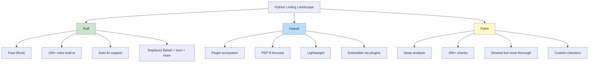
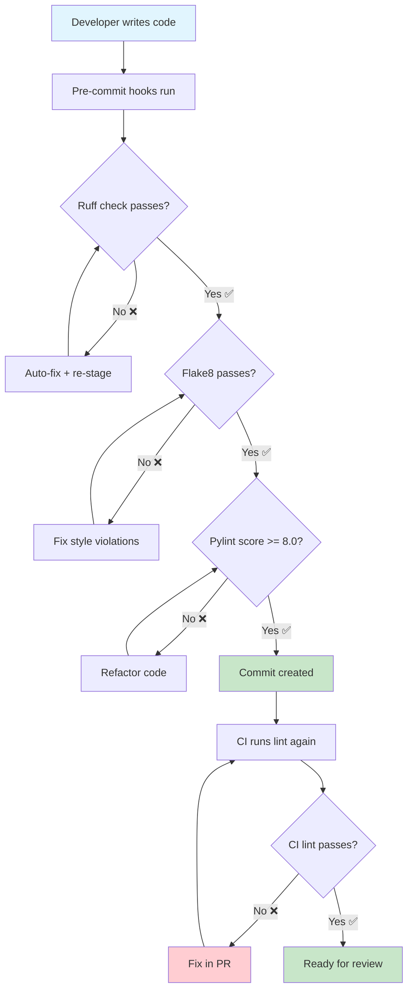

# Linting & Code Quality

Linters are static analysis tools that detect potential errors, style violations, and code smells **without running your code**. They enforce consistency, catch bugs early, and make code reviews focus on logic rather than formatting.

## Why Lint?

| Benefit | Without Linter | With Linter |
|---------|---------------|-------------|
| **Consistency** | Every developer has their own style | Codebase follows agreed rules |
| **Bug Prevention** | `==` instead of `is None` slips through | Linter catches it automatically |
| **Code Review** | 30% of comments about formatting | Reviews focus on architecture |
| **Onboarding** | New devs learn codebase conventions | Linter teaches them |
| **CI/CD** | Style issues block pipelines | Linter runs automatically |

## The Three Major Python Linters



| Feature | Flake8 | Pylint | Ruff |
|---------|--------|--------|------|
| **Speed** | Fast | Slow | Very Fast (Rust) |
| **Install** | `pip install flake8` | `pip install pylint` | `pip install ruff` |
| **Rules** | ~100 + plugins | ~200+ | ~800+ (many ecosystems) |
| **Auto-fix** | No | No | Yes |
| **Config** | `.flake8` / `tox.ini` | `.pylintrc` | `pyproject.toml` / `ruff.toml` |
| **Built-in** | Basic PEP 8 | Comprehensive | Flake8 + isort + pycodestyle |
| **Language** | Python | Python | Rust (Pycross interface) |
| **Adoption** | Mature, stable | Legacy, verbose | Modern, fast-growing |

## Flake8: The Reliable Standard

### Installation and Basic Usage

```bash
# Install
pip install flake8

# Run on current directory
flake8

# Run on specific files
flake8 src/ tests/

# Show error codes
flake8 --statistics

# Exit with error count
flake8 --exit-zero

# Generate report
flake8 --output-file=flake8_report.txt
```

### Configuration

```ini
# .flake8
[flake8]
max-line-length = 100
extend-ignore = E203, W503
exclude =
    .git,
    __pycache__,
    migrations/,
    build/,
    dist/,
    .venv,
    venv/
max-complexity = 10
per-file-ignores =
    __init__.py: F401
    tests/*: S101
statistics = True
```

### Flake8 Error Codes

| Code | Rule | Example |
|------|------|---------|
| **E1** | Indentation | `E111: 4 spaces per indent` |
| **E2** | Whitespace | `E203: whitespace before ':'` |
| **E3** | Blank lines | `E302: expected 2 blank lines after class` |
| **E4** | Imports | `E401: multiple imports on one line` |
| **E5** | Line length | `E501: line too long (100 > 79)` |
| **E7** | Statements | `E701: multiple statements on one line` |
| **W1** | Warning | `W191: indentation contains tabs` |
| **W2** | Warning | `W292: no newline at end of file` |
| **W5** | Warning | `W503: line break before binary operator` |
| **F4** | Import | `F401: module imported but unused` |
| **F6** | Definition | `F601: dictionary key duplicate` |
| **F8** | Name | `F821: undefined name 'foo'` |

### Flake8 Plugins

```bash
# Install plugins
pip install flake8-docstrings
pip install flake8-bugbear
pip install flake8-bandit
pip install flake8-builtins
pip install flake8-comprehensions
pip install flake8-import-order
pip install flake8-annotations
```

```ini
# .flake8 with plugins
[flake8]
max-line-length = 100
extend-ignore = E203, W503
extend-select = B, D, C4, ANN
per-file-ignores =
    __init__.py: F401
    tests/*: D100, D101, D102, ANN
```

```python
# Flake8 with plugins in action

def process_data(data):  # ANN001: missing type annotation for 'data'
    """Process the given data."""  # D200: docstring should fit on one line
    result = []
    for i, item in enumerate(data):
        # Using enumerate but never using 'i' - B007 caught by bugbear
        result.append(item * 2)
    return result


def validate_user(name, email, age):  # ANN001, ANN002
    """
    Validate user data.

    Checks name, email and age constraints.
    """
    if name is None or name == "":  # B101: use .strip() or compare to ""
        raise ValueError("Name required")
    return True
```

## Pylint: Deep Analysis

### Installation and Basic Usage

```bash
# Install
pip install pylint

# Run on a file
pylint src/main.py

# Run on a module
pylint src

# Generate a configuration file
pylint --generate-rcfile > .pylintrc

# Score only (no output)
pylint src --score=y

# Specify a configuration file
pylint --rcfile=.pylintrc src/
```

### Pylint Output

```
************* Module src.main
src/main.py:10:4: W0621: Redefining name 'process_data' from outer scope (redefined-outer-name)
src/main.py:15:8: E1101: Instance of 'list' has no 'do_something' member (no-member)
src/main.py:22:0: C0116: Missing function or method docstring (missing-function-docstring)
src/main.py:30:15: C0103: Variable name "x" doesn't conform to snake_case naming style (invalid-name)
src/main.py:45:0: R0914: Too many local variables (16/15) (too-many-locals)
```

### Pylint Message Categories

| Category | Code | Meaning | Count |
|----------|------|---------|-------|
| **Convention** | `C0xxx` | Style/formatting | 50+ |
| **Refactor** | `R0xxx` | Code smell | 20+ |
| **Warning** | `W0xxx` | Potential issues | 80+ |
| **Error** | `E0xxx` | Likely bugs | 60+ |
| **Fatal** | `F0xxx` | Pylint crash | 5 |

### .pylintrc Configuration

```ini
# .pylintrc
[MASTER]
ignore = .git,__pycache__,migrations,.venv
jobs = 4
load-plugins = pylint_django,pylint_flask

[MESSAGES CONTROL]
disable =
    C0111,  # missing-docstring (too strict)
    C0103,  # invalid-name
    R0903,  # too-few-public-methods
    W0511,  # fixme (allow TODO comments)

[FORMAT]
max-line-length = 100
expected-line-ending-format = LF

[DESIGN]
max-args = 7
max-attributes = 10
max-locals = 20
max-returns = 6
max-branches = 15
max-statements = 50
max-parents = 7
min-public-methods = 1
max-public-methods = 30

[SIMILARITIES]
min-similarity-lines = 10
ignore-comments = yes
ignore-docstrings = yes
ignore-imports = yes

[BASIC]
good-names = i, j, k, ex, Run, _, id, pk
bad-names = foo, bar, baz
```

> [!NOTE]
> Pylint scoring: 10.0 is perfect. Most projects aim for 8.0-9.0. Use `--fail-under=8.0` in CI to enforce a minimum score.

## Ruff: The Modern Powerhouse

Ruff is a Rust-based linter that's **10-100x faster** than traditional Python linters.

### Installation and Basic Usage

```bash
# Install
pip install ruff

# Run on current directory
ruff check .

# Auto-fix issues
ruff check --fix .

# Show which rules apply
ruff check --show-settings

# Generate a configuration file
ruff check --generate-docs > RULES.md
```

### Ruff Configuration

```toml
# pyproject.toml
[tool.ruff]
target-version = "py312"
line-length = 100

[tool.ruff.lint]
select = ["E", "F", "I", "N", "W", "D", "B", "SIM", "UP", "S"]
ignore = ["E203", "W503", "D100", "D104"]

[tool.ruff.lint.per-file-ignores]
"__init__.py" = ["F401"]
"tests/**" = ["D", "S101"]

[tool.ruff.format]
quote-style = "double"
indent-style = "space"
line-ending = "lf"

[tool.ruff.lint.pydocstyle]
convention = "google"
```

```bash
# Ruff specific checks
ruff check --select ALL  # Enable all rules
ruff check --select E,W,F  # Flake8 rules
ruff check --select I  # Import sorting
ruff check --select N  # Naming conventions
ruff check --select D  # Docstring conventions
ruff check --select B  # Bugbear rules
ruff check --select SIM # Simplify expressions
ruff check --select UP # Pyupgrade (modernize)
ruff check --select S  # Security (bandit rules)
```

### Ruff Output

```bash
$ ruff check src/
src/main.py:1:1: F401 [*] `os` imported but unused
src/main.py:5:5: E225 missing whitespace around operator
src/main.py:8:1: E302 expected 2 blank lines after class, found 1
src/main.py:12:9: B006 Do not use mutable data structures for argument defaults
src/main.py:15:1: D100 Missing docstring in public module
src/main.py:20:12: SIM105 Use `contextlib.suppress` instead of `try-except-pass`
Found 6 errors.
[*] 2 fixable with the `--fix` option.
```

### Before and After Ruff

```python
# BEFORE: Messy code
import os,sys
from collections import *

class data_processor:
    def __init__(self,data=[]):  # B006: mutable default
        self.data = data
    def process(self,item):
        if item in ['a','b','c']:pass
        else:
            try:
                result=do_something(item)
            except:  # E722: bare except
                pass
        return None
```

```python
# AFTER: Ruff fixes applied
import sys
from collections import defaultdict

class DataProcessor:
    def __init__(self, data=None):
        if data is None:
            data = []
        self.data = data

    def process(self, item):
        if item in {'a', 'b', 'c'}:
            return None
        result = do_something(item)
        return result
```

## Integrating Linters in Pre-Commit

```yaml
# .pre-commit-config.yaml
repos:
  # Ruff (fast, comprehensive)
  - repo: https://github.com/astral-sh/ruff-pre-commit
    rev: v0.4.8
    hooks:
      - id: ruff
        args: [--fix, --exit-non-zero-on-fix]

  # Flake8 (complementary checks)
  - repo: https://github.com/pycqa/flake8
    rev: 7.1.0
    hooks:
      - id: flake8
        additional_dependencies:
          - flake8-docstrings
          - flake8-bugbear

  # Pylint (deep analysis)
  - repo: https://github.com/pycqa/pylint
    rev: v3.2.2
    hooks:
      - id: pylint
        args: [--fail-under=8.0]
```

## CI Integration

```yaml
# .github/workflows/lint.yml
name: Linting

on:
  pull_request:
  push:
    branches: [main]

jobs:
  lint:
    runs-on: ubuntu-latest
    strategy:
      matrix:
        linter: [ruff, flake8, pylint]

    steps:
      - uses: actions/checkout@v4
      - uses: actions/setup-python@v5
        with:
          python-version: '3.12'

      - name: Install dependencies
        run: |
          pip install -r requirements.txt
          pip install ruff flake8 flake8-docstrings flake8-bugbear pylint

      - name: Run ${{ matrix.linter }}
        run: make lint-{{ matrix.linter }}

      - name: Generate report
        if: always()
        run: |
          ruff check . --output-format=github > ruff_report.txt 2>&1 || true
```

```makefile
# Makefile
.PHONY: lint lint-ruff lint-flake8 lint-pylint

lint: lint-ruff lint-flake8 lint-pylint

lint-ruff:
	ruff check src/ tests/
	ruff format --check src/ tests/

lint-flake8:
	flake8 src/ tests/ --statistics

lint-pylint:
	pylint src/ --fail-under=8.0

lint-fix:
	ruff check --fix src/ tests/
	ruff format src/ tests/
```



## Linting Configuration Comparison

| Setting | Flake8 | Pylint | Ruff |
|---------|--------|--------|------|
| Config file | `.flake8` / `tox.ini` | `.pylintrc` | `pyproject.toml` / `ruff.toml` |
| Line length | `max-line-length=100` | `max-line-length=100` | `line-length=100` |
| Ignore rules | `extend-ignore=E203` | `disable=C0111` | `ignore=["E203"]` |
| Exclude files | `exclude=.git,venv` | `ignore=.git,venv` | `exclude=["venv"]` |
| Per-file config | `per-file-ignores` | `--disable=` blocks | `per-file-ignores` |
| Fail threshold | Exit code 0-3 | `--fail-under=8.0` | Exit code 0-1 |

## Suppressing Linter Warnings

```python
# Flake8 suppression
def bad_function():  # noqa: E501
    long_line = "x" * 200  # noqa: E501

# Pylint suppression
class MyClass:  # pylint: disable=too-few-public-methods
    def my_method(self):
        pass

# Ruff suppression
result = 1 + 1  # noqa: SIM114 (if applicable)

# File-level suppression
# flake8: noqa: E501, W503
# ruff: noqa: E501
```

> [!WARNING]
> Suppress warnings sparingly. Each suppression should have a comment explaining WHY. Too many suppressions defeat the purpose of having a linter.

## Practice Exercises

1. **Install and Configure Flake8**: Install flake8 and create a `.flake8` config that sets line length to 100, ignores E203 and W503, and excludes the `migrations/` and `.venv/` directories.

2. **Fix Flake8 Violations**: Given this code, fix all flake8 violations:
   ```python
   import os,sys

   class calculator:
       def add(self,a,b):
           return a+b
       def subtract(self,a,b):
           return a-b
   ```

3. **Ruff Migration**: Take a project using flake8 + isort + pycodestyle and create a single ruff configuration that replaces all three. Verify the same rules are enforced.

4. **Pylint Score Improvement**: Set up pylint with a score threshold. Write code that scores below 5.0, then refactor until it scores above 9.0. Document the changes you made.

5. **Custom Rule Set**: Create a linting configuration for a team project. Include rules for docstrings (google convention), type annotations, error handling, and naming conventions.

6. **Linter Showdown**: Create a test file with 10 intentionally bad practices. Run flake8, pylint, and ruff on it. Compare the output of each. Which catches the most issues? Which is fastest?

7. **CI Pipeline**: Create a GitHub Actions workflow that runs ruff, flake8, and pylint on every PR. The pipeline should fail if any linter finds violations.

8. **Pre-Commit Linting**: Add ruff and flake8 as pre-commit hooks. Configure ruff to auto-fix issues and flake8 to only report errors (not warnings). Verify the hooks work with both staged and unstaged files.

## Summary

- **Flake8**: Fast, plugin-based, PEP 8 focused. Good for quick style checks.
- **Pylint**: Deep analysis, 200+ rules, scoring system. Best for comprehensive code review.
- **Ruff**: Extremely fast (Rust), replaces multiple tools, auto-fix support. Modern standard.
- **Integration**: All three work with pre-commit hooks and CI pipelines.
- **Configuration**: Each tool has its own config file format — keep them in version control.
- **Suppression**: Use `# noqa` sparingly with explanatory comments.
- **Strategy**: Start with Ruff (fast feedback), add Flake8 (plugin ecosystem), use Pylint for periodic deep analysis.

> [!SUCCESS]
> Linting turns code quality from a human negotiation into an automated guarantee. With the right linter configuration, your codebase stays consistent, your reviews stay focused, and your bugs stay minimal.
