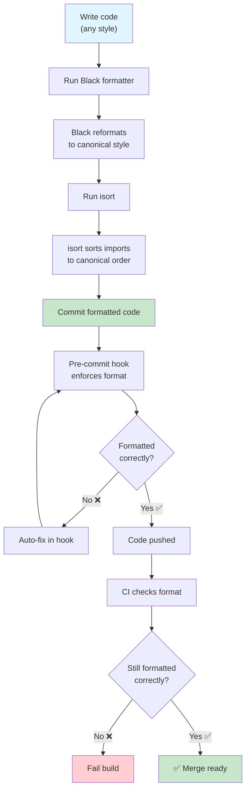
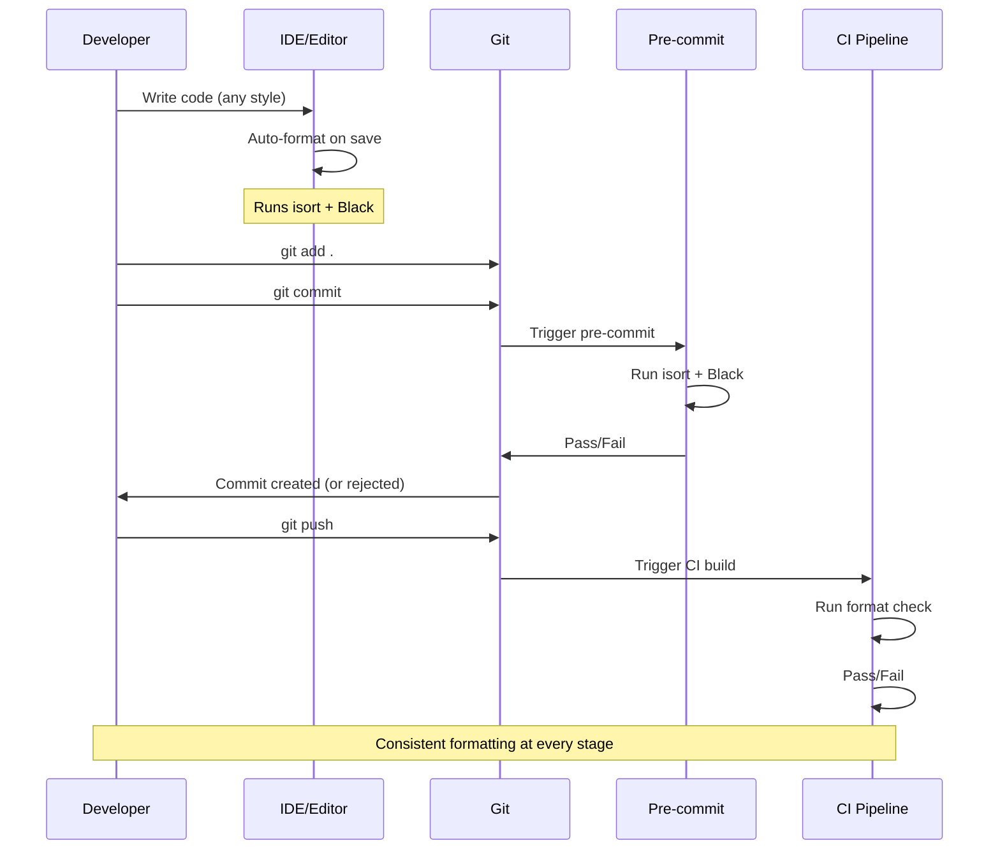

# Code Formatting

Code formatting is the most debated yet least important aspect of programming — which is exactly why it should be **automated**. Formatters like Black and isort eliminate formatting discussions entirely by enforcing a consistent, machine-readable style.

## Why Automate Formatting?

| Problem | Manual Formatting | Automated Formatting |
|---------|------------------|---------------------|
| **Bike-shedding** | "Tabs vs spaces?" debate for hours | The formatter decides |
| **Inconsistency** | Each file looks different | Every file follows the same rules |
| **Diff pollution** | Real changes mixed with formatting | Only meaningful changes in diffs |
| **Code review** | 30% of comments about formatting | 100% about logic |
| **Onboarding** | "Our style guide is..." | "Run `make format`" |



## Black: The Uncompromising Formatter

Black is "the uncompromising Python code formatter." It has very few configuration options by design — it produces consistent output no matter who runs it.

### Installation

```bash
# Install Black
pip install black

# Check version
black --version

# Format a file or directory
black src/main.py
black src/ tests/

# Check if files need formatting (without changing)
black --check src/ tests/

# See what would change (diff mode)
black --diff src/main.py

# Format with specific line length
black --line-length=100 src/

# Fast mode (skip AST validation)
black --fast src/
```

### Black Configuration

```toml
# pyproject.toml
[tool.black]
line-length = 100
target-version = ["py312"]
include = '\.pyi?$'
extend-exclude = '''
/(
    \.eggs
  | \.git
  | \.hg
  | \\.mypy_cache
  | \\.tox
  | \\.venv
  | _build
  | buck-out
  | build
  | dist
  | migrations
)/
'''

# setup.cfg (alternative)
[black]
line_length = 100
target_version = py312
include = \.pyi?$
extend-exclude = \.eggs|\.git|\.hg|\.mypy_cache|\.tox|\.venv|_build|buck-out|build|dist
```

### Before and After Black

```python
# BEFORE: Inconsistent formatting
def calculate_total(items,discount=0):
    total=sum(item['price']*item.get('qty',1) for item in items)
    if discount>0:
        total=total-(total*discount)
    return round(total,2)

def process_data(
    data,transform=None,
    validate=True):
    result=[]
    for d in data:
        if validate and not is_valid(d):continue
        v = transform(d) if transform else d
        result.append(v)
    return result
```

```python
# AFTER: Black formatted
def calculate_total(items, discount=0):
    total = sum(item["price"] * item.get("qty", 1) for item in items)
    if discount > 0:
        total = total - (total * discount)
    return round(total, 2)


def process_data(data, transform=None, validate=True):
    result = []
    for d in data:
        if validate and not is_valid(d):
            continue
        v = transform(d) if transform else d
        result.append(v)
    return result
```

### Black Transformations

| Pattern | Before Black | After Black |
|---------|-------------|-------------|
| Spaces | `x=1+2` | `x = 1 + 2` |
| Quotes | `x = 'hello'` | `x = "hello"` |
| Parentheses | `result = (1 + 2) * 3` | `result = (1 + 2) * 3` |
| Line breaks (long) | `x = some_func(arg1, arg2, ...)` (over 88 chars) | Multi-line formatting |
| Trailing commas | `func(a, b, c)` | `func(a, b, c)` (adds commas in multi-line) |
| Blank lines | Inconsistent spacing | Exactly 2 before functions/classes |
| Magic trailing comma | `func(a,b,)` | Preserves and uses for vertical formatting |

### Magic Trailing Comma

```python
# Black uses trailing commas to decide formatting style

# Without trailing comma → Black puts everything on one line
result = calculate_complex_thing(arg1, arg2, arg3)

# With trailing comma → Black expands vertically
result = calculate_complex_thing(
    arg1,
    arg2,
    arg3,
)

# Use trailing comma to control formatting
items = [
    "apple",
    "banana",
    "orange",
    "grape",  # ← trailing comma forces vertical layout
]
```

## isort: Import Organization

isort sorts and groups imports according to a standard convention.

### Installation

```bash
# Install isort
pip install isort

# Sort imports for a file
isort src/main.py

# Check if imports need sorting
isort --check-only src/

# Show diff of changes
isort --diff src/main.py

# Sort entire project
isort src/ tests/

# Generate a configuration file
isort --print-settings > .isort.cfg
```

### isort Configuration

```toml
# pyproject.toml
[tool.isort]
profile = "black"
line_length = 100
multi_line_output = 3
include_trailing_comma = true
force_grid_wrap = 0
use_parentheses = true
ensure_newline_before_comments = true
sections = ["FUTURE", "STDLIB", "THIRDPARTY", "FIRSTPARTY", "LOCALFOLDER"]
known_first_party = ["src"]
known_third_party = ["django", "pytest", "requests", "numpy"]
skip = ["migrations", ".venv"]
```

### isort Import Sections

isort organizes imports into sections separated by blank lines:

```python
# Standard library
import os
import sys
from datetime import datetime
from pathlib import Path

# Third-party libraries (blank line)
import pytest
import requests
from django.db import models
from numpy import array

# First-party / project modules (blank line)
from src.models import User
from src.services import PaymentService

# Local folder (blank line)
from .utils import helpers
from ..config import settings
```

### Before and After isort

```python
# BEFORE: Messy imports
from django.db import models
import sys, os
from ..config import settings
import requests
from datetime import datetime
import pytest
from src.models import User
from pathlib import Path
from .utils import helpers
import numpy
```

```python
# AFTER: isort sorted
import os
import sys
from datetime import datetime
from pathlib import Path

import numpy
import pytest
import requests
from django.db import models

from src.models import User

from .utils import helpers
from ..config import settings
```

## Black + isort Integration

### Pre-Commit Configuration

```yaml
# .pre-commit-config.yaml
repos:
  - repo: https://github.com/psf/black
    rev: 24.4.2
    hooks:
      - id: black
        args: [--line-length=100]
        language_version: python3.12

  - repo: https://github.com/pycqa/isort
    rev: 5.13.2
    hooks:
      - id: isort
        args: [--profile, black, --line-length=100]
```

### Order Matters!

Run isort **before** Black — or configure isort with `profile = "black"`:

```bash
# Correct order: isort first, then black
isort src/ && black src/

# Or use the black profile in isort
# isort will respect Black's formatting
isort --profile black src/
```

```yaml
# Makefile
.PHONY: format

format:
	isort --profile black src/ tests/
	black --line-length 100 src/ tests/

format-check:
	isort --check-only --profile black src/ tests/
	black --check --line-length 100 src/ tests/
```

## Advanced Formatting Patterns

### String Normalization with Black

```python
# Black normalizes string quotes (double quotes preferred)
message = 'Hello, World!'  # → message = "Hello, World!"

# But preserves triple-quoted strings
docstring = """This is a docstring."""  # Stays as-is

# Escaped quotes are handled
text = "She said, \"Hello\""  # → text = 'She said, "Hello"'
```

### Line Length Strategies

```python
# Strategy 1: Let Black break long lines
def process_data(data, transform=None, validate=True, cache_results=False):
    # Black handles this automatically based on line length setting
    pass

# Strategy 2: Use trailing comma for vertical formatting
important_result = some_function(
    argument_one,
    argument_two,
    argument_three,
    argument_four,
)

# Strategy 3: Parenthesize for explicit line breaks
result = (
    first_operand
    + second_operand
    - third_operand
    * fourth_operand
)
```

### Formatting Python 3.12+ Features

```python
# Type parameter syntax (Python 3.12)
def first[T](items: list[T]) -> T:
    return items[0]

# Match statement formatting
def process_status(status: int) -> str:
    match status:
        case 200:
            return "OK"
        case 404:
            return "Not Found"
        case 500:
            return "Server Error"
        case _:
            return "Unknown"

# Exception groups
try:
    do_something()
except* ValueError as eg:
    for e in eg.exceptions:
        handle_value_error(e)
```

## Formatting in CI

```yaml
# .github/workflows/format.yml
name: Formatting Check

on: [pull_request]

jobs:
  format:
    runs-on: ubuntu-latest
    steps:
      - uses: actions/checkout@v4
      - uses: actions/setup-python@v5
        with:
          python-version: '3.12'

      - name: Install formatters
        run: |
          pip install black isort

      - name: Check formatting with isort
        run: |
          isort --check-only --diff --profile black src/ tests/

      - name: Check formatting with Black
        run: |
          black --check --diff --line-length 100 src/ tests/

      - name: Show formatting errors
        if: failure()
        run: |
          echo "❌ Formatting issues found. Run:"
          echo "  isort --profile black src/ tests/"
          echo "  black --line-length 100 src/ tests/"
```

## Alternative Formatters

| Formatter | Style | Configuration | Speed |
|-----------|-------|---------------|-------|
| **Black** | Uncompromising | Very few options | Fast |
| **autopep8** | PEP 8 compliant | Many options | Moderate |
| **yapf** | Pluggable | Extensive options | Moderate |
| **ruff format** | Black-compatible | Few options | Very fast |

```bash
# autopep8
pip install autopep8
autopep8 --in-place --aggressive --aggressive src/

# yapf
pip install yapf
yapf --in-place --recursive src/

# ruff format
pip install ruff
ruff format src/
```

### Ruff Format as Black Replacement

Ruff's formatter is a drop-in replacement for Black:

```bash
# Ruff format (Black-compatible, much faster)
ruff format src/ tests/

# Check only
ruff format --check src/ tests/

# Show diff
ruff format --diff src/ tests/

# In pyproject.toml
[tool.ruff.format]
quote-style = "double"
indent-style = "space"
line-ending = "lf"
docstring-code-format = true
```

```toml
# pyproject.toml — ruff as the sole formatter
[tool.ruff]
line-length = 100
target-version = "py312"

[tool.ruff.format]
quote-style = "double"
indent-style = "space"
line-ending = "lf"
docstring-code-format = true
docstring-code-line-length = "dynamic"

[tool.ruff.lint]
select = ["I"]
# isort rules enabled for import sorting via ruff
```

```yaml
# Pre-commit with ruff for both lint and format
repos:
  - repo: https://github.com/astral-sh/ruff-pre-commit
    rev: v0.4.8
    hooks:
      - id: ruff
        args: [--fix, --exit-non-zero-on-fix]
      - id: ruff-format
```

> [!TIP]
> If you're starting a new project, use **ruff** for both linting AND formatting. It's faster than Black + isort combined and fully compatible. For existing projects, Black + isort is the safer migration path.

## Formatting Workflow



## Practice Exercises

1. **Install and Run Black**: Install Black and format a messy Python file. Use `--diff` to see what changed. Use `--check` to verify formatting without modifying files.

2. **Configure Black**: Set up pyproject.toml with Black configuration. Set line length to 100, target Python 3.12, and exclude migrations and virtual environments.

3. **isort Profiles**: Create an isort configuration with `profile = "black"`. Create a file with deliberately scrambled imports and verify isort organizes them correctly.

4. **The Magic Trailing Comma**: Write a function with 8 parameters. Format it with Black without trailing commas, then add a trailing comma and format again. Observe the difference in formatting.

5. **Formatting in Pre-Commit**: Add Black and isort as pre-commit hooks. Configure them so that formatting is automatically applied on every commit. Test by writing unformatted code and committing.

6. **CI Formatting Gate**: Create a GitHub Actions workflow that checks formatting on every PR. The build should fail if any file is not properly formatted. Include instructions in the error message on how to fix.

7. **Ruff as Formatter**: Migrate a project from Black + isort to using ruff for both linting AND formatting. Compare the configuration size and execution speed.

8. **Team Formatting Convention**: Your team of 10 developers disagrees on formatting. Write a proposal that includes: (a) why automated formatting is better than manual, (b) which tool to use and why, (c) the exact configuration, (d) how to integrate into the workflow.

## Summary

- **Black** is the uncompromising formatter — minimal config, consistent output
- **isort** organizes imports into standard sections (stdlib, third-party, first-party)
- **Always run isort before Black** — or configure isort with `profile = "black"`
- **The magic trailing comma** controls vertical vs horizontal layout in Black
- **Pre-commit hooks** automate formatting before code is committed
- **CI checks** ensure formatting is never forgotten
- **Ruff format** is a faster, drop-in replacement for Black
- **Consistency beats perfection** — any automated format is better than manual formatting debates

> [!SUCCESS]
> Automated formatting eliminates entire categories of code review comments. With Black and isort, your team spends zero time on formatting debates and 100% of review energy on what matters: logic, architecture, and correctness.
