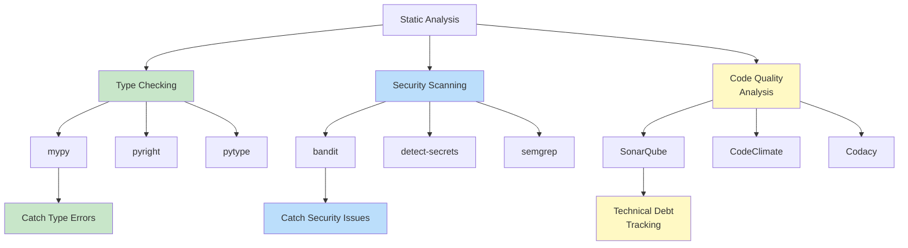
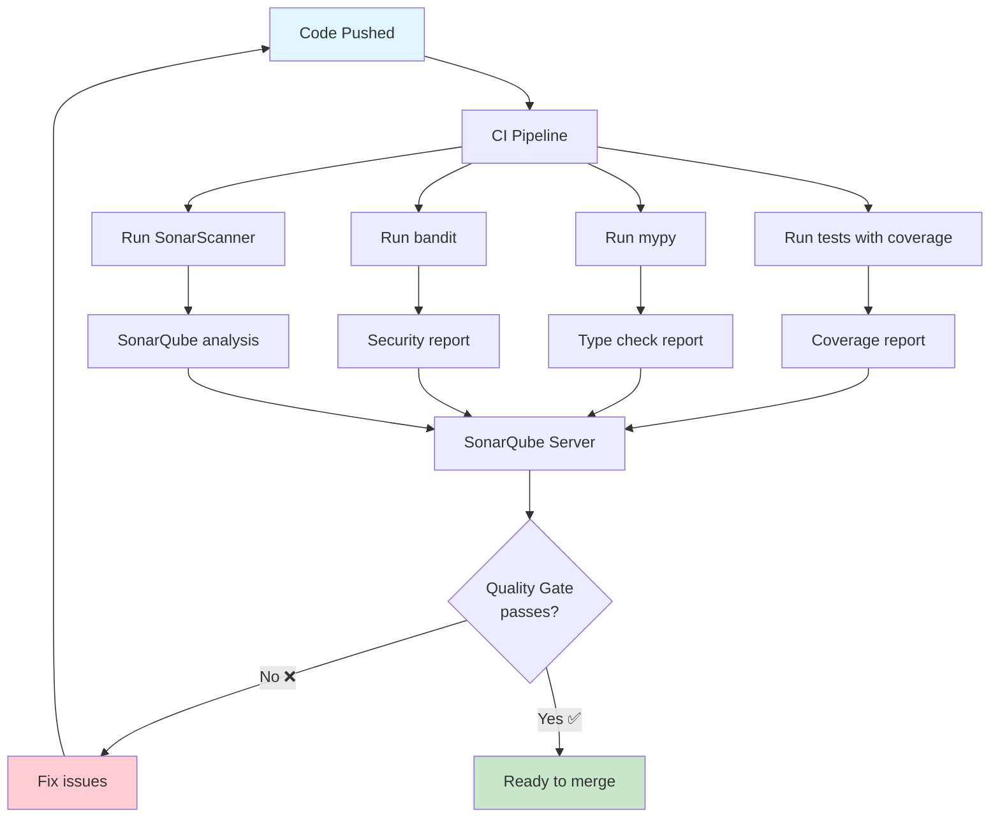

# Static Analysis & Code Scanning

Static analysis examines your code **without running it** to find bugs, security vulnerabilities, type errors, and code quality issues. Unlike linters (which enforce style), static analyzers find **real potential bugs** in your logic.

## Types of Static Analysis



| Tool | Purpose | Finds | Speed |
|------|---------|-------|-------|
| **mypy** | Type checking | Type mismatches, None safety, missing returns | Moderate |
| **bandit** | Security scanning | SQL injection, hardcoded passwords, unsafe eval | Fast |
| **SonarQube** | Comprehensive quality | Bugs, vulnerabilities, code smells, duplication | Slow |

## Type Checking with mypy

mypy is the standard static type checker for Python. It verifies that your type annotations are consistent with how the code actually uses values.

### Installation

```bash
# Install mypy
pip install mypy

# Install type stubs for libraries
pip install types-requests types-PyYAML types-python-dateutil

# Run mypy on a file
mypy src/main.py

# Run mypy on a module
mypy src

# Run mypy with strict mode
mypy --strict src/

# Generate a configuration file
mypy --generate-config
```

### Basic mypy Configuration

```toml
# pyproject.toml
[tool.mypy]
python_version = "3.12"
strict = true
ignore_missing_imports = true
disallow_untyped_defs = true
disallow_any_unimported = false
no_implicit_optional = true
warn_redundant_casts = true
warn_unused_ignores = true
warn_return_any = true
warn_unreachable = true

exclude = [
    "migrations/",
    "build/",
    ".venv/",
    "tests/",
]

[[tool.mypy.overrides]]
module = "tests.*"
disallow_untyped_defs = false
ignore_missing_imports = true
```

### mypy in Action

```python
# BEFORE: No type annotations (mypy cannot help)
def process_user(user_data):
    name = user_data["name"]
    age = user_data["age"]
    return f"{name} is {age} years old"


def calculate_discount(price, percentage):
    return price * percentage
```

```python
# AFTER: With type annotations (mypy catches errors)
from typing import Protocol, Any


class UserData(Protocol):
    name: str
    age: int


def process_user(user_data: UserData) -> str:
    name: str = user_data.name
    age: int = user_data.age
    return f"{name} is {age} years old"


def calculate_discount(price: float, percentage: float) -> float:
    return price * percentage
```

### Common mypy Errors

```python
from typing import Optional, Union, Any, Callable


# Error 1: None safety
def get_user_name(user_id: int) -> Optional[str]:
    if user_id == 1:
        return "Alice"
    return None


def process_user(user_id: int) -> str:
    name = get_user_name(user_id)
    # ERROR: Argument 1 to "len" has incompatible type "Optional[str]"; expected "str"
    return f"User: {name.upper()}"  # mypy error!
    # Fix: name = get_user_name(user_id) or "Unknown"
    #       name.upper()


# Error 2: Type mismatch
def add(a: int, b: int) -> int:
    return a + b


result = add(1, "2")  # mypy error: Argument 2 to "add" has incompatible type "str"; expected "int"


# Error 3: Missing return
def validate_age(age: int) -> bool:
    if age < 0:
        return False
    # ERROR: Missing return statement
    # Fix: return age >= 0


# Error 4: Incompatible return type
def get_item(items: list[int], index: int) -> int:
    if index < len(items):
        return items[index]
    return None  # mypy error: Incompatible return value type "None"; expected "int"
    # Fix: return -1 or use Optional[int]


# Error 5: Any type leak
def process(data: Any) -> str:
    return data  # mypy warns about returning Any unless silenced
```

### Gradual Typing Strategy

```python
# Stage 1: Function signatures only (most value)
def create_user(name: str, email: str) -> User:
    ...

# Stage 2: Add return types everywhere
def find_user(user_id: int) -> Optional[User]:
    ...

# Stage 3: Full annotations (internal variables too)
def calculate_total(items: list[Item]) -> float:
    total: float = 0.0
    for item in items:
        total += item.price * item.quantity
    return total
```

### Type Stubs for External Libraries

```bash
# Types for popular libraries
pip install types-requests
pip install types-PyYAML
pip install types-python-dateutil
pip install types-beautifulsoup4
pip install types-redis
pip install types-pytz
```

```python
# With types-requests installed, mypy checks this:
import requests


def fetch_data(url: str) -> dict:
    response = requests.get(url)
    response.raise_for_status()
    return response.json()  # Correctly typed as dict
```

### mypy Strict Mode Flags

| Flag | What It Does |
|------|-------------|
| `--strict` | Enables all strict flags below |
| `--disallow-untyped-defs` | All functions must have type annotations |
| `--disallow-incomplete-defs` | Partial annotations not allowed (e.g., `def f(x)` without typing `x`) |
| `--disallow-untyped-calls` | Cannot call functions without type annotations |
| `--no-implicit-optional` | `Optional[T]` must be explicit |
| `--warn-redundant-casts` | Warns about unnecessary `cast()` calls |
| `--warn-unused-ignores` | Warns about unused `# type: ignore` comments |
| `--warn-return-any` | Warns when function returns inferred `Any` |
| `--warn-unreachable` | Warns about unreachable code |

## Security Scanning with bandit

Bandit finds common security issues in Python code.

### Installation

```bash
# Install bandit
pip install bandit

# Run bandit on a file
bandit -r src/

# Run with specific severity/confidence
bandit -r src/ -ll  # Only medium+ severity
bandit -r src/ -iii # Only medium+ confidence

# Generate HTML report
bandit -r src/ -f html -o bandit_report.html

# Generate JSON report
bandit -r src/ -f json -o bandit_report.json

# Use a baseline (skip known issues)
bandit -r src/ -b .bandit_baseline.json
```

### Bandit Configuration

```ini
# .bandit
[bandit]
exclude: tests,.venv,migrations
tests: B101,B102,B301,B302,B303,B304,B305,B306,B307,B308,B309,B310,B311,B312,B313,B314,B315,B316,B317,B318,B319,B320,B321,B322,B323,B324,B325,B326,B327,B328,B329,B330,B331,B332,B333,B334,B335,B336,B337,B338,B339,B340,B341,B342,B343,B344,B345,B346,B347,B348,B349,B350,B351,B352,B353,B354,B355,B356,B357,B358,B359,B360,B361,B362,B363,B364,B365,B366,B367,B368,B369,B370,B371,B372,B373,B374,B375,B376,B377,B378,B379,B380,B381,B382,B383,B384,B385,B386,B387,B388,B389,B390,B391,B392,B393,B394,B395,B396,B397,B398,B399,B400,B401,B402,B403,B404,B405,B406,B407,B408,B409,B410,B411,B412,B413,B414,B415,B416,B417,B418,B419,B420,B421,B422,B423,B424,B425,B426,B427,B428,B429,B430,B431,B432,B433,B434,B435,B436,B437,B438,B439,B440,B441,B442,B443,B444,B445,B446,B447,B448,B449,B450,B451,B452,B453,B454,B455,B456,B457,B458,B459,B460,B461,B462,B463,B464,B465,B466,B467,B468,B469,B470,B471,B472,B473,B474,B475,B476,B477,B478,B479,B480,B481,B482,B483,B484,B485,B486,B487,B488,B489,B490,B491,B492,B493,B494,B495,B496,B497,B498,B499,B500
skips: B101,B311
```

### Bandit Security Issues

```python
import hashlib
import subprocess
import os

# B102: exec() usage (dangerous)
exec("print('hello')")  # BANDIT: B102

# B201: subprocess with shell=True
subprocess.call("ls -la", shell=True)  # BANDIT: B201

# B303: MD5 used for password
hashlib.md5(b"password")  # BANDIT: B303

# B105: Hardcoded password
password = "super_secret_123"  # BANDIT: B105

# B106: Hardcoded API key
API_KEY = "sk-abc123def456"  # BANDIT: B106

# B108: Temp file in insecure location
file_path = "/tmp/data.txt"  # BANDIT: B108

# B110: Bare except (catches all exceptions)
try:
    do_something()
except:  # BANDIT: B110
    pass

# B112: Try/except/pass
try:
    do_something()
except ValueError:
    pass  # BANDIT: B112

# B301: Pickle (dangerous deserialization)
import pickle
data = pickle.loads(unsafe_data)  # BANDIT: B301

# B320: SQL injection risk
cursor.execute("SELECT * FROM users WHERE id = " + user_input)  # BANDIT: B320
```

### Writing Secure Code (Bandit-Safe)

```python
import secrets
import hashlib
import subprocess
from typing import Optional


# ✅ Safe: Use environment variables for secrets
DATABASE_PASSWORD = os.environ.get("DATABASE_PASSWORD")
if not DATABASE_PASSWORD:
    raise ValueError("DATABASE_PASSWORD not set")


# ✅ Safe: Use parameterized queries
def get_user(user_id: int) -> Optional[dict]:
    cursor.execute("SELECT * FROM users WHERE id = ?", (user_id,))
    return cursor.fetchone()


# ✅ Safe: Use subprocess without shell
def list_directory(path: str) -> list[str]:
    result = subprocess.run(
        ["ls", "-la", path],
        capture_output=True,
        text=True,
        check=True,
    )
    return result.stdout.splitlines()


# ✅ Safe: Use secrets module for security-sensitive randomness
def generate_reset_token() -> str:
    return secrets.token_hex(32)


# ✅ Safe: Use hashlib securely
def hash_password(password: str) -> str:
    salt = secrets.token_hex(16)
    return hashlib.pbkdf2_hmac("sha256", password.encode(), salt.encode(), 100000).hex()


# ✅ Safe: Use context managers for files
def read_config(path: str) -> str:
    with open(path) as f:
        return f.read()
```

### Bandit CI Integration

```yaml
# .github/workflows/security.yml
name: Security Scan

on: [pull_request, push]

jobs:
  security:
    runs-on: ubuntu-latest
    steps:
      - uses: actions/checkout@v4
      - uses: actions/setup-python@v5
        with:
          python-version: '3.12'

      - name: Install bandit
        run: pip install bandit

      - name: Run bandit security scan
        run: |
          bandit -r src/ -ll -f json -o bandit_report.json || true

      - name: Upload report
        uses: actions/upload-artifact@v4
        with:
          name: bandit-report
          path: bandit_report.json

      - name: Fail on high severity issues
        run: |
          HIGH_ISSUES=$(python -c "
          import json
          with open('bandit_report.json') as f:
              data = json.load(f)
          high = [r for r in data.get('results', []) 
                  if r.get('issue_severity') == 'HIGH']
          print(f'High severity issues: {len(high)}')
          for r in high:
              print(f'  - {r[\"test_id\"]}: {r[\"issue_text\"]} at {r[\"filename\"]}:{r[\"line_number\"]}')
          exit(1 if high else 0)
          ")
```

## SonarQube: Comprehensive Quality Analysis

SonarQube provides a dashboard for tracking code quality over time, including bugs, vulnerabilities, code smells, and technical debt.

### Running SonarQube Locally

```bash
# Run SonarQube with Docker
docker run -d --name sonarqube \
  -p 9000:9000 \
  sonarqube:community

# Install SonarScanner
pip install sonar-scanner

# Run analysis
sonar-scanner \
  -Dsonar.projectKey=my_project \
  -Dsonar.sources=src \
  -Dsonar.tests=tests \
  -Dsonar.python.coverage.reportPaths=coverage.xml \
  -Dsonar.host.url=http://localhost:9000 \
  -Dsonar.login=your_token
```

### sonar-project.properties

```properties
# sonar-project.properties
sonar.projectKey=my_python_project
sonar.projectName=My Python Project
sonar.projectVersion=1.0
sonar.sources=src
sonar.tests=tests
sonar.sourceEncoding=UTF-8
sonar.language=py
sonar.python.version=3.12

# Coverage
sonar.python.coverage.reportPaths=coverage.xml
sonar.python.xunit.reportPath=test-report.xml

# Exclusions
sonar.exclusions=**/migrations/**,**/__init__.py
sonar.test.exclusions=**/migrations/**

# Quality gates
sonar.qualitygate.wait=true
sonar.qualitygate.timeout=300

# Duplication
sonar.cpd.exclusions=**/migrations/**
```

### SonarQube Quality Metrics

| Metric | What It Measures | Target |
|--------|-----------------|--------|
| **Bugs** | Runtime errors and incorrect behavior | 0 |
| **Vulnerabilities** | Security weaknesses | 0 |
| **Code Smells** | Maintainability issues | Low |
| **Technical Debt** | Time to fix all issues | < 5% |
| **Duplications** | Repeated code blocks | < 3% |
| **Coverage** | Test coverage percentage | >= 80% |
| **Security Rating** | A-E based on vulnerabilities | A |
| **Reliability Rating** | A-E based on bugs | A |
| **Maintainability Rating** | A-E based on code smells | A |



## Comprehensive CI Workflow

```yaml
# .github/workflows/static-analysis.yml
name: Static Analysis

on:
  pull_request:
  push:
    branches: [main]

jobs:
  type-check:
    runs-on: ubuntu-latest
    steps:
      - uses: actions/checkout@v4
      - uses: actions/setup-python@v5
        with:
          python-version: '3.12'

      - name: Install dependencies
        run: |
          pip install -r requirements.txt
          pip install mypy types-requests types-PyYAML

      - name: Run mypy
        run: mypy src/ --strict

  security:
    runs-on: ubuntu-latest
    steps:
      - uses: actions/checkout@v4
      - uses: actions/setup-python@v5
        with:
          python-version: '3.12'

      - name: Install bandit
        run: pip install bandit

      - name: Run bandit
        run: bandit -r src/ -ll

  sonarqube:
    runs-on: ubuntu-latest
    steps:
      - uses: actions/checkout@v4
        with:
          fetch-depth: 0

      - uses: actions/setup-python@v5
        with:
          python-version: '3.12'

      - name: Install dependencies
        run: |
          pip install -r requirements.txt
          pip install pytest pytest-cov

      - name: Run tests with coverage
        run: |
          pytest --cov=src --cov-report=xml --junitxml=test-report.xml

      - name: SonarQube Scan
        uses: SonarSource/sonarqube-scan-action@v4
        env:
          SONAR_TOKEN: ${{ secrets.SONAR_TOKEN }}
        with:
          args: >
            -Dsonar.python.coverage.reportPaths=coverage.xml
            -Dsonar.python.xunit.reportPath=test-report.xml
```

## Practice Exercises

1. **mypy Setup**: Install mypy and configure it with `--strict` mode. Add type annotations to a Python file until mypy reports no errors. Start with a file that has no type annotations.

2. **Fix mypy Errors**: Given this code, fix all mypy errors:
   ```python
   def get_user(id):
       if id == 1:
           return {"name": "Alice", "age": 30}
       return None

   def process_user(user):
       return user["name"].upper()
   ```

3. **Bandit Security Audit**: Create a Python file with 5 common security vulnerabilities (hardcoded passwords, SQL injection, eval usage, shell injection, pickle). Run bandit and verify it catches all 5.

4. **Fix Security Issues**: Given the bandit findings from exercise 3, fix all security vulnerabilities following best practices. Verify bandit reports no issues after fixes.

5. **SonarQube Setup**: Run SonarQube locally using Docker. Configure a project and run SonarScanner on a Python project. Analyze the quality gate results.

6. **Gradual Typing**: Take a 200+ line Python module with no type annotations. Add type annotations gradually: first function signatures, then return types, then internal variables. Track how mypy catches issues at each stage.

7. **CI Integration**: Create a GitHub Actions workflow that runs mypy (strict mode) and bandit on every PR. The pipeline should fail if any type error exists or if bandit finds high-severity issues.

8. **Quality Gate Setup**: Configure SonarQube quality gates that require: 0 bugs, 0 vulnerabilities, at least 80% coverage, and less than 5% duplicated code. Then create a PR that violates one gate and verify it fails.

## Summary

- **mypy** catches type errors at compile time — the earlier the annotation, the more it helps
- **Strict mode** (`--strict`) is the most valuable — it forces complete annotations
- **bandit** finds security issues: hardcoded secrets, injection risks, unsafe APIs
- **SonarQube** provides comprehensive quality tracking: bugs, vulnerabilities, technical debt
- **CI integration** makes static analysis a mandatory part of the development process
- **Fix issues at the source** — don't suppress warnings without understanding them
- **Static analysis complements testing** — tests verify behavior, static analysis verifies code structure

> [!SUCCESS]
> Static analysis tools are your automated code reviewers. mypy checks your types, bandit checks your security, and SonarQube tracks your quality over time. Together, they catch what tests miss.
