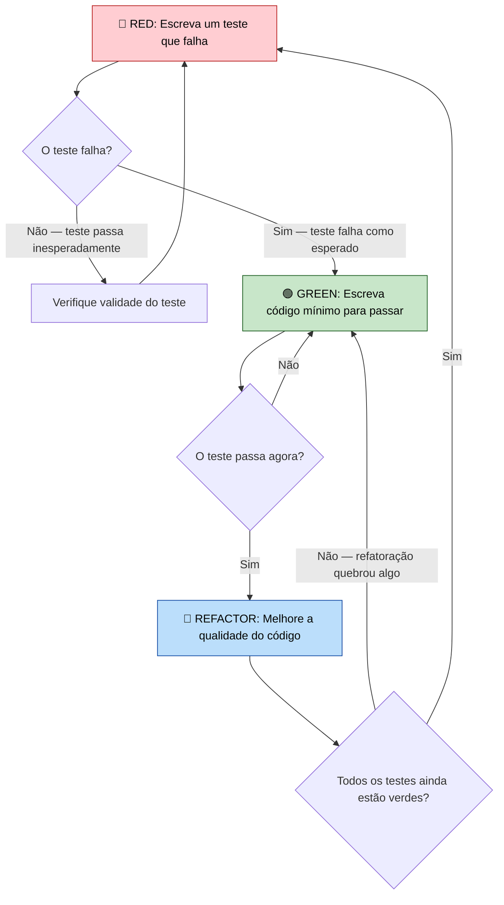
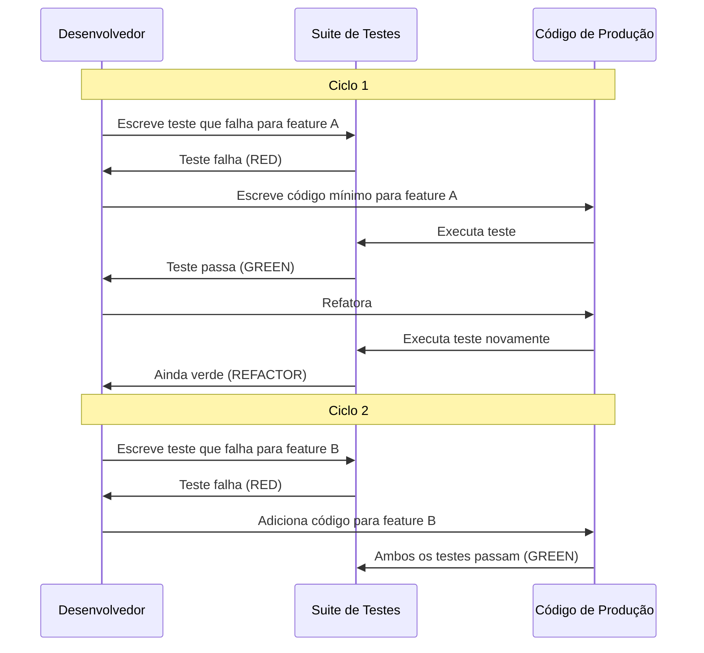
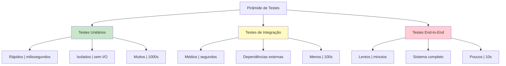

# Introdução ao TDD

Test-Driven Development (TDD) é uma abordagem de desenvolvimento de software onde você escreve os testes **antes** de escrever o código de produção. Este fluxo de trabalho invertido — teste primeiro, código depois — muda fundamentalmente como você projeta, implementa e verifica software.

## O Mantra do TDD: Red-Green-Refactor

O TDD segue um ciclo rápido e restrito com três fases:

| Fase | Ação | O que Acontece |
|------|------|----------------|
| 🔴 **Red** | Escreva um teste que falha | Pense no comportamento desejado primeiro. O teste falha porque nenhum código existe ainda. |
| 🟢 **Green** | Escreva o código mínimo para passar | Faça o teste passar o mais rápido possível. Sem superengenharia. |
| 🔵 **Refactor** | Melhore o código | Limpe duplicação, renomeie variáveis, extraia métodos. Os testes garantem segurança. |



> [!NOTE]
> Cada ciclo TDD deve durar de **30 segundos a 5 minutos**. Se você está gastando horas em um único ciclo, seus testes são muito grandes. Divida o problema em passos menores.

## Por que TDD? O Iceberg de Benefícios

O benefício visível do TDD é **menos bugs**, mas os benefícios mais profundos e valiosos estão abaixo da superfície:

| Camada | Benefício | Por Que Importa |
|--------|-----------|-----------------|
| **Superfície** | Menos defeitos | Testes capturam regressões imediatamente |
| **Design** | Melhor arquitetura | Testabilidade força acoplamento fraco |
| **Confiança** | Refatoração sem medo | Você pode reestruturar código sem preocupação |
| **Documentação** | Especificação viva | Testes descrevem como o sistema se comporta |
| **Velocidade** | Ritmo sustentável | Menos debugging significa mais funcionalidades |

```python
# Abordagem tradicional: código primeiro, talvez teste depois
def dividir(a, b):
    return a / b  # Bug: sem verificação de divisão por zero

# Abordagem TDD: teste primeiro, código depois
def test_dividir_por_zero():
    """Testa que divisão por zero levanta um erro."""
    import pytest
    with pytest.raises(ZeroDivisionError):
        dividir(10, 0)

def dividir(a, b):
    if b == 0:
        raise ZeroDivisionError("Não é possível dividir por zero")
    return a / b
```

> [!SUCCESS]
> TDD não é sobre testar — é sobre **design**. Escrever o teste primeiro força você a pensar na interface antes da implementação.

## As Três Leis do TDD

Robert C. Martin (Uncle Bob) formalizou o TDD com três leis:

1. **Lei 1**: Você não pode escrever código de produção até ter escrito um **teste unitário que falhe**.
2. **Lei 2**: Você não pode escrever mais de um teste unitário do que o suficiente para falhar — e **não compilar é falhar**.
3. **Lei 3**: Você não pode escrever mais código de produção do que o suficiente para passar no **teste que está falhando atualmente**.



## Exemplo Prático: TDD em Ação

Vamos construir uma classe `CarrinhoDeCompras` usando TDD, passo a passo.

### Ciclo 1: Criar um carrinho vazio

```python
# test_carrinho_compras.py
from carrinho_compras import CarrinhoDeCompras

def test_carrinho_vazio():
    """Um carrinho novo deve estar vazio."""
    carrinho = CarrinhoDeCompras()
    assert carrinho.total_itens() == 0
```

Execute: **Red** — `CarrinhoDeCompras` não existe ainda.

```python
# carrinho_compras.py
class CarrinhoDeCompras:
    def total_itens(self) -> int:
        return 0
```

Execute: **Green** — teste passa.

### Ciclo 2: Adicionar itens ao carrinho

```python
def test_adicionar_item():
    """Adicionar um item aumenta a contagem."""
    carrinho = CarrinhoDeCompras()
    carrinho.adicionar_item("maçã", 1.50)
    assert carrinho.total_itens() == 1

def test_adicionar_multiplos_itens():
    """Adicionar múltiplos itens aumenta a contagem."""
    carrinho = CarrinhoDeCompras()
    carrinho.adicionar_item("maçã", 1.50)
    carrinho.adicionar_item("banana", 0.75)
    assert carrinho.total_itens() == 2
```

Execute: **Red** — `adicionar_item` não existe.

```python
class CarrinhoDeCompras:
    def __init__(self):
        self._itens = []

    def adicionar_item(self, nome: str, preco: float) -> None:
        self._itens.append({"nome": nome, "preco": preco})

    def total_itens(self) -> int:
        return len(self._itens)
```

Execute: **Green** — todos os testes passam.

### Ciclo 3: Calcular o preço total

```python
def test_preco_total():
    """Preço total deve somar todos os preços dos itens."""
    carrinho = CarrinhoDeCompras()
    carrinho.adicionar_item("maçã", 1.50)
    carrinho.adicionar_item("banana", 0.75)
    assert carrinho.preco_total() == pytest.approx(2.25)

def test_carrinho_vazio_total():
    """Carrinho vazio deve ter total de 0."""
    carrinho = CarrinhoDeCompras()
    assert carrinho.preco_total() == 0.0
```

Execute: **Red** — `preco_total` não existe.

```python
class CarrinhoDeCompras:
    def __init__(self):
        self._itens = []

    def adicionar_item(self, nome: str, preco: float) -> None:
        self._itens.append({"nome": nome, "preco": preco})

    def total_itens(self) -> int:
        return len(self._itens)

    def preco_total(self) -> float:
        return sum(item["preco"] for item in self._itens)
```

Execute: **Green** — tudo passa.

### Refatorar: Melhorar o design

Agora refatoramos com confiança porque os testes nos protegem:

```python
from dataclasses import dataclass

@dataclass
class Item:
    nome: str
    preco: float

class CarrinhoDeCompras:
    def __init__(self):
        self._itens: list[Item] = []

    def adicionar_item(self, nome: str, preco: float) -> None:
        self._itens.append(Item(nome, preco))

    def total_itens(self) -> int:
        return len(self._itens)

    def preco_total(self) -> float:
        return sum(item.preco for item in self._itens)
```

> [!TIP]
> Use `pytest.approx()` para comparações de ponto flutuante. Nunca use `==` com floats devido a problemas de precisão.

## A Mentalidade TDD: Disciplina Sobre Inspiração

O TDD exige uma mudança em como você pensa sobre programação:

| Mentalidade Tradicional | Mentalidade TDD |
|------------------------|-----------------|
| Escreva código, depois teste | Escreva teste, depois código |
| Testar é uma fase separada | Testar é parte do desenvolvimento |
| Design grande upfront | Design emergente através de testes |
| Medo de refatorar | Confiança para refatorar livremente |
| Testes provam que o código funciona | Testes definem o que o código deve fazer |
| "Vou escrever testes depois" | "Vou escrever o teste agora" |

### Objeções Comuns e Respostas

| Objeção | Resposta |
|---------|----------|
| "Isso me atrasa" | Inicialmente sim. Após 2-3 semanas, você fica mais rápido porque depura menos. |
| "Não sei o que testar" | Teste o comportamento, não a implementação. Pergunte: "O que esta função deve fazer?" |
| "Meu código não é testável" | Isso é um cheiro de design. TDD naturalmente leva a designs testáveis. |
| "Testes demoram para escrever" | Um bom teste TDD leva 30-60 segundos. Se demorar mais, você está testando no nível errado. |
| "Meu gerente não permite" | Não anuncie. Apenas faça. Eles notarão menos bugs. |

## Tipos de Testes no Ecossistema TDD



| Tipo de Teste | Velocidade | Escopo | Papel no TDD |
|--------------|-----------|--------|-------------|
| **Unitário** | Milissegundos | Função/classe única | Alvo principal do TDD |
| **Integração** | Segundos | Limites de módulo | Verificar interações |
| **End-to-End** | Minutos | Sistema completo | Validar fluxos de trabalho |

> [!WARNING]
> Não confunda TDD com "escrever muitos testes". TDD é sobre **escrever o teste certo na hora certa**. Um único ciclo TDD bem escrito vale mais que uma dúzia de testes escritos depois.

## O Ritmo Red-Green-Refactor na Prática

Vamos traçar uma sessão completa construindo um `ConversorTemperatura`:

```python
# --- 🔴 RED: Escrever teste que falha ---
def test_celsius_para_fahrenheit():
    conversor = ConversorTemperatura()
    resultado = conversor.celsius_para_fahrenheit(100)
    assert resultado == 212.0

# Teste falha: ConversorTemperatura não definido

# --- 🟢 GREEN: Escrever código mínimo ---
class ConversorTemperatura:
    def celsius_para_fahrenheit(self, celsius):
        return celsius * 9 / 5 + 32

# Teste passa

# --- 🔵 REFACTOR: Melhorar ---
# Nenhuma refatoração necessária ainda. Avance para o próximo teste.

# --- 🔴 RED: Escrever próximo teste ---
def test_fahrenheit_para_celsius():
    conversor = ConversorTemperatura()
    resultado = conversor.fahrenheit_para_celsius(212)
    assert resultado == 100.0

# Teste falha: fahrenheit_para_celsius não definido

# --- 🟢 GREEN ---
class ConversorTemperatura:
    def celsius_para_fahrenheit(self, celsius):
        return celsius * 9 / 5 + 32

    def fahrenheit_para_celsius(self, fahrenheit):
        return (fahrenheit - 32) * 5 / 9

# Ambos os testes passam

# --- 🔴 RED: Testar caso extremo ---
def test_zero_absoluto():
    conversor = ConversorTemperatura()
    resultado = conversor.celsius_para_fahrenheit(-273.15)
    assert resultado == -459.67

# --- 🟢 GREEN ---
# Já passa! O código existente lida com valores negativos.

# --- 🔵 REFACTOR: Extrair constante ---
ZERO_ABSOLUTO_C = -273.15
CONGELAMENTO_C = 0.0
EBULICAO_C = 100.0

class ConversorTemperatura:
    def celsius_para_fahrenheit(self, celsius):
        return celsius * 9 / 5 + 32

    def fahrenheit_para_celsius(self, fahrenheit):
        return (fahrenheit - 32) * 5 / 9

    def esta_acima_do_zero_absoluto(self, celsius):
        return celsius >= ZERO_ABSOLUTO_C
```

> [!SUCCESS]
> Cada ciclo TDD produziu um incremento claro e testável. Após 3 ciclos, temos um conversor robusto com 3 testes passando e código limpo.

## Convenções de Nomenclatura de Testes

Bons nomes de teste comunicam intenção. Siga estes padrões:

| Convenção | Exemplo |
|-----------|---------|
| `test_[funcionalidade]` | `test_adicionar_item()` |
| `test_[cenário]_[esperado]` | `test_carrinho_vazio_retorna_zero()` |
| `test_[método]_[condição]_[resultado]` | `test_dividir_por_zero_levanta_erro()` |
| `test_dado_[contexto]_quando_[ação]_então_[resultado]` | `test_dado_saldo_negativo_quando_sacar_então_erro()` |

```python
# Bons nomes de teste — eles contam uma história
def test_usuario_autenticado_pode_ver_perfil():
    pass

def test_usuario_nao_autenticado_redirecionado_para_login():
    pass

def test_usuario_admin_ve_botao_excluir():
    pass

def test_usuario_normal_nao_ve_botao_excluir():
    pass
```

## Exercícios Práticos

1. **TDD um Inversor de String**: Escreva testes primeiro para uma função `inverter_string(s)`. Comece com string vazia, depois um caractere, depois múltiplos caracteres, depois palíndromo.

2. **TDD um Verificador de Número Primo**: Use TDD para construir `eh_primo(n)`. Comece com o caso mais simples (`n=2`), depois casos extremos (`n=1`, `n=0`, números negativos).

3. **TDD uma Implementação de FizzBuzz**: TDD o clássico FizzBuzz. Escreva testes para múltiplos de 3, múltiplos de 5, múltiplos de ambos, e não múltiplos.

4. **TDD Carrinho de Compras com Desconto**: Estenda a classe `CarrinhoDeCompras`. Escreva testes para 10% de desconto quando total > R$100, depois implemente para passar.

5. **Identifique o Cheiro de Teste**: Dado este teste, identifique o que está errado e corrija:
   ```python
   def test_adicionar():
       resultado = adicionar(2, 3)
       resultado = adicionar(5, 7)
       assert resultado == 12
   ```

6. **Refatore Sem Testes**: Esta função funciona mas é mal estruturada. Escreva testes primeiro, depois refatore:
   ```python
   def processar_dados(itens):
       r = []
       for i in itens:
           if i > 0:
               r.append(i * 2)
           else:
               r.append(i * -1)
       return r
   ```

7. **TDD uma Calculadora Simples**: Usando TDD, construa uma classe `Calculadora` com métodos `adicionar`, `subtrair`, `multiplicar`, `dividir`. Teste casos normais e extremos (divisão por zero, números negativos).

8. **Reflexão de Mentalidade**: Descreva como sua abordagem para programar muda quando você escreve testes primeiro. O que parece diferente? O que é mais difícil? O que é mais fácil?

## Resumo

- **TDD = Red → Green → Refactor**: Um ciclo rápido e disciplinado
- **Testes primeiro, código depois**: O teste define o que "pronto" significa
- **Três leis**: Escreva apenas teste suficiente para falhar, apenas código suficiente para passar
- **Benefícios**: Melhor design, menos bugs, refatoração sem medo, documentação viva
- **Mudança de mentalidade**: Testar é design, não verificação
- **Pirâmide de testes**: Testes unitários são rápidos e abundantes; testes E2E são lentos e poucos

> [!SUCCESS]
> TDD é um superpoder. Transforma programar de "será que funciona?" para "eu sei que funciona." A disciplina de escrever testes primeiro paga dividendos exponenciais à medida que seu projeto cresce.
