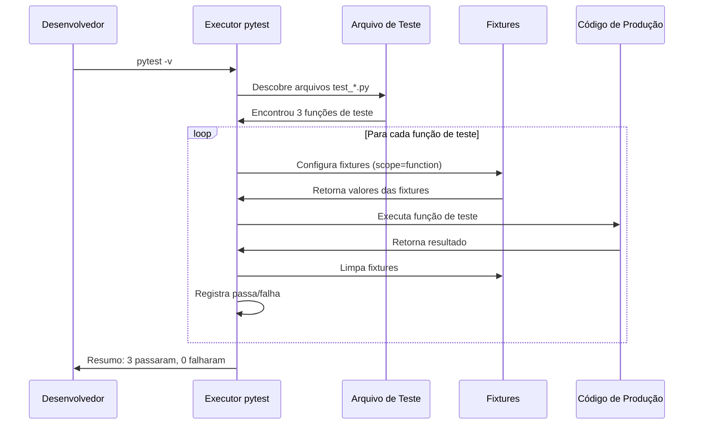
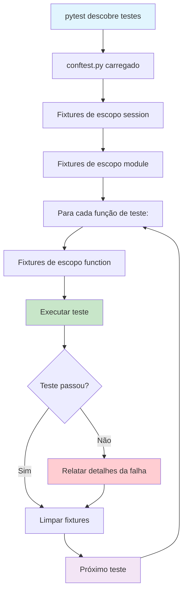

# Escrevendo Seus Primeiros Testes

Agora que você entende a mentalidade TDD, é hora de escrever testes reais. Usaremos **pytest** — o framework de teste mais popular para Python — para construir uma base sólida de testes.

## Por que pytest?

| Funcionalidade | pytest | unittest (nativo) |
|---------------|--------|-------------------|
| Sintaxe | Asserts `assert` simples | `self.assertEqual()`, `self.assertTrue()` |
| Fixtures | Modulares, injeção de dependência | Métodos `setUp()` / `tearDown()` |
| Descoberta | Automática por convenção de nome | Definição manual de suite |
| Plugins | Ecossistema de 1000+ plugins | Extensões nativas limitadas |
| Parametrização | `@pytest.mark.parametrize` | `subTest()` ou loops manuais |
| Introspecção | Mensagens de falha detalhadas | Passa/falha básico |

```python
# Estilo unittest (nativo)
import unittest

class TestMatematica(unittest.TestCase):
    def test_adicionar(self):
        self.assertEqual(adicionar(2, 3), 5)
        self.assertEqual(adicionar(-1, 1), 0)

# Estilo pytest (mais limpo)
def test_adicionar():
    assert adicionar(2, 3) == 5
    assert adicionar(-1, 1) == 0
```

## Configurando o pytest

```bash
# Instalar pytest
pip install pytest

# Verificar instalação
pytest --version

# Executar testes no diretório atual
pytest

# Executar com saída verbosa
pytest -v

# Executar um arquivo de teste específico
pytest test_calculadora.py -v

# Parar no primeiro erro
pytest -x

# Executar testes correspondendo a um padrão
pytest -k "calculadora"
```

### Estrutura do Projeto

Organize seus testes claramente:

```
projeto/
├── src/
│   ├── __init__.py
│   ├── calculadora.py
│   └── servico_usuario.py
├── tests/
│   ├── __init__.py
│   ├── test_calculadora.py
│   ├── test_servico_usuario.py
│   └── conftest.py              # Fixtures compartilhadas
├── setup.py
└── pytest.ini                   # Configuração do pytest
```

Crie um arquivo `pytest.ini` para configuração:

```ini
[pytest]
testpaths = tests
pythonpath = src
python_files = test_*.py
python_classes = Test*
python_functions = test_*
markers =
    lento: marca testes como lentos (desselecionar com '-m "not lento"')
    integracao: marca testes como testes de integração
    fumaca: marca testes como testes de fumaça
```

## Assertions Essenciais no pytest

pytest usa o `assert` nativo do Python com **introspecção rica** — quando uma asserção falha, o pytest mostra os valores de todas as expressões envolvidas.

```python
# test_assertions.py

def test_igualdade():
    """Testa asserções de igualdade."""
    assert 2 + 2 == 4
    assert "hello" == "hello"
    assert [1, 2, 3] == [1, 2, 3]

def test_desigualdade():
    """Testa asserções de desigualdade."""
    assert 2 + 2 != 5
    assert "hello" != "world"

def test_veracidade():
    """Testa asserções booleanas."""
    assert True
    assert 1            # Truthy
    assert [1, 2]       # Lista não vazia
    assert not False
    assert not 0        # Falsy
    assert not ""       # String vazia
    assert not []       # Lista vazia

def test_none():
    """Testa asserções de None."""
    resultado = obter_nada()
    assert resultado is None
    assert resultado is not None  # Falharia

def test_comparacoes():
    """Testa asserções de comparação."""
    assert 5 > 3
    assert 5 >= 5
    assert 10 < 20
    assert 10 <= 10
    assert 0 < len("hello") < 10

def test_contem():
    """Testa asserções de contêiner."""
    assert "mundo" in "olá mundo"
    assert 42 in [42, 43, 44]
    assert "chave" in {"chave": "valor"}
    assert 99 not in [1, 2, 3]

def test_floats():
    """Testa asserções de ponto flutuante."""
    assert 0.1 + 0.2 == pytest.approx(0.3)
    assert 1.0 / 3.0 == pytest.approx(0.3333, rel=1e-3)

def test_excecoes():
    """Testa asserções de exceção."""
    import pytest
    with pytest.raises(ZeroDivisionError):
        1 / 0

    with pytest.raises(ValueError) as exc_info:
        int("nao_e_numero")
    assert str(exc_info.value) == "invalid literal for int() with base 10: 'nao_e_numero'"

def obter_nada():
    return None
```

### Precisão de Ponto Flutuante

```python
import pytest

class TestComparacoesFloat:
    def test_approx_padrao(self):
        """Tolerância padrão é 1e-6 relativa."""
        assert 0.1 + 0.2 == pytest.approx(0.3)

    def test_approx_absoluto(self):
        """Definir tolerância absoluta."""
        assert 0.12345 == pytest.approx(0.12346, abs=1e-4)

    def test_approx_relativo(self):
        """Definir tolerância relativa."""
        assert 1000.0 == pytest.approx(1001.0, rel=1e-2)
```

> [!WARNING]
> Nunca use `==` para comparações de ponto flutuante. Use `pytest.approx()` ou `math.isclose()`. O clássico `0.1 + 0.2 == 0.3` avalia para `False` devido à representação IEEE 754 de ponto flutuante.

## Fluxo de Teste com pytest



## Fixtures: Dependências de Teste Feitas Certas

Fixtures substituem `setUp()` / `tearDown()` do unittest por uma abordagem mais limpa e modular:

```python
# conftest.py — compartilhado entre todos os arquivos de teste
import pytest
import tempfile
import os

@pytest.fixture
def dados_exemplo():
    """Fornece dados de exemplo para testes."""
    return {"nome": "Alice", "idade": 30, "email": "alice@exemplo.com"}

@pytest.fixture
def diretorio_temporario():
    """Cria um diretório temporário para testes de arquivo."""
    with tempfile.TemporaryDirectory() as tmpdir:
        yield tmpdir
    # Diretório é automaticamente limpo

@pytest.fixture
def conexao_banco():
    """Configura e limpa uma conexão de banco de dados."""
    conn = criar_conexao(":memory:")
    yield conn
    conn.fechar()

# test_fixtures.py
def test_dados_exemplo(dados_exemplo):
    """Usando a fixture do conftest."""
    assert dados_exemplo["nome"] == "Alice"
    assert dados_exemplo["idade"] == 30

def test_criacao_arquivo_temporario(diretorio_temporario):
    """Usando fixture de diretório temporário."""
    arquivo_teste = os.path.join(diretorio_temporario, "teste.txt")
    with open(arquivo_teste, "w") as f:
        f.write("olá")
    assert os.path.exists(arquivo_teste)
```

### Escopos de Fixture

| Escopo | Quando Criada | Quando Destruída | Caso de Uso |
|-------|---------------|------------------|-------------|
| `function` (padrão) | Antes de cada teste | Após cada teste | Padrão, mais comum |
| `class` | Antes do primeiro teste na classe | Após o último teste na classe | Recursos compartilhados de classe |
| `module` | Antes do primeiro teste no módulo | Após o último teste no módulo | Configuração de módulo |
| `package` | Antes do primeiro teste no pacote | Após o último teste no pacote | Configuração de pacote |
| `session` | Antes do primeiro teste na sessão | Após o último teste na sessão | Recursos caros (BD) |

```python
@pytest.fixture(scope="session")
def banco_dados():
    """Cria banco de dados uma vez por sessão."""
    db = BancoDeDados(":memory:")
    db.inicializar()
    yield db
    db.fechar()

@pytest.fixture(scope="module")
def cliente_api():
    """Cria cliente de API uma vez por módulo."""
    return ClienteAPI(base_url="https://api.exemplo.com")

@pytest.fixture(scope="function")
def usuario_novo(conexao_banco):
    """Cria um novo usuário para cada teste."""
    usuario = Usuario.criar(conexao_banco, "usuario_teste")
    yield usuario
    Usuario.deletar(conexao_banco, usuario.id)
```

> [!TIP]
> Use `scope="session"` para recursos caros de criar (conexões de banco, clientes de API). Use `scope="function"` (padrão) para todo o resto para manter os testes isolados.

### Composição de Fixtures

Fixtures podem depender de outras fixtures:

```python
@pytest.fixture
def dados_usuario():
    """Dados base de usuário."""
    return {"username": "joao_silva", "email": "joao@exemplo.com"}

@pytest.fixture
def usuario_admin(dados_usuario):
    """Cria usuário admin estendendo dados base."""
    data = dados_usuario.copy()
    data["role"] = "admin"
    data["permissoes"] = ["ler", "escrever", "deletar"]
    return data

@pytest.fixture
def usuario_convidado(dados_usuario):
    """Cria usuário convidado estendendo dados base."""
    data = dados_usuario.copy()
    data["role"] = "convidado"
    data["permissoes"] = ["ler"]
    return data

def test_admin_tem_permissao_deletar(usuario_admin):
    assert "deletar" in usuario_admin["permissoes"]

def test_convidado_somente_leitura(usuario_convidado):
    assert "deletar" not in usuario_convidado["permissoes"]
```

## Testes Parametrizados

Teste múltiplos cenários com uma única função de teste:

```python
import pytest

# Parâmetro único
@pytest.mark.parametrize("valor_entrada", [1, 2, 3, 4, 5])
def test_numeros_positivos(valor_entrada):
    assert valor_entrada > 0

# Múltiplos parâmetros
@pytest.mark.parametrize("a, b, esperado", [
    (1, 1, 2),
    (2, 3, 5),
    (-1, 1, 0),
    (0, 0, 0),
    (100, 200, 300),
])
def test_adicao(a, b, esperado):
    assert a + b == esperado

# Combinar com fixtures
@pytest.mark.parametrize("item, quantidade, total_esperado", [
    ("maca", 3, 3.00),
    ("banana", 2, 1.50),
    ("maca", 0, 0.00),
])
def test_total_item_carrinho(item, quantidade, total_esperado, mapa_precos):
    carrinho = CarrinhoDeCompras(mapa_precos)
    carrinho.adicionar_item(item, quantidade)
    assert carrinho.total() == pytest.approx(total_esperado)

# Testar uma função com muitos casos extremos
def eh_par(n: int) -> bool:
    return n % 2 == 0

@pytest.mark.parametrize("n, esperado", [
    (0, True),
    (1, False),
    (2, True),
    (3, False),
    (-2, True),
    (-3, False),
    (999, False),
    (1000, True),
])
def test_eh_par(n, esperado):
    assert eh_par(n) == esperado
```

### Parametrize com IDs para Legibilidade

```python
@pytest.mark.parametrize("a, b, esperado", [
    pytest.param(2, 3, 5, id="positivo_positivo"),
    pytest.param(-1, 1, 0, id="negativo_positivo"),
    pytest.param(0, 0, 0, id="zero_zero"),
])
def test_adicionar(a, b, esperado):
    assert a + b == esperado

# Saída:
# test_adicionar[positivo_positivo] PASSED
# test_adicionar[negativo_positivo] PASSED
# test_adicionar[zero_zero] PASSED
```

## Markers: Categorize Testes

```python
import pytest

@pytest.mark.lento
def test_processamento_grande_dataset():
    """Este teste leva muito tempo."""
    dados = gerar_grande_dataset(1_000_000)
    resultado = processar_dados(dados)
    assert len(resultado) == 1_000_000

@pytest.mark.integracao
def test_conexao_banco():
    """Este teste requer um banco de dados."""
    conn = conectar_banco_dados()
    assert conn.esta_conectado

@pytest.mark.fumaca
def test_funcionalidade_critica():
    """Teste de fumaça para caminho crítico."""
    assert funcao_critica() == "OK"

@pytest.mark.xfail(reason="Bug conhecido #1234")
def test_issue_conhecida():
    """Teste esperado para falhar."""
    assert funcao_com_bug() == 42

@pytest.mark.skip(reason="Não implementado ainda")
def test_funcionalidade_futura():
    """Teste para implementação futura."""
    assert funcao_futura() == True

@pytest.mark.skipif(sys.version_info < (3, 10), reason="Requer Python 3.10+")
def test_funcionalidade_python_10():
    """Funcionalidade específica do Python 3.10+."""
    testar_statement_match()
```

```bash
# Executar apenas testes lentos
pytest -m lento

# Executar tudo exceto testes lentos
pytest -m "not lento"

# Executar testes de fumaça ou integração
pytest -m "fumaca or integracao"

# Executar testes que não são lentos e não são integração
pytest -m "not lento and not integracao"
```

## Testando com Dependências Externas

```python
# src/servico_clima.py
import requests

class ServicoClima:
    def __init__(self, api_key: str):
        self.api_key = api_key
        self.base_url = "https://api.clima.com"

    def obter_temperatura(self, cidade: str) -> float:
        response = requests.get(
            f"{self.base_url}/atual",
            params={"cidade": cidade, "api_key": self.api_key},
        )
        response.raise_for_status()
        return response.json()["temperatura"]
```

```python
# Usando monkeypatch para mockar requests
import pytest

def test_obter_temperatura(monkeypatch):
    """Mockar chamada de API externa."""
    def mock_get(url, params=None):
        class MockResponse:
            def raise_for_status(self):
                pass

            def json(self):
                return {"temperatura": 25.5}

        return MockResponse()

    monkeypatch.setattr(requests, "get", mock_get)

    servico = ServicoClima(api_key="chave_teste")
    temp = servico.obter_temperatura("Londres")
    assert temp == 25.5
```

> [!NOTE]
> `monkeypatch` é uma fixture nativa do pytest. Use-a para modificar temporariamente objetos, dicionários ou variáveis de ambiente durante os testes.

## O Arquivo conftest.py

O arquivo `conftest.py` é o local central para configuração de teste compartilhada:

```python
# tests/conftest.py
import pytest
from typing import Generator

@pytest.fixture(autouse=True)
def configurar_ambiente_teste():
    """Executa antes de cada teste automaticamente."""
    print("\n--- Configuração do Teste ---")
    yield
    print("--- Limpeza do Teste ---")

@pytest.fixture
def mapa_precos() -> dict:
    return {
        "maca": 1.00,
        "banana": 0.75,
        "laranja": 1.25,
        "leite": 3.50,
    }

@pytest.fixture
def carrinho_exemplo(mapa_precos) -> "CarrinhoDeCompras":
    from src.carrinho import CarrinhoDeCompras
    carrinho = CarrinhoDeCompras(mapa_precos)
    carrinho.adicionar_item("maca", 2)
    carrinho.adicionar_item("banana", 3)
    return carrinho

# Hook para modificar saída do pytest
def pytest_report_header():
    """Adiciona info personalizada ao cabeçalho do pytest."""
    return "Executando testes para o projeto Carrinho de Compras"

def pytest_runtest_setup(item):
    """Lógica de configuração personalizada antes de cada teste."""
    if "lento" in item.keywords:
        print(f"\nExecutando teste lento: {item.name}")
```



## Executando Testes: Padrões Comuns

```bash
# Execução básica
pytest

# Saída verbosa
pytest -v

# Mostrar variáveis locais em tracebacks
pytest --showlocals

# Sem captura (ver statements print)
pytest -s

# Parar após primeiras 2 falhas
pytest --maxfail=2

# Executar testes por palavra-chave
pytest -k "calcular"

# Executar testes por marker
pytest -m "lento"

# Gerar relatório JUnit XML
pytest --junitxml=relatorio.xml

# Falhar em warnings
pytest -W error

# Coletar testes sem executar
pytest --collect-only

# Re-executar últimos testes falhos primeiro
pytest --ff

# Executar testes em paralelo (requer pytest-xdist)
pytest -n auto
```

### Arquivos de Configuração

Além de `pytest.ini`, você pode usar `pyproject.toml`:

```toml
[tool.pytest.ini_options]
testpaths = ["tests"]
pythonpath = ["src"]
python_files = "test_*.py"
python_functions = "test_*"
markers = [
    "lento: marca testes como lentos",
    "integracao: marca testes como testes de integração",
]
filterwarnings = [
    "error",
    "ignore::DeprecationWarning",
]
```

## Exercícios Práticos

1. **Instale e Configure**: Instale o pytest e crie um `pytest.ini` que procure testes no diretório `tests/` com `src/` no path do Python.

2. **Escreva Asserções**: Crie um arquivo de teste com testes para uma função `multiplicar(a, b)`. Cubra casos positivos, negativos, zero e ponto flutuante.

3. **Construa uma Calculadora**: Escreva testes parametrizados para uma classe `Calculadora` com métodos `adicionar`, `subtrair`, `multiplicar`, `dividir`. Teste pelo menos 8 combinações de parâmetros.

4. **Fixture de Arquivo**: Escreva uma fixture que cria um arquivo temporário com conteúdo específico. Escreva um teste que leia o arquivo e verifique seu conteúdo.

5. **Mock Serviço de API**: Crie uma classe `ServicoUsuario` que chama uma API externa. Escreva testes usando `monkeypatch` para mockar a chamada de API.

6. **Categorize Testes**: Use markers para marcar testes como `unitario`, `integracao` ou `lento`. Verifique que `pytest -m "integracao"` executa apenas os testes corretos.

7. **Teste Tratamento de Exceções**: Escreva testes para uma função `validar_idade(idade)` que levanta `ValueError` para idades negativas e `TypeError` para entradas não inteiras. Teste ambos os tipos de erro.

8. **Construa uma Suite de Testes**: Dado o seguinte código, escreva uma suite de testes completa:
   ```python
   class ContaBancaria:
       def __init__(self, titular: str, saldo: float = 0.0):
           self.titular = titular
           self._saldo = saldo

       @property
       def saldo(self) -> float:
           return self._saldo

       def depositar(self, valor: float) -> float:
           if valor <= 0:
               raise ValueError("Valor deve ser positivo")
           self._saldo += valor
           return self._saldo

       def sacar(self, valor: float) -> float:
           if valor <= 0:
               raise ValueError("Valor deve ser positivo")
           if valor > self._saldo:
               raise ValueError("Saldo insuficiente")
           self._saldo -= valor
           return self._saldo
   ```

## Resumo

- **pytest** usa asserts `assert` simples com relatório de erros rico
- **Fixtures** substituem `setUp()`/`tearDown()` com dependências modulares e com escopo
- **Parametrize** reduz duplicação de código testando múltiplas entradas
- **Markers** categorizam testes para execução seletiva
- **conftest.py** centraliza fixtures e hooks compartilhados
- **monkeypatch** substitui objetos em tempo de execução para testes isolados
- **Configuração** via `pytest.ini` ou `pyproject.toml` controla descoberta de testes

> [!SUCCESS]
> Você agora tem todos os fundamentos do pytest: assertions, fixtures, parametrização, markers e mocking. Este kit de ferramentas servirá cada ciclo TDD que você escrever.
