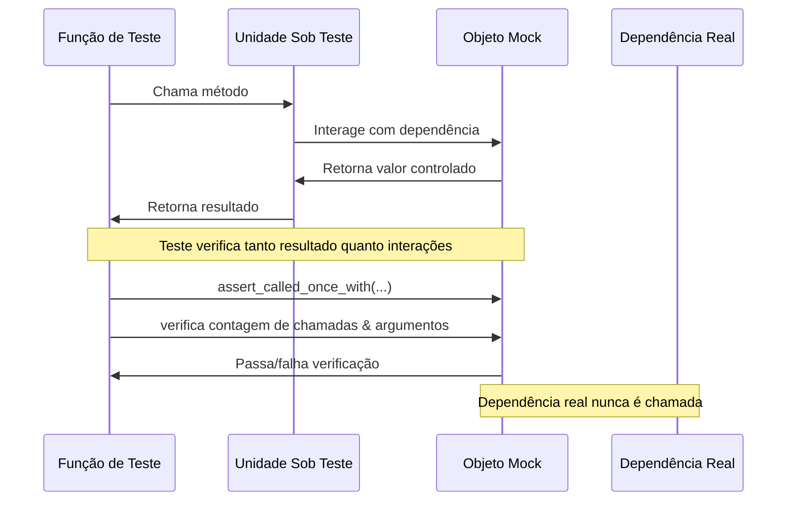
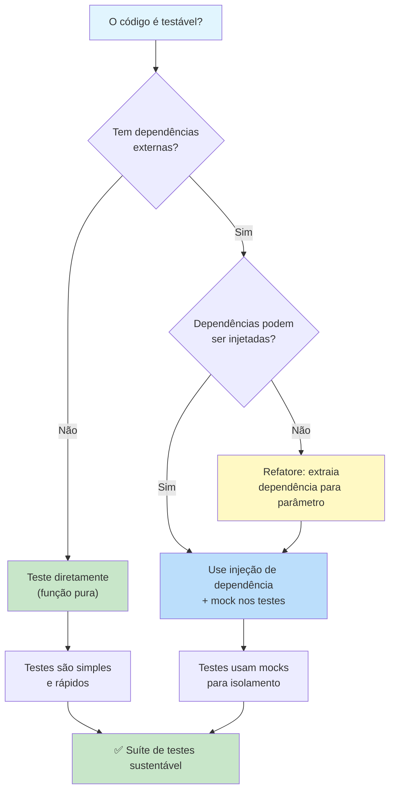

# Melhores Práticas de Testes Unitários

Escrever testes que passam é fácil. Escrever testes que são sustentáveis, confiáveis e confiáveis é uma arte. Esta lição cobre os padrões e práticas que separam grandes suítes de teste das medíocres.

## O Padrão AAA: Arrange-Act-Assert

Todo teste deve seguir três fases claras, separadas por linhas em branco:

```python
# Padrão AAA em ação
def test_saque_reduz_saldo():
    # Arrange (Preparar)
    conta = ContaBancaria("Alice", 1000.0)

    # Act (Agir)
    conta.sacar(300.0)

    # Assert (Verificar)
    assert conta.saldo == 700.0

# Teste ruim — fases misturadas
def test_saque():
    conta = ContaBancaria("Alice", 1000.0)
    conta.sacar(300.0)
    assert conta.saldo == 700.0
    conta.sacar(100.0)
    assert conta.saldo == 500.0
```

### Por que AAA Importa

| Aspecto | Com AAA | Sem AAA |
|---------|---------|---------|
| **Legibilidade** | História clara: Dado → Quando → Então | Múltiplos cenários embaralhados |
| **Debugging** | Identifica qual fase falhou | Não claro se Arrange ou Act está errado |
| **Manutenção** | Altera uma fase independentemente | Mudar entrada força reescrever o teste |
| **Revisão** | Revisor entende intenção rapidamente | Revisor precisa analisar o teste inteiro |

```python
# Bom: Um cenário claro por teste
def test_deposito_aumenta_saldo():
    """Dada uma conta com R$0, quando deposito R$100, saldo se torna R$100."""
    conta = ContaBancaria("Bob")
    conta.depositar(100.0)
    assert conta.saldo == 100.0

def test_deposito_valor_negativo_levanta_erro():
    """Dada uma conta, quando deposito valor negativo, um erro é levantado."""
    conta = ContaBancaria("Bob", 500.0)
    with pytest.raises(ValueError, match="Valor deve ser positivo"):
        conta.depositar(-50.0)

def test_depositos_multiplos_acumulam():
    """Dada uma conta, quando deposito múltiplas vezes, saldo acumula."""
    conta = ContaBancaria("Bob")
    conta.depositar(100.0)
    conta.depositar(50.0)
    conta.depositar(25.0)
    assert conta.saldo == 175.0
```

> [!TIP]
> Se seu teste não se encaixa naturalmente no padrão AAA, é um sinal de que a função sob teste está fazendo demais. Considere refatorar o código de produção.

## Uma Asserção Por Teste? Não Exatamente

Um mito comum: "uma asserção por teste." A regra real é **um conceito por teste**:

```python
# RUIM: Testando múltiplos comportamentos não relacionados
def test_operacoes_conta():
    conta = ContaBancaria("Alice", 1000.0)
    conta.depositar(500.0)
    assert conta.saldo == 1500.0
    conta.sacar(200.0)
    assert conta.saldo == 1300.0
    assert conta.titular == "Alice"

# BOM: Agrupa asserções relacionadas que testam um comportamento
def test_conta_apos_deposito():
    conta = ContaBancaria("Alice", 1000.0)
    conta.depositar(500.0)
    assert conta.saldo == 1500.0
    assert conta.quantidade_transacoes == 1

# BOM: Múltiplas asserções confirmando o mesmo resultado
def test_criacao_usuario_definir_campos():
    usuario = Usuario(nome="Alice", email="alice@teste.com", idade=30)
    assert usuario.nome == "Alice"
    assert usuario.email == "alice@teste.com"
    assert usuario.idade == 30
    assert usuario.ativo is True
```

## Nomenclatura de Testes: Conte uma História

```python
# Nomes de teste descritivos
def test_dado_carrinho_vazio_quando_adicionar_item_entao_contagem_um():
    carrinho = CarrinhoDeCompras()
    carrinho.adicionar_item("maca", 1.50)
    assert carrinho.total_itens() == 1

def test_dado_item_no_carrinho_quando_remover_item_entao_contagem_zero():
    carrinho = CarrinhoDeCompras()
    carrinho.adicionar_item("maca", 1.50)
    carrinho.remover_item("maca")
    assert carrinho.total_itens() == 0

def test_dado_cupom_expirado_quando_aplicar_desconto_entao_levanta_erro():
    carrinho = CarrinhoDeCompras()
    cupom = Cupom("SAVE10", expira_em=ontem)
    with pytest.raises(ErroCupomExpirado):
        carrinho.aplicar_cupom(cupom)
```

| Estilo de Nome | Exemplo |
|---------------|---------|
| `test_[funcionalidade]` | `test_sacar()` |
| `test_[cenário]_[esperado]` | `test_saque_excedente_levanta_erro()` |
| `test_dado_[contexto]_quando_[ação]_então_[resultado]` | `test_dado_fundos_insuficientes_quando_sacar_entao_erro()` |
| `test_[método]_[condição]_[resultado]` | `test_dividir_por_zero_levanta_excecao()` |

> [!SUCCESS]
> Um bom nome de teste elimina a necessidade de ler o corpo do teste. Quando uma build de CI falha, você deve saber aproximadamente o que quebrou apenas pelo nome do teste.

## Mocking: Isolando a Unidade Sob Teste

Mocking substitui dependências reais por substitutos controlados:

```python
from unittest.mock import Mock, patch, MagicMock
import pytest

# Exemplo: Processamento de pagamento
class ProcessadorPagamento:
    def __init__(self, gateway):
        self.gateway = gateway

    def processar_pagamento(self, usuario_id: int, valor: float) -> dict:
        if valor <= 0:
            raise ValueError("Valor deve ser positivo")

        usuario = self.gateway.obter_usuario(usuario_id)
        if not usuario["ativo"]:
            raise RuntimeError("Usuário não está ativo")

        cobranca = self.gateway.cobrar(usuario["cartao_token"], valor)
        return {"status": "sucesso", "id_transacao": cobranca["id"]}

# Teste com Mock
def test_processar_pagamento_sucesso():
    # Arrange
    mock_gateway = Mock()
    mock_gateway.obter_usuario.return_value = {
        "id": 1, "ativo": True, "cartao_token": "tok_123"
    }
    mock_gateway.cobrar.return_value = {
        "id": "txn_abc", "valor": 50.0, "status": "capturado"
    }

    processador = ProcessadorPagamento(mock_gateway)

    # Act
    resultado = processador.processar_pagamento(1, 50.0)

    # Assert
    assert resultado["status"] == "sucesso"
    assert resultado["id_transacao"] == "txn_abc"
    mock_gateway.obter_usuario.assert_called_once_with(1)
    mock_gateway.cobrar.assert_called_once_with("tok_123", 50.0)
```

### Mock vs Patch vs MagicMock

```python
from unittest.mock import Mock, patch, MagicMock, PropertyMock

# Mock — objeto mock básico
mock_obj = Mock()
mock_obj.algum_metodo.return_value = 42
mock_obj.algum_metodo(1, 2, 3)
mock_obj.algum_metodo.assert_called_once_with(1, 2, 3)

# MagicMock — Mock com "métodos mágicos" pré-criados
mm = MagicMock()
mm.__len__.return_value = 5
assert len(mm) == 5
mm.__iter__.return_value = iter([1, 2, 3])
assert list(mm) == [1, 2, 3]

# patch — gerenciador de contexto para substituir atributos
with patch("modulo.NomeClasse") as MockClass:
    MockClass.return_value.algum_metodo.return_value = 42
    instancia = MockClass()
    resultado = instancia.algum_metodo()
    assert resultado == 42

# patch como decorador
@patch("modulo.NomeClasse")
def test_algo(MockClass):
    MockClass.return_value.metodo.return_value = "mockado"
    instancia = MockClass()
    assert instancia.metodo() == "mockado"
```



### Quando (e Quando Não) Usar Mock

| Use Mock Quando... | Não Use Mock Quando... |
|-------------------|------------------------|
| Chamadas de API externas | Transformações simples de dados |
| Operações de banco de dados | Funções puras (mesma entrada → mesma saída) |
| Acesso a sistema de arquivos | Validação de lógica de negócio |
| Requisições de rede | Manipulação de strings |
| SDKs de terceiros | Operações matemáticas/algorítmicas |
| Código dependente de tempo | Métodos auxiliares internos |

```python
# APROPRIADO: chamada HTTP externa
def test_obter_clima():
    mock_response = Mock()
    mock_response.json.return_value = {"temp": 22.5}
    mock_response.raise_for_status.return_value = None

    with patch("requests.get", return_value=mock_response):
        servico = ServicoClima("chave_falsa")
        temp = servico.obter_temperatura("Londres")
        assert temp == 22.5

# INAPROPRIADO: matemática simples
def test_calculo_desconto():
    # Não mocke isto! É uma função pura
    resultado = calcular_desconto(100.0, 0.1)
    assert resultado == 90.0

# MELHOR: Não mocke lógica pura, teste diretamente
def test_email_valido():
    assert email_valido("usuario@exemplo.com") is True
    assert email_valido("nao-email") is False
    assert email_valido("") is False
```

> [!WARNING]
> Excesso de mocking é um antipadrão comum. Se você mocka tudo, seus testes se tornam frágeis — eles quebram quando a implementação muda, não quando o comportamento quebra. Mocke fronteiras, não internos.

## Isolamento de Testes: Sem Estado Compartilhado

Testes nunca devem depender uns dos outros:

```python
# RUIM: Testes compartilham estado via variável global
itens = []

def test_adicionar_item():
    itens.append("maca")
    assert len(itens) == 1

def test_adicionar_outro_item():
    itens.append("banana")
    assert len(itens) == 1  # Falha! itens já tem "maca"

# BOM: Cada teste cria seu próprio estado
def test_adicionar_item():
    carrinho = CarrinhoDeCompras()
    carrinho.adicionar_item("maca")
    assert carrinho.total_itens() == 1

def test_adicionar_outro_item():
    carrinho = CarrinhoDeCompras()
    carrinho.adicionar_item("banana")
    assert carrinho.total_itens() == 1  # Passa — carrinho novo
```

### Regras de Isolamento

| Regra | Por quê |
|------|---------|
| Sem estado mutável compartilhado | Testes se tornam dependentes de ordem |
| Sem registros de banco compartilhados | Dados do Teste A corrompem o Teste B |
| Sem variáveis globais | Um teste polui estado para outro |
| Sem efeitos colaterais no sistema de arquivos | Criação de arquivo do Teste A quebra o Teste B |
| Sem lógica dependente de tempo | Testes quebram à meia-noite ou às segundas |
| Fixtures novas por teste | `scope="function"` é seu padrão |

```python
# RUIM: Fixture mutável compartilhada
usuarios_teste = []

@pytest.fixture
def usuario():
    usuarios_teste.append(Usuario("Alice"))
    return usuarios_teste[-1]

# BOM: Estado novo por teste
@pytest.fixture
def usuario():
    return Usuario("Alice")  # Objeto novo toda vez

# RUIM: Testes se afetam através do BD
def test_criar_usuario(db):
    db.execute("INSERT INTO usuarios VALUES ('Alice')")
    assert db.query("SELECT count(*) FROM usuarios")[0][0] == 1

def test_outro_usuario(db):
    # Isto FALHARÁ se test_criar_usuario rodou primeiro
    assert db.query("SELECT count(*) FROM usuarios")[0][0] == 0
```

## Testando Casos Extremos

Os testes mais valiosos são frequentemente os casos extremos:

```python
# Padrões de caso extremo
def test_dividir_por_zero():
    with pytest.raises(ZeroDivisionError):
        calcular(10, 0)

def test_entrada_vazia():
    assert processar_lista([]) == []

def test_elemento_unico():
    assert processar_lista([42]) == [42]

def test_entrada_none():
    with pytest.raises(TypeError):
        processar_lista(None)

def test_valores_limite():
    assert validar_idade(0) is False   # Limite
    assert validar_idade(1) is True    # Acima
    assert validar_idade(17) is True   # Abaixo do limiar
    assert validar_idade(18) is True   # No limiar
    assert validar_idade(120) is True  # Limite superior
    assert validar_idade(121) is False # Excedeu

def test_valores_negativos():
    assert processar_transacao(-1) == "invalido"

def test_valores_grandes():
    texto_grande = "a" * 10_000
    resultado = processar_texto(texto_grande)
    assert len(resultado) == 10_000

def test_caracteres_especiais():
    assert sanitizar_entrada("<script>alert('xss')</script>") == ""

def test_unicode():
    assert processar_nome("José 💻") is not None
```

## Os Princípios FIRST de Bons Testes Unitários

| Princípio | Significado | Como Aplicar |
|-----------|-------------|-------------|
| **F**ast (Rápido) | Testes executam rapidamente | Escala de milissegundos. Sem I/O em testes unitários. |
| **I**solated (Isolado) | Testes não dependem uns dos outros | Fixtures novas, sem estado compartilhado |
| **R**epeatable (Repetível) | Mesmo resultado toda vez | Sem valores aleatórios, sem dependência de tempo |
| **S**elf-validating (Autoverificável) | Passa ou falha automaticamente | Sem inspeção manual de saída |
| **T**horough (Completo) | Cobre casos extremos, não apenas caminho feliz | Valores limite, erros, nulos |

```python
import random
from datetime import datetime

# RUIM: Teste não repetível
def test_escolha_aleatoria():
    resultado = random.choice([1, 2, 3])
    assert resultado > 0  # Asserção fraca — sempre passa

# RUIM: Teste dependente de tempo
def test_saudacao_bom_dia():
    hora = datetime.now().hour
    saudacao = obter_saudacao()
    if 5 <= hora < 12:
        assert saudacao == "Bom dia"
    else:
        assert saudacao != "Bom dia"

# BOM: Entradas controladas
def test_escolha_aleatoria_com_semente():
    random.seed(42)
    resultado = random.choice([1, 2, 3])
    assert resultado == 2  # Determinístico com semente

# BOM: Injete o tempo
def test_saudacao_em_horario_especifico():
    assert obter_saudacao_em(hora=9) == "Bom dia"
    assert obter_saudacao_em(hora=14) == "Boa tarde"
    assert obter_saudacao_em(hora=20) == "Boa noite"
```

## Refatorando Código de Produção para Testabilidade

Às vezes o código não é testável. Aqui está como corrigir:

```python
# ANTES: Não testável — dependência hardcoded
def enviar_email_boas_vindas(email_usuario: str) -> None:
    import smtplib
    servidor = smtplib.SMTP("smtp.gmail.com", 587)
    servidor.login("usuario@gmail.com", "senha")
    servidor.sendmail("from@teste.com", email_usuario, "Bem-vindo!")
    servidor.quit()

# DEPOIS: Testável — injeção de dependência
class ServicoEmail:
    def __init__(self, cliente_smtp=None):
        self.smtp = cliente_smtp or self._smtp_padrao()

    def enviar_boas_vindas(self, email_usuario: str) -> None:
        self.smtp.sendmail("from@teste.com", email_usuario, "Bem-vindo!")

    def _smtp_padrao(self):
        import smtplib
        servidor = smtplib.SMTP("smtp.gmail.com", 587)
        servidor.login("usuario@gmail.com", "senha")
        return servidor

# Teste
def test_enviar_boas_vindas():
    mock_smtp = Mock()
    servico = ServicoEmail(cliente_smtp=mock_smtp)
    servico.enviar_boas_vindas("alice@teste.com")
    mock_smtp.sendmail.assert_called_once_with(
        "from@teste.com", "alice@teste.com", "Bem-vindo!"
    )
```



## Testando Exceções e Caminhos de Erro

```python
import pytest

class Validador:
    def validar_usuario(self, dados_usuario: dict) -> None:
        if not isinstance(dados_usuario, dict):
            raise TypeError("dados_usuario deve ser um dict")
        if "email" not in dados_usuario:
            raise ValueError("email é obrigatório")
        if "@" not in dados_usuario["email"]:
            raise ValueError("Formato de email inválido")
        if dados_usuario.get("idade", 0) < 0:
            raise ValueError("Idade não pode ser negativa")
        if dados_usuario.get("idade", 0) > 150:
            raise ValueError("Idade parece irrealista")

class TestValidadorExcecoes:
    def test_rejeita_nao_dict(self):
        with pytest.raises(TypeError, match="deve ser um dict"):
            Validador().validar_usuario("não é um dict")

    def test_rejeita_email_ausente(self):
        with pytest.raises(ValueError, match="email é obrigatório"):
            Validador().validar_usuario({"nome": "Alice"})

    def test_rejeita_email_invalido(self):
        with pytest.raises(ValueError, match="email inválido"):
            Validador().validar_usuario({"email": "nao-email"})

    def test_rejeita_idade_negativa(self):
        with pytest.raises(ValueError, match="negativa"):
            Validador().validar_usuario({"email": "a@b.com", "idade": -5})

    def test_rejeita_idade_irrealista(self):
        with pytest.raises(ValueError, match="irrealista"):
            Validador().validar_usuario({"email": "a@b.com", "idade": 200})

    def test_aceita_usuario_valido(self):
        """Caminho feliz — nenhuma exceção levantada."""
        resultado = Validador().validar_usuario({
            "email": "alice@exemplo.com",
            "idade": 30,
        })
        assert resultado is None
```

## Testando Código Assíncrono

```python
import pytest

# Função assíncrona para testar
async def buscar_dados_usuario(usuario_id: int) -> dict:
    await asyncio.sleep(0.1)
    return {"id": usuario_id, "nome": "Alice"}

# Teste assíncrono
@pytest.mark.asyncio
async def test_buscar_dados_usuario():
    resultado = await buscar_dados_usuario(1)
    assert resultado["id"] == 1
    assert resultado["nome"] == "Alice"

# Assíncrono com mocking
@pytest.mark.asyncio
async def test_servico_assincrono():
    mock_db = AsyncMock()
    mock_db.obter_usuario.return_value = {"id": 1, "nome": "Alice"}

    servico = ServicoUsuario(mock_db)
    resultado = await servico.obter_usuario(1)
    assert resultado["nome"] == "Alice"
    mock_db.obter_usuario.assert_called_once_with(1)
```

## Maus Cheiros Comuns em Testes

```python
# CHEIRO 1: Testando detalhes de implementação
def test_ordenacao_usa_quicksort():
    """RUIM: Testa como ordena, não o que faz."""
    arr = [3, 1, 2]
    resultado = ordenar(arr)
    # Verificar algoritmo interno é frágil

# CHEIRO 2: Múltiplos caminhos lógicos em um teste
def test_complexo():
    """RUIM: Testa muitas coisas."""
    if alguma_condicao:
        assert x == 1
    else:
        assert y == 2

# CHEIRO 3: Teste usa dados de produção
def test_com_dados_reais():
    """RUIM: Depende de dados externos mutáveis."""
    dados = buscar_da_api_producao()
    assert len(dados) > 0

# CHEIRO 4: Condicionais em testes
def test_condicional():
    """RUIM: Testes devem ser determinísticos."""
    if os.name == "nt":
        assert especifico_windows()
    else:
        assert especifico_unix()
```

| Cheiro | Sintoma | Correção |
|--------|---------|----------|
| **Teste Fragmentado** | Testa muitos comportamentos não relacionados | Dividir em testes focados |
| **Teste Preguiçoso** | Afirma muito pouco | Testar a saída real |
| **Teste Subordinado** | Testa auxiliar, não o principal | Identificar a unidade real |
| **Teste Indecente** | Acessa métodos privados | Testar via interface pública |
| **Convidado Mistério** | Usa estado global | Injetar dependências |
| **Otimista de Recursos** | Testes não limpam | Usar fixtures com limpeza |
| **Herói Local** | Testes dependem de localidade | Definir localidade explicitamente |

## Exercícios Práticos

1. **Refatore para AAA**: Pegue este teste mal estruturado e refatore em três testes AAA separados:
   ```python
   def test_carrinho():
       carrinho = CarrinhoDeCompras()
       carrinho.adicionar_item("maca", 1.0)
       assert carrinho.total() == 1.0
       carrinho.adicionar_item("banana", 2.0)
       assert carrinho.total() == 3.0
       carrinho.remover_item("maca")
       assert carrinho.total() == 2.0
   ```

2. **Escreva Testes com Mock**: Crie um `ServicoNewsletter` que chama uma API de email. Escreva testes que mockam a chamada de API. Verifique se os dados corretos são enviados.

3. **Identifique Violações de Isolamento**: Encontre e corrija os problemas de estado compartilhado nesta suíte de testes:
   ```python
   usuarios = []
   def test_criar_usuario():
       usuarios.append(Usuario("Alice"))
       assert len(usuarios) == 1
   def test_deletar_usuario():
       usuarios.clear()
       assert len(usuarios) == 0
   ```

4. **Cobertura de Casos Extremos**: Escreva testes abrangentes de casos extremos para uma função `parse_int(s: str) -> int` que lida com números regulares, números negativos, zeros, zeros à esquerda, strings vazias, strings não numéricas e espaços em branco.

5. **Auditoria FIRST**: Revise uma suíte de testes de um projeto real ou de exemplo. Para cada teste, avalie-o contra os princípios FIRST. Quais testes violam quais princípios?

6. **Refatoração com Injeção de Dependência**: Pegue este código não testável e refatore para testabilidade, depois escreva testes:
   ```python
   class GeradorRelatorio:
       def gerar(self):
           import datetime
           agora = datetime.datetime.now()
           with open("/var/log/app.log") as f:
               dados = f.read()
           return f"Relatório gerado em {agora}: {len(dados)} bytes"
   ```

7. **Teste uma Função Fibonacci**: Escreva testes para uma função `fibonacci(n)`. Cubra n=0, n=1, n=2, n=10, n negativo, n não inteiro e n grande. Use parametrize.

8. **Mockando um Gateway de Pagamento**: Um `ServicoPagamento` tem um método `processar_pagamento(usuario_id, valor)` que chama um gateway de pagamento. Escreva testes para cenários de sucesso, cartão recusado, fundos insuficientes e timeout usando mocks.

## Resumo

- **Padrão AAA**: Arrange → Act → Assert — uma história clara por teste
- **Um conceito por teste**: Não uma asserção, mas um comportamento
- **Nomes descritivos**: `test_dado_X_quando_Y_entao_Z` conta a história completa
- **Mocke fronteiras**: Mocke dependências externas, não lógica interna
- **Isolamento**: Estado novo por teste, sem compartilhamento, sem dependência de ordem
- **Casos extremos**: Vazio, nulo, negativo, limite — teste todos
- **FIRST**: Fast, Isolated, Repeatable, Self-validating, Thorough
- **Testabilidade**: Projete código para que possa ser testado (injeção de dependência)

> [!SUCCESS]
> Testar bem é uma disciplina de design. O padrão AAA, mocking adequado e isolamento rigoroso não são custos — são investimentos que tornam cada refatoração futura segura e cada relatório de bug solucionável.
