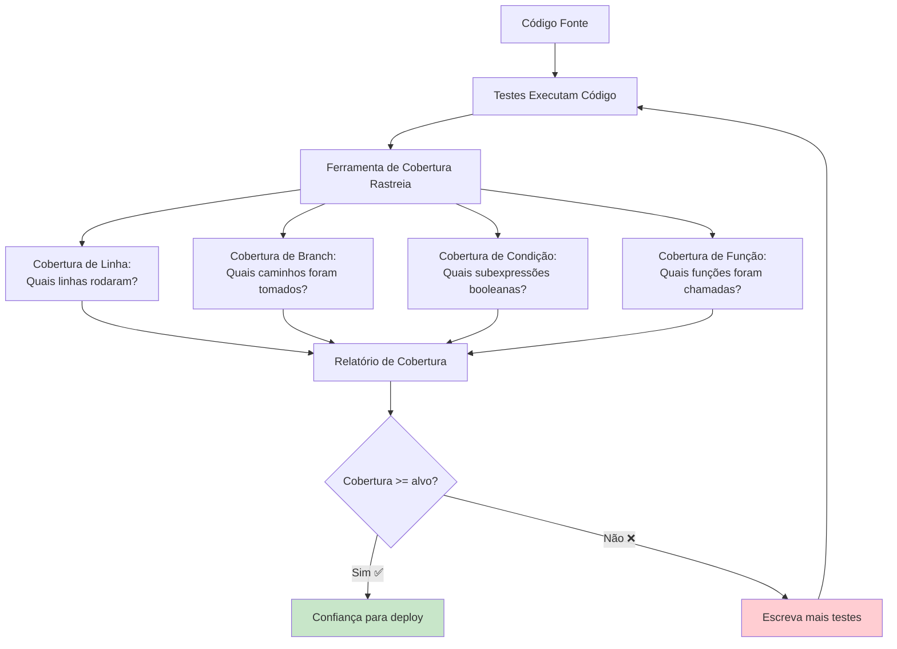
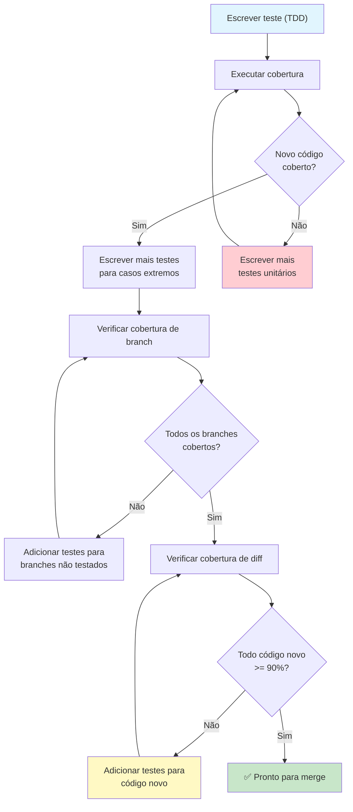

# Cobertura de Testes e Qualidade

Cobertura informa qual código seus testes executam. É um **indicador negativo** útil — cobertura baixa significa que você definitivamente não está testando o suficiente — mas cobertura alta não garante bons testes. Esta lição cobre como medir, interpretar e agir com base em dados de cobertura.

## O que é Cobertura de Código?

Cobertura de código mede a porcentagem do seu código que é executada durante os testes.



## Tipos de Métricas de Cobertura

| Métrica | O que Mede | Exemplo |
|---------|-----------|---------|
| **Cobertura de Linha** | Qual porcentagem de linhas executou | 80% das linhas rodaram durante testes |
| **Cobertura de Branch** | Qual porcentagem de branches if/else foram tomados | 3 de 4 branches cobertos (75%) |
| **Cobertura de Condição** | Subexpressões booleanas avaliadas | `A or B` — testado A=True, A=False |
| **Cobertura de Função** | Funções que foram chamadas | 45 de 50 funções invocadas |
| **Cobertura de Statement** | Statements individuais executados | 120 de 150 statements rodaram |
| **Cobertura de Caminho** | Todos os caminhos possíveis pelo código | 8 de 16 caminhos possíveis testados |

```python
# Exemplo mostrando diferentes tipos de cobertura
def processar_pedido(pedido: dict) -> str:
    """Uma função de processamento de pedido para analisar cobertura."""
    # Linha 1 (sempre executa quando chamada)
    if not pedido:                          # Branch 1: True / False
        return "pedido_vazio"               # Linha 2 (branch True)

    if pedido.get("valor", 0) > 100:        # Branch 2: True / False
        desconto = pedido["valor"] * 0.1    # Linha 4 (branch True)
        pedido["valor"] -= desconto         # Linha 5

    if pedido.get("membro_fidelidade"):     # Branch 3: True / False
        pontos = pedido["valor"] * 10       # Linha 7 (branch True)
        pedido["pontos_fidelidade"] = pontos# Linha 8

    if pedido.get("frete_expresso"):        # Branch 4: True / False
        return "expresso"                   # Linha 10 (branch True)

    return "padrao"                         # Linha 12
```

## Configurando Cobertura com pytest-cov

```bash
# Instalar ferramentas de cobertura
pip install pytest-cov coverage

# Executar testes com cobertura
pytest --cov=src tests/

# Executar com relatório de cobertura no terminal
pytest --cov=src --cov-report=term-missing tests/

# Gerar relatório HTML (abrir htmlcov/index.html)
pytest --cov=src --cov-report=html tests/

# Gerar relatório XML (para integração CI)
pytest --cov=src --cov-report=xml tests/

# Combinar múltiplos relatórios de cobertura
pytest --cov=src --cov-report=term --cov-report=html:relatorio_cobertura tests/
```

### Configuração no pyproject.toml

```toml
[tool.coverage.run]
source = ["src"]
omit = ["*/tests/*", "*/migrations/*", "*/__init__.py"]
branch = true
parallel = true

[tool.coverage.report]
exclude_lines = [
    "pragma: no cover",
    "def __repr__",
    "if __name__ == .__main__.:",
    "raise NotImplementedError",
    "if False:",
    "def __str__",
]
fail_under = 80
show_missing = true
precision = 2

[tool.coverage.html]
directory = "coverage_html"
title = "Relatório de Cobertura do Projeto"
```

## Lendo Relatórios de Cobertura

```python
# src/calculadora.py
def adicionar(a, b):
    return a + b

def subtrair(a, b):
    return a - b

def multiplicar(a, b):
    return a * b

def dividir(a, b):
    if b == 0:
        raise ValueError("Não é possível dividir por zero")
    return a / b

def potencia(a, b):
    return a ** b

def modulo(a, b):
    if b == 0:
        raise ValueError("Não é possível mod por zero")
    return a % b
```

```python
# tests/test_calculadora.py
from src.calculadora import adicionar, subtrair, multiplicar, dividir

def test_adicionar():
    assert adicionar(2, 3) == 5

def test_subtrair():
    assert subtrair(5, 3) == 2

def test_multiplicar():
    assert multiplicar(4, 3) == 12

# Testes ausentes: dividir, potencia, modulo!
```

```bash
# Executar cobertura
pytest --cov=src --cov-report=term-missing tests/

# Saída:
# Name                  Stmts   Miss  Cover   Missing
# --------------------------------------------------
# src/calculadora.py       15      6    60%   12-20
# --------------------------------------------------
# TOTAL                   15      6    60%
#
# Linhas 12-20 são: exceção dividir, potencia(), modulo()
```

> [!WARNING]
> 60% de cobertura com todos os testes verdes dá falsa confiança. As funções não testadas podem estar completamente quebradas. Cobertura informa o que você NÃO testou.

## Cobertura de Branch: A Peça Faltante

Cobertura de linha pode ser enganosa. Cobertura de branch revela caminhos não testados:

```python
def validar_idade(idade: int) -> str:
    if idade < 0:          # Branch 1
        return "invalido"
    elif idade < 18:       # Branch 2
        return "menor"
    elif idade < 65:       # Branch 3
        return "adulto"
    else:                  # Branch 4
        return "idoso"
```

```python
# Teste com 100% de cobertura de linha mas apenas 50% de branch
def test_validar_idade():
    assert validar_idade(25) == "adulto"
    # Linhas cobertas: todas as 8 linhas
    # Branches cobertos: apenas caminho "adulto" (branch 3)
    # Perdidos: idade < 0, idade < 18, idade >= 65
```

```bash
# Habilitar cobertura de branch
pytest --cov=src --cov-branch --cov-report=term-missing tests/

# Saída:
# Name                  Stmts   Miss  Branch BrPart  Cover   Missing
# ----------------------------------------------------------------
# src/validator.py         8      0      4      3    75%   4,6,10
# ----------------------------------------------------------------
```

> [!TIP]
> Sempre habilite cobertura de branch com `--cov-branch`. Cobertura de linha sozinha pode dar uma sensação de segurança perigosamente falsa.

## Alvos Significativos de Cobertura

| Nível de Cobertura | O que Significa | Quando é Suficiente |
|-------------------|-----------------|---------------------|
| **< 40%** | Lacunas críticas | Projeto novo sem testes |
| **40-60%** | Caminhos principais testados | Código legado com cobertura parcial |
| **60-80%** | Maioria dos caminhos cobertos | Desenvolvimento ativo, lançamentos regulares |
| **80-90%** | Bem testado | Serviços de produção, bibliotecas |
| **90-100%** | Completamente testado | Crítico para segurança, financeiro, médico |

```python
# Cobertura alta não significa bons testes
def usuario_valido(usuario: dict) -> bool:
    return (
        "nome" in usuario
        and "email" in usuario
        and "@" in usuario.get("email", "")
        and len(usuario.get("nome", "")) > 2
        and usuario.get("idade", 0) >= 18
    )
```

```python
# "Testes" que alcançam 100% de cobertura mas não testam nada útil
def test_usuario_valido():
    usuario = {"nome": "Alice", "email": "a@b.com", "idade": 25}
    resultado = usuario_valido(usuario)
    assert resultado is True
    # 100% de cobertura de linha! Mas:
    # - Não testa nome ausente
    # - Não testa email inválido
    # - Não testa menor de idade
    # - Não testa nome curto
    # - Não testa dict vazio
```

```python
# Testes significativos de cobertura
def test_usuario_valido_caminho_feliz():
    assert usuario_valido({"nome": "Alice", "email": "a@b.com", "idade": 25}) is True

def test_usuario_valido_nome_ausente():
    assert usuario_valido({"email": "a@b.com", "idade": 25}) is False

def test_usuario_valido_email_invalido():
    assert usuario_valido({"nome": "Alice", "email": "invalido", "idade": 25}) is False

def test_usuario_valido_menor_idade():
    assert usuario_valido({"nome": "Alice", "email": "a@b.com", "idade": 16}) is False

def test_usuario_valido_vazio():
    assert usuario_valido({}) is False

def test_usuario_valido_nome_curto():
    assert usuario_valido({"nome": "A", "email": "a@b.com", "idade": 25}) is False
```

## Arquivos de Configuração de Cobertura

### .coveragerc

```ini
[run]
source = src
omit =
    */tests/*
    */migrations/*
    */.eggs/*
    **/__init__.py
    **/settings.py
    manage.py
branch = True
parallel = True

[report]
exclude_lines =
    pragma: no cover
    def __repr__
    def __str__
    if __name__ == "__main__":
    raise NotImplementedError
    raise AssertionError
    pass
ignore_errors = True
precision = 2
show_missing = True
fail_under = 85
skip_covered = True
skip_empty = True

[html]
directory = coverage_html
title = Relatório de Cobertura

[xml]
output = coverage.xml
package_depth = 3
```

### Cobertura em CI/CD

```yaml
# .github/workflows/testes.yml (parcial)
name: Testes com Cobertura

on: [push, pull_request]

jobs:
  test:
    runs-on: ubuntu-latest
    steps:
      - uses: actions/checkout@v4
      - uses: actions/setup-python@v5
        with:
          python-version: '3.12'

      - name: Instalar dependências
        run: |
          pip install -r requirements.txt
          pip install pytest pytest-cov

      - name: Executar testes com cobertura
        run: |
          pytest --cov=src --cov-report=xml --cov-report=term-missing tests/

      - name: Enviar relatório de cobertura
        uses: codecov/codecov-action@v4
        with:
          file: ./coverage.xml
          flags: unittests
          fail_ci_if_error: true
```

## Antipadrões de Cobertura

### 1. Perseguindo 100% de Cobertura

```python
# NÃO FAÇA: Escrever testes só para bater alvos de cobertura
def test_getter_inutil():
    obj = MinhaClasse()
    assert obj.get_nome() is None  # Testando um getter que retorna None

# FAÇA: Testar comportamento significativo
def test_get_nome_apos_definir():
    obj = MinhaClasse()
    obj.set_nome("Alice")
    assert obj.get_nome() == "Alice"

def test_get_nome_padrao():
    obj = MinhaClasse()
    assert obj.get_nome() == ""  # Padrão significativo
```

### 2. Ignorando Código Complexo

```python
# NÃO FAÇA: Escrever testes para código simples, pular código complexo
def test_soma_simples():
    assert somar(1, 2) == 3

# Mas nenhum teste para esta lógica complexa:
def calcular_imposto(renda: float, deducoes: list, status: str) -> float:
    # Cálculo complexo de imposto com muitos branches
    pass  # Não testado!
```

### 3. Cobertura de Integração em vez de Unitária

```python
# NÃO FAÇA: Cobrir código apenas através de testes de integração
def test_api_completa():
    response = client.post("/api/usuarios", json={"nome": "Alice"})
    assert response.status_code == 201
    # Isso cobre models, serializers, views, middleware, BD...
    # Mas você não sabe QUAL parte está testada

# FAÇA: Também escreva testes unitários para cada camada
def test_criacao_usuario_servico():
    servico = ServicoUsuario(mock_repo)
    usuario = servico.criar_usuario({"nome": "Alice"})
    assert usuario.nome == "Alice"
```

## Fluxo de Trabalho de Desenvolvimento Orientado por Cobertura



## Usando Exclusões de Cobertura com Sabedoria

```python
# Exclusões legítimas de cobertura

# 1. Código apenas de debug
if DEBUG:  # pragma: no cover
    logger.debug(f"Processando pedido {pedido_id}: {dados_pedido}")

# 2. Código específico de plataforma
if sys.platform == "win32":  # pragma: no cover
    HANDLER_WINDOWS = ...
else:
    HANDLER_UNIX = ...

# 3. Código morto (mantido intencionalmente)
# pragma: no cover
def funcao_deprecada():
    """Mantido para compatibilidade reversa."""
    pass

# 4. __repr__ / __str__ (frequentemente testados indiretamente)
def __repr__(self):  # pragma: no cover
    return f"Usuario({self.nome!r})"
```

> [!NOTE]
> Use `# pragma: no cover` com moderação. Cada exclusão deve ter um comentário explicando POR QUÊ. O uso excessivo de exclusões torna seu relatório de cobertura sem sentido.

## Integração de Ferramentas

```bash
# Usando coverage.py diretamente (sem pytest)
coverage run -m pytest tests/
coverage report -m
coverage html
coverage xml

# Executar cobertura com configuração específica
coverage run --rcfile=.coveragerc -m pytest tests/

# Combinar execuções paralelas
coverage combine
coverage report

# Ver código anotado
coverage annotate -d cobertura_anotada/

# Apagar dados de cobertura anteriores
coverage erase
```

### Cobertura de Diff

Cobertura de diff mede cobertura apenas das linhas alteradas em um pull request:

```bash
# Instalar diff-cover
pip install diff-cover

# Gerar relatório de cobertura de diff
diff-cover coverage.xml --compare-branch=main

# Saída HTML
diff-cover coverage.xml --compare-branch=main --html-report=diff_report.html

# Falhar CI se cobertura de diff < 90%
diff-cover coverage.xml --compare-branch=main --fail-under=90
```

```bash
# Exemplo de saída diff-coverage:
# ----------
# Diff Coverage
# Diff: origin/main...HEAD, linhas criadas e modificadas: 45
# ----------
# src/calculadora.py (90.0%): Linha ausente 42
# src/validador.py (100.0%)
# src/relatorios.py (66.7%): Linhas ausentes 15, 23
# ----------
# Total:    Coverage: 85.7% (42 de 45 linhas)
# FALHA: Cobertura de diff (85.7%) está abaixo do limiar (90%)
```

## Exercícios Práticos

1. **Instale e Configure**: Instale pytest-cov e configure cobertura para rastrear o diretório `src/` com cobertura de branch habilitada. Gere um relatório HTML.

2. **Lacuna Linha vs Branch**: Escreva uma função com if-else aninhado (pelo menos 4 branches). Escreva um teste que atinge 100% de cobertura de linha mas apenas 50% de branch. Execute `--cov-branch` para verificar.

3. **TDD Orientado por Cobertura**: Escolha uma função com pelo menos 6 branches. Use TDD para desenvolvê-la mantendo cobertura em 100% tanto para linhas quanto para branches. Mostre seu relatório de cobertura.

4. **Melhore a Cobertura**: Dado este código, escreva testes para atingir 100% de cobertura de branch:
   ```python
   def classificar_numero(n: int) -> str:
       if n <= 0:
           if n == 0:
               return "zero"
           return "negativo"
       if n % 2 == 0:
           return "par" if n < 100 else "par grande"
       return "impar" if n < 100 else "impar grande"
   ```

5. **Defina Portões de Cobertura**: Crie um `.coveragerc` que falhe se a cobertura cair abaixo de 80%. Crie uma suíte de testes que passe inicialmente, depois adicione código não testado para disparar a falha.

6. **Configuração de Diff Coverage**: Crie um cenário onde dois branches têm coberturas diferentes. Execute `diff-cover` para mostrar apenas a cobertura das linhas alteradas.

7. **Caça aos Antipadrões**: Encontre exemplos em um código real ou de exemplo de antipadrões de cobertura: perseguir 100% com testes triviais, ignorar código complexo ou uso excessivo de `# pragma: no cover`.

8. **Configure CI com Cobertura**: Escreva um workflow do GitHub Actions que executa testes com cobertura, envia para Codecov e falha se a cobertura cair abaixo de 85% ou a cobertura de diff estiver abaixo de 90%.

## Resumo

- **Cobertura mede qual código executa durante os testes**, não qual código está correto
- **Cobertura de linha** é a métrica básica; **cobertura de branch** revela caminhos não testados
- **100% de cobertura ≠ 100% de correção** — você pode ter cobertura perfeita e ainda ter bugs
- **Alvos de cobertura**: 80%+ para código de produção, 90%+ para caminhos críticos
- **Cobertura de diff** garante que código novo seja testado, não apenas números totais
- **Exclusões** devem ser raras e bem documentadas
- **Cobertura alta é um efeito colateral** de boa disciplina de testes, não o objetivo em si

> [!SUCCESS]
> Cobertura é uma bússola, não um destino. Ela aponta para código não testado, mas atingir 100% não significa que você terminou. Testes significativos exigem pensamento, não apenas métricas.
