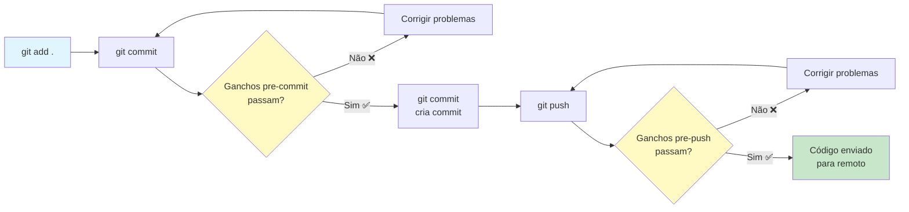
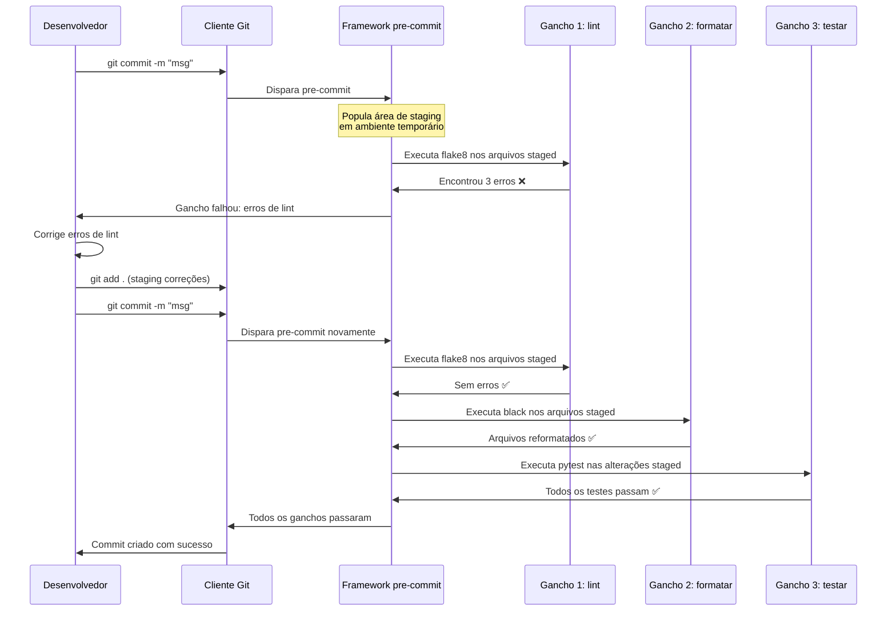

# Ganchos Pre-Commit

Ganchos pre-commit são verificações automatizadas que executam **antes** de você fazer commit do código. Eles capturam problemas cedo — antes que cheguem ao repositório — economizando tempo de revisão de código e prevenindo que código ruim seja mesclado.

## O que São Ganchos Git?

Ganchos Git são scripts que o Git executa em pontos específicos do fluxo de trabalho:



| Tipo de Gancho | Quando Executa | Usos Comuns |
|---------------|---------------|-------------|
| `pre-commit` | Antes do editor de mensagem de commit | Lint, formatar, testar, verificar segredos |
| `pre-push` | Antes de enviar para remoto | Executar suite completa de testes, varredura de segurança |
| `commit-msg` | Após mensagem de commit ser escrita | Validar formato da mensagem de commit |
| `prepare-commit-msg` | Antes do editor de mensagem de commit | Auto-gerar mensagens de commit |
| `post-commit` | Após commit ser criado | Notificar CI, atualizar dashboards |

## Introduzindo o Framework pre-commit

O framework `pre-commit` torna os ganchos fáceis de instalar, configurar e compartilhar:

```bash
# Instalar o framework pre-commit
pip install pre-commit

# Verificar instalação
pre-commit --version

# Instalar ganchos no seu repositório git
pre-commit install

# Executar ganchos em todos os arquivos (útil na primeira configuração)
pre-commit run --all-files

# Executar um gancho específico
pre-commit run flake8 --all-files

# Atualizar ganchos para versões mais recentes
pre-commit autoupdate

# Desinstalar ganchos
pre-commit uninstall
```

### .pre-commit-config.yaml Básico

```yaml
# .pre-commit-config.yaml
repos:
  - repo: https://github.com/pre-commit/pre-commit-hooks
    rev: v4.6.0
    hooks:
      - id: trailing-whitespace
      - id: end-of-file-fixer
      - id: check-yaml
      - id: check-added-large-files
        args: ['--maxkb=500']
      - id: check-json
      - id: check-toml
      - id: check-merge-conflict
      - id: detect-private-key
      - id: mixed-line-ending
        args: ['--fix=lf']

  - repo: https://github.com/psf/black
    rev: 24.4.2
    hooks:
      - id: black

  - repo: https://github.com/pycqa/isort
    rev: 5.13.2
    hooks:
      - id: isort
        args: ['--profile', 'black']

  - repo: https://github.com/pycqa/flake8
    rev: 7.1.0
    hooks:
      - id: flake8
        args: ['--max-line-length=88', '--extend-ignore=E203,W503']
```

## Como o pre-commit Funciona



> [!NOTE]
> O pre-commit executa ganchos apenas em **arquivos staged** (preparados). Isso mantém o ciclo de feedback rápido. Use `pre-commit run --all-files` para verificar o repositório inteiro.

## Categorias Comuns de Ganchos

### 1. Ganchos de Formatação

```yaml
- repo: https://github.com/psf/black
  rev: 24.4.2
  hooks:
    - id: black
      language_version: python3.12
      args: ['--line-length=100']

- repo: https://github.com/pycqa/isort
  rev: 5.13.2
  hooks:
    - id: isort
      args: ['--profile', 'black']

- repo: https://github.com/pre-commit/mirrors-prettier
  rev: v4.0.0-alpha.8
  hooks:
    - id: prettier
      types_or: [javascript, typescript, css, json, yaml, markdown]
```

### 2. Ganchos de Linting

```yaml
- repo: https://github.com/astral-sh/ruff-pre-commit
  rev: v0.4.8
  hooks:
    - id: ruff
      args: [--fix, --exit-non-zero-on-fix]

- repo: https://github.com/pycqa/flake8
  rev: 7.1.0
  hooks:
    - id: flake8
      additional_dependencies:
        - flake8-docstrings
        - flake8-bugbear

- repo: https://github.com/pycqa/pylint
  rev: v3.2.2
  hooks:
    - id: pylint
      args: ['--max-line-length=100']
```

### 3. Ganchos de Segurança

```yaml
- repo: https://github.com/Yelp/detect-secrets
  rev: v1.5.0
  hooks:
    - id: detect-secrets
      args: ['--baseline', '.secrets.baseline']

- repo: https://github.com/PyCQA/bandit
  rev: 1.7.9
  hooks:
    - id: bandit
      args: ['-x', 'tests/', '-ll']

- repo: https://github.com/pre-commit/pre-commit-hooks
  rev: v4.6.0
  hooks:
    - id: detect-private-key
```

### 4. Ganchos de Verificação de Tipo

```yaml
- repo: https://github.com/pre-commit/mirrors-mypy
  rev: v1.10.0
  hooks:
    - id: mypy
      args: ['--strict']
      additional_dependencies: [types-requests, types-PyYAML]

- repo: https://github.com/pre-commit/pyright
  rev: v1.1.366
  hooks:
    - id: pyright
```

### 5. Ganchos de Teste

```yaml
- repo: local
  hooks:
    - id: pytest
      name: pytest
      entry: pytest
      language: system
      types: [python]
      pass_filenames: false
      always_run: true
      args: ['-x', '--ff', '--cov=src', 'tests/']

    - id: pytest-cov-threshold
      name: Verificar limiar de cobertura
      entry: pytest
      language: system
      pass_filenames: false
      always_run: true
      args: ['--cov=src', '--cov-fail-under=85']
```

> [!WARNING]
> Executar a suite completa de testes como gancho pre-commit pode tornar os commits significativamente mais lentos. Considere usar `pre-push` para a suite completa e manter apenas testes unitários rápidos no `pre-commit`.

## Configuração Avançada

### Ganchos Condicionais com Files/Exclude

```yaml
repos:
  - repo: https://github.com/psf/black
    rev: 24.4.2
    hooks:
      - id: black
        # Executar apenas em arquivos Python
        types: [python]
        # Excluir arquivos gerados
        exclude: |
          (?x)^(
            migrations/|
            .*_pb2\.py|
            build/
          )

  - repo: https://github.com/pre-commit/pre-commit-hooks
    rev: v4.6.0
    hooks:
      - id: check-added-large-files
        # Verificar apenas certos diretórios
        files: ^src/
        args: ['--maxkb=200']

  - repo: https://github.com/astral-sh/ruff-pre-commit
    rev: v0.4.8
    hooks:
      - id: ruff
        # Nunca executar em arquivos de teste
        exclude: ^tests/
        args: [--fix]
```

### Usando Argumentos de Gancho

```yaml
repos:
  - repo: https://github.com/pycqa/flake8
    rev: 7.1.0
    hooks:
      - id: flake8
        args:
          - --max-line-length=100
          - --extend-ignore=E203,W503
          - --per-file-ignores=__init__.py:F401
        additional_dependencies:
          - flake8-docstrings==1.7.0
          - flake8-bugbear==24.4.26

  - repo: https://github.com/pycqa/pylint
    rev: v3.2.2
    hooks:
      - id: pylint
        args:
          - --disable=C0111
          - --max-line-length=100
          - --score=n
        files: ^src/

  - repo: https://github.com/psf/black
    rev: 24.4.2
    hooks:
      - id: black
        args: ['--line-length=100', '--target-version=py312']
```

### Ganchos Locais: Executando Comandos do Sistema

```yaml
repos:
  - repo: local
    hooks:
      - id: pytest
        name: Executar testes unitários
        entry: pytest
        language: system
        pass_filenames: false
        always_run: true
        args: ['-x', 'tests/unit/']

      - id: check-requirements
        name: Verificar arquivos de requisitos
        entry: python
        language: system
        files: ^requirements.*\.txt$
        args: ['-c', 'scripts/check_requirements.py']

      - id: shellcheck
        name: Lint de script shell
        entry: shellcheck
        language: system
        types: [shell]

      - id: make
        name: Executar make check
        entry: make
        language: system
        pass_filenames: false
        always_run: true
        args: ['check']
```

## O Ecossistema de Ganchos Pre-Commit

| Categoria | Gancho | Propósito |
|----------|--------|---------|
| **Básico** | `trailing-whitespace` | Remover espaços em branco finais |
| **Básico** | `end-of-file-fixer` | Garantir que arquivos terminem com nova linha |
| **Básico** | `check-yaml` | Validar arquivos YAML |
| **Básico** | `check-json` | Validar arquivos JSON |
| **Básico** | `check-added-large-files` | Prevenir commits de arquivos grandes |
| **Lint** | `ruff` | Linter Python rápido |
| **Lint** | `flake8` | Verificador de conformidade PEP 8 |
| **Lint** | `pylint` | Análise Python aprofundada |
| **Format** | `black` | Formatador automático |
| **Format** | `isort` | Organizador de imports |
| **Format** | `prettier` | Formatador multi-linguagem |
| **Tipo** | `mypy` | Verificação de tipo estática |
| **Tipo** | `pyright` | Verificação de tipo rápida |
| **Segurança** | `detect-secrets` | Encontrar segredos no código |
| **Segurança** | `bandit` | Scanner de vulnerabilidades de segurança |
| **Segurança** | `detect-private-key` | Encontrar chaves privadas |
| **Teste** | `pytest` | Executar suite de testes |
| **Cobertura** | `pytest-cov` | Verificar limiares de cobertura |
| **Doc** | `interrogate` | Verificar cobertura de docstrings |

## Criando Ganchos Personalizados

Você pode escrever seus próprios ganchos para verificações específicas do projeto:

```python
# .pre-commit-hooks/check_migration_names.py
"""
Gancho personalizado para validar convenção de nomenclatura de migrações.
"""
import re
import sys
from pathlib import Path

PADRAO_MIGRACAO = re.compile(r'^\d{4}_[a-z0-9_]+\.py$')

def main():
    erros = []
    for arquivo in Path('migrations').glob('*.py'):
        if not PADRAO_MIGRACAO.match(arquivo.name):
            erros.append(f"Nome de migração inválido: {arquivo.name}")

    if erros:
        for erro in erros:
            print(erro)
        sys.exit(1)
    sys.exit(0)

if __name__ == '__main__':
    main()
```

```yaml
# .pre-commit-config.yaml (gancho personalizado)
repos:
  - repo: local
    hooks:
      - id: migration-naming
        name: Validar nomes de migração
        entry: python
        language: system
        files: ^migrations/
        args: ['.pre-commit-hooks/check_migration_names.py']

      - id: commit-message-length
        name: Verificar tamanho da mensagem de commit
        entry: python
        language: system
        stages: [commit-msg]
        args: ['.pre-commit-hooks/check_commit_msg.py']
```

## Integração com CI

O pre-commit também pode executar em pipelines CI usando o estágio `ci`:

```yaml
# .github/workflows/pre-commit.yml
name: Verificações Pre-commit

on:
  pull_request:
  push:
    branches: [main]

jobs:
  pre-commit:
    runs-on: ubuntu-latest
    steps:
      - uses: actions/checkout@v4
      - uses: actions/setup-python@v5
        with:
          python-version: '3.12'

      - name: Instalar pre-commit
        run: pip install pre-commit

      - name: Executar todos os ganchos pre-commit
        run: pre-commit run --all-files

      - name: Executar apenas ganchos de segurança
        run: pre-commit run detect-secrets --all-files
```

### Pre-Commit CI (pre-commit.ci)

Habilite CI automático para seus ganchos:

```yaml
# .pre-commit-config.yaml (com configurações CI)
ci:
  autofix_commit_msg: |
    [pre-commit.ci] correções automáticas dos ganchos pre-commit
  autofix_prs: true
  autoupdate_branch: main
  autoupdate_commit_msg: '[pre-commit.ci] atualização automática de ganchos'
  autoupdate_schedule: monthly
  submodules: false

repos:
  - repo: https://github.com/psf/black
    rev: 24.4.2
    hooks:
      - id: black

  - repo: https://github.com/astral-sh/ruff-pre-commit
    rev: v0.4.8
    hooks:
      - id: ruff
```

## Pulando Ganchos (Temporariamente)

Às vezes você precisa bypassar os ganchos:

```bash
# Pular todos os ganchos (use com moderação!)
git commit -m "WIP: correção de emergência" --no-verify

# Pular ganchos via variável de ambiente
SKIP=black,flake8 git commit -m "pular formatação"

# Pular usando configuração Git
git -c core.hooksPath=/dev/null commit -m "bypassar tudo"

# Pular gancho específico com pre-commit
PRE_COMMIT_ALLOW_NO_CONFIG=1 git commit -m "emergência"
```

> [!WARNING]
> Pular ganchos derrota seu propósito. Só os ignore para emergências legítimas e sempre volte para corrigir os problemas.

## Solução de Problemas do Pre-Commit

```bash
# Limpar cache do pre-commit
pre-commit clean

# Reinstalar ganchos
pre-commit install --overwrite

# Executar ganchos em arquivos específicos
pre-commit run --files src/main.py tests/test_main.py

# Ver quais ganchos executariam (dry run)
pre-commit run --all-files --verbose

# Debug de execução de gancho
pre-commit run --all-files --hook-stage manual

# Verificar incompatibilidades de versão
pre-commit validate-config

# Forçar reinstalação de ganchos
pre-commit install --install-hooks
```

### Problemas Comuns

| Problema | Causa | Solução |
|----------|-------|---------|
| Gancho falha em alterações não relacionadas | Gancho verifica arquivos não staged | `git stash` antes de commitar |
| `conda: command not found` | Ambiente não ativado | Use `language: system` |
| Ganchos muito lentos | Suite completa de testes no pre-commit | Mova ganchos lentos para pre-push |
| `ModuleNotFoundError` | Dependências de linguagem ausentes | Adicione `additional_dependencies` |
| Ganchos modificando arquivos | Auto-formatadores | Re-stage após gancho executar |
| `rev` não encontrado | Tag não existe | Verifique o repositório para a tag correta |

## Exercícios Práticos

1. **Instale e Inicialize**: Instale o framework pre-commit e inicialize-o em um repositório Git. Execute `pre-commit run --all-files` para verificar o estado atual.

2. **Configuração Básica**: Crie um `.pre-commit-config.yaml` com ganchos trailing-whitespace, end-of-file-fixer, check-yaml e black. Verifique se cada gancho dispara corretamente.

3. **Configuração Avançada**: Adicione flake8 com flake8-docstrings e ruff à sua configuração de ganchos. Configure-os para excluir arquivos de teste e diretórios de migração.

4. **Gancho Personalizado**: Escreva um gancho personalizado que valide que todos os comentários TODO incluam um número de ticket JIRA (ex: `TODO: PROJ-123: consertar isso`). Adicione-o como um gancho local.

5. **Otimização de Velocidade**: Profile seus ganchos. Quais são lentos? Crie uma configuração que execute ganchos rápidos (< 1 segundo) no pre-commit e ganchos lentos no pre-push.

6. **Ganchos de Segurança**: Adicione `detect-secrets` e `bandit` aos seus ganchos. Crie um arquivo `.secrets.baseline` para quaisquer segredos pré-existentes.

7. **Integração com CI**: Crie um workflow do GitHub Actions que execute pre-commit no CI. Garanta que ele falhe a build se qualquer gancho falhar.

8. **Padronização de Equipe**: Sua equipe tem 5 repositórios. Crie uma configuração de pre-commit compartilhada que possa ser reutilizada em todos eles. Use `default_language_version` e `default_stages` para consistência.

## Resumo

- **Ganchos pre-commit** capturam problemas antes que cheguem ao repositório
- **O framework pre-commit** torna os ganchos fáceis de instalar, configurar e compartilhar
- **Ganchos executam apenas em arquivos staged** — feedback rápido, verificações incrementais
- **Ganchos comuns**: Linting (ruff, flake8), formatação (black, isort), segurança (bandit, detect-secrets), verificação de tipo (mypy)
- **Ganchos locais**: Executam comandos do sistema, scripts personalizados ou suítes de teste
- **Integração com CI**: pre-commit funciona localmente e em pipelines CI
- **Pule com moderação**: Só ignore ganchos em emergências genuínas
- **Consistência de equipe**: Configuração compartilhada garante que todos executem as mesmas verificações

> [!SUCCESS]
> Ganchos pre-commit automatizam a aplicação de qualidade. Eles transformam "lembre-se de fazer lint" de uma tarefa manual em uma garantia automatizada. Cada commit se torna um ponto de verificação de qualidade.
