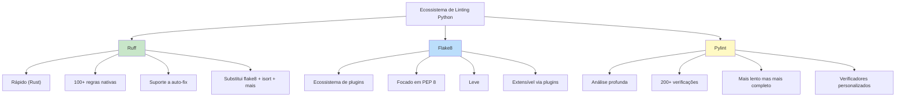
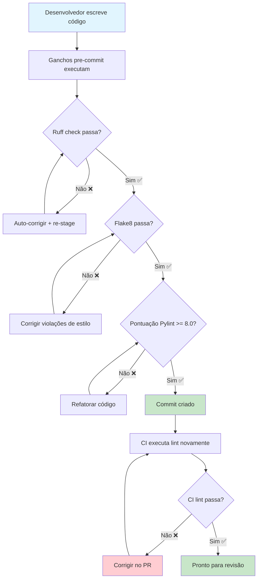

# Linting e Qualidade de Código

Linters são ferramentas de análise estática que detectam erros potenciais, violações de estilo e maus cheiros de código **sem executar seu código**. Eles aplicam consistência, capturam bugs cedo e fazem com que as revisões de código foquem na lógica em vez de formatação.

## Por que Usar Lint?

| Benefício | Sem Linter | Com Linter |
|---------|-----------|-------------|
| **Consistência** | Cada desenvolvedor tem seu próprio estilo | Base de código segue regras acordadas |
| **Prevenção de Bugs** | `==` em vez de `is None` passa despercebido | Linter captura automaticamente |
| **Revisão de Código** | 30% dos comentários sobre formatação | Revisões focam na arquitetura |
| **Integração** | Novos devs aprendem convenções do código | Linter os ensina |
| **CI/CD** | Problemas de estilo bloqueiam pipelines | Linter executa automaticamente |

## Os Três Principais Linters Python



| Funcionalidade | Flake8 | Pylint | Ruff |
|---------------|--------|--------|------|
| **Velocidade** | Rápido | Lento | Muito Rápido (Rust) |
| **Instalação** | `pip install flake8` | `pip install pylint` | `pip install ruff` |
| **Regras** | ~100 + plugins | ~200+ | ~800+ (vários ecossistemas) |
| **Auto-correção** | Não | Não | Sim |
| **Config** | `.flake8` / `tox.ini` | `.pylintrc` | `pyproject.toml` / `ruff.toml` |
| **Nativo** | PEP 8 básico | Abrangente | Flake8 + isort + pycodestyle |
| **Linguagem** | Python | Python | Rust (interface Pycross) |
| **Adoção** | Maduro, estável | Legado, verboso | Moderno, crescimento rápido |

## Flake8: O Padrão Confiável

### Instalação e Uso Básico

```bash
# Instalar
pip install flake8

# Executar no diretório atual
flake8

# Executar em arquivos específicos
flake8 src/ tests/

# Mostrar códigos de erro
flake8 --statistics

# Sair com contagem de erros
flake8 --exit-zero

# Gerar relatório
flake8 --output-file=flake8_report.txt
```

### Configuração

```ini
# .flake8
[flake8]
max-line-length = 100
extend-ignore = E203, W503
exclude =
    .git,
    __pycache__,
    migrations/,
    build/,
    dist/,
    .venv,
    venv/
max-complexity = 10
per-file-ignores =
    __init__.py: F401
    tests/*: S101
statistics = True
```

### Códigos de Erro Flake8

| Código | Regra | Exemplo |
|-------|-------|---------|
| **E1** | Indentação | `E111: 4 espaços por indentação` |
| **E2** | Espaço em branco | `E203: espaço em branco antes de ':'` |
| **E3** | Linhas em branco | `E302: esperadas 2 linhas em branco após classe` |
| **E4** | Imports | `E401: múltiplos imports em uma linha` |
| **E5** | Tamanho de linha | `E501: linha muito longa (100 > 79)` |
| **E7** | Statements | `E701: múltiplos statements em uma linha` |
| **W1** | Aviso | `W191: indentação contém tabs` |
| **W2** | Aviso | `W292: sem nova linha no final do arquivo` |
| **W5** | Aviso | `W503: quebra de linha antes de operador binário` |
| **F4** | Import | `F401: módulo importado mas não usado` |
| **F6** | Definição | `F601: chave de dicionário duplicada` |
| **F8** | Nome | `F821: nome indefinido 'foo'` |

### Plugins Flake8

```bash
# Instalar plugins
pip install flake8-docstrings
pip install flake8-bugbear
pip install flake8-bandit
pip install flake8-builtins
pip install flake8-comprehensions
pip install flake8-import-order
pip install flake8-annotations
```

```ini
# .flake8 com plugins
[flake8]
max-line-length = 100
extend-ignore = E203, W503
extend-select = B, D, C4, ANN
per-file-ignores =
    __init__.py: F401
    tests/*: D100, D101, D102, ANN
```

```python
# Flake8 com plugins em ação

def processar_dados(dados):  # ANN001: anotação de tipo ausente para 'dados'
    """Processa os dados fornecidos."""  # D200: docstring deve caber em uma linha
    resultado = []
    for i, item in enumerate(dados):
        # Usando enumerate mas nunca usando 'i' - B007 capturado por bugbear
        resultado.append(item * 2)
    return resultado


def validar_usuario(nome, email, idade):  # ANN001, ANN002
    """
    Valida dados do usuário.

    Verifica restrições de nome, email e idade.
    """
    if nome is None or nome == "":  # B101: use .strip() ou compare a ""
        raise ValueError("Nome obrigatório")
    return True
```

## Pylint: Análise Profunda

### Instalação e Uso Básico

```bash
# Instalar
pip install pylint

# Executar em um arquivo
pylint src/main.py

# Executar em um módulo
pylint src

# Gerar arquivo de configuração
pylint --generate-rcfile > .pylintrc

# Pontuação apenas (sem saída)
pylint src --score=y

# Especificar arquivo de configuração
pylint --rcfile=.pylintrc src/
```

### Saída do Pylint

```
************* Module src.main
src/main.py:10:4: W0621: Redefinição de nome 'processar_dados' de escopo externo (redefined-outer-name)
src/main.py:15:8: E1101: Instância de 'list' não tem membro 'fazer_algo' (no-member)
src/main.py:22:0: C0116: Docstring de função ou método ausente (missing-function-docstring)
src/main.py:30:15: C0103: Nome de variável "x" não segue estilo snake_case (invalid-name)
src/main.py:45:0: R0914: Muitas variáveis locais (16/15) (too-many-locals)
```

### Categorias de Mensagem do Pylint

| Categoria | Código | Significado | Contagem |
|----------|-------|-------------|---------|
| **Convenção** | `C0xxx` | Estilo/formatação | 50+ |
| **Refatorar** | `R0xxx` | Mau cheiro de código | 20+ |
| **Aviso** | `W0xxx` | Problemas potenciais | 80+ |
| **Erro** | `E0xxx` | Prováveis bugs | 60+ |
| **Fatal** | `F0xxx` | Crash do Pylint | 5 |

### Configuração .pylintrc

```ini
# .pylintrc
[MASTER]
ignore = .git,__pycache__,migrations,.venv
jobs = 4
load-plugins = pylint_django,pylint_flask

[MESSAGES CONTROL]
disable =
    C0111,  # missing-docstring (muito restritivo)
    C0103,  # invalid-name
    R0903,  # too-few-public-methods
    W0511,  # fixme (permitir comentários TODO)

[FORMAT]
max-line-length = 100
expected-line-ending-format = LF

[DESIGN]
max-args = 7
max-attributes = 10
max-locals = 20
max-returns = 6
max-branches = 15
max-statements = 50
max-parents = 7
min-public-methods = 1
max-public-methods = 30

[SIMILARITIES]
min-similarity-lines = 10
ignore-comments = yes
ignore-docstrings = yes
ignore-imports = yes

[BASIC]
good-names = i, j, k, ex, Run, _, id, pk
bad-names = foo, bar, baz
```

> [!NOTE]
> Pontuação do Pylint: 10,0 é perfeito. A maioria dos projetos visa 8,0-9,0. Use `--fail-under=8.0` no CI para aplicar uma pontuação mínima.

## Ruff: A Potência Moderna

Ruff é um linter baseado em Rust que é **10-100x mais rápido** que linters Python tradicionais.

### Instalação e Uso Básico

```bash
# Instalar
pip install ruff

# Executar no diretório atual
ruff check .

# Auto-corrigir problemas
ruff check --fix .

# Mostrar configurações
ruff check --show-settings

# Gerar arquivo de configuração
ruff check --generate-docs > REGRAS.md
```

### Configuração Ruff

```toml
# pyproject.toml
[tool.ruff]
target-version = "py312"
line-length = 100

[tool.ruff.lint]
select = ["E", "F", "I", "N", "W", "D", "B", "SIM", "UP", "S"]
ignore = ["E203", "W503", "D100", "D104"]

[tool.ruff.lint.per-file-ignores]
"__init__.py" = ["F401"]
"tests/**" = ["D", "S101"]

[tool.ruff.format]
quote-style = "double"
indent-style = "space"
line-ending = "lf"

[tool.ruff.lint.pydocstyle]
convention = "google"
```

```bash
# Verificações específicas do Ruff
ruff check --select ALL  # Habilitar todas as regras
ruff check --select E,W,F  # Regras Flake8
ruff check --select I  # Ordenação de imports
ruff check --select N  # Convenções de nomenclatura
ruff check --select D  # Convenções de docstring
ruff check --select B  # Regras Bugbear
ruff check --select SIM # Simplificar expressões
ruff check --select UP # Pyupgrade (modernizar)
ruff check --select S  # Segurança (regras bandit)
```

### Saída do Ruff

```bash
$ ruff check src/
src/main.py:1:1: F401 [*] `os` importado mas não usado
src/main.py:5:5: E225 espaço em branco ausente ao redor do operador
src/main.py:8:1: E302 esperadas 2 linhas em branco após classe, encontrado 1
src/main.py:12:9: B006 Não use estruturas de dados mutáveis para valores padrão de argumentos
src/main.py:15:1: D100 Docstring ausente em módulo público
src/main.py:20:12: SIM105 Use `contextlib.suppress` em vez de `try-except-pass`
Encontrados 6 erros.
[*] 2 corrigíveis com a opção `--fix`.
```

### Antes e Depois do Ruff

```python
# ANTES: Código bagunçado
import os,sys
from collections import *

class processador_dados:
    def __init__(self,dados=[]):  # B006: padrão mutável
        self.dados = dados
    def processar(self,item):
        if item in ['a','b','c']:pass
        else:
            try:
                resultado=fazer_algo(item)
            except:  # E722: except puro
                pass
        return None
```

```python
# DEPOIS: Correções do Ruff aplicadas
import sys
from collections import defaultdict

class ProcessadorDados:
    def __init__(self, dados=None):
        if dados is None:
            dados = []
        self.dados = dados

    def processar(self, item):
        if item in {'a', 'b', 'c'}:
            return None
        resultado = fazer_algo(item)
        return resultado
```

## Integrando Linters no Pre-Commit

```yaml
# .pre-commit-config.yaml
repos:
  # Ruff (rápido, abrangente)
  - repo: https://github.com/astral-sh/ruff-pre-commit
    rev: v0.4.8
    hooks:
      - id: ruff
        args: [--fix, --exit-non-zero-on-fix]

  # Flake8 (verificações complementares)
  - repo: https://github.com/pycqa/flake8
    rev: 7.1.0
    hooks:
      - id: flake8
        additional_dependencies:
          - flake8-docstrings
          - flake8-bugbear

  # Pylint (análise profunda)
  - repo: https://github.com/pycqa/pylint
    rev: v3.2.2
    hooks:
      - id: pylint
        args: [--fail-under=8.0]
```

## Integração com CI

```yaml
# .github/workflows/lint.yml
name: Linting

on:
  pull_request:
  push:
    branches: [main]

jobs:
  lint:
    runs-on: ubuntu-latest
    strategy:
      matrix:
        linter: [ruff, flake8, pylint]

    steps:
      - uses: actions/checkout@v4
      - uses: actions/setup-python@v5
        with:
          python-version: '3.12'

      - name: Instalar dependências
        run: |
          pip install -r requirements.txt
          pip install ruff flake8 flake8-docstrings flake8-bugbear pylint

      - name: Executar ${{ matrix.linter }}
        run: make lint-{{ matrix.linter }}

      - name: Gerar relatório
        if: always()
        run: |
          ruff check . --output-format=github > ruff_report.txt 2>&1 || true
```

```makefile
# Makefile
.PHONY: lint lint-ruff lint-flake8 lint-pylint

lint: lint-ruff lint-flake8 lint-pylint

lint-ruff:
	ruff check src/ tests/
	ruff format --check src/ tests/

lint-flake8:
	flake8 src/ tests/ --statistics

lint-pylint:
	pylint src/ --fail-under=8.0

lint-fix:
	ruff check --fix src/ tests/
	ruff format src/ tests/
```



## Comparação de Configuração de Linting

| Configuração | Flake8 | Pylint | Ruff |
|-------------|--------|--------|------|
| Arquivo de config | `.flake8` / `tox.ini` | `.pylintrc` | `pyproject.toml` / `ruff.toml` |
| Tamanho de linha | `max-line-length=100` | `max-line-length=100` | `line-length=100` |
| Ignorar regras | `extend-ignore=E203` | `disable=C0111` | `ignore=["E203"]` |
| Excluir arquivos | `exclude=.git,venv` | `ignore=.git,venv` | `exclude=["venv"]` |
| Config por arquivo | `per-file-ignores` | `--disable=` blocks | `per-file-ignores` |
| Limiar de falha | Código de saída 0-3 | `--fail-under=8.0` | Código de saída 0-1 |

## Suprimindo Avisos do Linter

```python
# Supressão Flake8
def funcao_ruim():  # noqa: E501
    linha_longa = "x" * 200  # noqa: E501

# Supressão Pylint
class MinhaClasse:  # pylint: disable=too-few-public-methods
    def meu_metodo(self):
        pass

# Supressão Ruff
resultado = 1 + 1  # noqa: SIM114 (se aplicável)

# Supressão em nível de arquivo
# flake8: noqa: E501, W503
# ruff: noqa: E501
```

> [!WARNING]
> Suprima avisos com moderação. Cada supressão deve ter um comentário explicando POR QUÊ. Muitas supressões derrotam o propósito de ter um linter.

## Exercícios Práticos

1. **Instale e Configure Flake8**: Instale flake8 e crie uma config `.flake8` que defina tamanho de linha para 100, ignore E203 e W503, e exclua os diretórios `migrations/` e `.venv/`.

2. **Corrija Violações Flake8**: Dado este código, corrija todas as violações flake8:
   ```python
   import os,sys

   class calculadora:
       def adicionar(self,a,b):
           return a+b
       def subtrair(self,a,b):
           return a-b
   ```

3. **Migração para Ruff**: Pegue um projeto usando flake8 + isort + pycodestyle e crie uma única configuração ruff que substitua todas as três. Verifique se as mesmas regras são aplicadas.

4. **Melhoria de Pontuação Pylint**: Configure pylint com um limiar de pontuação. Escreva código que pontue abaixo de 5,0, depois refatore até que pontue acima de 9,0. Documente as mudanças que fez.

5. **Conjunto de Regras Personalizado**: Crie uma configuração de linting para um projeto de equipe. Inclua regras para docstrings (convenção google), anotações de tipo, tratamento de erros e convenções de nomenclatura.

6. **Duelo de Linters**: Crie um arquivo de teste com 10 práticas ruins intencionais. Execute flake8, pylint e ruff nele. Compare a saída de cada um. Qual captura mais problemas? Qual é mais rápido?

7. **Pipeline CI**: Crie um workflow do GitHub Actions que execute ruff, flake8 e pylint em todo PR. O pipeline deve falhar se qualquer linter encontrar violações.

8. **Linting no Pre-Commit**: Adicione ruff e flake8 como ganchos pre-commit. Configure ruff para auto-corrigir problemas e flake8 para apenas relatar erros (não avisos). Verifique se os ganchos funcionam com arquivos staged e não staged.

## Resumo

- **Flake8**: Rápido, baseado em plugins, focado em PEP 8. Bom para verificações rápidas de estilo.
- **Pylint**: Análise profunda, 200+ regras, sistema de pontuação. Melhor para revisão abrangente de código.
- **Ruff**: Extremamente rápido (Rust), substitui múltiplas ferramentas, suporte a auto-correção. Padrão moderno.
- **Integração**: Todos os três funcionam com ganchos pre-commit e pipelines CI.
- **Configuração**: Cada ferramenta tem seu próprio formato de arquivo de config — mantenha-os no controle de versão.
- **Supressão**: Use `# noqa` com moderação com comentários explicativos.
- **Estratégia**: Comece com Ruff (feedback rápido), adicione Flake8 (ecossistema de plugins), use Pylint para análise profunda periódica.

> [!SUCCESS]
> Linting transforma qualidade de código de uma negociação humana em uma garantia automatizada. Com a configuração certa de linter, sua base de código permanece consistente, suas revisões permanecem focadas e seus bugs permanecem mínimos.
