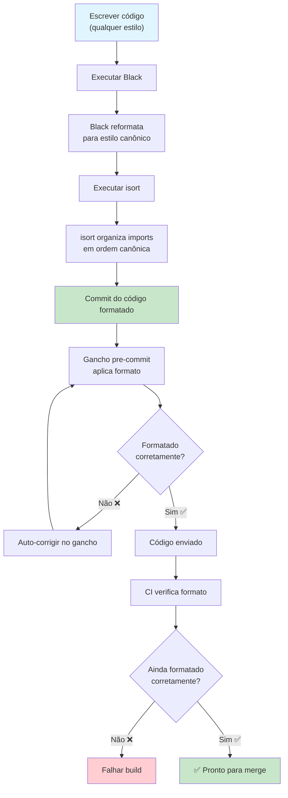

# Formatação de Código

Formatação de código é o aspecto mais debatido e menos importante da programação — exatamente por isso deve ser **automatizada**. Formatadores como Black e isort eliminam discussões de formatação inteiramente ao aplicar um estilo consistente e legível por máquina.

## Por que Automatizar Formatação?

| Problema | Formatação Manual | Formatação Automatizada |
|---------|------------------|------------------------|
| **Bike-shedding** | Debate "Tabs vs espaços?" por horas | O formatador decide |
| **Inconsistência** | Cada arquivo parece diferente | Todo arquivo segue as mesmas regras |
| **Poluição de diff** | Mudanças reais misturadas com formatação | Apenas mudanças significativas em diffs |
| **Revisão de código** | 30% dos comentários sobre formatação | 100% sobre lógica |
| **Integração** | "Nosso guia de estilo é..." | "Execute `make format`" |



## Black: O Formatador Sem Compromisso

Black é "o formatador de código Python sem compromisso." Tem muito poucas opções de configuração por design — produz saída consistente independente de quem executa.

### Instalação

```bash
# Instalar Black
pip install black

# Verificar versão
black --version

# Formatar um arquivo ou diretório
black src/main.py
black src/ tests/

# Verificar se arquivos precisam de formatação (sem alterar)
black --check src/ tests/

# Ver o que mudaria (modo diff)
black --diff src/main.py

# Formatar com tamanho de linha específico
black --line-length=100 src/

# Modo rápido (pular validação AST)
black --fast src/
```

### Configuração Black

```toml
# pyproject.toml
[tool.black]
line-length = 100
target-version = ["py312"]
include = '\.pyi?$'
extend-exclude = '''
/(
    \.eggs
  | \.git
  | \.hg
  | \\.mypy_cache
  | \\.tox
  | \\.venv
  | _build
  | buck-out
  | build
  | dist
  | migrations
)/
'''

# setup.cfg (alternativa)
[black]
line_length = 100
target_version = py312
include = \.pyi?$
extend-exclude = \.eggs|\.git|\.hg|\.mypy_cache|\.tox|\.venv|_build|buck-out|build|dist
```

### Antes e Depois do Black

```python
# ANTES: Formatação inconsistente
def calcular_total(itens,desconto=0):
    total=sum(item['preco']*item.get('qtd',1) for item in itens)
    if desconto>0:
        total=total-(total*desconto)
    return round(total,2)

def processar_dados(
    dados,transformacao=None,
    validar=True):
    resultado=[]
    for d in dados:
        if validar and not eh_valido(d):continue
        v = transformacao(d) if transformacao else d
        resultado.append(v)
    return resultado
```

```python
# DEPOIS: Formatado pelo Black
def calcular_total(itens, desconto=0):
    total = sum(item["preco"] * item.get("qtd", 1) for item in itens)
    if desconto > 0:
        total = total - (total * desconto)
    return round(total, 2)


def processar_dados(dados, transformacao=None, validar=True):
    resultado = []
    for d in dados:
        if validar and not eh_valido(d):
            continue
        v = transformacao(d) if transformacao else d
        resultado.append(v)
    return resultado
```

### Transformações do Black

| Padrão | Antes do Black | Depois do Black |
|--------|---------------|-----------------|
| Espaços | `x=1+2` | `x = 1 + 2` |
| Aspas | `x = 'hello'` | `x = "hello"` |
| Parênteses | `resultado = (1 + 2) * 3` | `resultado = (1 + 2) * 3` |
| Quebras de linha | `x = func(arg1, arg2, ...)` (> 88 chars) | Formatação multi-linha |
| Vírgula final | `func(a, b, c)` | `func(a, b, c)` (adiciona em multi-linha) |
| Linhas em branco | Espaçamento inconsistente | Exatamente 2 antes de funções/classes |
| Vírgula mágica | `func(a,b,)` | Preserva e usa para formatação vertical |

### Vírgula Final Mágica

```python
# Black usa vírgulas finais para decidir estilo de formatação

# Sem vírgula final → Black coloca tudo em uma linha
resultado = calcular_coisa_complexa(arg1, arg2, arg3)

# Com vírgula final → Black expande verticalmente
resultado = calcular_coisa_complexa(
    arg1,
    arg2,
    arg3,
)

# Use vírgula final para controlar formatação
itens = [
    "maca",
    "banana",
    "laranja",
    "uva",  # ← vírgula final força layout vertical
]
```

## isort: Organização de Imports

isort ordena e agrupa imports de acordo com uma convenção padrão.

### Instalação

```bash
# Instalar isort
pip install isort

# Ordenar imports de um arquivo
isort src/main.py

# Verificar se imports precisam de ordenação
isort --check-only src/

# Mostrar diff das mudanças
isort --diff src/main.py

# Ordenar projeto inteiro
isort src/ tests/

# Gerar arquivo de configuração
isort --print-settings > .isort.cfg
```

### Configuração isort

```toml
# pyproject.toml
[tool.isort]
profile = "black"
line_length = 100
multi_line_output = 3
include_trailing_comma = true
force_grid_wrap = 0
use_parentheses = true
ensure_newline_before_comments = true
sections = ["FUTURE", "STDLIB", "THIRDPARTY", "FIRSTPARTY", "LOCALFOLDER"]
known_first_party = ["src"]
known_third_party = ["django", "pytest", "requests", "numpy"]
skip = ["migrations", ".venv"]
```

### Seções de Import do isort

isort organiza imports em seções separadas por linhas em branco:

```python
# Biblioteca padrão
import os
import sys
from datetime import datetime
from pathlib import Path

# Bibliotecas de terceiros (linha em branco)
import pytest
import requests
from django.db import models
from numpy import array

# Primeiro parte / módulos do projeto (linha em branco)
from src.models import Usuario
from src.services import ServicoPagamento

# Pasta local (linha em branco)
from .utils import helpers
from ..config import configuracoes
```

### Antes e Depois do isort

```python
# ANTES: Imports bagunçados
from django.db import models
import sys, os
from ..config import configuracoes
import requests
from datetime import datetime
import pytest
from src.models import Usuario
from pathlib import Path
from .utils import helpers
import numpy
```

```python
# DEPOIS: isort organizou
import os
import sys
from datetime import datetime
from pathlib import Path

import numpy
import pytest
import requests
from django.db import models

from src.models import Usuario

from .utils import helpers
from ..config import configuracoes
```

## Integração Black + isort

### Configuração Pre-Commit

```yaml
# .pre-commit-config.yaml
repos:
  - repo: https://github.com/psf/black
    rev: 24.4.2
    hooks:
      - id: black
        args: [--line-length=100]
        language_version: python3.12

  - repo: https://github.com/pycqa/isort
    rev: 5.13.2
    hooks:
      - id: isort
        args: [--profile, black, --line-length=100]
```

### A Ordem Importa!

Execute isort **antes** do Black — ou configure isort com `profile = "black"`:

```bash
# Ordem correta: isort primeiro, depois black
isort src/ && black src/

# Ou use o perfil black no isort
# isort respeitará a formatação do Black
isort --profile black src/
```

```yaml
# Makefile
.PHONY: format

format:
	isort --profile black src/ tests/
	black --line-length 100 src/ tests/

format-check:
	isort --check-only --profile black src/ tests/
	black --check --line-length 100 src/ tests/
```

## Padrões Avançados de Formatação

### Normalização de Strings com Black

```python
# Black normaliza aspas de string (aspas duplas preferidas)
mensagem = 'Olá, Mundo!'  # → mensagem = "Olá, Mundo!"

# Mas preserva strings com três aspas
docstring = """Esta é uma docstring."""  # Permece como está

# Aspas escapadas são tratadas
texto = "Ela disse, \"Olá\""  # → texto = 'Ela disse, "Olá"'
```

### Estratégias de Tamanho de Linha

```python
# Estratégia 1: Deixe o Black quebrar linhas longas
def processar_dados(dados, transformacao=None, validar=True, cache_resultados=False):
    # Black lida com isso automaticamente baseado no tamanho de linha
    pass

# Estratégia 2: Use vírgula final para formatação vertical
resultado_importante = alguma_funcao(
    argumento_um,
    argumento_dois,
    argumento_tres,
    argumento_quatro,
)

# Estratégia 3: Use parênteses para quebras de linha explícitas
resultado = (
    primeiro_operando
    + segundo_operando
    - terceiro_operando
    * quarto_operando
)
```

## Formatação no CI

```yaml
# .github/workflows/format.yml
name: Verificação de Formatação

on: [pull_request]

jobs:
  format:
    runs-on: ubuntu-latest
    steps:
      - uses: actions/checkout@v4
      - uses: actions/setup-python@v5
        with:
          python-version: '3.12'

      - name: Instalar formatadores
        run: |
          pip install black isort

      - name: Verificar formatação com isort
        run: |
          isort --check-only --diff --profile black src/ tests/

      - name: Verificar formatação com Black
        run: |
          black --check --diff --line-length 100 src/ tests/

      - name: Mostrar erros de formatação
        if: failure()
        run: |
          echo "❌ Problemas de formatação encontrados. Execute:"
          echo "  isort --profile black src/ tests/"
          echo "  black --line-length 100 src/ tests/"
```

## Exercícios Práticos

1. **Instale e Execute Black**: Instale Black e formate um arquivo Python bagunçado. Use `--diff` para ver o que mudou. Use `--check` para verificar formatação sem modificar arquivos.

2. **Configure Black**: Configure pyproject.toml com configuração do Black. Defina tamanho de linha para 100, target Python 3.12, e exclua migrations e ambientes virtuais.

3. **Perfis isort**: Crie uma configuração isort com `profile = "black"`. Crie um arquivo com imports deliberadamente embaralhados e verifique se isort os organiza corretamente.

4. **A Vírgula Final Mágica**: Escreva uma função com 8 parâmetros. Formate com Black sem vírgulas finais, depois adicione uma vírgula final e formate novamente. Observe a diferença na formatação.

5. **Formatação no Pre-Commit**: Adicione Black e isort como ganchos pre-commit. Configure-os para que a formatação seja aplicada automaticamente em cada commit. Teste escrevendo código não formatado e commitando.

6. **Portão de Formatação no CI**: Crie um workflow do GitHub Actions que verifique formatação em todo PR. A build deve falhar se qualquer arquivo não estiver devidamente formatado. Inclua instruções na mensagem de erro sobre como corrigir.

7. **Ruff como Formatador**: Migre um projeto de Black + isort para usar ruff tanto para linting quanto para formatação. Compare o tamanho da configuração e a velocidade de execução.

8. **Convenção de Formatação da Equipe**: Sua equipe de 10 desenvolvedores discorda sobre formatação. Escreva uma proposta que inclua: (a) por que formatação automatizada é melhor que manual, (b) qual ferramenta usar e por quê, (c) a configuração exata, (d) como integrar no fluxo de trabalho.

## Resumo

- **Black** é o formatador sem compromisso — config mínima, saída consistente
- **isort** organiza imports em seções padrão (stdlib, terceiros, primeiro parte)
- **Sempre execute isort antes do Black** — ou configure isort com `profile = "black"`
- **A vírgula final mágica** controla layout vertical vs horizontal no Black
- **Ganchos pre-commit** automatizam formatação antes do código ser commitado
- **Verificações CI** garantem que a formatação nunca seja esquecida
- **Ruff format** é um substituto mais rápido para Black
- **Consistência vence perfeição** — qualquer formatação automatizada é melhor que debates de formatação manual

> [!SUCCESS]
> Formatação automatizada elimina categorias inteiras de comentários de revisão de código. Com Black e isort, sua equipe gasta zero tempo em debates de formatação e 100% da energia de revisão no que importa: lógica, arquitetura e correção.
