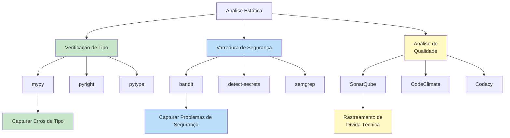
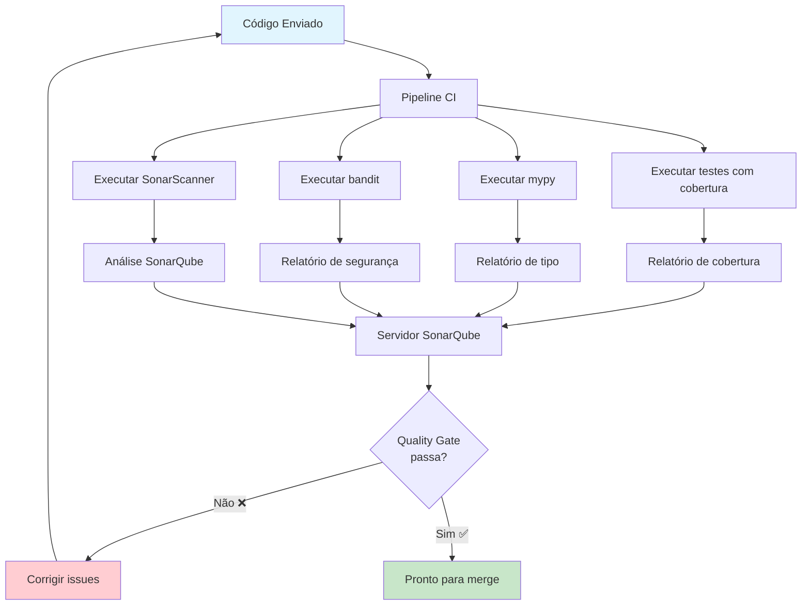

# Análise Estática e Varredura de Código

Análise estática examina seu código **sem executá-lo** para encontrar bugs, vulnerabilidades de segurança, erros de tipo e problemas de qualidade de código. Diferente de linters (que aplicam estilo), analisadores estáticos encontram **bugs potenciais reais** em sua lógica.

## Tipos de Análise Estática



| Ferramenta | Propósito | Encontra | Velocidade |
|-----------|---------|---------|-----------|
| **mypy** | Verificação de tipo | Incompatibilidades de tipo, segurança None, retornos ausentes | Moderada |
| **bandit** | Varredura de segurança | SQL injection, senhas hardcoded, eval inseguro | Rápida |
| **SonarQube** | Qualidade abrangente | Bugs, vulnerabilidades, maus cheiros, duplicação | Lenta |

## Verificação de Tipo com mypy

mypy é o verificador de tipo estático padrão para Python. Ele verifica se suas anotações de tipo são consistentes com como o código realmente usa os valores.

### Instalação

```bash
# Instalar mypy
pip install mypy

# Instalar type stubs para bibliotecas
pip install types-requests types-PyYAML types-python-dateutil

# Executar mypy em um arquivo
mypy src/main.py

# Executar mypy em um módulo
mypy src

# Executar mypy com modo estrito
mypy --strict src/

# Gerar arquivo de configuração
mypy --generate-config
```

### Configuração Básica mypy

```toml
# pyproject.toml
[tool.mypy]
python_version = "3.12"
strict = true
ignore_missing_imports = true
disallow_untyped_defs = true
disallow_any_unimported = false
no_implicit_optional = true
warn_redundant_casts = true
warn_unused_ignores = true
warn_return_any = true
warn_unreachable = true

exclude = [
    "migrations/",
    "build/",
    ".venv/",
    "tests/",
]

[[tool.mypy.overrides]]
module = "tests.*"
disallow_untyped_defs = false
ignore_missing_imports = true
```

### mypy em Ação

```python
# ANTES: Sem anotações de tipo (mypy não pode ajudar)
def processar_usuario(dados_usuario):
    nome = dados_usuario["nome"]
    idade = dados_usuario["idade"]
    return f"{nome} tem {idade} anos"


def calcular_desconto(preco, porcentagem):
    return preco * porcentagem
```

```python
# DEPOIS: Com anotações de tipo (mypy captura erros)
from typing import Protocol


class DadosUsuario(Protocol):
    nome: str
    idade: int


def processar_usuario(dados_usuario: DadosUsuario) -> str:
    nome: str = dados_usuario.nome
    idade: int = dados_usuario.idade
    return f"{nome} tem {idade} anos"


def calcular_desconto(preco: float, porcentagem: float) -> float:
    return preco * porcentagem
```

### Erros Comuns do mypy

```python
from typing import Optional, Union, Any


# Erro 1: Segurança None
def obter_nome_usuario(usuario_id: int) -> Optional[str]:
    if usuario_id == 1:
        return "Alice"
    return None


def processar_usuario(usuario_id: int) -> str:
    nome = obter_nome_usuario(usuario_id)
    # ERRO: Argumento 1 para "len" tem tipo incompatível "Optional[str]"; esperado "str"
    return f"Usuário: {nome.upper()}"  # erro mypy!
    # Correção: nome = obter_nome_usuario(usuario_id) or "Desconhecido"
    #           nome.upper()


# Erro 2: Incompatibilidade de tipo
def adicionar(a: int, b: int) -> int:
    return a + b


resultado = adicionar(1, "2")  # erro mypy: Argumento 2 incompatível


# Erro 3: Retorno ausente
def validar_idade(idade: int) -> bool:
    if idade < 0:
        return False
    # ERRO: Statement de retorno ausente
    # Correção: return idade >= 0


# Erro 4: Tipo de retorno incompatível
def obter_item(itens: list[int], indice: int) -> int:
    if indice < len(itens):
        return itens[indice]
    return None  # erro mypy: tipo de retorno incompatível
    # Correção: return -1 ou use Optional[int]
```

### Estratégia de Tipagem Gradual

```python
# Estágio 1: Apenas assinaturas de função (mais valor)
def criar_usuario(nome: str, email: str) -> Usuario:
    ...

# Estágio 2: Adicionar tipos de retorno em todo lugar
def encontrar_usuario(usuario_id: int) -> Optional[Usuario]:
    ...

# Estágio 3: Anotações completas (variáveis internas também)
def calcular_total(itens: list[Item]) -> float:
    total: float = 0.0
    for item in itens:
        total += item.preco * item.quantidade
    return total
```

### Type Stubs para Bibliotecas Externas

```bash
# Types para bibliotecas populares
pip install types-requests
pip install types-PyYAML
pip install types-python-dateutil
pip install types-beautifulsoup4
pip install types-redis
pip install types-pytz
```

```python
# Com types-requests instalado, mypy verifica isto:
import requests


def buscar_dados(url: str) -> dict:
    response = requests.get(url)
    response.raise_for_status()
    return response.json()  # Corretamente tipado como dict
```

### Flags do Modo Strict do mypy

| Flag | O que Faz |
|------|-----------|
| `--strict` | Habilita todas as flags estritas abaixo |
| `--disallow-untyped-defs` | Todas as funções devem ter anotações de tipo |
| `--disallow-incomplete-defs` | Anotações parciais não permitidas |
| `--disallow-untyped-calls` | Não pode chamar funções sem anotações de tipo |
| `--no-implicit-optional` | `Optional[T]` deve ser explícito |
| `--warn-redundant-casts` | Avisa sobre chamadas `cast()` desnecessárias |
| `--warn-unused-ignores` | Avisa sobre comentários `# type: ignore` não usados |
| `--warn-return-any` | Avisa quando função retorna `Any` inferido |
| `--warn-unreachable` | Avisa sobre código inalcançável |

## Varredura de Segurança com bandit

Bandit encontra problemas de segurança comuns em código Python.

### Instalação

```bash
# Instalar bandit
pip install bandit

# Executar bandit em um diretório
bandit -r src/

# Executar com severidade/confiança específica
bandit -r src/ -ll  # Apenas severidade média+
bandit -r src/ -iii # Apenas confiança média+

# Gerar relatório HTML
bandit -r src/ -f html -o bandit_report.html

# Gerar relatório JSON
bandit -r src/ -f json -o bandit_report.json

# Usar baseline (pular issues conhecidas)
bandit -r src/ -b .bandit_baseline.json
```

### Configuração Bandit

```ini
# .bandit
[bandit]
exclude: tests,.venv,migrations
tests: B101,B102,B301,B302,B303,B304,B305,B306,B307,B308,B309,B310,B311,B312,B313,B314,B315,B316,B317,B318,B319,B320,B321,B322,B323,B324,B325,B326,B327,B328,B329,B330,B331,B332,B333,B334,B335,B336,B337,B338,B339,B340,B341,B342,B343,B344,B345,B346,B347,B348,B349,B350,B351,B352,B353,B354,B355,B356,B357,B358,B359,B360,B361,B362,B363,B364,B365,B366,B367,B368,B369,B370,B371,B372,B373,B374,B375,B376,B377,B378,B379,B380,B381,B382,B383,B384,B385,B386,B387,B388,B389,B390,B391,B392,B393,B394,B395,B396,B397,B398,B399,B400,B401,B402,B403,B404,B405,B406,B407,B408,B409,B410,B411,B412,B413,B414,B415,B416,B417,B418,B419,B420,B421,B422,B423,B424,B425,B426,B427,B428,B429,B430,B431,B432,B433,B434,B435,B436,B437,B438,B439,B440,B441,B442,B443,B444,B445,B446,B447,B448,B449,B450,B451,B452,B453,B454,B455,B456,B457,B458,B459,B460,B461,B462,B463,B464,B465,B466,B467,B468,B469,B470,B471,B472,B473,B474,B475,B476,B477,B478,B479,B480,B481,B482,B483,B484,B485,B486,B487,B488,B489,B490,B491,B492,B493,B494,B495,B496,B497,B498,B499,B500
skips: B101,B311
```

### Problemas de Segurança do Bandit

```python
import hashlib
import subprocess
import os

# B102: uso de exec() (perigoso)
exec("print('hello')")  # BANDIT: B102

# B201: subprocess com shell=True
subprocess.call("ls -la", shell=True)  # BANDIT: B201

# B303: MD5 usado para senha
hashlib.md5(b"senha")  # BANDIT: B303

# B105: Senha hardcoded
senha = "super_secreta_123"  # BANDIT: B105

# B106: Chave de API hardcoded
API_KEY = "sk-abc123def456"  # BANDIT: B106

# B108: Arquivo temp em local inseguro
caminho_arquivo = "/tmp/dados.txt"  # BANDIT: B108

# B110: Except puro (captura todas as exceções)
try:
    fazer_algo()
except:  # BANDIT: B110
    pass

# B112: Try/except/pass
try:
    fazer_algo()
except ValueError:
    pass  # BANDIT: B112

# B301: Pickle (desserialização perigosa)
import pickle
dados = pickle.loads(dados_inseguros)  # BANDIT: B301

# B320: Risco de SQL injection
cursor.execute("SELECT * FROM usuarios WHERE id = " + entrada_usuario)  # BANDIT: B320
```

### Escrevendo Código Seguro (Bandit-Safe)

```python
import secrets
import hashlib
import subprocess
from typing import Optional


# ✅ Seguro: Use variáveis de ambiente para segredos
SENHA_BANCO = os.environ.get("SENHA_BANCO")
if not SENHA_BANCO:
    raise ValueError("SENHA_BANCO não definida")


# ✅ Seguro: Use consultas parametrizadas
def obter_usuario(usuario_id: int) -> Optional[dict]:
    cursor.execute("SELECT * FROM usuarios WHERE id = ?", (usuario_id,))
    return cursor.fetchone()


# ✅ Seguro: Use subprocess sem shell
def listar_diretorio(caminho: str) -> list[str]:
    resultado = subprocess.run(
        ["ls", "-la", caminho],
        capture_output=True,
        text=True,
        check=True,
    )
    return resultado.stdout.splitlines()


# ✅ Seguro: Use módulo secrets para aleatoriedade sensível
def gerar_token_reset() -> str:
    return secrets.token_hex(32)


# ✅ Seguro: Use hashlib com segurança
def hash_senha(senha: str) -> str:
    salt = secrets.token_hex(16)
    return hashlib.pbkdf2_hmac("sha256", senha.encode(), salt.encode(), 100000).hex()
```

### Integração Bandit no CI

```yaml
# .github/workflows/security.yml
name: Varredura de Segurança

on: [pull_request, push]

jobs:
  security:
    runs-on: ubuntu-latest
    steps:
      - uses: actions/checkout@v4
      - uses: actions/setup-python@v5
        with:
          python-version: '3.12'

      - name: Instalar bandit
        run: pip install bandit

      - name: Executar varredura bandit
        run: |
          bandit -r src/ -ll -f json -o bandit_report.json || true

      - name: Falhar em issues de alta severidade
        run: |
          HIGH_ISSUES=$(python -c "
          import json
          with open('bandit_report.json') as f:
              data = json.load(f)
          high = [r for r in data.get('results', [])
                  if r.get('issue_severity') == 'HIGH']
          print(f'Issues de alta severidade: {len(high)}')
          for r in high:
              print(f'  - {r[\"test_id\"]}: {r[\"issue_text\"]} em {r[\"filename\"]}:{r[\"line_number\"]}')
          exit(1 if high else 0)
          ")
```

## SonarQube: Análise Abrangente de Qualidade

SonarQube fornece um dashboard para rastrear qualidade de código ao longo do tempo, incluindo bugs, vulnerabilidades, maus cheiros e dívida técnica.

### Executando SonarQube Localmente

```bash
# Executar SonarQube com Docker
docker run -d --name sonarqube \
  -p 9000:9000 \
  sonarqube:community

# Instalar SonarScanner
pip install sonar-scanner

# Executar análise
sonar-scanner \
  -Dsonar.projectKey=meu_projeto \
  -Dsonar.sources=src \
  -Dsonar.tests=tests \
  -Dsonar.python.coverage.reportPaths=coverage.xml \
  -Dsonar.host.url=http://localhost:9000 \
  -Dsonar.login=seu_token
```

### sonar-project.properties

```properties
# sonar-project.properties
sonar.projectKey=meu_projeto_python
sonar.projectName=Meu Projeto Python
sonar.projectVersion=1.0
sonar.sources=src
sonar.tests=tests
sonar.sourceEncoding=UTF-8
sonar.language=py
sonar.python.version=3.12

# Cobertura
sonar.python.coverage.reportPaths=coverage.xml
sonar.python.xunit.reportPath=test-report.xml

# Exclusões
sonar.exclusions=**/migrations/**,**/__init__.py
sonar.test.exclusions=**/migrations/**

# Quality gates
sonar.qualitygate.wait=true
sonar.qualitygate.timeout=300

# Duplicação
sonar.cpd.exclusions=**/migrations/**
```

### Métricas de Qualidade do SonarQube

| Métrica | O que Mede | Alvo |
|---------|-----------|------|
| **Bugs** | Erros de runtime e comportamento incorreto | 0 |
| **Vulnerabilidades** | Fraquezas de segurança | 0 |
| **Maus Cheiros** | Problemas de manutenibilidade | Baixo |
| **Dívida Técnica** | Tempo para corrigir todos os issues | < 5% |
| **Duplicações** | Blocos de código repetidos | < 3% |
| **Cobertura** | Porcentagem de cobertura de testes | >= 80% |
| **Rating de Segurança** | A-E baseado em vulnerabilidades | A |
| **Rating de Confiabilidade** | A-E baseado em bugs | A |
| **Rating de Manutenibilidade** | A-E baseado em maus cheiros | A |



## Workflow CI Abrangente

```yaml
# .github/workflows/analise-estatica.yml
name: Análise Estática

on:
  pull_request:
  push:
    branches: [main]

jobs:
  type-check:
    runs-on: ubuntu-latest
    steps:
      - uses: actions/checkout@v4
      - uses: actions/setup-python@v5
        with:
          python-version: '3.12'

      - name: Instalar dependências
        run: |
          pip install -r requirements.txt
          pip install mypy types-requests types-PyYAML

      - name: Executar mypy
        run: mypy src/ --strict

  security:
    runs-on: ubuntu-latest
    steps:
      - uses: actions/checkout@v4
      - uses: actions/setup-python@v5
        with:
          python-version: '3.12'

      - name: Instalar bandit
        run: pip install bandit

      - name: Executar bandit
        run: bandit -r src/ -ll

  sonarqube:
    runs-on: ubuntu-latest
    steps:
      - uses: actions/checkout@v4
        with:
          fetch-depth: 0

      - uses: actions/setup-python@v5
        with:
          python-version: '3.12'

      - name: Instalar dependências
        run: |
          pip install -r requirements.txt
          pip install pytest pytest-cov

      - name: Executar testes com cobertura
        run: |
          pytest --cov=src --cov-report=xml --junitxml=test-report.xml

      - name: Varredura SonarQube
        uses: SonarSource/sonarqube-scan-action@v4
        env:
          SONAR_TOKEN: ${{ secrets.SONAR_TOKEN }}
        with:
          args: >
            -Dsonar.python.coverage.reportPaths=coverage.xml
            -Dsonar.python.xunit.reportPath=test-report.xml
```

## Exercícios Práticos

1. **Configuração mypy**: Instale mypy e configure-o com modo `--strict`. Adicione anotações de tipo a um arquivo Python até mypy não reportar erros. Comece com um arquivo sem anotações de tipo.

2. **Corrija Erros mypy**: Dado este código, corrija todos os erros mypy:
   ```python
   def obter_usuario(id):
       if id == 1:
           return {"nome": "Alice", "idade": 30}
       return None

   def processar_usuario(usuario):
       return usuario["nome"].upper()
   ```

3. **Auditoria de Segurança Bandit**: Crie um arquivo Python com 5 vulnerabilidades de segurança comuns (senhas hardcoded, SQL injection, uso de eval, shell injection, pickle). Execute bandit e verifique se captura todas as 5.

4. **Corrija Issues de Segurança**: Dados os achados do bandit do exercício 3, corrija todas as vulnerabilidades de segurança seguindo melhores práticas. Verifique se bandit não reporta issues após as correções.

5. **Configuração SonarQube**: Execute SonarQube localmente usando Docker. Configure um projeto e execute SonarScanner em um projeto Python. Analise os resultados do quality gate.

6. **Tipagem Gradual**: Pegue um módulo Python de 200+ linhas sem anotações de tipo. Adicione anotações gradualmente: primeiro assinaturas de função, depois tipos de retorno, depois variáveis internas. Acompanhe como mypy captura issues em cada estágio.

7. **Integração CI**: Crie um workflow do GitHub Actions que execute mypy (modo strict) e bandit em todo PR. O pipeline deve falhar se existir qualquer erro de tipo ou se bandit encontrar issues de alta severidade.

8. **Configuração de Quality Gate**: Configure quality gates do SonarQube que exijam: 0 bugs, 0 vulnerabilidades, pelo menos 80% de cobertura e menos de 5% de código duplicado. Depois crie um PR que viole um gate e verifique se falha.

## Resumo

- **mypy** captura erros de tipo em tempo de compilação — quanto mais cedo a anotação, mais ele ajuda
- **Modo strict** (`--strict`) é o mais valioso — força anotações completas
- **bandit** encontra issues de segurança: segredos hardcoded, riscos de injeção, APIs inseguras
- **SonarQube** fornece rastreamento abrangente de qualidade: bugs, vulnerabilidades, dívida técnica
- **Integração CI** torna análise estática parte obrigatória do processo de desenvolvimento
- **Corrija issues na fonte** — não suprima avisos sem entendê-los
- **Análise estática complementa testes** — testes verificam comportamento, análise estática verifica estrutura do código

> [!SUCCESS]
> Ferramentas de análise estática são seus revisores de código automatizados. mypy verifica seus tipos, bandit verifica sua segurança e SonarQube rastreia sua qualidade ao longo do tempo. Juntos, eles capturam o que os testes perdem.
