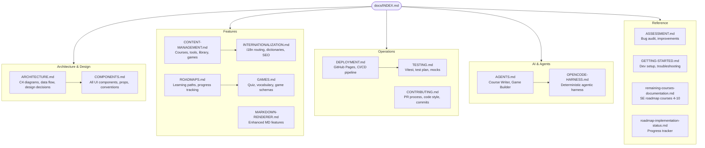

# NUniversity Platform — Documentation Index

> **NUniversity** is an open, multilingual educational platform built with **Next.js 14** and deployed as a static site on GitHub Pages.
> Mission: *Empower learners worldwide through accessible, interactive, and high-quality education.*

---

## Documentation Map



---

## Quick Start

```bash
# 1. Install dependencies
npm install

# 2. Run in development mode
npm run dev

# 3. Open in browser
open http://localhost:3000  # (or :3001 if 3000 is in use)
```

---

## Platform Overview

NUniversity is composed of **seven main features**, all accessible via a locale-prefixed URL (e.g. `/en/`, `/pt/`, `/es/`):

| Feature | URL Pattern | Description |
|---|---|---|
| **Home** | `/{lang}` | Landing page with hero and features |
| **Courses** | `/{lang}/courses` | 38 Markdown-driven learning paths |
| **Tools** | `/{lang}/tools` | 10 interactive productivity/study tools |
| **Games** | `/{lang}/games` | 11 games across 7 categories |
| **Library** | `/{lang}/library` | 59+ curated external learning resources |
| **Roadmaps** | `/{lang}/roadmaps` | Structured learning paths with progress |
| **About** | `/{lang}/about` | Mission, vision, team |
| **Contact** | `/{lang}/contact` | Contact form (Formspree) |

---

## Supported Languages

| Code | Language | Flag |
|---|---|---|
| `en` | English | 🇺🇸 |
| `pt` | Português | 🇧🇷 |
| `es` | Español | 🇪🇸 |

---

## Documentation by Category

### Architecture & Design

Understand how the system is built.

| Document | Lines | What You'll Learn |
|---|---|---|
| [ARCHITECTURE.md](./architecture/ARCHITECTURE.md) | 421 | C4 system diagrams, folder structure, data flow, theme system, key design decisions |
| [COMPONENTS.md](./architecture/COMPONENTS.md) | 714 | Every UI component — props, usage patterns, server vs client conventions |

### Features

How each feature works and how to extend it.

| Document | Lines | What You'll Learn |
|---|---|---|
| [CONTENT-MANAGEMENT.md](./features/CONTENT-MANAGEMENT.md) | 573 | Adding courses, tools, library resources, games — file formats, frontmatter reference |
| [INTERNATIONALIZATION.md](./features/INTERNATIONALIZATION.md) | 463 | i18n routing, dictionary loading, locale fallback, adding new languages |
| [ROADMAPS.md](./features/ROADMAPS.md) | 621 | Roadmap architecture, step types, progress tracking, data model |
| [GAMES.md](./features/GAMES.md) | 565 | Game system, quiz/vocabulary schemas, lifecycle, content quality standards |
| [MARKDOWN-RENDERER.md](./features/MARKDOWN-RENDERER.md) | 216 | Enhanced Markdown: code blocks, alert boxes, Mermaid diagrams, tables |

### Operations

How to deploy, test, and contribute.

| Document | Lines | What You'll Learn |
|---|---|---|
| [DEPLOYMENT.md](./operations/DEPLOYMENT.md) | 398 | GitHub Pages config, CI/CD pipeline, static export constraints |
| [TESTING.md](./operations/TESTING.md) | 267 | 5-phase test plan (~246 tests), mocking strategy, Vitest setup |
| [CONTRIBUTING.md](./operations/CONTRIBUTING.md) | 478 | Branching, commit conventions, PR process, code style |

### AI & Agents

AI-powered content generation and development workflows.

| Document | Lines | What You'll Learn |
|---|---|---|
| [AGENTS.md](./ai/AGENTS.md) | 353 | Course Writer & Game Builder agents, usage templates, LLM config |
| [OPENCODE-HARNESS.md](./ai/OPENCODE-HARNESS.md) | 1276 | Deterministic agentic harness: hooks, skills, memory, agents |

### Reference

Assessment, setup, and implementation tracking.

| Document | Lines | What You'll Learn |
|---|---|---|
| [ASSESSMENT.md](./assessment/ASSESSMENT.md) | 730 | Full codebase audit — 4 critical bugs, 6 high, 8 medium, 7 low |
| [GETTING-STARTED.md](./getting-started/GETTING-STARTED.md) | 284 | Dev setup via FNM, environment, scripts, troubleshooting |
| [remaining-courses-documentation.md](./reference/remaining-courses-documentation.md) | 481 | Detailed plans for SE roadmap courses 4-10 |
| [roadmap-implementation-status.md](./reference/roadmap-implementation-status.md) | 228 | Progress tracker — 3 of 10 courses created |

---

## Tech Stack

| Layer | Technology |
|---|---|
| Framework | Next.js 14 (App Router) |
| Language | TypeScript 5 |
| Styling | Tailwind CSS + DaisyUI + HeroUI |
| Markdown | react-markdown + remark-gfm + rehype-raw |
| Diagrams | Mermaid.js |
| Code Highlight | react-syntax-highlighter |
| Animations | Framer Motion |
| Forms | React Hook Form + Formspree |
| Testing | Vitest + @testing-library/react |
| Deployment | GitHub Pages (static export) |
| AI Agents | OpenCode + @opencode-ai/plugin |

---

## Platform Statistics

| Metric | Count |
|---|---|
| Courses | 38 |
| Lessons | 849 |
| Languages | 3 (EN, PT, ES) |
| Interactive Tools | 10 |
| Games | 11 |
| Library Resources | 59+ |
| Roadmaps | 1 |
| Documentation Files | 17 |
| Documentation Lines | 8,000+ |

---

## Copyright

© 2026 NUniversity. All Rights Reserved.
