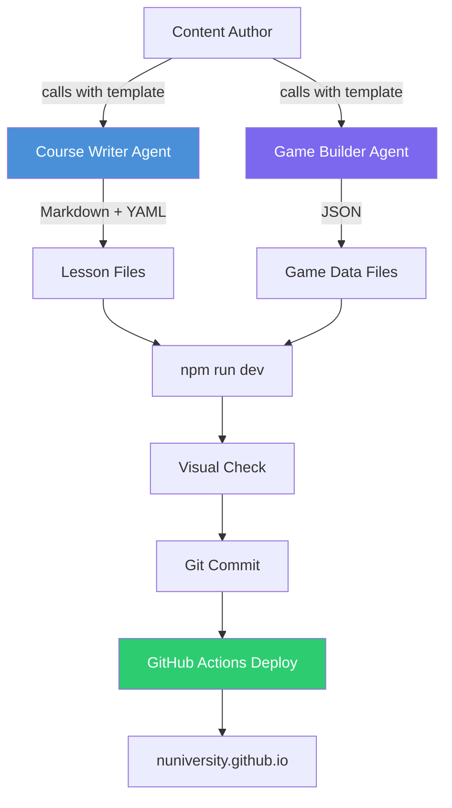
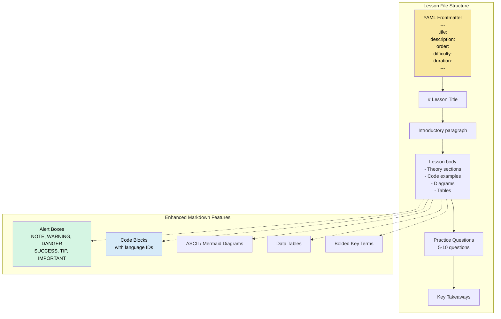
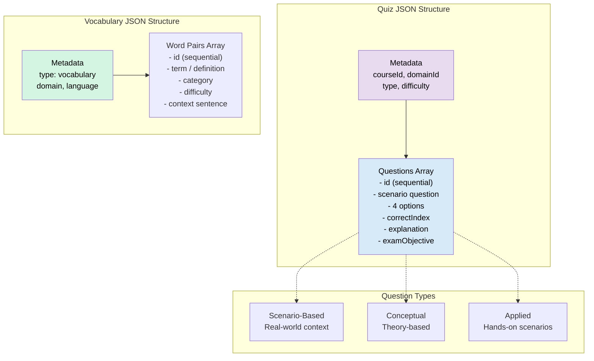
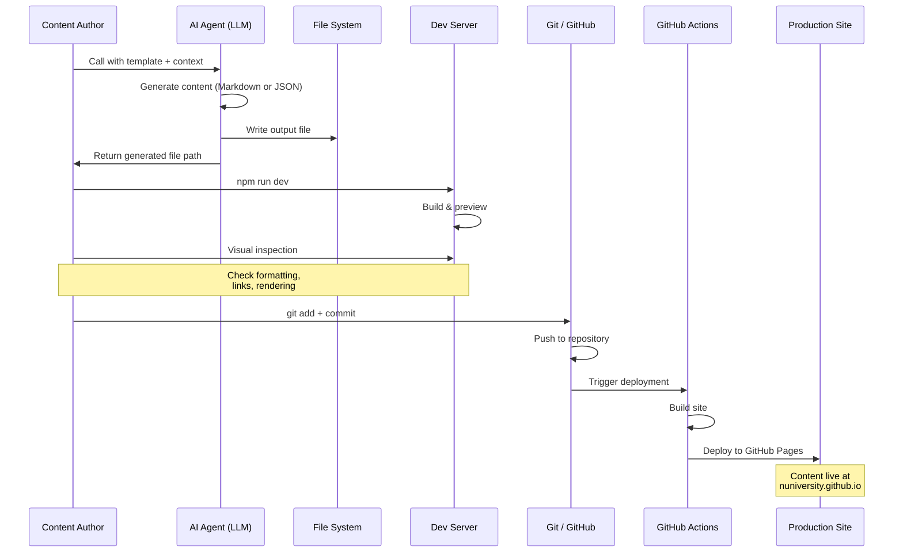
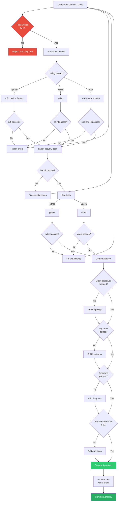
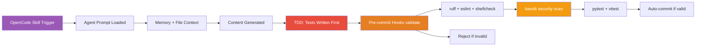

# NUniversity AI Agent System

## Core Principle

**Deterministic Agentic Harness**: Build the most deterministic harness possible by creating deterministic AI agentic development pipelines based on deterministic skills, hooks, plugins, and tools. Let the uncertainty and decision-making stay with the LLM models — they call or loop into engineering using deterministic solutions.

### Design Principles (All Mandatory)

| # | Principle | Rule | Full Reference |
|---|-----------|------|----------------|
| 1 | **Test-Driven Development (TDD)** | Every script, hook, tool, and skill is built using Red-Green-Refactor. 90% coverage minimum. Tests are written before implementation. | `OPENCODE-HARNESS.md` §1.1 |
| 2 | **Domain-Driven Design (DDD)** | Model the harness around NUniversity's domain. Each skill is a bounded context. Ubiquitous language in code, tests, docs. | `OPENCODE-HARNESS.md` §1.2 |
| 3 | **Clean Architecture** | Dependencies point inward. Entities → Business Rules → Adapters → Frameworks. No inner layer imports from outer layers. | `OPENCODE-HARNESS.md` §1.3 |
| 4 | **SOLID Principles** | SRP (one thing per script), OCP (extend, don't modify), LSP (hooks are interchangeable), ISP (focused skill triggers), DIP (depend on exit codes, not implementations). | `OPENCODE-HARNESS.md` §1.4 |
| 5 | **Clean Code** | Descriptive naming, small functions (20 lines max), docstrings on public functions, errors to stderr, no dead code. | `OPENCODE-HARNESS.md` §1.5 |
| 6 | **Spec-Driven Design (SDD)** | Specifications are the source of truth. Spec → Schema → Tests → Implementation. Every code line traces to a spec requirement. | `OPENCODE-HARNESS.md` §1.6 |

### Development Tool Stack

All deterministic components use a standardized tool chain:
- **Python**: `uv` (packages), `ruff` (lint+format), `pytest` (tests), `bandit` (security)
- **JavaScript/TypeScript**: `fnm` (Node.js), `eslint` (lint), `vitest` (tests), `playwright` (E2E)
- **Bash**: `shellcheck` (lint), `shfmt` (format)
- **All**: `pre-commit` (git hooks), enforced via CI/CD

## Overview

NUniversity uses specialized AI agents to generate publication-ready course content and interactive quiz data. Each agent is defined by a prompt template and produces validated Markdown or JSON output.

### Available Skills

| Skill | Purpose | Triggers |
|-------|---------|----------|
| `skill-builder` | Meta-skill for creating new skills | `.opencode/skills/**` |
| `course-writer` | Generates lesson files | `content/courses/**` |
| `game-builder` | Generates game JSON files | `content/games/**` |
| `i18n-translator` | Handles localization | `dictionaries/**` |
| `platform-engineer` | TypeScript/Next.js guidance | `lib/**`, `src/**` |
| `mermaid-js` | Creates and validates diagrams | `**/*.md`, `docs/**` |
| `tailwind-css` | CSS utility class management | `**/*.tsx`, `src/**` |



---

## Course Writer Agent

**Location:** `agents/COURSE-WRITER-AGENT-PROMPT.md`

Produces publication-ready Markdown lesson files with structured YAML frontmatter and enhanced Markdown formatting.

### Output Format



### Quality Checklist

| Check | Description |
|-------|-------------|
| Frontmatter validation | All required fields present and valid |
| H1 matching | Title in frontmatter matches H1 heading |
| Exam objective mapping | Lesson maps to certification exam objectives |
| Key terms bolded | Domain-specific terms are **bolded** on first use |
| Architecture diagrams | Complex concepts include visual diagrams |
| Warning boxes | Potential pitfalls marked with `[!WARNING]` or `[!CAUTION]` |
| Practice questions | 5-10 questions per lesson |
| Key takeaways | Summary section at end |

### Templates

| Template | Purpose |
|----------|---------|
| Single lesson | Generate one lesson file |
| New course | Create `course.json` manifest + initial lessons |
| Full domain | Generate all lessons for a certification domain |
| Translate lesson | Translate existing lesson to another language |

### Recommended LLM Configuration

- **Temperature:** 0.3 -- 0.5 (balanced creativity and accuracy)
- **Max tokens:** 4000 -- 8000 per lesson

---

## Game Builder Agent

**Location:** `agents/GAME-BUILDER-AGENT-PROMPT.md`

Produces publication-ready JSON game files for quizzes and vocabulary exercises.

### Output Format



### Quality Checklist

| Check | Description |
|-------|-------------|
| Valid JSON | Passes `JSON.parse()` without errors |
| Sequential IDs | `id` fields are sequential starting from 0 |
| No duplicates | No duplicate questions or word pairs |
| Minimum counts | 40 questions for certification quizzes, 50 word pairs for vocabulary |
| 4-option format | Each question has exactly 4 options |
| Detailed explanations | Every question includes an explanation field |
| Domain coverage | Questions distributed across sub-topics |
| Difficulty distribution | Mix of easy, medium, hard questions |

### Templates

| Template | Purpose |
|----------|---------|
| Certification quiz | Full-length practice exam (40+ questions) |
| Domain drill | Focused quiz on a single domain |
| General knowledge | Broad topic coverage |
| Technical skills | Hands-on skill assessment |
| Vocabulary game | Term-definition matching (50+ pairs) |
| Expand existing quiz | Add questions to an existing quiz file |

### Recommended LLM Configuration

- **Temperature:** 0.2 -- 0.4 (more deterministic for accuracy)
- **Max tokens:** 8000 -- 16000 (larger JSON payloads)

---

## Agent Integration Workflow



---

## Quality Assurance Pipeline (TDD-Enforced)



---

## LLM Configuration Guide

| Parameter | Course Writer Agent | Game Builder Agent | Notes |
|-----------|-------------------|-------------------|-------|
| **Temperature** | 0.3 -- 0.5 | 0.2 -- 0.4 | Lower = more deterministic |
| **Max tokens** | 4000 -- 8000 | 8000 -- 16000 | JSON payloads need more room |
| **Top-p** | 0.9 | 0.9 | Standard for both |
| **Frequency penalty** | 0.0 | 0.0 | Avoid repetitive content |
| **Presence penalty** | 0.0 | 0.0 | Allow technical repetition |

**General Guidelines:**
- Use lower temperature for quiz/exam content where accuracy is critical
- Use higher temperature for lesson prose and explanations
- Increase max tokens for full-domain or full-course generation
- Test with a small sample before batch generation

---

## OpenCode Integration

NUniversity uses OpenCode for automated deterministic workflows.

### Current State

```
.opencode/
├── hooks/          # 5 Python-based validation hooks
├── skills/         # 9 skills (skill-builder, course-writer, game-builder, etc.)
├── plugins/        # nuniversity-plugin
├── memory/         # MEMORY.md with project state
└── package.json    # @opencode-ai/plugin dependency
```

### Dev Tool Stack

All code uses a standardized tool chain enforced via pre-commit hooks and CI:

| Language | Linter | Formatter | Tester | Security |
|----------|--------|-----------|--------|----------|
| Python | `ruff` | `ruff format` | `pytest` | `bandit` |
| JS/TS | `eslint` | `prettier` | `vitest` | — |
| Bash | `shellcheck` | `shfmt` | — | — |

### Integration Flow



**Current capabilities:**
- Skills in `.opencode/skills/` that trigger agents via context matching
- Pre-commit hooks in `.opencode/hooks/` for automated validation
- Shared memory in `.opencode/memory/` for cross-agent context
- TDD enforcement: all scripts must have tests written first
- Quality gates: ruff, eslint, shellcheck, bandit, pytest, vitest

---

## Agent Prompt Reference

### Using the Prompts

Each agent prompt is a self-contained instruction file. To use:

1. **Read the prompt file** for context and instructions
2. **Provide the template** (which template to use)
3. **Supply context** (course name, domain, topic, existing content references)
4. **Run in your LLM** (ChatGPT, Claude, or via OpenCode)

### Prompt Locations

| Agent | File |
|-------|------|
| Course Writer | `agents/COURSE-WRITER-AGENT-PROMPT.md` |
| Game Builder | `agents/GAME-BUILDER-AGENT-PROMPT.md` |

### Example Usage

**Course Writer -- Single Lesson:**
```
Use the Course Writer Agent prompt.
Template: Single lesson
Context: Course "AZ-900 Azure Fundamentals", Domain "Cloud Concepts",
Topic "What is Cloud Computing", Difficulty: Beginner
```

**Game Builder -- Certification Quiz:**
```
Use the Game Builder Agent prompt.
Template: Certification quiz
Context: Course "AZ-900 Azure Fundamentals", Domain "Cloud Concepts",
40 questions, difficulty distribution: 30% easy, 50% medium, 20% hard
```
