# OpenCode Deterministic Agentic Harness — NUniversity

> **Status:** Implemented
> **Purpose:** Define a deterministic, quality-gated content generation harness using OpenCode's extensibility primitives (skills, hooks, plugins) to scale NUniversity's 38 courses, 11 games, and 10 tools.

---

## Core Principle

**Deterministic Agentic Harness**: Build the most deterministic harness possible by creating deterministic AI agentic development pipelines based on deterministic skills, hooks, plugins, and tools. Let the uncertainty and decision-making stay with the LLM models — they call or loop into engineering using deterministic solutions.

The harness is the foundation of reliability. The LLM models are the agents of flexibility.

```
┌─────────────────────────────────────────────────────────────┐
│                    LLM LAYER (Flexible)                      │
│  • Understanding user intent                                │
│  • Making decisions                                         │
│  • Orchestrating workflows                                  │
│  • Handling edge cases                                      │
└─────────────────────────┬───────────────────────────────────┘
                          │ calls
                          ▼
┌─────────────────────────────────────────────────────────────┐
│                 HARNESS LAYER (Deterministic)                │
│  • Skills: Structured prompts with known outputs            │
│  • Hooks: Schema validation on every write                  │
│  • Plugins: Automated quality gates                         │
│  • Tools: Python/JS/Bash scripts with exit codes            │
└─────────────────────────┬───────────────────────────────────┘
                          │ built on
                          ▼
┌─────────────────────────────────────────────────────────────┐
│                 FOUNDATION LAYER (TDD + Dev Stack)           │
│  • Test-Driven Development (Red-Green-Refactor)             │
│  • Dev Tool Stack (linters, formatters, security scanners)  │
│  • Quality Gates (pre-commit, CI/CD enforcement)            │
└─────────────────────────────────────────────────────────────┘
```

---

## 1.1 Test-Driven Development as Core Principle

**Test-Driven Development is the foundation of the deterministic harness.** Every script, hook, tool, and skill must be built using the Red-Green-Refactor cycle. TDD provides the feedback loop that makes deterministic execution reliable — tests define objective success criteria that the harness can verify automatically.

### The TDD Cycle (Mandatory for All Harness Components)

```
┌─────────────────────────────────────────────────────────────┐
│                    TDD CYCLE (Mandatory)                     │
│                                                             │
│   ┌─────────┐    ┌─────────┐    ┌─────────────┐            │
│   │   RED   │───▶│  GREEN  │───▶│  REFACTOR   │            │
│   │         │    │         │    │             │             │
│   │ Write   │    │ Write   │    │ Improve     │            │
│   │ failing │    │ minimum │    │ code while  │            │
│   │ test    │    │ code to │    │ keeping     │            │
│   │ first   │    │ pass    │    │ tests green │            │
│   └─────────┘    └─────────┘    └─────────────┘            │
│        │                                        │           │
│        └────────────────────────────────────────┘           │
│                    Repeat for each feature                   │
└─────────────────────────────────────────────────────────────┘
```

### Why TDD Is Non-Negotiable

1. **Deterministic verification**: Tests convert subjective "seems right" into objective pass/fail signals
2. **Regression safety**: Every hook, script, and tool is protected against breaking changes
3. **Documentation**: Tests serve as executable specifications of expected behavior
4. **Feedback loop**: LLMs get immediate feedback on whether their output meets requirements
5. **Quality baseline**: Coverage thresholds enforce minimum quality standards

### TDD Rules for Harness Components

| Rule | Description |
|------|-------------|
| **No code without tests** | Every script must have a test file written first |
| **RED before GREEN** | Verify the test fails before writing implementation |
| **One test at a time** | Write one test, implement, verify, repeat |
| **Refactor only when green** | Never refactor while tests are failing |
| **90% coverage minimum** | All hooks and scripts must meet coverage threshold |
| **Tests are documentation** | Test names and structure describe expected behavior |

### TDD Quality Gates

```bash
# Gate 1: Test existence - every script has a test file
find scripts/ -name "*.py" | while read script; do
    test_file="tests/test_$(basename $script .py).py"
    [ ! -f "$test_file" ] && exit 2
done

# Gate 2: All tests pass
pytest tests/ --tb=short
# Exit code must be 0

# Gate 3: Coverage threshold met
pytest tests/ --cov=scripts --cov-fail-under=90

# Gate 4: No skipped tests (in deterministic components)
pytest tests/ -v | grep -c "SKIPPED" | grep -q "^0$"
```

---

## 1.2 Domain-Driven Design (DDD)

**Model the harness around the business domain, not the technology.** DDD ensures that skills, hooks, and tools reflect NUniversity's actual content structure — courses, lessons, games, translations — rather than arbitrary technical abstractions.

### Strategic Design

| Concept | NUniversity Mapping |
|---------|---------------------|
| **Bounded Context** | Each skill is a bounded context: `course-writer`, `game-builder`, `i18n-translator` |
| **Ubiquitous Language** | Domain terms used consistently: "lesson", "course", "domain", "quiz", "vocabulary" |
| **Context Mapping** | Skills communicate via shared schemas and memory, not direct coupling |
| **Core Domain** | Content generation (course-writer, game-builder) |
| **Supporting Domains** | Validation hooks, i18n parity, security guard |
| **Generic Domains** | File I/O, JSON parsing, YAML parsing |

### Tactical Design

| Building Block | Implementation |
|----------------|----------------|
| **Entities** | `lesson.md`, `course.json`, `quiz.json`, `vocabulary.json` |
| **Value Objects** | Frontmatter (title, description, order, difficulty, duration), exit codes (0, 1, 2) |
| **Aggregates** | Course = aggregate root containing lessons; Game = aggregate root containing questions |
| **Repositories** | Filesystem as repository; `content/courses/{slug}/` as course repository |
| **Domain Events** | `file.edited`, `tool.execute.before`, `session.created` |
| **Services** | Hook scripts, validation scripts, quality gate scripts |

### DDD Rules for Harness Components

1. **Bounded Contexts**: Each skill operates independently; no cross-skill imports
2. **Ubiquitous Language**: Use domain terms in code, tests, and documentation — no synonyms
3. **Aggregates**: Course is the consistency boundary for lessons; game is the consistency boundary for questions
4. **Domain Events**: All mutations flow through `file.edited` events — no direct file writes outside hooks
5. **Anti-Corruption Layer**: Hooks act as ACL — validating external (LLM) output before it enters the domain

---

## 1.3 Clean Architecture

**Dependencies point inward.** The harness is organized in concentric layers where inner layers know nothing of outer layers. This makes components independently testable and replaceable.

### Layer Structure

```
┌─────────────────────────────────────────────────────────────┐
│                  FRAMEWORKS & DRIVERS (Outermost)            │
│  OpenCode hooks, skills, plugins, CLI                       │
│  • Hook registration (opencode.json)                        │
│  • Skill activation (frontmatter triggers)                  │
│  • Plugin event handlers                                    │
├─────────────────────────────────────────────────────────────┤
│                    INTERFACE ADAPTERS                        │
│  Script I/O, schema parsing, exit code translation          │
│  • Environment variable reading (OPENCODE_FILE_PATH)        │
│  • JSON/YAML parsing (json.tool, pyyaml)                    │
│  • stdout/stderr formatting                                 │
├─────────────────────────────────────────────────────────────┤
│                    APPLICATION BUSINESS RULES                │
│  Validation logic, quality gates, content generation        │
│  • Frontmatter field validation                             │
│  • Quiz schema enforcement                                  │
│  • i18n parity computation                                  │
│  • Content depth scoring                                    │
├─────────────────────────────────────────────────────────────┤
│                    ENTITIES (Innermost)                      │
│  Domain models: lesson, course, quiz, vocabulary            │
│  • Frontmatter entity (title, order, difficulty, duration)  │
│  • Question entity (id, options, correct, explanation)      │
│  • Word entity (source, target, context)                    │
└─────────────────────────────────────────────────────────────┘
```

### The Dependency Rule

**Source code dependencies must point only inward.** Inner layers cannot import from outer layers. Outer layers communicate with inner layers through interfaces.

| Layer | Can Depend On | Cannot Depend On |
|-------|---------------|------------------|
| Entities | Nothing | Everything else |
| Business Rules | Entities | Adapters, Frameworks |
| Adapters | Entities, Business Rules | Frameworks |
| Frameworks | Everything | Nothing (it's the entry point) |

### Clean Architecture in Practice

```python
# ENTITY (innermost) — no imports from outer layers
@dataclass
class Frontmatter:
    title: str
    description: str
    order: int
    difficulty: str  # beginner | intermediate | advanced
    duration: str    # "N min"

# BUSINESS RULE — depends only on entity
def validate_frontmatter(fm: Frontmatter) -> list[str]:
    errors = []
    if fm.difficulty not in ("beginner", "intermediate", "advanced"):
        errors.append(f"Invalid difficulty: {fm.difficulty}")
    if not isinstance(fm.order, int) or fm.order < 1:
        errors.append(f"Order must be positive integer: {fm.order}")
    return errors

# ADAPTER — translates framework I/O to entity
def parse_frontmatter(content: str) -> Frontmatter:
    # Extract YAML, parse, return Frontmatter entity
    ...

# FRAMEWORK (outermost) — OpenCode hook
def main() -> int:
    content = Path(os.environ["OPENCODE_FILE_PATH"]).read_text()
    fm = parse_frontmatter(content)           # Adapter
    errors = validate_frontmatter(fm)         # Business Rule
    if errors:
        print("\n".join(errors), file=sys.stderr)
        return 2
    return 0
```

---

## 1.4 SOLID Principles

Five design principles that make the harness maintainable, extensible, and testable.

### Single Responsibility Principle (SRP)

**Each script, hook, and skill does exactly one thing.**

| Component | Single Responsibility |
|-----------|-----------------------|
| `validate_frontmatter.py` | Validates Markdown frontmatter only |
| `validate_game_json.py` | Validates game JSON only |
| `check_i18n_parity.py` | Checks dictionary key parity only |
| `guard_env_read.py` | Blocks .env reads only |
| `course-writer` skill | Generates lesson content only |
| `game-builder` skill | Generates game JSON only |

### Open/Closed Principle (OCP)

**The harness is open for extension, closed for modification.** New content types are added by creating new hooks and skills, not by modifying existing ones.

```
# To add a new content type (e.g., flashcards):
# 1. Create new hook: validate-flashcard-json/
# 2. Create new skill: flashcard-builder/
# 3. Register in opencode.json
# → Existing hooks and skills remain unchanged
```

### Liskov Substitution Principle (LSP)

**All hooks are interchangeable.** Any hook can be replaced with another hook that has the same exit code contract (0=pass, 1=warn, 2=block) without affecting the harness.

| Hook | Exit 0 | Exit 1 | Exit 2 |
|------|--------|--------|--------|
| `validate_frontmatter.py` | Pass | N/A | Fail |
| `validate_game_json.py` | Pass | N/A | Fail |
| `check_i18n_parity.py` | Pass | Warn | N/A |
| `guard_env_read.py` | Pass | N/A | Block |

All hooks follow the same contract → they are substitutable.

### Interface Segregation Principle (ISP)

**Skills have focused interfaces.** Each skill exposes only the triggers and instructions relevant to its domain. No skill forces the agent to depend on methods it doesn't use.

```yaml
# course-writer — focused interface
triggers:
  - content/courses/**        # Only course paths
  - keyword: "write lesson"   # Only lesson actions

# game-builder — focused interface
triggers:
  - content/games/**          # Only game paths
  - keyword: "build quiz"     # Only quiz actions
```

### Dependency Inversion Principle (DIP)

**High-level policies depend on abstractions, not concrete implementations.** The quality gate flow doesn't know which specific linter runs — it depends on the exit code abstraction.

```python
# Abstraction: exit code contract
# 0 = pass, 1 = warn, 2 = block

# All tools implement this abstraction:
ruff check ...        # returns 0 or non-zero
eslint ...            # returns 0 or non-zero
pytest ...            # returns 0 or non-zero
bandit ...            # returns 0 or non-zero
shellcheck ...        # returns 0 or non-zero

# Quality gate depends on the abstraction:
for tool in [ruff, eslint, bandit, pytest]:
    exit_code = tool.run()  # abstraction
    if exit_code != 0:
        return 2
```

---

## 1.5 Clean Code

**Code is read more than it is written.** Every script, hook, and test must be immediately understandable by the next developer (or LLM agent).

### Naming

| Rule | Good | Bad |
|------|------|-----|
| Descriptive names | `validate_frontmatter` | `vf` |
| Intent-revealing | `is_valid_difficulty` | `check` |
| Domain terminology | `lesson`, `course`, `quiz` | `item`, `data`, `obj` |
| Consistent casing | `snake_case` (Python), `camelCase` (JS) | Mixed styles |
| No abbreviations | `question_count` | `q_cnt` |

### Functions

| Rule | Description |
|------|-------------|
| **Small** | Each function does one thing; 20 lines max |
| **Single level of abstraction** | Don't mix high-level logic with low-level details |
| **Descriptive names** | Function name says what it does |
| **Minimal arguments** | 0–3 parameters; use dataclasses for more |
| **No side effects** | Pure functions where possible |

### Comments

| Rule | Description |
|------|-------------|
| **Don't comment bad code — rewrite it** | Self-documenting code over comments |
| **Explain why, not what** | `# Exit 2 to block the operation` not `# Check if error` |
| **Docstrings on all public functions** | Parameters, return type, exit codes |
| **No dead code comments** | Remove commented-out code |

### Error Handling

| Rule | Description |
|------|-------------|
| **Explicit over implicit** | Catch specific exceptions, not bare `except:` |
| **Errors to stderr** | `print(msg, file=sys.stderr)` |
| **Exit codes for control flow** | 0=pass, 1=warn, 2=block — never complex return types |
| **Fail fast** | Validate inputs at the top of the function |

### Formatting

| Tool | Rule |
|------|------|
| `ruff format` | 88 chars, double quotes, 4-space indent |
| `shfmt` | 2-space indent, binary ops next line |
| `prettier` | 2-space indent, trailing commas |

---

## 1.6 Spec-Driven Design (SDD)

**Specifications are the source of truth, not code.** The harness is built from specifications that define behavior, structure, and quality gates. Code implements the spec; tests verify the spec.

### The Spec Hierarchy

```
┌─────────────────────────────────────────────────────────────┐
│                    SPECIFICATIONS (Source of Truth)          │
│  • OPENCODE-HARNESS.md (this document)                     │
│  • AGENTS.md (agent system specification)                   │
│  • Schema files (JSON Schema, YAML schemas)                 │
│  • Skill skill.md files (behavior specifications)           │
├─────────────────────────────────────────────────────────────┤
│                    TESTS (Executable Specs)                  │
│  • pytest tests/ (Python validation)                        │
│  • vitest tests/ (JS/TS validation)                         │
│  • Hook exit codes (integration tests)                      │
├─────────────────────────────────────────────────────────────┤
│                    IMPLEMENTATION (Code)                     │
│  • Hook scripts (validate_frontmatter.py, etc.)             │
│  • Skill scripts (generate_*, test_*, etc.)                 │
│  • Quality gate scripts                                     │
└─────────────────────────────────────────────────────────────┘
```

### How Specs Drive Development

1. **Write the spec first** — Define what the hook/skill should do in `skill.md` or `OPENCODE-HARNESS.md`
2. **Write the schema** — Define the exact structure in JSON Schema or dataclass
3. **Write the tests** — Convert spec requirements into executable test cases
4. **Write the implementation** — Make tests pass
5. **Refactor** — Clean up while keeping tests green

### Spec-to-Code Traceability

Every piece of code traces back to a spec requirement:

| Code | Spec Source |
|------|-------------|
| `validate_frontmatter.py` line checking difficulty enum | Section 3.2 flowchart: "difficulty valid?" |
| `validate_game_json.py` minimum 5 questions | Section 3.3: "Minimum 5 questions required" |
| `check_i18n_parity.py` missing keys check | Section 3.4: "Keys missing in pt?" |
| `guard_env_read.py` blocking .env reads | Section 3.5: "BLOCKED: Access to sensitive file" |
| Exit code 2 for blocking errors | Section 2.3: "Exit code semantics" |

### Spec Compliance Verification

```bash
# Verify implementation matches spec
python -m pytest tests/ -v  # All tests pass = spec compliance

# Verify schema matches spec
python scripts/validate_skill_json.py  # Schema valid = structure compliance

# Verify integration matches spec
python scripts/test_skill.py --all  # Integration pass = workflow compliance
```

---

## 1. Overview

The harness transforms OpenCode from a general-purpose coding assistant into a **deterministic content factory** — where every file write, every agent invocation, and every commit passes through layered validation gates.

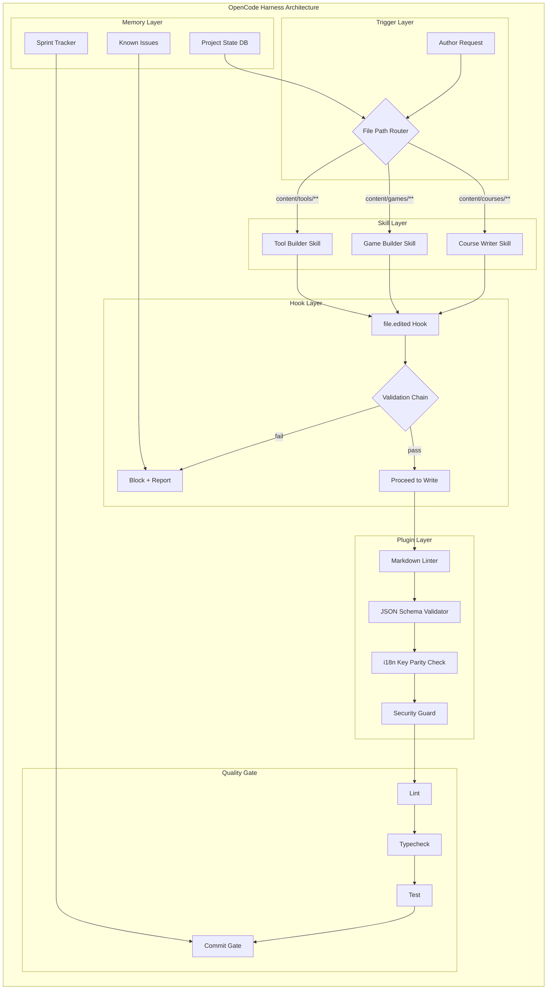

---

## 2. Architecture Principles

### 2.1 Deterministic > Probabilistic

| Principle | Implementation |
|---|---|
| **TDD first** | All code is written test-first using Red-Green-Refactor cycle |
| **Validate on write** | Every file mutation triggers schema validation via `file.edited` hook |
| **Never trust the agent** | LLM output is always treated as untrusted input — validated before persistence |
| **Fail fast** | Hook exit code `2` blocks the operation immediately; stderr becomes agent feedback |
| **Idempotent hooks** | Running the same validation twice produces the same result |
| **Deterministic outputs** | Temperature `0.3–0.5`, structured prompts, rigid output schemas |

### 2.2 Layered Defense (Depth)

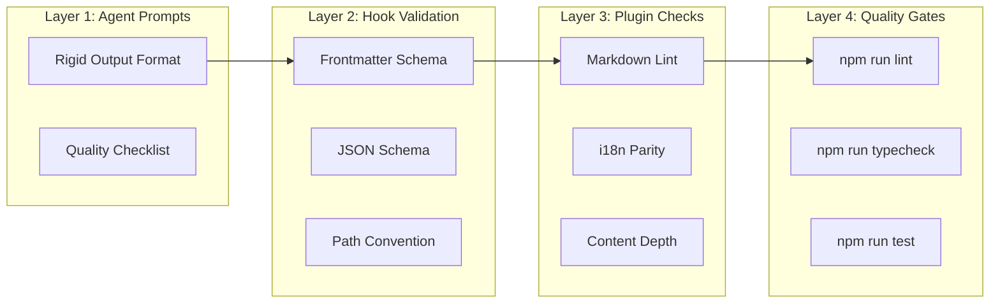

Each layer catches errors the previous layer missed. No single point of failure.

### 2.3 Hook Exit Code Semantics

| Code | Meaning | Behavior |
|---|---|---|
| `0` | Success | Proceed with the operation |
| `2` | Blocking error | Operation blocked; stderr is fed back to the agent as an error message |
| `1`, `3+` | Non-blocking warning | Operation proceeds, warning logged to memory |

---

## 3. Hooks Layer

### 3.1 Hook Registration

Hooks live in `.opencode/hooks/` as executable scripts. Each hook declares which events it listens to via a JSON manifest.

```json
// .opencode/hooks/manifest.json
{
  "hooks": [
    {
      "name": "validate-markdown-frontmatter",
      "event": "file.edited",
      "pattern": "content/**/*.md",
      "script": "validate-frontmatter.sh",
      "description": "Validate YAML frontmatter schema on every Markdown file write"
    },
    {
      "name": "validate-game-json",
      "event": "file.edited",
      "pattern": "content/games/**/*.json",
      "script": "validate-game-json.sh",
      "description": "Validate game JSON against quiz/vocabulary schemas"
    },
    {
      "name": "validate-course-json",
      "event": "file.edited",
      "pattern": "content/**/course.json",
      "script": "validate-course-json.sh",
      "description": "Validate course.json against the course schema"
    },
    {
      "name": "i18n-parity-check",
      "event": "file.edited",
      "pattern": "dictionaries/*.json",
      "script": "check-i18n-parity.sh",
      "description": "Ensure dictionary key parity across en.json, pt.json, es.json"
    },
    {
      "name": "security-env-guard",
      "event": "tool.execute.before",
      "tool": "read",
      "script": "guard-env-read.sh",
      "description": "Block reads of .env files"
    },
    {
      "name": "quality-gate",
      "event": "file.edited",
      "pattern": "content/**/*",
      "script": "quality-gate.sh",
      "description": "Run lint, typecheck, and test before allowing content commits"
    }
  ]
}
```

### 3.2 Markdown Frontmatter Validation Hook

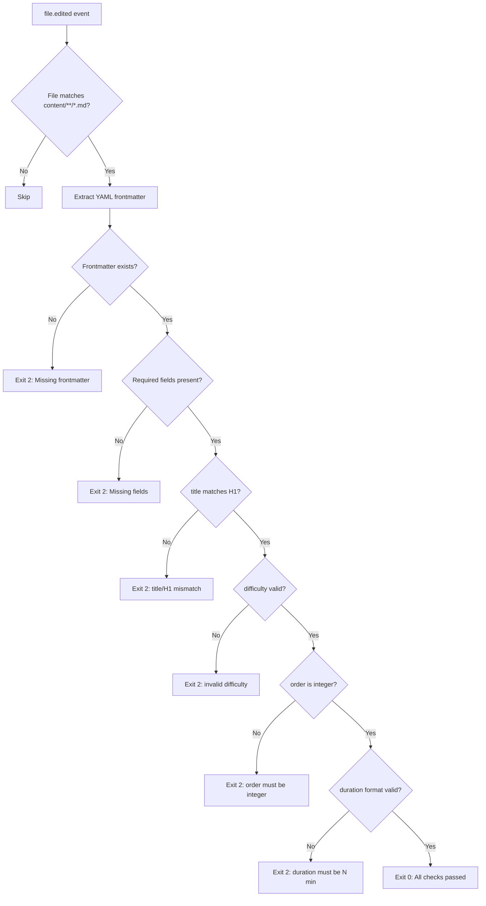

**Implementation** (`.opencode/hooks/validate-frontmatter.sh`):

```bash
#!/usr/bin/env bash
# Validates Markdown frontmatter for NUniversity lesson files
# Exit 0 = pass, Exit 2 = blocking error (stderr → agent)

set -euo pipefail

FILE="$OPENCODE_FILE_PATH"

# Extract frontmatter between first --- pair
FRONTMATTER=$(sed -n '/^---$/,/^---$/p' "$FILE" | sed '1d;$d')

if [ -z "$FRONTMATTER" ]; then
  echo "ERROR: No YAML frontmatter found in $FILE" >&2
  echo "Every lesson must start with --- frontmatter containing: title, description, order, difficulty, duration" >&2
  exit 2
fi

# Validate required fields
REQUIRED_FIELDS=("title" "description" "order" "difficulty" "duration")
for field in "${REQUIRED_FIELDS[@]}"; do
  if ! echo "$FRONTMATTER" | grep -q "^${field}:"; then
    echo "ERROR: Missing required frontmatter field '${field}' in $FILE" >&2
    exit 2
  fi
done

# Validate difficulty enum
DIFFICULTY=$(echo "$FRONTMATTER" | grep "^difficulty:" | cut -d' ' -f2)
if [[ ! "$DIFFICULTY" =~ ^(beginner|intermediate|advanced)$ ]]; then
  echo "ERROR: difficulty must be exactly: beginner, intermediate, or advanced. Got: '$DIFFICULTY'" >&2
  exit 2
fi

# Validate order is integer
ORDER=$(echo "$FRONTMATTER" | grep "^order:" | tr -d '[:space:]' | cut -d':' -f2)
if ! [[ "$ORDER" =~ ^[0-9]+$ ]]; then
  echo "ERROR: order must be an integer. Got: '$ORDER'" >&2
  exit 2
fi

# Validate duration format
DURATION=$(echo "$FRONTMATTER" | grep "^duration:" | sed 's/^duration: *//' | tr -d '"')
if ! [[ "$DURATION" =~ ^[0-9]+\ min$ ]]; then
  echo "ERROR: duration must be in format 'N min'. Got: '$DURATION'" >&2
  exit 2
fi

# Validate H1 matches title
TITLE=$(echo "$FRONTMATTER" | grep "^title:" | sed 's/^title: *//' | tr -d '"')
H1=$(grep -m1 '^# ' "$FILE" | sed 's/^# //')
if [ "$TITLE" != "$H1" ]; then
  echo "ERROR: H1 heading '$H1' does not match frontmatter title '$TITLE'" >&2
  exit 2
fi

exit 0
```

### 3.3 Game JSON Validation Hook

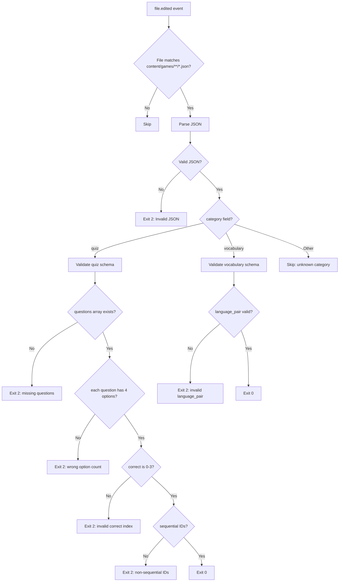

**Implementation** (`.opencode/hooks/validate-game-json.sh`):

```bash
#!/usr/bin/env bash
set -euo pipefail

FILE="$OPENCODE_FILE_PATH"

# Parse JSON and validate structure
JSON=$(cat "$FILE")

# Basic JSON validity
if ! echo "$JSON" | python3 -m json.tool > /dev/null 2>&1; then
  echo "ERROR: Invalid JSON in $FILE" >&2
  echo "Run: python3 -m json.tool $FILE" >&2
  exit 2
fi

CATEGORY=$(echo "$JSON" | python3 -c "import sys,json; print(json.load(sys.stdin).get('category',''))")

if [ "$CATEGORY" = "quiz" ]; then
  # Validate quiz structure
  ERRORS=$(echo "$JSON" | python3 -c "
import sys, json
data = json.load(sys.stdin)
errors = []

# Required top-level fields
for field in ['id', 'title', 'difficulty', 'category', 'questions']:
    if field not in data:
        errors.append(f'Missing field: {field}')

if data.get('difficulty') not in ['beginner', 'intermediate', 'advanced']:
    errors.append(f'Invalid difficulty: {data.get(\"difficulty\")}')

questions = data.get('questions', [])
if len(questions) < 5:
    errors.append(f'Minimum 5 questions required, got {len(questions)}')

prev_id = 0
for i, q in enumerate(questions):
    if len(q.get('options', [])) != 4:
        errors.append(f'Question {i}: must have exactly 4 options')
    if not (0 <= q.get('correct', -1) <= 3):
        errors.append(f'Question {i}: correct must be 0-3')
    expected_id = f'q{i+1:03d}'
    if q.get('id') != expected_id:
        errors.append(f'Question {i}: ID should be {expected_id}, got {q.get(\"id\")}')

print('\n'.join(errors))
" 2>&1)

  if [ -n "$ERRORS" ]; then
    echo "ERROR: Quiz validation failed:" >&2
    echo "$ERRORS" >&2
    exit 2
  fi
fi

if [ "$CATEGORY" = "vocabulary" ]; then
  ERRORS=$(echo "$JSON" | python3 -c "
import sys, json
data = json.load(sys.stdin)
errors = []

if 'language_pair' not in data:
    errors.append('Missing language_pair field')
else:
    lp = data['language_pair']
    if 'source' not in lp or 'target' not in lp:
        errors.append('language_pair must have source and target')

words = data.get('words', [])
if len(words) < 40:
    errors.append(f'Minimum 40 words required, got {len(words)}')

seen_sources = set()
for i, w in enumerate(words):
    if w.get('source') in seen_sources:
        errors.append(f'Word {i}: duplicate source word')
    seen_sources.add(w.get('source'))
    if 'context' not in w:
        errors.append(f'Word {i}: missing context field')

print('\n'.join(errors))
" 2>&1)

  if [ -n "$ERRORS" ]; then
    echo "ERROR: Vocabulary validation failed:" >&2
    echo "$ERRORS" >&2
    exit 2
  fi
fi

exit 0
```

### 3.4 i18n Parity Hook

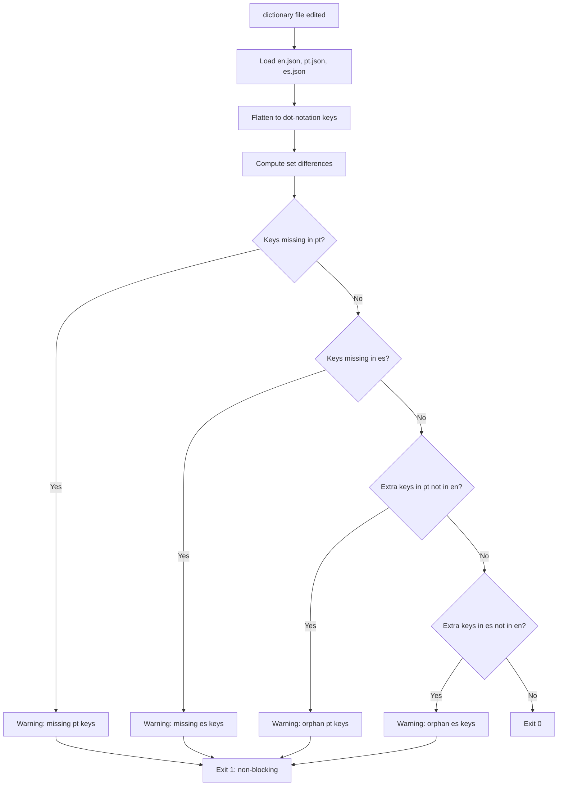

**Implementation** (`.opencode/hooks/check-i18n-parity.sh`):

```bash
#!/usr/bin/env bash
set -euo pipefail

DICT_DIR="dictionaries"

EN_KEYS=$(python3 -c "
import json
def flatten(d, prefix=''):
    keys = []
    for k, v in d.items():
        path = f'{prefix}.{k}' if prefix else k
        if isinstance(v, dict):
            keys.extend(flatten(v, path))
        else:
            keys.append(path)
    return keys
with open('$DICT_DIR/en.json') as f:
    print('\n'.join(sorted(flatten(json.load(f)))))
")

for LANG in pt es; do
  LANG_KEYS=$(python3 -c "
import json
def flatten(d, prefix=''):
    keys = []
    for k, v in d.items():
        path = f'{prefix}.{k}' if prefix else k
        if isinstance(v, dict):
            keys.extend(flatten(v, path))
        else:
            keys.append(path)
    return keys
with open('$DICT_DIR/$LANG.json') as f:
    print('\n'.join(sorted(flatten(json.load(f)))))
")

  MISSING=$(comm -23 <(echo "$EN_KEYS") <(echo "$LANG_KEYS"))
  EXTRA=$(comm -13 <(echo "$EN_KEYS") <(echo "$LANG_KEYS"))

  if [ -n "$MISSING" ]; then
    echo "WARNING: Keys in en.json missing from $LANG.json:" >&2
    echo "$MISSING" >&2
    exit 1
  fi

  if [ -n "$EXTRA" ]; then
    echo "WARNING: Orphan keys in $LANG.json not in en.json:" >&2
    echo "$EXTRA" >&2
    exit 1
  fi
done

exit 0
```

### 3.5 Security Guard Hook

```bash
#!/usr/bin/env bash
# Blocks reads of .env files and other secrets
# Hooks into tool.execute.before event with tool=read

set -euo pipefail

TARGET="$OPENCODE_TOOL_INPUT_PATH"

PATTERNS=(".env" ".env.local" ".env.production" ".env.development" "*.key" "*.pem" "*.secret")

for pattern in "${PATTERNS[@]}"; do
  if [[ "$TARGET" == $pattern ]] || [[ "$TARGET" == *"/$pattern" ]] || [[ "$TARGET" == *\\$pattern ]]; then
    echo "BLOCKED: Access to sensitive file '$TARGET' is forbidden by security policy" >&2
    echo "If this is needed, update .opencode/hooks/manifest.json to whitelist the path" >&2
    exit 2
  fi
done

exit 0
```

---

## 4. Skills Layer

Skills are reusable Markdown prompt files in `.opencode/skills/`. They activate contextually based on file paths.

### 4.1 Skill Definitions

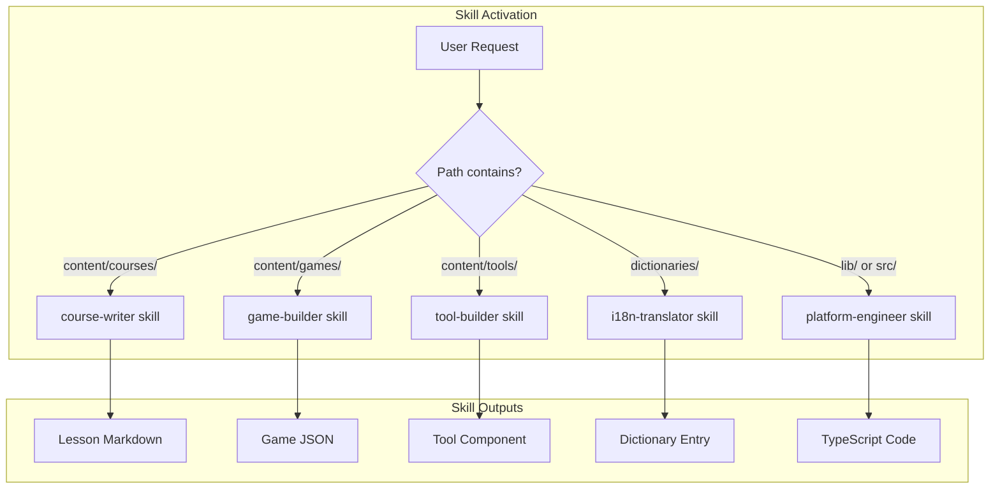

### 4.2 Course Writer Skill

**File:** `.opencode/skills/course-writer.md`

```markdown
---
name: course-writer
description: Activate for content/courses/** file operations
triggers:
  - path: "content/courses/**"
  - keyword: "write lesson"
  - keyword: "create course"
---

# Course Writer Skill

You are writing content for NUniversity, a Next.js educational platform.

## Activation Context
When this skill activates, load:
1. The course structure from `content/courses/{slug}/course.json`
2. Existing lessons in `content/courses/{slug}/{lang}/` to avoid duplicates
3. The agent prompt from `agents/COURSE-WRITER-AGENT-PROMPT.md`

## Output Format
- Lesson files: Markdown with YAML frontmatter (title, description, order, difficulty, duration)
- Course files: JSON with area, author, difficulty, duration, icon, and en/pt/es translations
- File naming: `NN-kebab-case-title.md` with zero-padded order number

## Quality Rules
- Minimum 5 practice questions per lesson
- One `[!WARNING]` for exam traps
- One `[!SUCCESS]` key takeaways at end
- All code blocks must have language identifiers
- ASCII architecture diagrams for structural concepts
- H1 must match frontmatter title exactly
```

### 4.3 Game Builder Skill

**File:** `.opencode/skills/game-builder.md`

```markdown
---
name: game-builder
description: Activate for content/games/** file operations
triggers:
  - path: "content/games/**"
  - keyword: "build quiz"
  - keyword: "create vocabulary"
---

# Game Builder Skill

You are building interactive games for NUniversity.

## Activation Context
When this skill activates, load:
1. Existing games in `content/games/{category}/` to avoid duplicates
2. The agent prompt from `agents/GAME-BUILDER-AGENT-PROMPT.md`
3. The game content reader from `lib/games/get-game-content.ts` for schema reference

## Supported Types
- **Quiz**: JSON with id, title, difficulty, category, topic, questions array
- **Vocabulary**: JSON with language_pair, words array with source/target/context

## Output Format
- Pure JSON, no markdown wrapping
- Sequential question IDs: q001, q002, ...
- Correct answers as zero-based integer index
- SAVE AS path stated after JSON

## Quality Rules
- Quiz: minimum 5 questions, 4 options each, scenario-based where possible
- Vocabulary: minimum 40 words, all with context categories
- Explanations must be educational, not just confirmatory
- No duplicate questions or source words within a file
```

### 4.4 i18n Translator Skill

**File:** `.opencode/skills/i18n-translator.md`

```markdown
---
name: i18n-translator
description: Activate for dictionaries/** and content localization
triggers:
  - path: "dictionaries/**"
  - path: "content/**/pt/**"
  - path: "content/**/es/**"
  - keyword: "translate"
---

# i18n Translator Skill

You are localizing NUniversity content for Portuguese (pt) and Spanish (es).

## Rules
- Keep all Markdown formatting, code blocks, and structure identical
- Translate body text, table content, question text, alert boxes
- Do NOT translate: SQL code, code comments, technical terms used in English
- Maintain dictionary key parity: every en.json key must exist in pt.json and es.json
- Duration formats: "N min" → "N min" (same), "N Weeks" → "N Semanas" (pt/es)
- Difficulty labels: Beginner→Iniciante/Principiante, Intermediate→Intermediário/Intermedio, Advanced→Avançado/Avanzado
```

### 4.5 Skill Activation Matrix

| File Path Pattern | Skill | Auto-Load Files |
|---|---|---|
| `content/courses/**` | `course-writer` | `agents/COURSE-WRITER-AGENT-PROMPT.md` |
| `content/games/**` | `game-builder` | `agents/GAME-BUILDER-AGENT-PROMPT.md` |
| `content/tools/**` | `tool-builder` | _(future)_ |
| `dictionaries/**` | `i18n-translator` | `dictionaries/en.json` |
| `content/**/pt/**` | `i18n-translator` | source locale lesson |
| `content/**/es/**` | `i18n-translator` | source locale lesson |
| `lib/**`, `src/**` | `platform-engineer` | `tsconfig.json`, `package.json` |

---

## 5. Memory Layer

### 5.1 Memory Structure

```
.opencode/memory/
├── project-status.json    # Current state of the platform
├── known-issues.json      # Catalogued bugs and tech debt
├── sprint.json            # Current sprint tasks
├── content-audit.json     # Per-course/game completeness tracking
└── agent-history.json     # Log of agent invocations and outcomes
```

### 5.2 Project Status Schema

```json
{
  "last_updated": "2026-09-01T00:00:00Z",
  "platform": {
    "total_courses": 38,
    "total_games": 11,
    "total_tools": 10,
    "locales": ["en", "pt", "es"],
    "last_deploy": "2026-08-30"
  },
  "content_gaps": {
    "courses_missing_lessons": [
      {
        "slug": "some-course",
        "locale": "pt",
        "missing_lessons": ["05-topic.md", "06-topic.md"],
        "priority": "high"
      }
    ],
    "games_missing": [
      {
        "slug": "az-900",
        "category": "quiz",
        "status": "planned"
      }
    ]
  },
  "active_generations": [
    {
      "type": "course",
      "slug": "snowpro-core-cof-c03",
      "locale": "en",
      "current_lesson": 4,
      "total_lessons": 12,
      "started": "2026-09-01T10:00:00Z"
    }
  ]
}
```

### 5.3 Content Audit Schema

```json
{
  "courses": {
    "snowpro-core-cof-c03": {
      "en": {
        "lessons": ["01-intro.md", "02-architecture.md"],
        "total_expected": 12,
        "last_generated": "2026-09-01",
        "quality_score": 0.95
      },
      "pt": { "lessons": [], "total_expected": 12 },
      "es": { "lessons": [], "total_expected": 12 }
    }
  },
  "games": {
    "snowpro-core-cof-c03": {
      "category": "quiz",
      "question_count": 90,
      "domains_covered": 12,
      "last_updated": "2026-09-01"
    }
  }
}
```

### 5.4 Memory Usage in Hooks

The memory system feeds context back to agents:

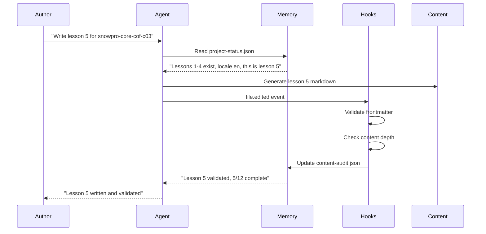

---

## 6. Agent Workflows

### 6.1 Course Generation Pipeline

```mermaid
flowchart TD
    A[Author: "Write Domain 2 lessons"] --> B[Agent loads skill: course-writer]
    B --> C[Agent reads project-status.json]
    C --> D[Agent reads existing lessons in domain]
    D --> E[Agent generates lessons sequentially]
    E --> F{Each lesson file}
    F --> G[file.edited hook fires]
    G --> H{Frontmatter valid?}
    H -->|No| I[Hook exit 2 → Agent fixes]
    I --> F
    H -->|Yes| J{Content structure valid?}
    J -->|No| K[Hook exit 2 → Agent revises]
    K --> F
    J -->|Yes| L[File written to disk]
    L --> M[Update content-audit.json]
    M --> N{More lessons in domain?}
    N -->|Yes| E
    N -->|No| O[Agent reports completion]
    O --> P[Memory: update project-status]
```

### 6.2 Game Generation Pipeline

```mermaid
flowchart TD
    A[Author: "Build Snowflake quiz"] --> B[Agent loads skill: game-builder]
    B --> C[Agent reads existing quiz files]
    C --> D[Agent generates quiz JSON]
    D --> E[file.edited hook fires]
    E --> F{JSON valid?}
    F -->|No| G[Hook exit 2 → Agent fixes]
    G --> D
    F -->|Yes| H{Quiz schema valid?}
    H -->|No| I[Hook exit 2 → Agent revises]
    I --> D
    H -->|Yes| J[File written to disk]
    J --> K[npm run lint -- content]
    K --> L{Lint passes?}
    L -->|No| M[Agent fixes lint errors]
    M --> D
    L -->|Yes| N[Quality gate: test game renders]
    N --> O[Update content-audit.json]
    O --> P[Memory: update project-status]
```

### 6.3 Quality Gate Flow (TDD-Enforced)

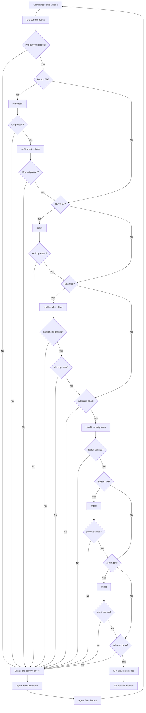

---

## 7. Plugin Implementation

### 7.1 Plugin Entry Point

**File:** `.opencode/plugin.ts`

```typescript
import { definePlugin } from "@opencode-ai/plugin";
import { readFile } from "fs/promises";
import { resolve } from "path";

export default definePlugin({
  name: "nuniversity-harness",
  version: "0.1.0",

  hooks: {
    // Validate content on every file write
    "file.edited": async ({ filePath, content }) => {
      const repoRoot = resolve(import.meta.dirname, "../..");

      // Course lesson validation
      if (filePath.startsWith("content/courses/") && filePath.endsWith(".md")) {
        const result = await validateMarkdownFrontmatter(filePath, content);
        if (!result.valid) {
          return { exitCode: 2, stderr: result.error };
        }
      }

      // Game JSON validation
      if (filePath.startsWith("content/games/") && filePath.endsWith(".json")) {
        const result = await validateGameJSON(filePath, content);
        if (!result.valid) {
          return { exitCode: 2, stderr: result.error };
        }
      }

      // i18n parity check
      if (filePath.startsWith("dictionaries/")) {
        const result = await checkI18nParity(repoRoot);
        if (!result.valid) {
          return { exitCode: 1, stderr: result.warnings.join("\n") };
        }
      }

      return { exitCode: 0 };
    },

    // Security guard for sensitive file reads
    "tool.execute.before": async ({ tool, input }) => {
      if (tool === "read") {
        const target = input.path || "";
        const blocked = [".env", ".env.local", ".env.production", "*.key", "*.pem"];
        for (const pattern of blocked) {
          if (target.includes(pattern)) {
            return {
              exitCode: 2,
              stderr: `BLOCKED: Access to '${target}' violates security policy`,
            };
          }
        }
      }
      return { exitCode: 0 };
    },

    // Track agent sessions in memory
    "session.created": async ({ sessionId }) => {
      const memoryPath = resolve(import.meta.dirname, "memory/agent-history.json");
      try {
        const history = JSON.parse(await readFile(memoryPath, "utf-8"));
        history.sessions.push({
          id: sessionId,
          created: new Date().toISOString(),
        });
        // Keep last 100 sessions
        if (history.sessions.length > 100) {
          history.sessions = history.sessions.slice(-100);
        }
        await writeFile(memoryPath, JSON.stringify(history, null, 2));
      } catch {
        // Memory file may not exist yet
      }
      return { exitCode: 0 };
    },
  },
});

// --- Validation Helpers ---

interface ValidationResult {
  valid: boolean;
  error?: string;
  warnings?: string[];
}

async function validateMarkdownFrontmatter(
  filePath: string,
  content: string
): Promise<ValidationResult> {
  const match = content.match(/^---\n([\s\S]*?)\n---/);
  if (!match) {
    return { valid: false, error: `Missing YAML frontmatter in ${filePath}` };
  }

  const fm = match[1];
  const required = ["title", "description", "order", "difficulty", "duration"];
  for (const field of required) {
    if (!fm.includes(`${field}:`)) {
      return { valid: false, error: `Missing field '${field}' in ${filePath}` };
    }
  }

  const difficulty = fm.match(/difficulty:\s*(\w+)/)?.[1];
  if (!["beginner", "intermediate", "advanced"].includes(difficulty || "")) {
    return {
      valid: false,
      error: `Invalid difficulty '${difficulty}' in ${filePath}`,
    };
  }

  const title = fm.match(/title:\s*"?([^"\n]+)"?/)?.[1]?.trim();
  const h1 = content.match(/^#\s+(.+)$/m)?.[1]?.trim();
  if (title && h1 && title !== h1) {
    return {
      valid: false,
      error: `H1 '${h1}' does not match title '${title}' in ${filePath}`,
    };
  }

  return { valid: true };
}

async function validateGameJSON(
  filePath: string,
  content: string
): Promise<ValidationResult> {
  let data: any;
  try {
    data = JSON.parse(content);
  } catch (e) {
    return { valid: false, error: `Invalid JSON in ${filePath}: ${e}` };
  }

  if (data.category === "quiz") {
    const questions = data.questions || [];
    if (questions.length < 5) {
      return {
        valid: false,
        error: `Quiz needs minimum 5 questions, got ${questions.length}`,
      };
    }
    for (let i = 0; i < questions.length; i++) {
      const q = questions[i];
      if (q.options?.length !== 4) {
        return {
          valid: false,
          error: `Question ${i + 1}: must have exactly 4 options`,
        };
      }
      if (typeof q.correct !== "number" || q.correct < 0 || q.correct > 3) {
        return {
          valid: false,
          error: `Question ${i + 1}: correct must be 0-3`,
        };
      }
      const expectedId = `q${String(i + 1).padStart(3, "0")}`;
      if (q.id !== expectedId) {
        return {
          valid: false,
          error: `Question ${i + 1}: ID should be ${expectedId}, got ${q.id}`,
        };
      }
    }
  }

  if (data.category === "vocabulary") {
    const words = data.words || [];
    if (words.length < 40) {
      return {
        valid: false,
        error: `Vocabulary needs minimum 40 words, got ${words.length}`,
      };
    }
  }

  return { valid: true };
}

async function checkI18nParity(repoRoot: string): Promise<ValidationResult> {
  const dictDir = resolve(repoRoot, "dictionaries");
  const langs = ["en", "pt", "es"];

  function flatten(obj: any, prefix = ""): string[] {
    return Object.entries(obj).flatMap(([k, v]) => {
      const path = prefix ? `${prefix}.${k}` : k;
      return typeof v === "object" && v !== null ? flatten(v, path) : [path];
    });
  }

  const keys: Record<string, string[]> = {};
  for (const lang of langs) {
    try {
      const raw = await readFile(resolve(dictDir, `${lang}.json`), "utf-8");
      keys[lang] = flatten(JSON.parse(raw)).sort();
    } catch {
      keys[lang] = [];
    }
  }

  const warnings: string[] = [];
  for (const lang of ["pt", "es"]) {
    const missing = keys.en.filter((k) => !keys[lang].includes(k));
    const extra = keys[lang].filter((k) => !keys.en.includes(k));
    if (missing.length > 0) {
      warnings.push(`${lang}: missing ${missing.length} keys from en.json`);
    }
    if (extra.length > 0) {
      warnings.push(`${lang}: ${extra.length} orphan keys not in en.json`);
    }
  }

  return {
    valid: warnings.length === 0,
    warnings,
  };
}
```

### 7.2 Plugin Registration

The plugin is registered via the `.opencode/package.json` dependency:

```json
{
  "dependencies": {
    "@opencode-ai/plugin": "1.17.18"
  },
  "opencode": {
    "plugin": "./plugin.ts"
  }
}
```

---

## 8. Content Generation Pipeline (End-to-End)

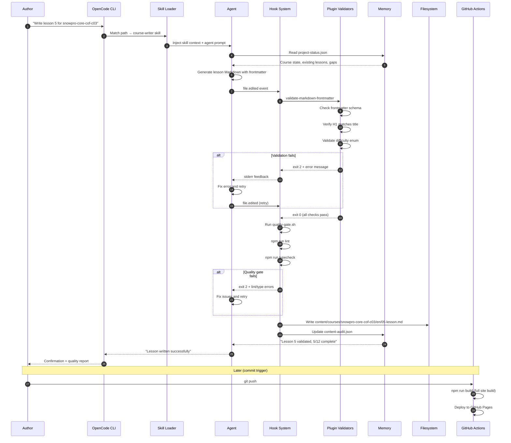

---

## 9. Implementation Roadmap

### Phase 1: Foundation (Weeks 1–2)

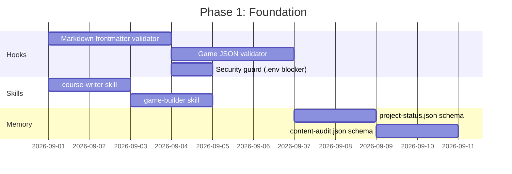

**Deliverables:**
- [ ] `.opencode/hooks/manifest.json` with all hook registrations
- [ ] `validate-frontmatter.sh` — validates Markdown frontmatter
- [ ] `validate-game-json.sh` — validates quiz/vocabulary JSON
- [ ] `guard-env-read.sh` — blocks .env reads
- [ ] `.opencode/skills/course-writer.md` — activates course context
- [ ] `.opencode/skills/game-builder.md` — activates game context
- [ ] `.opencode/memory/project-status.json` — initial platform state
- [ ] `.opencode/memory/content-audit.json` — 38 courses, 11 games catalogued

### Phase 2: Quality Gates (Weeks 3–4)

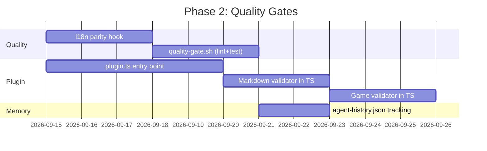

**Deliverables:**
- [ ] `check-i18n-parity.sh` — en/pt/es key parity
- [ ] `quality-gate.sh` — lint, typecheck, test chain
- [ ] `.opencode/plugin.ts` — TypeScript plugin with all hooks
- [ ] Agent session tracking in memory

### Phase 3: Intelligence (Weeks 5–6)

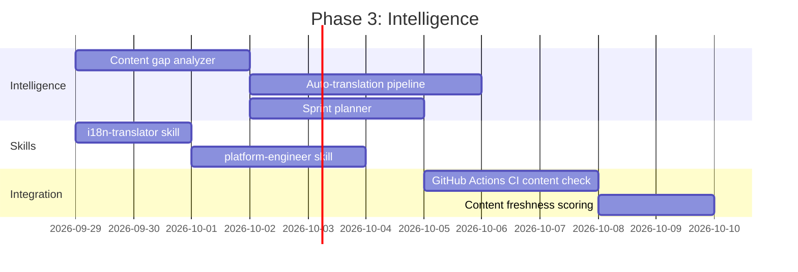

**Deliverables:**
- [ ] `content-gap-analyzer.sh` — scans for missing lessons/games
- [ ] Auto-translation pipeline: en → pt/es with quality gates
- [ ] `.opencode/skills/i18n-translator.md`
- [ ] `.opencode/skills/platform-engineer.md`
- [ ] Sprint planner that reads memory and suggests next tasks
- [ ] GitHub Actions workflow for content validation on PR

### Phase 4: Scale (Weeks 7–8)

**Deliverables:**
- [ ] Batch generation: generate entire domains in parallel
- [ ] Content versioning: track revisions in memory
- [ ] Quality scoring: automated content depth analysis
- [ ] Dashboard: visual status of all 38 courses, 11 games
- [ ] Agent performance tracking: success rate, fix rate, time per lesson

---

## 10. File Structure

```
.opencode/
├── .gitignore
├── package.json                  # @opencode-ai/plugin dependency
├── package-lock.json
├── node_modules/
│
├── hooks/
│   ├── validate-frontmatter/
│   │   ├── scripts/validate_frontmatter.py
│   │   ├── assets/hook.json
│   │   ├── examples/valid_lesson.md, invalid_lesson.md
│   │   └── references/schema.json
│   ├── validate-game-json/
│   │   ├── scripts/validate_game_json.py
│   │   ├── assets/hook.json
│   │   ├── examples/valid_quiz.json, valid_vocabulary.json
│   │   └── references/schema.json
│   ├── validate-course-json/
│   │   ├── scripts/validate_course_json.py
│   │   ├── assets/hook.json
│   │   ├── examples/valid_course.json
│   │   └── references/schema.json
│   ├── check-i18n-parity/
│   │   ├── scripts/check_i18n_parity.py
│   │   └── assets/hook.json
│   └── guard-env-read/
│       ├── scripts/guard_env_read.py
│       └── assets/hook.json
│
├── skills/
│   ├── skill-builder/            # Meta-skill for creating new skills
│   │   ├── skill.md
│   │   ├── assets/skill.json
│   │   ├── examples/skill.md, skill.json
│   │   └── references/
│   ├── course-writer/
│   │   ├── skill.md
│   │   ├── assets/skill.json
│   │   ├── examples/valid_lesson.md
│   │   └── references/guide.md
│   ├── game-builder/
│   │   ├── skill.md
│   │   ├── assets/skill.json
│   │   └── examples/valid_quiz.json
│   ├── i18n-translator/
│   │   └── skill.md
│   ├── platform-engineer/
│   │   └── skill.md
│   ├── mermaid-js/
│   │   ├── skill.md
│   │   ├── assets/skill.json
│   │   ├── examples/diagram_types.md
│   │   └── scripts/validate_mermaid.py
│   └── tailwind-css/
│       ├── skill.md
│       ├── assets/skill.json
│       ├── examples/components.tsx
│       ├── references/cheatsheet.md
│       └── scripts/validate_tailwind.py
│
├── plugins/
│   └── nuniversity-plugin/
│       ├── scripts/
│       ├── assets/
│       ├── examples/
│       └── references/
│
└── memory/
    └── MEMORY.md                 # Project state and context
```

### Hook → Event Mapping

| Hook Script | Listens To | Pattern | Exit Codes |
|---|---|---|---|
| `validate_frontmatter.py` | `file.write` | `content/courses/**/*.md` | 0=pass, 2=fail |
| `validate_game_json.py` | `file.write` | `content/games/**/*.json` | 0=pass, 2=fail |
| `validate_course_json.py` | `file.write` | `content/courses/**/course.json` | 0=pass, 2=fail |
| `check_i18n_parity.py` | `file.write` | `dictionaries/*.json` | 0=pass, 1=warn |
| `guard_env_read.py` | `tool.read` | `**` | 0=pass, 2=block |

### Skill → Path Mapping

| Skill | Triggers On | Auto-Loads |
|---|---|---|
| `skill-builder` | `.opencode/skills/**` | Meta-skill for creating skills |
| `course-writer` | `content/courses/**` | `COURSE-WRITER-AGENT-PROMPT.md` |
| `game-builder` | `content/games/**` | `GAME-BUILDER-AGENT-PROMPT.md` |
| `i18n-translator` | `dictionaries/**`, `**/pt/**`, `**/es/**` | `en.json`, source locale |
| `platform-engineer` | `lib/**`, `src/**` | `tsconfig.json`, `package.json` |
| `mermaid-js` | `**/*.md`, `content/**`, `docs/**` | Mermaid syntax reference |
| `tailwind-css` | `**/*.tsx`, `**/*.jsx`, `src/**`, `app/**` | Tailwind utilities reference |

---

## 11. Development Tool Stack

The deterministic harness uses a standardized tool stack for Python, JavaScript/TypeScript, and Bash development. All tools are configured via `pyproject.toml` and `.pre-commit-config.yaml` at the repository root.

### 11.1 Tool Overview

| Category | Tool | Language | Purpose | Install |
|----------|------|----------|---------|---------|
| **Package Mgmt** | `uv` | Python | Package management, virtual environments | `curl -LsSf https://astral.sh/uv/install.sh \| sh` |
| **Package Mgmt** | `fnm` | Node.js | Fast Node Manager | `curl -fsSL https://fnm.vercel.app/install \| bash` |
| **Linting** | `ruff` | Python | Linter + formatter (replaces flake8, black, isort) | `uv tool install ruff` |
| **Linting** | `eslint` | JS/TS | JavaScript/TypeScript linting | `npm install -D eslint` |
| **Linting** | `shellcheck` | Bash | Bash script linting | `apt install shellcheck` |
| **Linting** | `bandit` | Python | Security linter (AST-based) | `uv tool install bandit` |
| **Formatting** | `shfmt` | Bash | Bash script formatter | `go install mvdan.cc/sh/v3/cmd/shfmt@latest` |
| **Testing** | `pytest` | Python | Unit test runner | `uv tool install pytest pytest-mock pytest-cov` |
| **Testing** | `vitest` | JS/TS | Unit test runner | `npm install -D vitest` |
| **Testing** | `playwright` | E2E | End-to-end testing | `npm install -D @playwright/test` |
| **Pre-commit** | `pre-commit` | Any | Git hook framework | `uv tool install pre-commit` |

### 11.2 Tool Configuration

#### Ruff (Python Linting + Formatting)

```toml
# pyproject.toml
[tool.ruff]
target-version = "py312"
line-length = 88

[tool.ruff.lint]
select = [
    "E",    # pycodestyle errors
    "W",    # pycodestyle warnings
    "F",    # Pyflakes
    "I",    # isort
    "B",    # flake8-bugbear
    "C4",   # flake8-comprehensions
    "UP",   # pyupgrade
    "S",    # flake8-bandit (security)
    "B",    # flake8-bugbear
    "N",    # pep8-naming
    "RUF",  # Ruff-specific rules
]

[tool.ruff.lint.per-file-ignores]
"tests/**/*.py" = ["S101"]  # Allow assert in tests

[tool.ruff.format]
quote-style = "double"
indent-style = "space"
```

#### Bandit (Python Security)

```toml
# pyproject.toml
[tool.bandit]
exclude_dirs = ["tests", "venv", ".venv"]
skips = ["B101"]  # Skip assert warnings in tests
```

#### Pytest (Python Testing)

```toml
# pyproject.toml
[tool.pytest.ini_options]
testpaths = ["tests"]
markers = [
    "slow: marks tests as slow",
    "integration: marks integration tests",
]
addopts = "-v --tb=short"

[tool.coverage.run]
source = ["scripts", "hooks"]

[tool.coverage.report]
fail_under = 90
show_missing = true
```

#### ESLint (JavaScript/TypeScript)

```javascript
// eslint.config.js
import js from "@eslint/js";
export default [
  js.configs.recommended,
  {
    rules: {
      "no-unused-vars": "error",
      "no-undef": "error",
      "prefer-const": "error",
      "no-var": "error",
    },
  },
];
```

#### Vitest (JavaScript/TypeScript Testing)

```typescript
// vitest.config.ts
import { defineConfig } from "vitest/config";
export default defineConfig({
  test: {
    globals: true,
    environment: "node",
    coverage: {
      provider: "v8",
      thresholds: {
        lines: 80,
        functions: 80,
      },
    },
  },
});
```

#### ShellCheck + shfmt (Bash)

```bash
# .shellcheckrc
shell=bash
severity=warning

# shfmt flags: -i=2 (2-space indent), -bn (binary ops next line), -ci (case indent)
```

### 11.3 Pre-commit Configuration

```yaml
# .pre-commit-config.yaml
repos:
  - repo: https://github.com/astral-sh/ruff-pre-commit
    rev: v0.8.0
    hooks:
      - id: ruff
        args: [--fix]
      - id: ruff-format

  - repo: https://github.com/PyCQA/bandit
    rev: 1.8.0
    hooks:
      - id: bandit
        args: [-c, pyproject.toml]
        additional_dependencies: ["bandit[toml]"]

  - repo: https://github.com/pre-commit/mirrors-shellcheck
    rev: v0.10.0
    hooks:
      - id: shellcheck

  - repo: https://github.com/scop/pre-commit-shfmt
    rev: v3.10.0
    hooks:
      - id: shfmt
        args: ["-i", "2", "-bn", "-ci"]

  - repo: https://github.com/pre-commit/mirrors-eslint
    rev: v9.15.0
    hooks:
      - id: eslint
        files: \.(js|ts|jsx|tsx)$

  - repo: local
    hooks:
      - id: pytest-check
        name: pytest
        entry: uv run pytest --tb=short -q
        language: system
        types: [python]
        pass_filenames: false

  - repo: local
    hooks:
      - id: vitest-check
        name: vitest
        entry: npx vitest run
        language: system
        files: \.(test|spec)\.(js|ts|jsx|tsx)$
        pass_filenames: false
```

### 11.4 Quality Gate Chain

The quality gate chain runs automatically on every commit via pre-commit hooks and in CI:

```
┌─────────────────────────────────────────────────────────────┐
│              QUALITY GATE CHAIN (Deterministic)              │
│                                                             │
│  1. pre-commit ──▶ Run all hooks on staged files            │
│  2. ruff check ──▶ Python linting (flake8, isort, bugbear)  │
│  3. ruff format ─▶ Python formatting (Black-compatible)     │
│  4. eslint ──────▶ JS/TS linting                            │
│  5. shellcheck ──▶ Bash linting (SC2086, etc.)              │
│  6. shfmt ───────▶ Bash formatting                          │
│  7. bandit ──────▶ Python security scan (AST-based)         │
│  8. pytest ──────▶ Python unit tests (coverage ≥ 90%)       │
│  9. vitest ──────▶ JS/TS unit tests (coverage ≥ 80%)        │
│ 10. playwright ──▶ E2E integration tests                    │
│                                                             │
│  All gates must pass (exit 0) before commit/push            │
└─────────────────────────────────────────────────────────────┘
```

### 11.5 Language-Specific Workflows

#### Python Scripts

```bash
# Development
uv add pytest pytest-mock pytest-cov ruff bandit
uv run ruff check scripts/
uv run ruff format scripts/
uv run pytest tests/ --cov=scripts --cov-report=term-missing
uv run bandit -r scripts/

# CI
uv run ruff check . && uv run ruff format --check .
uv run pytest tests/ --cov=scripts --cov-fail-under=90
uv run bandit -r scripts/ -f json
```

#### JavaScript/TypeScript

```bash
# Development
npm install -D vitest eslint @playwright/test
npx vitest run
npx eslint src/
npx playwright test

# CI
npx vitest run --coverage
npx eslint src/
npx playwright test
```

#### Bash Scripts

```bash
# Development
shellcheck scripts/*.sh
shfmt -i 2 -bn -ci scripts/*.sh

# CI
shellcheck scripts/*.sh
shfmt -d -i 2 -bn -ci scripts/*.sh
```

---

## Appendix: NUniversity Content Inventory

| Type | Count | Location | Format |
|---|---|---|---|
| Courses | 38 | `content/courses/{slug}/` | Markdown + `course.json` |
| Games (quiz) | 5+ | `content/games/quiz/` | JSON |
| Games (vocabulary) | 2+ | `content/games/vocabulary/` | JSON |
| Games (other) | 4 | `content/games/{coding,logic,math,physics,puzzles}/` | JSON |
| Tools | 10 | `content/tools/` | Markdown + JSON |
| Libraries | — | `content/library/` | Markdown |
| Roadmaps | — | `content/roadmaps/` | Markdown |
| Dictionaries | 3 | `dictionaries/` | JSON (en, pt, es) |
