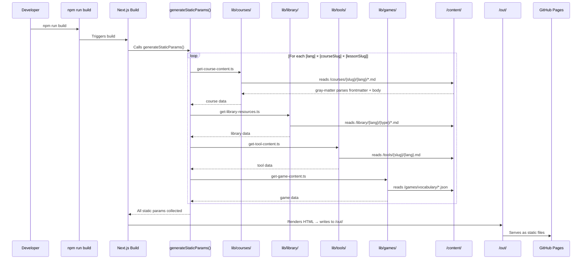
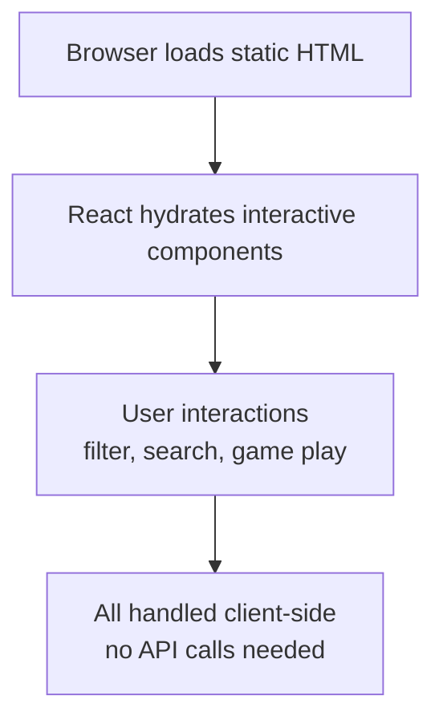
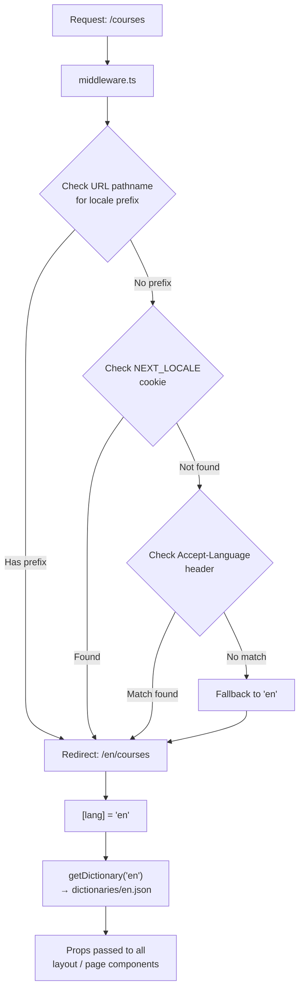

# 🏗️ Architecture

This document describes the overall system architecture, folder structure, key design decisions, and data flow of the NUniversity platform.

---

## Table of Contents

1. [High-Level Overview](#1-high-level-overview)
2. [Folder Structure](#2-folder-structure)
3. [Application Router (Next.js App Router)](#3-application-router)
4. [Data Flow](#4-data-flow)
5. [Internationalization Architecture](#5-internationalization-architecture)
6. [Content Architecture](#6-content-architecture)
7. [Component Architecture](#7-component-architecture)
8. [Static Export Strategy](#8-static-export-strategy)
9. [Theme System](#9-theme-system)
10. [Key Design Decisions](#10-key-design-decisions)

---

## 1. High-Level Overview


---

## 2. Folder Structure

```
nuniversity.github.io/
│
├── app/                            # Next.js App Router pages
│   ├── globals.css                 # Global styles (Tailwind base + custom CSS)
│   └── [lang]/                     # Dynamic locale segment
│       ├── layout.tsx              # Root layout (Header, Footer, Providers, SEO)
│       ├── page.tsx                # Home page
│       ├── about/
│       │   ├── page.tsx
│       │   └── AboutPageClient.tsx
│       ├── contact/
│       │   └── page.tsx
│       ├── courses/
│       │   ├── page.tsx            # Courses listing (Server Component)
│       │   ├── courses-client.tsx  # Courses listing (Client Component)
│       │   └── [courseSlug]/
│       │       └── [lessonSlug]/
│       │           ├── page.tsx    # Lesson viewer (Server Component)
│       │           └── lesson-client.tsx
│       ├── games/
│       │   ├── page.tsx
│       │   ├── games-client.tsx
│       │   └── vocabulary/
│       │       └── [slug]/
│       │           ├── page.tsx
│       │           └── vocabulary-game-client.tsx
│       ├── library/
│       │   ├── page.tsx
│       │   └── library-client.tsx
│       └── tools/
│           ├── page.tsx
│           ├── tools-client.tsx
│           └── [slug]/
│               └── page.tsx
│
├── components/                     # Reusable UI components
│   ├── ads/
│   ├── contacts/
│   ├── home/                       # Hero, Features, Stats, Newsletter, Tools, FeaturedCourses
│   ├── language/                   # LanguageSwitcher
│   ├── layout/                     # Header, Footer
│   ├── markdown/                   # MarkdownRenderer, FixWrapper (SyntaxHighlighter)
│   ├── providers/                  # ThemeProvider / Providers
│   └── tools/                      # EisenhowerMatrix, LLMPromptBuilder, SWOTMatrix, BrainWritingSession
│
├── content/                        # All static content (Markdown + JSON)
│   ├── courses/
│   │   └── {course-slug}/
│   │       ├── course.json         # Course metadata (multilingual)
│   │       ├── en/                 # English lessons (.md)
│   │       ├── pt/                 # Portuguese lessons (.md)
│   │       └── es/                 # Spanish lessons (.md)
│   ├── games/
│   │   └── vocabulary/
│   │       └── {game-id}.json      # Vocabulary game word pairs
│   ├── library/
│   │   └── {lang}/
│   │       └── {type}/             # video | ebook | course | blog | repository | podcast | article
│   │           └── {resource}.md   # Resource metadata (frontmatter)
│   └── tools/
│       └── {tool-slug}/
│           ├── en.md               # Tool metadata in English
│           ├── pt.md               # Tool metadata in Portuguese
│           └── es.md               # Tool metadata in Spanish
│
├── dictionaries/                   # UI translation strings
│   ├── en.json
│   ├── pt.json
│   └── es.json
│
├── lib/                            # Data access / utility functions
│   ├── courses/
│   │   └── get-course-content.ts   # Read course markdown files
│   ├── games/
│   │   └── get-game-content.ts     # Read game JSON files
│   ├── i18n/
│   │   ├── config.ts               # Locale config (en, pt, es)
│   │   └── get-dictionary.ts       # Load dictionary for a locale
│   ├── library/
│   │   ├── get-library-resources.ts
│   │   └── types.ts
│   └── tools/
│       └── get-tool-content.ts
│
├── public/                         # Static assets
│   ├── favicon.ico / favicon.svg
│   ├── robots.txt
│   ├── Ads.txt
│   └── team/
│       └── leandro-alves.png
│
├── docs/                           # ← You are here
│   ├── INDEX.md                    # Master documentation index
│   ├── architecture/               # System design, components
│   ├── features/                   # Content, i18n, roadmaps, games, markdown
│   ├── operations/                 # Deployment, testing, contributing
│   ├── ai/                         # Agents, OpenCode harness
│   ├── assessment/                 # Codebase audit
│   ├── getting-started/            # Dev setup
│   └── reference/                  # Course plans, status trackers
│
├── middleware.ts                   # i18n redirect middleware
├── nextjs.config.js                # Next.js configuration (static export)
├── tailwind.config.js              # Tailwind + DaisyUI configuration
├── tsconfig.json                   # TypeScript configuration
└── package.json
```

---

## 3. Application Router

The platform uses the **Next.js 14 App Router** with a top-level **dynamic route segment** `[lang]` that handles all locale-specific pages.

### Route Hierarchy

```
app/
└── [lang]/              ← captures 'en', 'pt', 'es'
    ├── layout.tsx        ← persistent shell (Header + Footer)
    ├── page.tsx          ← /en  /pt  /es
    ├── about/page.tsx    ← /en/about
    ├── contact/page.tsx  ← /en/contact
    ├── courses/
    │   ├── page.tsx      ← /en/courses
    │   └── [courseSlug]/
    │       └── [lessonSlug]/
    │           └── page.tsx  ← /en/courses/intro-to-programming/01-introduction
    ├── games/
    │   ├── page.tsx      ← /en/games
    │   └── vocabulary/
    │       └── [slug]/
    │           └── page.tsx  ← /en/games/vocabulary/en-to-pt
    ├── library/page.tsx  ← /en/library
    └── tools/
        ├── page.tsx      ← /en/tools
        └── [slug]/
            └── page.tsx  ← /en/tools/eisenhower-matrix
```

### Server vs Client Components

| Pattern | Usage |
|---|---|
| **Server Component** (`page.tsx`) | Data fetching at build time via `lib/` functions |
| **Client Component** (`*-client.tsx`) | Interactive UI — filtering, state, animations |
| `'use client'` directive | All interactive tools, header, language switcher, providers |

The pattern used throughout is:

```
page.tsx (Server)
  ↓ fetches data
  ↓ passes as props
*-client.tsx (Client)
  ↓ renders interactive UI
```

---

## 4. Data Flow

### Build-Time Data Flow (Static Generation)



### Runtime Data Flow (Client Side)



---

## 5. Internationalization Architecture



For full details see **[INTERNATIONALIZATION.md](../features/INTERNATIONALIZATION.md)**.

---

## 6. Content Architecture

All content is **file-system based** — there is no database or CMS.

### Courses

```
content/courses/{course-slug}/
  ├── course.json           # metadata: title, description, area, difficulty, duration (per locale)
  └── {lang}/
      └── NN-lesson-name.md # frontmatter: title, description, order, difficulty, duration
```

### Library Resources

```
content/library/{lang}/{type}/{resource-id}.md
# frontmatter only — no body content used at runtime
```

### Tools

```
content/tools/{tool-slug}/{lang}.md
# frontmatter: title, description, category, icon, order
```

### Games

```
content/games/vocabulary/{game-id}.json
# JSON with id, title, description, difficulty, language_pair, words[]
```

---

## 7. Component Architecture

```
components/
├── providers/
│   └── Providers.tsx       ← ThemeContext + ThemeProvider (light/dark)
│
├── layout/
│   ├── Header.tsx          ← Nav links, theme toggle, language switcher (Client)
│   └── Footer.tsx          ← Links, social media, copyright (Server-compatible)
│
├── language/
│   └── LanguageSwitcher.tsx ← Dropdown to switch locale (Client)
│
├── home/
│   ├── Hero.tsx            ← Full-screen hero section
│   ├── Features.tsx        ← Feature cards grid
│   ├── FeaturedCourses.tsx ← Course preview cards
│   ├── Stats.tsx           ← Platform statistics
│   ├── Tools.tsx           ← Tool highlights
│   └── Newsletter.tsx      ← Email signup form
│
├── markdown/
│   ├── MarkdownRenderer.tsx ← Full-featured MD renderer (Client)
│   └── FixWrapper.tsx       ← SyntaxHighlighter SSR compatibility wrapper
│
├── tools/
│   ├── EisenhowerMatrix.tsx   ← Priority matrix tool (Client)
│   ├── LLMPromptBuilder.tsx   ← AI prompt constructor (Client)
│   ├── SWOTMatrix.tsx         ← SWOT analysis tool (Client)
│   └── BrainWritingSession.tsx ← Brainstorming tool (Client)
│
├── contacts/
│   ├── Contact.tsx         ← Contact info display
│   └── ContactForm.tsx     ← Formspree-powered form
│
└── ads/
    └── AdsSpace.tsx        ← Ad placement wrapper
```

---

## 8. Static Export Strategy

The site is exported as **pure static HTML** (no server required):

```js
// nextjs.config.js
const nextConfig = {
  output: 'export',           // generates /out directory
  trailingSlash: true,        // /en/ instead of /en
  distDir: 'out',
  assetPrefix: '/nuniversity.github.io',  // production CDN prefix
  basePath: '/nuniversity.github.io',     // GitHub Pages subdirectory
  images: { unoptimized: true },          // Next/Image without server
}
```

**Implications:**
- No server-side rendering at runtime
- No API routes (all data read at build time)
- `dynamic = 'force-static'` set on all pages
- `generateStaticParams()` required for all dynamic routes
- All locale + course + lesson combinations pre-rendered at build time

---

## 9. Theme System

The theme system is a **custom Context-based implementation** (not next-themes):

```mermaid
flowchart TD
    A[Providers.tsx] --> B[ThemeProvider]
    B --> C[State: 'light' | 'dark']
    B --> D[Reads from localStorage\non mount]
    B --> E[Respects\nprefers-color-scheme]
    B --> F[Persists to localStorage\non change]
    B --> G["Sets document.documentElement.classList\n('dark')"]
    G --> H[Triggers Tailwind\ndark: variant]
    G --> I["Sets data-theme attribute\nfor DaisyUI"]
```

The `useTheme()` hook is exported from `Providers.tsx` and consumed by `Header.tsx`.

---

## 10. Key Design Decisions

| Decision | Rationale |
|---|---|
| **Static export** | Zero infrastructure cost; GitHub Pages hosting; fast global CDN delivery |
| **File-based content** | No database dependency; easy to version-control content alongside code |
| **Locale in URL** | SEO-friendly, shareable links, accessible without JavaScript |
| **Server + Client split** | Data fetched once at build time; interactive UI hydrated on the client |
| **Locale fallback to 'en'** | If a lesson/tool doesn't exist in the requested locale, English is served |
| **gray-matter for frontmatter** | Standard, well-supported YAML frontmatter parsing for Markdown files |
| **DaisyUI + Tailwind** | Rapid UI development with pre-built component classes + customizable tokens |
| **Custom ThemeProvider** | More control than next-themes; avoids flash of incorrect theme |
| **Mermaid.js lazy-loaded** | Heavy library — dynamically imported only when a mermaid code block is detected |
| **Server → Client props** | Functions cannot be passed from Server to Client Components — use string identifiers for icons, not component references |
