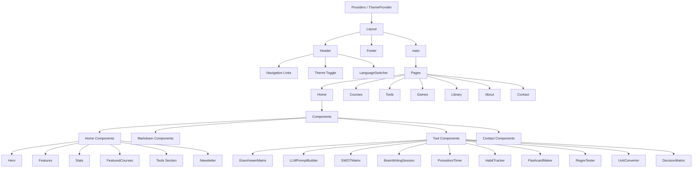
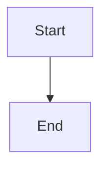

# 🧩 Components Reference

This document covers every reusable component in the NUniversity platform — its purpose, props, usage patterns, and where it fits in the application.

---

## Component Hierarchy



---

## Table of Contents

1. [Layout Components](#1-layout-components)
   - [Header](#header)
   - [Footer](#footer)
2. [Provider Components](#2-provider-components)
   - [Providers / ThemeProvider](#providers--themeprovider)
3. [Language Components](#3-language-components)
   - [LanguageSwitcher](#languageswitcher)
4. [Home Page Components](#4-home-page-components)
   - [Hero](#hero)
   - [Features](#features)
   - [Stats](#stats)
   - [FeaturedCourses](#featuredcourses)
   - [Tools Section](#tools-section)
   - [Newsletter](#newsletter)
5. [Markdown Components](#5-markdown-components)
   - [MarkdownRenderer](#markdownrenderer)
   - [FixWrapper](#fixwrapper)
   - [MathBlock](#mathblock)
   - [PhETEmbed](#phetembed)
   - [SciencePlot](#scienceplot)
   - [MoleculeViewer](#moleculeviewer)
   - [DragOrderQuestion](#dragorderquestion)
   - [MatchingQuestion](#matchingquestion)
   - [FillBlankQuestion](#fillblankquestion)
6. [Tool Components](#6-tool-components)
   - [EisenhowerMatrix](#eisenhowermatrix)
   - [LLMPromptBuilder](#llmpromptbuilder)
   - [SWOTMatrix](#swotmatrix)
   - [BrainWritingSession](#brainwritingsession)
   - [PomodoroTimer](#pomodorotimer)
   - [HabitTracker](#habittracker)
   - [FlashcardMaker](#flashcardmaker)
   - [RegexTester](#regextester)
   - [UnitConverter](#unitconverter)
   - [DecisionMatrix](#decisionmatrix)
7. [Contact Components](#7-contact-components)
   - [Contact](#contact)
   - [ContactForm](#contactform)
8. [Ads Components](#8-ads-components)
   - [AdsSpace](#adsspace)
9. [Component Props Conventions](#9-component-props-conventions)

---

## 1. Layout Components

### Header

**File:** `components/layout/Header.tsx`  
**Type:** Client Component (`'use client'`)  
**Role:** Sticky top navigation bar present on all pages.

#### Features
- NUniversity logo and brand name
- Desktop navigation links with icons
- "NEW" badge on recently added sections (Tools, Games, Library)
- Light/Dark theme toggle button
- Language switcher dropdown
- Responsive mobile hamburger menu with slide-in animation

#### Props

| Prop | Type | Required | Description |
|---|---|---|---|
| `lang` | `Locale` | Yes | Current locale (`'en'`, `'pt'`, `'es'`) |
| `dict` | `Dictionary` | Yes | Translation dictionary for navigation labels |

#### Navigation Items

```ts
const navigation = [
  { name: dict.navigation.home,    href: `/${lang}`,         icon: Home    },
  { name: dict.navigation.courses, href: `/${lang}/courses`, icon: BookOpen },
  { name: dict.navigation.tools,   href: `/${lang}/tools`,   icon: Calculator, isNew: true },
  { name: dict.navigation.games,   href: `/${lang}/games`,   icon: GamepadIcon, isNew: true },
  { name: dict.navigation.library, href: `/${lang}/library`, icon: Library, isNew: true },
  { name: dict.navigation.about,   href: `/${lang}/about`   },
  { name: dict.navigation.contact, href: `/${lang}/contact` },
]
```

#### Theme Toggle

Uses `useTheme()` from `Providers.tsx`. Renders a Moon icon in light mode and a Sun icon in dark mode.

#### Usage

```tsx
// app/[lang]/layout.tsx
<Header lang={params.lang} dict={dict} />
```

---

### Footer

**File:** `components/layout/Footer.tsx`  
**Type:** Server-compatible Component  
**Role:** Full-width site footer at the bottom of all pages.

#### Features
- Brand logo + mission description
- Social media links (YouTube, Instagram, GitHub, LinkedIn, Email)
- Platform links (Courses, Tools, Games, Library)
- Company links (About, Contact)
- Privacy Policy, Terms of Service, Cookies links
- Copyright notice with dynamic year
- "Made with ❤️ for learners worldwide" tagline

#### Props

| Prop | Type | Required | Description |
|---|---|---|---|
| `lang` | `Locale` | Yes | Current locale |
| `dict` | `Dictionary` | Yes | Translation dictionary |

#### Social Links

```ts
const socialLinks = [
  { name: "Youtube",   href: 'https://www.youtube.com/@nuniversity',          icon: Youtube },
  { name: "Instagram", href: 'https://www.instagram.com/thenuniversity/',      icon: Instagram },
  { name: "GitHub",    href: 'https://github.com/nuniversity',                 icon: Github },
  { name: "LinkedIn",  href: 'https://www.linkedin.com/company/nuniversity/',  icon: Linkedin },
  { name: "Email",     href: 'mailto:thenuniversitybr@gmail.com',              icon: Mail },
]
```

#### Usage

```tsx
// app/[lang]/layout.tsx
<Footer lang={params.lang} dict={dict} />
```

---

## 2. Provider Components

### Providers / ThemeProvider

**File:** `components/providers/Providers.tsx`  
**Type:** Client Component (`'use client'`)  
**Role:** Application-level context providers. Currently manages the theme system.

#### Exports

| Export | Type | Description |
|---|---|---|
| `Providers` | Component | Root provider wrapper — wrap the entire app |
| `useTheme` | Hook | Access `theme` state and `toggleTheme` function |

#### `useTheme()` Return Value

```ts
interface ThemeContextType {
  theme: 'light' | 'dark'
  toggleTheme: () => void
}
```

#### Theme Behavior

1. On mount: reads `localStorage.getItem('theme')`
2. Fallback: checks `window.matchMedia('(prefers-color-scheme: dark)')`
3. On change: writes to `localStorage`, toggles `document.documentElement.classList.dark`, and sets `data-theme` attribute for DaisyUI

#### Usage

```tsx
// app/[lang]/layout.tsx
<Providers>
  <div className="min-h-screen flex flex-col">
    <Header lang={lang} dict={dict} />
    <main>{children}</main>
    <Footer lang={lang} dict={dict} />
  </div>
</Providers>
```

```tsx
// In any Client Component:
import { useTheme } from '@/components/providers/Providers'

const { theme, toggleTheme } = useTheme()
```

---

## 3. Language Components

### LanguageSwitcher

**File:** `components/language/LanguageSwitcher.tsx`  
**Type:** Client Component (`'use client'`)  
**Role:** Dropdown selector for switching the active locale.

#### Features
- Shows current locale flag + name
- Dropdown with all supported locales
- Checkmark on the active locale
- Sets `NEXT_LOCALE` cookie (1-year expiry) on selection
- Navigates to the same page path in the new locale
- Click-outside overlay to close

#### Props

| Prop | Type | Required | Description |
|---|---|---|---|
| `currentLocale` | `Locale` | Yes | The currently active locale |

#### Locale Switch Logic

```ts
const switchLanguage = (newLocale: Locale) => {
  const segments = pathname.split('/')
  segments[1] = newLocale           // replace locale segment
  const newPathname = segments.join('/')
  document.cookie = `NEXT_LOCALE=${newLocale}; path=/; max-age=31536000`
  router.push(newPathname)
}
```

#### Usage

```tsx
// components/layout/Header.tsx
<LanguageSwitcher currentLocale={lang} />
```

---

## 4. Home Page Components

### Hero

**File:** `components/home/Hero.tsx`  
**Type:** Client Component (`'use client'`)  
**Role:** Full-viewport hero section on the home page.

#### Features
- Animated gradient background with pulsing blur circles
- Platform badge (animated)
- Main headline with highlighted gradient word
- Subheadline
- CTA button → courses page
- Feature pill badges (Coding, Tools, Courses)
- Animated scroll indicator

#### Props

| Prop | Type | Required | Description |
|---|---|---|---|
| `lang` | `Locale` | Yes | Current locale for link generation |
| `dict` | `Dictionary` | Yes | Translations for all text content |

#### Key Dictionary Keys Used

```
dict.hero.badge
dict.hero.title
dict.hero.titleHighlight
dict.hero.subtitle
dict.hero.cta.explore
dict.hero.features.coding
dict.hero.features.tools
dict.hero.features.courses
```

---

### Features

**File:** `components/home/Features.tsx`  
**Type:** Client Component (`'use client'`)  
**Role:** Feature cards grid displayed on the home page below the hero.

#### Features
- Section title with highlighted word
- Grid of 6 feature cards with icons
- "Discover all features" CTA button

#### Props

| Prop | Type | Required | Description |
|---|---|---|---|
| `lang` | `Locale` | Yes | Current locale |
| `dict` | `Dictionary` | Yes | Translations |

#### Feature Cards (from dictionary)

```
Interactive Courses | Coding Tools | Study Tools
Educational Games   | Video Integration | Community Driven
```

---

### Stats

**File:** `components/home/Stats.tsx`  
**Type:** Client Component (`'use client'`)  
**Role:** Animated statistics section on the home page showing platform metrics.

#### Features
- 4-column grid of animated stat cards (Courses, Tools, Games, Resources)
- Icon per stat resolved via `iconMap` lookup (string-keyed, not component-passed)
- Scroll-triggered animation via framer-motion

#### Props

| Prop | Type | Required | Description |
|---|---|---|---|
| `dict` | `Dictionary` | Yes | Translation dictionary |
| `stats` | `StatItem[]` | Yes | Array of stat objects |

#### `StatItem` Interface

```ts
export type StatIcon = 'BookOpen' | 'Wrench' | 'GamepadIcon' | 'Library'

export interface StatItem {
  label: string
  value: string
  icon: StatIcon   // string key, not a React component
}
```

> **Note:** Icons are passed as string identifiers, not React components. The `Stats` client component resolves them internally via `iconMap`. This avoids the "Functions cannot be passed to Client Components" error in Next.js.

#### Usage

```tsx
// app/[lang]/page.tsx (Server Component)
const stats: StatItem[] = [
  { label: 'Courses', value: '27+', icon: 'BookOpen' },
  { label: 'Tools',   value: '5+',  icon: 'Wrench' },
  { label: 'Games',   value: '4+',  icon: 'GamepadIcon' },
  { label: 'Resources', value: '50+', icon: 'Library' },
]

<Stats dict={dict} stats={stats} />
```

---

### FeaturedCourses

**File:** `components/home/FeaturedCourses.tsx`  
**Type:** Client Component (`'use client'`)  
**Role:** Grid of featured course cards on the home page.

#### Props

| Prop | Type | Required | Description |
|---|---|---|---|
| `lang` | `Locale` | Yes | Current locale |
| `dict` | `Dictionary` | Yes | Translation dictionary |
| `courses` | `Course[]` | Yes | Array of courses to display |

---

### Tools Section

**File:** `components/home/Tools.tsx`  
**Type:** Client Component (`'use client'`)  
**Role:** Highlights available interactive tools on the home page.

#### Props

| Prop | Type | Required | Description |
|---|---|---|---|
| `lang` | `Locale` | Yes | Current locale |
| `dict` | `Dictionary` | Yes | Translation dictionary |
| `tools` | `Tool[]` | Yes | Array of tools to display |

---

### Newsletter

**File:** `components/home/Newsletter.tsx`  
**Type:** Client Component (`'use client'`)  
**Role:** Email signup form section on the home page.

#### Props

| Prop | Type | Required | Description |
|---|---|---|---|
| `dict` | `Dictionary` | Yes | Translation dictionary |

---

## 5. Markdown Components

### MarkdownRenderer

**File:** `components/markdown/MarkdownRenderer.tsx`  
**Type:** Client Component (`'use client'`)  
**Role:** Renders Markdown content with rich styling, code highlighting, diagrams, and interactive features.

#### Props

| Prop | Type | Required | Description |
|---|---|---|---|
| `content` | `string` | Yes | Raw Markdown string to render |

#### Supported Markdown Features

| Feature | Implementation |
|---|---|
| **GFM** (tables, task lists, strikethrough) | `remark-gfm` plugin |
| **Raw HTML** in Markdown | `rehype-raw` plugin |
| **Syntax highlighting** | `react-syntax-highlighter` (via `FixWrapper`) |
| **Mermaid diagrams** | Dynamic import of `mermaid` library |
| **Alert boxes** | Custom `blockquote` renderer (4 types) |
| **Copy button** on code blocks | `CopyButton` sub-component |
| **Responsive tables** | Wrapped in scrollable container |
| **External links** | Auto-open in new tab |

#### Language Aliases

The renderer normalizes language identifiers before passing to the highlighter:

```ts
const langMap = {
  psql: 'sql', postgresql: 'sql',
  py: 'python',
  rs: 'rust',
  sh: 'bash', shell: 'bash', zsh: 'bash',
  terraform: 'terraform', hcl: 'terraform', tf: 'terraform',
  diagram: 'mermaid',
}
```

#### Alert Box Syntax

```markdown
> [!NOTE]      → blue info box
> [!WARNING]   → yellow warning box
> [!DANGER]    → red error box
> [!SUCCESS]   → green success box
```

#### Mermaid Diagram Syntax

````markdown

````

Mermaid diagrams include:
- Zoom in/out controls (+/- buttons and Ctrl+Mouse Wheel)
- Reset zoom (1:1 button)
- Fullscreen toggle
- Error display with collapsible code

#### Usage

```tsx
import MarkdownRenderer from '@/components/markdown/MarkdownRenderer'

<MarkdownRenderer content={lesson.content} />
```

---

### FixWrapper

**File:** `components/markdown/FixWrapper.tsx`  
**Type:** Client Component  
**Role:** Compatibility wrapper around `react-syntax-highlighter` to prevent SSR hydration mismatches.

#### Props

Passes all props through to `SyntaxHighlighter` from `react-syntax-highlighter`.

#### Usage

Only used internally by `MarkdownRenderer`. Not intended for direct use.

---

### MathBlock

**File:** `components/markdown/MarkdownRenderer.tsx` (inline)  
**Type:** Client Component  
**Role:** Renders KaTeX math equations from ` ```math ` blocks and `$...$` / `$$...$$` syntax.

#### Features
- Dynamic import of KaTeX library (SSR-safe)
- Inline and display mode support
- Dark mode compatible CSS
- Loading spinner during dynamic import

#### Config Schema

| Field | Type | Required | Description |
|-------|------|----------|-------------|
| `expression` | string | Yes | LaTeX math expression |
| `display` | boolean | No | Display mode (default: true) |

---

### PhETEmbed

**File:** `components/markdown/PhETEmbed.tsx`  
**Type:** Client Component  
**Role:** Embeds PhET Interactive Simulations via iframe.

#### Features
- Responsive iframe with aspect-ratio 834:504
- Loading spinner while iframe loads
- Error fallback with simulation link
- Attribution footer with link to phet.colorado.edu

#### Config Schema

| Field | Type | Required | Description |
|-------|------|----------|-------------|
| `slug` | string | Yes | PhET simulation slug |
| `title` | string | No | Display title |
| `language` | string | No | Interface language |

---

### SciencePlot

**File:** `components/markdown/SciencePlot.tsx`  
**Type:** Client Component  
**Role:** Renders interactive charts using Recharts (line, bar, scatter, pie).

#### Features
- Dynamic import of Recharts (SSR-safe)
- Responsive container
- Dark mode tooltips and grid
- Animated transitions
- 4 chart types: line, bar, scatter, pie

#### Config Schema

| Field | Type | Required | Description |
|-------|------|----------|-------------|
| `type` | string | Yes | `line`, `bar`, `scatter`, `pie` |
| `title` | string | No | Chart title |
| `data` | array | Yes | Data objects |
| `xKey` | string | Yes | X-axis key |
| `yKey` | string | Yes | Y-axis key |
| `xLabel` | string | No | X-axis label |
| `yLabel` | string | No | Y-axis label |

---

### MoleculeViewer

**File:** `components/markdown/MoleculeViewer.tsx`  
**Type:** Client Component  
**Role:** Renders 3D molecular structures from RCSB PDB using 3Dmol.js.

#### Features
- Dynamic import of 3Dmol (SSR-safe)
- Fetches PDB data from RCSB
- 5 display styles: cartoon, sphere, stick, line, surface
- Drag-to-rotate, scroll-to-zoom
- Loading spinner and error fallback

#### Config Schema

| Field | Type | Required | Description |
|-------|------|----------|-------------|
| `pdbId` | string | Yes | 4-char PDB ID |
| `style` | string | No | Display style |
| `color` | string | No | Coloring scheme |
| `height` | string | No | CSS height |

---

### DragOrderQuestion

**File:** `components/markdown/DragOrderQuestion.tsx`  
**Type:** Client Component  
**Role:** Drag-and-drop ordering quiz using @dnd-kit.

#### Features
- Sortable list with grip handle
- Per-item correct/incorrect feedback
- Keyboard accessible (Space/Enter to grab, Arrow keys to move, Escape to cancel)
- Check answer and Try Again buttons
- Explanation display

#### Config Schema

| Field | Type | Required | Description |
|-------|------|----------|-------------|
| `question` | string | Yes | Question text |
| `items` | string[] | Yes | Items to order |
| `correctOrder` | string[] | Yes | Correct order |
| `explanation` | string | No | Feedback explanation |

---

### MatchingQuestion

**File:** `components/markdown/MatchingQuestion.tsx`  
**Type:** Client Component  
**Role:** Matching pairs quiz using @dnd-kit.

#### Features
- Two-column layout with draggable chips and droppable slots
- DragOverlay for visual feedback
- Per-slot correct/incorrect feedback
- Check Matches and Try Again buttons
- Shuffled answer options

#### Config Schema

| Field | Type | Required | Description |
|-------|------|----------|-------------|
| `question` | string | Yes | Question text |
| `pairs` | array | Yes | `[{left, right}]` pairs |
| `explanation` | string | No | Feedback explanation |

---

### FillBlankQuestion

**File:** `components/markdown/FillBlankQuestion.tsx`  
**Type:** Client Component  
**Role:** Fill-in-the-blank quiz with word bank using @dnd-kit.

#### Features
- Template parser with `{{N}}` placeholder syntax
- Inline blank slots within text
- Draggable word bank with distractors
- Per-blank correct/incorrect feedback
- Check Answers and Try Again buttons

#### Config Schema

| Field | Type | Required | Description |
|-------|------|----------|-------------|
| `question` | string | Yes | Question text |
| `template` | string | Yes | Text with `{{N}}` blanks |
| `answers` | object | Yes | `{"N": "correct answer"}` |
| `distractors` | string[] | No | Wrong options |
| `explanation` | string | No | Feedback explanation |

---

## 6. Tool Components

All tool components follow this interface convention:

```ts
interface ToolProps {
  lang: Locale   // for built-in translations
  dict: any      // for dictionary-driven text
}
```

All tools are **Client Components** (`'use client'`).

---

### EisenhowerMatrix

**File:** `components/tools/EisenhowerMatrix.tsx`  
**Role:** Interactive priority management tool based on the Eisenhower Decision Matrix.

#### Features
- **4 Quadrants:** Do First (🔴), Schedule (🔵), Delegate (🟡), Eliminate (⚫)
- Add, edit, delete tasks within each quadrant
- Mark tasks as complete (with strikethrough and checkmark)
- **Matrix view** (2×2 grid) and **List view** toggle
- Show/hide completed tasks toggle
- Task completion statistics (total, completed, pending, completion rate)
- **Export tasks** as JSON or CSV
- **Import tasks** from JSON or CSV file (with drag-and-drop modal)
- Full multilingual support (EN, PT, ES — built-in translations in component)

#### State Shape

```ts
{
  tasks: {
    doFirst:  Task[]
    schedule: Task[]
    delegate: Task[]
    eliminate: Task[]
  },
  view: 'matrix' | 'list',
  showCompleted: boolean
}

interface Task {
  id: number
  text: string
  completed: boolean
  createdAt: string  // ISO date
}
```

#### Import/Export Format

**JSON:**
```json
{
  "tasks": [
    { "quadrant": "doFirst", "task": "Fix critical bug", "completed": false, "createdAt": "..." }
  ],
  "exportedAt": "..."
}
```

**CSV:**
```csv
Quadrant,Task,Completed,Created At
"doFirst","Fix critical bug","false","2025-01-01T..."
```

---

### LLMPromptBuilder

**File:** `components/tools/LLMPromptBuilder.tsx`  
**Role:** Structured prompt generator for Large Language Models (ChatGPT, Claude, Gemini, etc.)

#### Features
- Form with 8 configurable fields:
  - **Agent Role** (optional) — sets the AI persona
  - **Objective** (required) — what the AI should do
  - **Context** (optional) — background information
  - **Target Audience** (optional) — who the response is for
  - **Tone** (dropdown) — Professional, Casual, Technical, Creative, Educational
  - **Constraints** (optional) — length limits, restrictions
  - **Output Format** (optional) — JSON, bullet points, etc.
  - **Examples** (optional) — sample outputs
- Live **generated prompt preview** panel
- **Copy to clipboard** button
- **Download as .txt** button
- Reset form button
- Tips section with prompt engineering best practices
- Full dictionary-driven translations

#### Generated Prompt Template

```
You are {role}.

**Objective:**
{objective}

**Context:**
{context}

**Target Audience:**
{target}

**Constraints:**
{constraints}

**Output Format:**
{outputFormat}

**Tone:**
{tone}

**Examples:**
{examples}

Please provide a comprehensive response following the guidelines above.
```

---

### SWOTMatrix

**File:** `components/tools/SWOTMatrix.tsx`  
**Role:** Strategic analysis tool using the SWOT (Strengths, Weaknesses, Opportunities, Threats) framework.

#### Features
- 4-quadrant editable grid
- Add/remove items in each quadrant
- Export functionality
- Multilingual support

---

### BrainWritingSession

**File:** `components/tools/BrainWritingSession.tsx`  
**Role:** Collaborative brainstorming tool based on the 6-3-5 BrainWriting method.

#### Features
- Timer-based idea generation sessions
- Multiple participant simulation
- Idea collection and display
- Export session results

---

### PomodoroTimer

**File:** `components/tools/PomodoroTimer.tsx`  
**Role:** Productivity timer implementing the Pomodoro Technique with session tracking and streak management.

#### Features
- Configurable work/break durations (25/5/15 min defaults)
- Session counter with auto-incrementing streaks
- **localStorage persistence** — survives page reloads
- Visual circular progress indicator
- Start, pause, and reset controls
- Sound notification on session completion
- Session history display

#### State Shape

```ts
{
  workDuration: number       // minutes
  shortBreak: number         // minutes
  longBreak: number          // minutes
  currentSession: number     // 1–4
  streak: number             // completed sessions today
  isRunning: boolean
  isBreak: boolean
  timeRemaining: number      // seconds
}
```

#### Props

| Prop | Type | Required | Description |
|---|---|---|---|
| `lang` | `Locale` | Yes | Current locale |
| `dict` | `Dictionary` | Yes | Translation dictionary |

---

### HabitTracker

**File:** `components/tools/HabitTracker.tsx`  
**Role:** Daily habit tracking with CRUD operations, streak counting, and calendar visualization.

#### Features
- **Create, read, update, delete** habits
- Daily check-in/logging per habit
- **Streak counter** per habit (consecutive days)
- **Calendar view** showing completion history
- Color-coded habit categories
- Progress overview with completion stats
- localStorage persistence for all data

#### State Shape

```ts
interface Habit {
  id: string
  name: string
  color: string
  icon: string
  createdAt: string        // ISO date
  completions: string[]    // array of ISO dates
}

interface HabitState {
  habits: Habit[]
  selectedDate: string     // ISO date
}
```

#### Props

| Prop | Type | Required | Description |
|---|---|---|---|
| `lang` | `Locale` | Yes | Current locale |
| `dict` | `Dictionary` | Yes | Translation dictionary |

---

### FlashcardMaker

**File:** `components/tools/FlashcardMaker.tsx`  
**Role:** Flashcard deck builder with spaced repetition algorithm and interactive study sessions.

#### Features
- **Deck CRUD** — create, rename, delete decks
- **Card CRUD** — add, edit, delete cards within decks
- **Spaced repetition** (SM-2 variant) — cards shown based on difficulty rating
- **Study sessions** — flip cards, rate difficulty (1–5)
- Progress tracking per deck (mastered vs. learning cards)
- localStorage persistence for decks and ratings

#### State Shape

```ts
interface Card {
  id: string
  front: string
  back: string
  easeFactor: number       // SM-2 ease factor (starts at 2.5)
  interval: number         // days until next review
  nextReview: string       // ISO date
  repetitions: number
}

interface Deck {
  id: string
  name: string
  cards: Card[]
  createdAt: string
}
```

#### Props

| Prop | Type | Required | Description |
|---|---|---|---|
| `lang` | `Locale` | Yes | Current locale |
| `dict` | `Dictionary` | Yes | Translation dictionary |

---

### RegexTester

**File:** `components/tools/RegexTester.tsx`  
**Role:** Real-time regular expression tester with match highlighting and flag toggling.

#### Features
- **Pattern input** field with live validation
- **Test string** textarea for matching
- **Match highlighting** — highlighted regions in test string
- Match count and individual match details
- **Flag toggles** — `g` (global), `i` (case-insensitive), `m` (multiline), `s` (dotAll), `u` (unicode)
- Regex syntax reference panel
- Copy regex pattern to clipboard
- Error display for invalid patterns

#### Props

| Prop | Type | Required | Description |
|---|---|---|---|
| `lang` | `Locale` | Yes | Current locale |
| `dict` | `Dictionary` | Yes | Translation dictionary |

---

### UnitConverter

**File:** `components/tools/UnitConverter.tsx`  
**Role:** Multi-category unit converter supporting all standard measurement systems.

#### Features
- **All conversion categories:** Length, Weight, Temperature, Volume, Area, Speed, Time, Digital Storage, Data Transfer
- Bidirectional conversion — swap source/target units
- Real-time result as you type
- **Rounding** control (0–10 decimal places)
- Favorites/recently used conversions
- Copy result to clipboard

#### Supported Categories

| Category | Example Units |
|---|---|
| Length | mm, cm, m, km, in, ft, yd, mi |
| Weight | mg, g, kg, lb, oz, ton |
| Temperature | °C, °F, K |
| Volume | mL, L, gal, fl oz, cup |
| Area | mm², cm², m², km², acre, ha |
| Speed | m/s, km/h, mph, knots |
| Time | ms, s, min, h, day, week |
| Digital Storage | B, KB, MB, GB, TB, PB |
| Data Transfer | bps, Kbps, Mbps, Gbps |

#### Props

| Prop | Type | Required | Description |
|---|---|---|---|
| `lang` | `Locale` | Yes | Current locale |
| `dict` | `Dictionary` | Yes | Translation dictionary |

---

### DecisionMatrix

**File:** `components/tools/DecisionMatrix.tsx`  
**Role:** Weighted decision matrix for comparing options across multiple criteria.

#### Features
- **Row/column CRUD** — add, edit, delete options and criteria
- **Weighted scoring** — assign weight per criterion (1–10)
- Auto-calculated weighted totals per option
- Best option highlighted automatically
- **CSV export** of the full matrix
- Visual score bar chart
- localStorage persistence

#### State Shape

```ts
interface Criterion {
  id: string
  name: string
  weight: number     // 1–10
}

interface Option {
  id: string
  name: string
  scores: Record<string, number>  // criterionId → score (1–10)
}

interface DecisionState {
  criteria: Criterion[]
  options: Option[]
}
```

#### Props

| Prop | Type | Required | Description |
|---|---|---|---|
| `lang` | `Locale` | Yes | Current locale |
| `dict` | `Dictionary` | Yes | Translation dictionary |

---

## 7. Contact Components

### Contact

**File:** `components/contacts/Contact.tsx`  
**Role:** Displays contact information (email, location, social media links).

#### Props

| Prop | Type | Description |
|---|---|---|
| `lang` | `Locale` | Current locale |
| `dict` | `Dictionary` | Translation dictionary |

---

### ContactForm

**File:** `components/contacts/ContactForm.tsx`  
**Role:** Contact form powered by Formspree.

#### Features
- Fields: Full Name, Email Address, Subject, Message
- Client-side validation via React Hook Form
- Submits to Formspree endpoint
- Success/error feedback states
- Fully translated via dictionary

#### Dependencies
- `react-hook-form` — form state and validation
- `@formspree/react` — form submission service

---

## 8. Ads Components

### AdsSpace

**File:** `components/ads/AdsSpace.tsx`  
**Role:** Placeholder component for advertisement slots.

#### Usage
Can be placed anywhere in the layout. Renders an ad unit or empty space depending on configuration.

---

## 9. Component Props Conventions

All components throughout the codebase follow consistent prop naming conventions:

### Standard Props

| Prop Name | Type | Description |
|---|---|---|
| `lang` | `Locale` | The active locale (`'en' \| 'pt' \| 'es'`) |
| `dict` | `Dictionary` | The full translation dictionary object |
| `children` | `React.ReactNode` | Child elements (for wrapper components) |

### TypeScript Type Imports

Components always import types from centralized sources:

```ts
import { type Locale } from '@/lib/i18n/config'
import { type Dictionary } from '@/lib/i18n/get-dictionary'
```

### Client vs Server

| Decorator | Rule |
|---|---|
| `'use client'` | Required when using `useState`, `useEffect`, `useRouter`, `usePathname`, browser APIs, or event handlers |
| *(none)* | Server Components — only for pure rendering and data display with no interactivity |

### Path Alias

All imports use the `@/` alias which resolves to the project root:

```ts
import Header from '@/components/layout/Header'
import { getDictionary } from '@/lib/i18n/get-dictionary'
import { getAllCourses } from '@/lib/courses/get-course-content'
```
