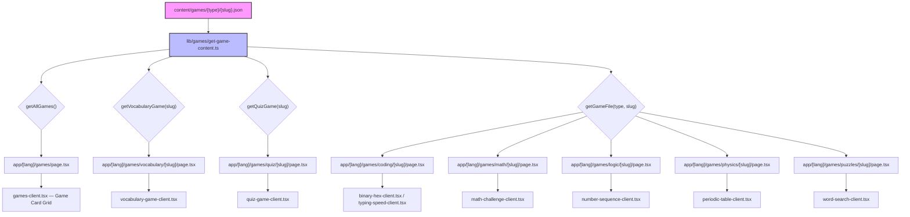
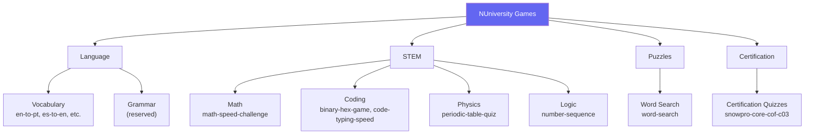
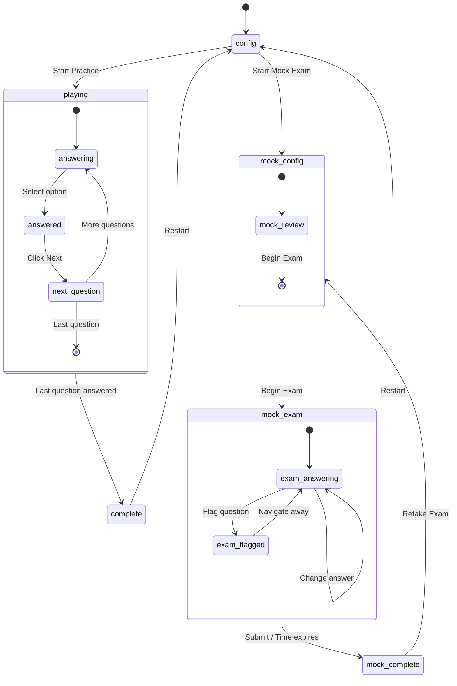
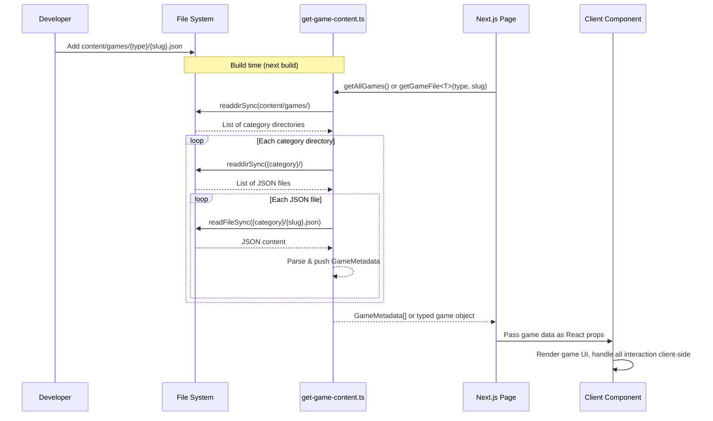

# NUniversity Games System

Comprehensive documentation of the interactive learning games platform.

## 1. Overview

NUniversity provides browser-based learning games that users play directly in the web interface. Games are defined as static JSON content files, rendered by dedicated Next.js page routes, and displayed through client-side React components. All games are statically generated at build time (`force-static`) — there is no server-side game logic at runtime.

**Key characteristics:**
- Content-driven: games are JSON data files, not application code
- Fully static: generated at build time, zero runtime server cost
- Client-side gameplay: React components handle all game state and interaction
- Internationalized: all pages are routed under `/{lang}/games/`
- Searchable: the games listing page includes client-side filtering by title, description, and category

## 2. System Architecture



### Data Layer

| File | Purpose |
|------|---------|
| `lib/games/get-game-content.ts` | All data-fetching functions and TypeScript interfaces |
| `content/games/**/*.json` | Static game data files organized by category |
| `content/games/vocabulary/` | Vocabulary game JSON files |
| `content/games/quiz/` | Quiz/certification game JSON files |
| `content/games/coding/` | Binary/hex and typing speed JSON files |
| `content/games/math/` | Math challenge JSON files |
| `content/games/logic/` | Number sequence JSON files |
| `content/games/physics/` | Periodic table quiz JSON files |
| `content/games/puzzles/` | Word search JSON files |

### Page Routes

| Route | Description |
|-------|-------------|
| `app/[lang]/games/page.tsx` | Games listing — fetches all games at build time |
| `app/[lang]/games/games-client.tsx` | Client component — card grid with search/filter |
| `app/[lang]/games/vocabulary/[slug]/page.tsx` | Vocabulary game detail page |
| `app/[lang]/games/quiz/[slug]/page.tsx` | Quiz game detail page |
| `app/[lang]/games/coding/[slug]/page.tsx` | Coding game detail page |
| `app/[lang]/games/math/[slug]/page.tsx` | Math game detail page |
| `app/[lang]/games/logic/[slug]/page.tsx` | Logic game detail page |
| `app/[lang]/games/physics/[slug]/page.tsx` | Physics game detail page |
| `app/[lang]/games/puzzles/[slug]/page.tsx` | Puzzles game detail page |

## 3. Game Categories



| Category | Label in UI | Icon | Description |
|----------|------------|------|-------------|
| `vocabulary` | Language - Vocabulary | `BookOpen` | Word/phrase matching for language learning |
| `grammar` | Language - Grammar | `BookOpen` | Grammar exercises (reserved, no current games) |
| `math` | Mathematics | `Target` | Arithmetic speed challenges |
| `coding` | Coding & Programming | `Code` | Binary/hex conversion, typing speed |
| `physics` | Physics | `Zap` | Periodic table quiz |
| `logic` | Logic & Puzzles | `Brain` | Number sequence memory |
| `fun` | Fun & Games | `Sparkles` | General entertainment games |
| `quiz` | Certification Quizzes | `Award` | Multiple-choice Q&A for certification prep |
| `science` | Science | `Atom` | Science-related games (reserved) |
| `puzzles` | Word Puzzles | `Search` | Word search grids |

### Difficulty Levels

| Level | Badge Color | Description |
|-------|------------|-------------|
| `beginner` | Green | Basic concepts, short timers |
| `intermediate` | Yellow | Moderate complexity |
| `advanced` | Red | Challenging content, longer sequences |

## 4. Vocabulary Game Schema

Vocabulary games are word/phrase matching exercises for language learning.

### TypeScript Interface

```ts
export interface VocabularyGame {
  id: string
  title: string
  description: string
  difficulty: 'beginner' | 'intermediate' | 'advanced'
  category: string
  language_pair: {
    source: string   // ISO 639-1 language code (e.g., "en", "es")
    target: string   // ISO 639-1 language code (e.g., "pt")
  }
  words: VocabularyWord[]
}

export interface VocabularyWord {
  id: string       // Unique word identifier (string of a number)
  source: string   // Word in the source language
  target: string   // Translation in the target language
  context: string  // Semantic category (e.g., "greeting", "food", "actions")
}
```

### JSON Schema

```json
{
  "id": "en-to-pt",
  "title": "English to Portuguese - Basic Vocabulary",
  "description": "Match English words with their Portuguese translations",
  "difficulty": "beginner",
  "category": "vocabulary",
  "language_pair": {
    "source": "en",
    "target": "pt"
  },
  "words": [
    {
      "id": "1",
      "source": "Hello",
      "target": "Ola",
      "context": "greeting"
    }
  ]
}
```

### Field Rules

| Field | Type | Required | Rules |
|-------|------|----------|-------|
| `id` | `string` | Yes | Matches the filename without `.json` extension. Used as the URL slug. |
| `title` | `string` | Yes | Displayed on the game card and detail page header. |
| `description` | `string` | Yes | Shown on the game card and detail page. |
| `difficulty` | `string` | Yes | One of: `"beginner"`, `"intermediate"`, `"advanced"`. |
| `category` | `string` | Yes | Must be `"vocabulary"`. Determines the page route. |
| `language_pair.source` | `string` | Yes | ISO 639-1 code for the source language. |
| `language_pair.target` | `string` | Yes | ISO 639-1 code for the target language. |
| `words` | `array` | Yes | Non-empty array of `VocabularyWord` objects. |
| `words[].id` | `string` | Yes | Unique identifier within the file. Conventionally a numeric string. |
| `words[].source` | `string` | Yes | Word or phrase in the source language. |
| `words[].target` | `string` | Yes | Translation in the target language. |
| `words[].context` | `string` | Yes | Semantic category for grouping (e.g., `"greeting"`, `"food"`, `"nature"`). |

### Existing Vocabulary Games

| Slug | Languages | Difficulty | Word Count |
|------|-----------|------------|------------|
| `en-to-pt` | English → Portuguese | beginner | 300 |
| `en-to-pt-advanced` | English → Portuguese | advanced | 250 |
| `es-to-en` | Spanish → English | beginner | 300 |
| `es-to-pt` | Spanish → Portuguese | intermediate | 300 |

## 5. Quiz Game Schema

Quiz games are certification-prep exams with multiple-choice questions, optional mock exam mode, and domain-based organization.

### TypeScript Interface

```ts
export interface QuizGame {
  id: string
  title: string
  description: string
  difficulty: 'beginner' | 'intermediate' | 'advanced'
  category: string
  topic: string
  certification: string
  mockExam?: MockExamConfig
  questions: QuizQuestion[]
}

export interface QuizQuestion {
  id: string         // Unique question ID (e.g., "q001")
  domain: string     // Subdomain label (e.g., "1.1 - Snowflake Architecture")
  question: string   // Full question text
  options: string[]  // Exactly 4 answer options (A, B, C, D)
  correct: number    // 0-based index of the correct option
  explanation: string // Shown after answering in practice mode
}

export interface MockExamConfig {
  durationSeconds: number   // Total exam time in seconds (e.g., 6900 = 115 min)
  passingScore: number      // Percentage to pass (e.g., 75)
  allocations: Record<string, number>  // Questions per subdomain
  domainGroups: Record<string, MockExamDomainGroup>
}

export interface MockExamDomainGroup {
  label: string     // Display name (e.g., "1.0 Architecture & Features")
  color: string     // UI color key (e.g., "blue", "purple", "teal")
  subdomains: string[]  // Subdomain prefixes (e.g., ["1.1", "1.2", "1.3"])
}
```

### JSON Schema

```json
{
  "id": "snowpro-core-cof-c03",
  "title": "SnowPro Core Certification (COF-C03)",
  "description": "Exam-style questions covering all five COF-C03 domains...",
  "difficulty": "intermediate",
  "category": "quiz",
  "topic": "Snowflake",
  "certification": "SnowPro Core COF-C03",
  "mockExam": {
    "durationSeconds": 6900,
    "passingScore": 75,
    "allocations": {
      "1.1 - Snowflake Architecture": 8,
      "2.1 - Security Model": 9
    },
    "domainGroups": {
      "1.0": {
        "label": "1.0 Architecture & Features",
        "color": "blue",
        "subdomains": ["1.1", "1.2", "1.3", "1.4", "1.5", "1.6"]
      }
    }
  },
  "questions": [
    {
      "id": "q001",
      "domain": "5.1 - Data Collaboration and Protection",
      "question": "Which Snowflake feature allows you to query data as it existed 48 hours ago?",
      "options": ["Fail-Safe", "Zero-Copy Clone", "Time Travel", "Data Sharing"],
      "correct": 2,
      "explanation": "Time Travel allows querying historical data..."
    }
  ]
}
```

### Field Rules

| Field | Type | Required | Rules |
|-------|------|----------|-------|
| `id` | `string` | Yes | Matches filename. Used as URL slug. |
| `title` | `string` | Yes | Display name on game cards and headers. |
| `description` | `string` | Yes | Supports domain breakdown in description text. |
| `difficulty` | `string` | Yes | One of: `"beginner"`, `"intermediate"`, `"advanced"`. |
| `category` | `string` | Yes | Must be `"quiz"`. |
| `topic` | `string` | Yes | Subject area (e.g., `"Snowflake"`). |
| `certification` | `string` | Yes | Official certification name (e.g., `"SnowPro Core COF-C03"`). |
| `mockExam` | `object` | No | Enables mock exam mode when present. |
| `mockExam.durationSeconds` | `number` | Yes | Countdown timer in seconds. 6900 = 115 minutes. |
| `mockExam.passingScore` | `number` | Yes | Minimum percentage to pass. |
| `mockExam.allocations` | `object` | Yes | Maps subdomain label → number of questions for the exam. |
| `mockExam.domainGroups` | `object` | Yes | Maps group key → domain group config with label, color, subdomains. |
| `questions` | `array` | Yes | Non-empty array of `QuizQuestion` objects. |
| `questions[].id` | `string` | Yes | Unique within the file. Conventionally `"q001"`, `"q002"`, etc. |
| `questions[].domain` | `string` | Yes | Must match a key in `mockExam.allocations` for mock exam support. |
| `questions[].question` | `string` | Yes | Full question text. |
| `questions[].options` | `string[]` | Yes | Exactly 4 options. |
| `questions[].correct` | `number` | Yes | 0-based index into `options` array. |
| `questions[].explanation` | `string` | Yes | Shown after answering in practice mode. |

### Quiz Game Modes

The quiz game client (`quiz-game-client.tsx`) supports two distinct modes:

**Practice Quiz:**
- Configurable domain selection, question count, and shuffle
- Instant feedback with explanation after each answer
- Score summary and domain breakdown at completion

**Mock Exam:**
- Fixed question count drawn proportionally from domain allocations
- Countdown timer (no pausing)
- No feedback until submission
- Question navigator with flag-for-review
- Pass/fail result against official certification threshold

## 6. Game Lifecycle

### Quiz Game State Diagram



### Regular Quiz Flow

1. **Config** — User selects domains, question count, shuffle preference
2. **Playing** — Questions presented one at a time with instant feedback
3. **Answer** — User selects option, sees correctness and explanation
4. **Complete** — Score summary, domain breakdown, option to restart

### Mock Exam Flow

1. **Mock Config** — Rules displayed, domain allocation table shown
2. **Mock Exam** — All questions available, timer counts down, no feedback
3. **Mock Complete** — Pass/fail determination, score, domain breakdown, review

## 7. Game Data Flow

### Build-Time Data Loading



### Key Function Signatures

```ts
// Returns metadata for all games across all categories
async function getAllGames(): Promise<GameMetadata[]>

// Returns full vocabulary game data by slug
async function getVocabularyGame(slug: string): Promise<VocabularyGame | null>

// Returns full quiz game data by slug
async function getQuizGame(slug: string): Promise<QuizGame | null>

// Generic getter for any game type (coding, math, logic, physics, puzzles)
async function getGameFile<T>(type: string, slug: string): Promise<T | null>

// Returns all games in a specific category
async function getGamesByCategory(category: string): Promise<GameMetadata[]>
```

## 8. Adding New Games

### Adding a Vocabulary Game

1. Create `content/games/vocabulary/{slug}.json` with the vocabulary schema
2. The page route `app/[lang]/games/vocabulary/[slug]/page.tsx` already exists
3. The client component `vocabulary-game-client.tsx` handles rendering
4. Run `next build` to verify the game appears in the listing

**Example file:** `content/games/vocabulary/fr-to-en.json`
```json
{
  "id": "fr-to-en",
  "title": "French to English - Basic Vocabulary",
  "description": "Match French words with their English translations",
  "difficulty": "beginner",
  "category": "vocabulary",
  "language_pair": { "source": "fr", "target": "en" },
  "words": [
    { "id": "1", "source": "Bonjour", "target": "Hello", "context": "greeting" }
  ]
}
```

### Adding a Quiz Game

1. Create `content/games/quiz/{slug}.json` with the quiz schema
2. Populate `questions[]` with multiple-choice items (4 options each)
3. Set `domain` on each question to match your `mockExam.allocations` keys (if mock exam is needed)
4. Optionally add `mockExam` config for exam simulation mode
5. The page route and client component already exist

**Checklist before shipping:**
- [ ] Every `questions[].domain` value matches a key in `mockExam.allocations`
- [ ] Every `questions[].correct` is a valid 0-based index (0–3)
- [ ] Every `questions[]` has exactly 4 options
- [ ] `mockExam.allocations` sum matches total question count for the exam

### Adding a Coding Game

1. Create `content/games/coding/{slug}.json`
2. Create a new client component in `app/[lang]/games/coding/[slug]/`
3. Add the route in the `page.tsx` using `getGameFile<T>()` generic getter
4. Register the game type in `GameMetadata['type']` if not already present

### Adding a Math Game

1. Create `content/games/math/{slug}.json`
2. The existing page route and `math-challenge-client.tsx` handle rendering
3. Follow the `math-speed-challenge.json` schema: `operations[]`, `difficultyLevels{}`

### Adding a Logic Game

1. Create `content/games/logic/{slug}.json`
2. The existing page route and `number-sequence-client.tsx` handle rendering
3. Follow the `number-sequence.json` schema: `startingLength`, `maxLength`, `displayTimeMs`

### Adding a Physics Game

1. Create `content/games/physics/{slug}.json`
2. The existing page route and `periodic-table-client.tsx` handle rendering
3. Follow the `periodic-table-quiz.json` schema: `modes[]`, `elements[]`

### Adding a Puzzles Game

1. Create `content/games/puzzles/{slug}.json`
2. The existing page route and `word-search-client.tsx` handle rendering
3. Follow the `word-search.json` schema: `categories{}` with word lists

## 9. Content Quality Standards

### Vocabulary Games

- **Minimum word count:** 30 words per game (recommended: 50–300)
- **Context variety:** Use at least 5 different `context` categories
- **Translation accuracy:** Verify native-speaker translations; avoid machine-only output
- **ID uniqueness:** All word IDs must be unique within the file
- **Cognates:** Avoid source/target pairs that are identical (e.g., "Hospital" → "Hospital") — these teach nothing

### Quiz Games

- **Minimum question count:** 20 questions (recommended: 50–100)
- **Domain balance:** Distribute questions across all exam domains proportionally
- **Explanation quality:** Every `explanation` field must teach the concept, not just restate the answer
- **Distractor quality:** Wrong options should be plausible — avoid obviously incorrect answers
- **Exam alignment:** If `mockExam` is configured, ensure `allocations` sum to the total question count
- **No duplicate IDs:** Every `questions[].id` must be unique within the file

### Coding Games

- **Code snippets:** Use real, runnable code — not pseudocode
- **Progression:** Include beginner through advanced difficulty levels
- **Diversity:** Cover multiple languages/frameworks where applicable

### General

- **File naming:** Use lowercase kebab-case for filenames (e.g., `en-to-pt.json`)
- **JSON validity:** Run `node -e "JSON.parse(require('fs').readFileSync('path'))"` to validate
- **No secrets:** Never include API keys, credentials, or personal information in game data
- **Character encoding:** UTF-8 only — special characters in Portuguese/Spanish must render correctly

## 10. Existing Games Inventory

| Slug | Category | Type | Difficulty | Description |
|------|----------|------|------------|-------------|
| `en-to-pt` | vocabulary | `vocabulary` | beginner | English to Portuguese - Basic Vocabulary (300 words) |
| `en-to-pt-advanced` | vocabulary | `vocabulary` | advanced | English to Portuguese - Advanced Vocabulary (250 words) |
| `es-to-en` | vocabulary | `vocabulary` | beginner | Spanish to English - Basic Vocabulary (300 words) |
| `es-to-pt` | vocabulary | `vocabulary` | intermediate | Spanish to Portuguese - Basic Vocabulary (300 words) |
| `binary-hex-game` | coding | `coding` | intermediate | Binary, decimal, hex number system conversion (6 modes) |
| `code-typing-speed` | coding | `coding` | beginner | Code typing speed test (Python, JS, HTML, CSS) |
| `number-sequence` | logic | `logic` | beginner | Number sequence memory game (3–15 digits) |
| `math-speed-challenge` | math | `math` | beginner | Arithmetic speed challenge (+, -, ×, ÷) |
| `periodic-table-quiz` | physics | `physics` | intermediate | Periodic table element quiz (4 modes, 28 elements) |
| `word-search` | puzzles | `puzzles` | beginner | Word search puzzle (4 categories) |
| `snowpro-core-cof-c03` | quiz | `quiz` | intermediate | SnowPro Core Certification (COF-C03) mock exam (85+ questions) |

### Game File Sizes

| Game | Words/Questions | File Size |
|------|----------------|-----------|
| `en-to-pt` | 300 words | ~14 KB |
| `en-to-pt-advanced` | 250 words | ~10 KB |
| `es-to-en` | 300 words | ~12 KB |
| `es-to-pt` | 300 words | ~12 KB |
| `binary-hex-game` | Config only | ~0.5 KB |
| `code-typing-speed` | 16 snippets | ~5 KB |
| `number-sequence` | Config only | ~0.3 KB |
| `math-speed-challenge` | Config only | ~0.4 KB |
| `periodic-table-quiz` | 28 elements | ~3 KB |
| `word-search` | 40 words | ~1 KB |
| `snowpro-core-cof-c03` | 85+ questions | ~150 KB |
