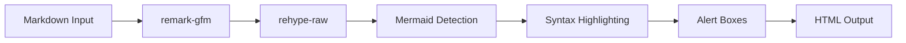

# 🎨 Enhanced Markdown Renderer - Feature Guide



## ✨ New Features

Your markdown renderer now includes beautiful, interactive components that make learning more engaging!

### 1. **Enhanced Code Blocks** 💻

#### Features:
- **Gradient header** with language icon
- **Copy button** that appears on hover
- **Line numbers** for easy reference
- **Syntax highlighting** with light/dark mode support
- **Beautiful borders** and shadows

#### Usage in Markdown:

````markdown
```javascript
function greet(name) {
  console.log(`Hello, ${name}!`);
}

greet("World");
```
````

#### Result:
- Blue-to-purple gradient header
- Language badge with icon
- One-click copy button
- Smooth hover animations

---

### 2. **Enhanced Alert Boxes** 🎯

#### 6 Types Available:

**📘 Note** - For general information
```markdown
> [!NOTE]
> This is an informational note about the topic.
```

**⚠️ Warning** - For caution messages
```markdown
> [!WARNING]
> Be careful when using this feature!
```

**🚨 Danger** - For critical warnings
```markdown
> [!DANGER]
> This operation cannot be undone!
```

**✅ Success** - For positive confirmations
```markdown
> [!SUCCESS]
> Great job! You've completed this section.
```

**💡 Tip** - For helpful hints
```markdown
> [!TIP]
> Pro tip: Use keyboard shortcuts to save time!
```

**⚡ Important** - For key points
```markdown
> [!IMPORTANT]
> Make sure to save your work before continuing.
```

#### Features:
- **Color-coded backgrounds** with appropriate theming
- **Icons** that match the alert type
- **Hover effects** with shadow
- **Responsive** on all devices

---

### 3. **Interactive Tables** 📊

#### Features:
- **Gradient header** (blue-to-purple)
- **Hover effects** on rows
- **Responsive** with horizontal scroll
- **Beautiful borders** and spacing

#### Usage:
```markdown
| Feature | Supported | Notes |
|---------|-----------|-------|
| Tables  | ✅        | Fully styled |
| Lists   | ✅        | Interactive |
| Code    | ✅        | With copy button |
```

---

### 4. **Enhanced Images** 🖼️

#### Features:
- **Click to zoom** functionality
- **Hover zoom** effect
- **Rounded corners** and shadows
- **Caption support** below image
- **Overlay effect** on hover

#### Usage:
```markdown

```

The alt text becomes the caption!

---

### 5. **Task Lists** ✅

#### Features:
- **Visual checkboxes** with color coding
- **Green background** for completed tasks
- **Hover effects** on uncompleted tasks
- **Strike-through** text for completed items

#### Usage:
```markdown
- [ ] Incomplete task
- [x] Completed task
- [ ] Another task to do
```

---

### 6. **Beautiful Headings** 📝

#### H1 - Major Sections
- **Vertical gradient bar** on the left
- **Large, bold text**
- **Extra spacing**

```markdown
# Main Title
```

#### H2 - Subsections
- **Bottom border** with gradient
- **Medium bold text**

```markdown
## Subsection
```

#### H3 - Topics
- **Target icon** on the left
- **Smaller but prominent**

```markdown
### Topic
```

---

### 7. **Enhanced Lists** 📋

#### Features:
- **Gradient bullet points** (blue-to-purple dots)
- **Better spacing** between items
- **Improved readability**

#### Usage:
```markdown
- First item
- Second item
  - Nested item
- Third item
```

#### Numbered Lists:
```markdown
1. Step one
2. Step two
3. Step three
```

---

### 8. **Inline Code** 💾

#### Features:
- **Highlighted background**
- **Primary color text**
- **Border** for definition
- **Monospace font**

#### Usage:
```markdown
Use the `const` keyword to declare variables.
```

---

### 9. **Enhanced Links** 🔗

#### Features:
- **Primary color** with hover effects
- **Underline decoration** that changes on hover
- **External link icon** for external URLs
- **Opens in new tab** for external links

#### Usage:
```markdown
[Internal link](/path)
[External link](https