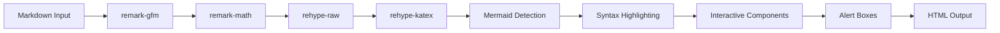

# 🎨 Enhanced Markdown Renderer - Feature Guide



## ✨ New Features

Your markdown renderer now includes beautiful, interactive components that make learning more engaging!

### 1. **Enhanced Code Blocks** 💻

#### Features:
- **Gradient header** with language icon
- **Copy button** that appears on hover
- **Line numbers** for easy reference
- **Syntax highlighting** with light/dark mode support
- **Beautiful borders** and shadows

#### Usage in Markdown:

````markdown
```javascript
function greet(name) {
  console.log(`Hello, ${name}!`);
}

greet("World");
```
````

#### Result:
- Blue-to-purple gradient header
- Language badge with icon
- One-click copy button
- Smooth hover animations

---

### 2. **Enhanced Alert Boxes** 🎯

#### 6 Types Available:

**📘 Note** - For general information
```markdown
> [!NOTE]
> This is an informational note about the topic.
```

**⚠️ Warning** - For caution messages
```markdown
> [!WARNING]
> Be careful when using this feature!
```

**🚨 Danger** - For critical warnings
```markdown
> [!DANGER]
> This operation cannot be undone!
```

**✅ Success** - For positive confirmations
```markdown
> [!SUCCESS]
> Great job! You've completed this section.
```

**💡 Tip** - For helpful hints
```markdown
> [!TIP]
> Pro tip: Use keyboard shortcuts to save time!
```

**⚡ Important** - For key points
```markdown
> [!IMPORTANT]
> Make sure to save your work before continuing.
```

#### Features:
- **Color-coded backgrounds** with appropriate theming
- **Icons** that match the alert type
- **Hover effects** with shadow
- **Responsive** on all devices

---

### 3. **Interactive Tables** 📊

#### Features:
- **Gradient header** (blue-to-purple)
- **Hover effects** on rows
- **Responsive** with horizontal scroll
- **Beautiful borders** and spacing

#### Usage:
```markdown
| Feature | Supported | Notes |
|---------|-----------|-------|
| Tables  | ✅        | Fully styled |
| Lists   | ✅        | Interactive |
| Code    | ✅        | With copy button |
```

---

### 4. **Enhanced Images** 🖼️

#### Features:
- **Click to zoom** functionality
- **Hover zoom** effect
- **Rounded corners** and shadows
- **Caption support** below image
- **Overlay effect** on hover

#### Usage:
```markdown

```

The alt text becomes the caption!

---

### 5. **Task Lists** ✅

#### Features:
- **Visual checkboxes** with color coding
- **Green background** for completed tasks
- **Hover effects** on uncompleted tasks
- **Strike-through** text for completed items

#### Usage:
```markdown
- [ ] Incomplete task
- [x] Completed task
- [ ] Another task to do
```

---

### 6. **Beautiful Headings** 📝

#### H1 - Major Sections
- **Vertical gradient bar** on the left
- **Large, bold text**
- **Extra spacing**

```markdown
# Main Title
```

#### H2 - Subsections
- **Bottom border** with gradient
- **Medium bold text**

```markdown
## Subsection
```

#### H3 - Topics
- **Target icon** on the left
- **Smaller but prominent**

```markdown
### Topic
```

---

### 7. **Enhanced Lists** 📋

#### Features:
- **Gradient bullet points** (blue-to-purple dots)
- **Better spacing** between items
- **Improved readability**

#### Usage:
```markdown
- First item
- Second item
  - Nested item
- Third item
```

#### Numbered Lists:
```markdown
1. Step one
2. Step two
3. Step three
```

---

### 8. **Inline Code** 💾

#### Features:
- **Highlighted background**
- **Primary color text**
- **Border** for definition
- **Monospace font**

#### Usage:
```markdown
Use the `const` keyword to declare variables.
```

---

### 9. **Enhanced Links** 🔗

#### Features:
- **Primary color** with hover effects
- **Underline decoration** that changes on hover
- **External link icon** for external URLs
- **Opens in new tab** for external links

#### Usage:
```markdown
[Internal link](/path)
[External link](https://example.com)
```

---

### 10. **KaTeX Math Equations** 📐

Render mathematical expressions using KaTeX — 10x faster than MathJax, 3x smaller bundle.

#### Inline Math:
```markdown
The equation $E = mc^2$ shows mass-energy equivalence.
```

#### Display Math:
```markdown
$$\int_0^\infty e^{-x^2} dx = \frac{\sqrt{\pi}}{2}$$
```

#### Fenced Block:
```math
{ "expression": "\\frac{d}{dx}[x^n] = nx^{n-1}", "display": true }
```

#### Features:
- **Dynamic import** — KaTeX loads only when a math block is present
- **Dark mode** — equations adapt to theme
- **Multiple modes** — inline (`$...$`), display (`$$...$$`), and fenced blocks

---

### 11. **PhET Simulation Embeds** 🔬

Embed interactive simulations from PhET Interactive Simulations (University of Colorado Boulder).

```phet
{ "slug": "forces-and-motion-basics", "title": "Forces and Motion", "language": "en" }
```

| Config | Type | Required | Description |
|--------|------|----------|-------------|
| `slug` | string | Yes | PhET simulation identifier (from URL) |
| `title` | string | No | Display title above iframe |
| `language` | string | No | Interface language (default: en) |

#### Features:
- **Responsive iframe** — maintains 834:504 aspect ratio
- **Loading spinner** — shown while iframe loads
- **Error fallback** — link to simulation if embed fails
- **Attribution footer** — links to phet.colorado.edu

---

### 12. **Interactive Charts (Recharts)** 📊

Embed interactive charts with line, bar, scatter, and pie types using Recharts.

```plot
{
  "type": "line",
  "title": "Projectile Trajectory",
  "data": [
    {"x": 0, "y": 0},
    {"x": 1, "y": 4.9},
    {"x": 2, "y": 19.6}
  ],
  "xKey": "x",
  "yKey": "y",
  "xLabel": "Time (s)",
  "yLabel": "Height (m)"
}
```

| Config | Type | Required | Description |
|--------|------|----------|-------------|
| `type` | string | Yes | `line`, `bar`, `scatter`, or `pie` |
| `title` | string | No | Chart title |
| `data` | array | Yes | Array of data objects |
| `xKey` | string | Yes | Key for x-axis (not needed for pie) |
| `yKey` | string | Yes | Key for y-axis (not needed for pie) |
| `xLabel` | string | No | X-axis label |
| `yLabel` | string | No | Y-axis label |

#### Features:
- **Dynamic import** — Recharts loads only when a plot block is present
- **Responsive** — charts resize to container width
- **Dark mode** — tooltips and grid adapt to theme
- **4 chart types** — line, bar, scatter, pie

---

### 13. **3D Molecular Viewer** 🧬

Render 3D molecular structures from RCSB Protein Data Bank using 3Dmol.js.

```molecule
{ "pdbId": "1CRN", "style": "cartoon", "color": "spectrum" }
```

| Config | Type | Required | Description |
|--------|------|----------|-------------|
| `pdbId` | string | Yes | 4-character PDB identifier |
| `style` | string | No | `cartoon`, `sphere`, `stick`, `line`, or `surface` |
| `color` | string | No | `spectrum`, `chain`, `element`, or hex color |
| `height` | string | No | CSS height (default: 400px) |

#### Features:
- **Dynamic import** — 3Dmol.js loads only when a molecule block is present
- **Drag to rotate** — interactive 3D manipulation
- **Scroll to zoom** — inspect molecular details
- **Loading spinner** — shown while PDB data fetches

---

### 14. **Drag-and-Drop Ordering** 🎯

Students drag items into the correct order using @dnd-kit.

```dragdrop
{
  "question": "Order these steps:",
  "items": ["Identify knowns", "Choose equation", "Solve", "Check units"],
  "correctOrder": ["Identify knowns", "Choose equation", "Solve", "Check units"],
  "explanation": "Always start by listing what you know."
}
```

| Config | Type | Required | Description |
|--------|------|----------|-------------|
| `question` | string | Yes | Question text |
| `items` | string[] | Yes | Items to order (shuffled on display) |
| `correctOrder` | string[] | Yes | Correct order |
| `explanation` | string | No | Feedback after checking |

#### Features:
- **Grip handle** — visual drag affordance
- **Keyboard accessible** — Space/Enter to grab, Arrow keys to move
- **Per-item feedback** — correct/incorrect highlighting

---

### 15. **Matching Pairs** 🔗

Students drag answer chips to match with question slots using @dnd-kit.

```matching
{
  "question": "Match each law with its statement:",
  "pairs": [
    {"left": "First Law", "right": "Object at rest stays at rest"},
    {"left": "Second Law", "right": "F = ma"}
  ],
  "explanation": "Newton's laws form the foundation of mechanics."
}
```

| Config | Type | Required | Description |
|--------|------|----------|-------------|
| `question` | string | Yes | Question text |
| `pairs` | array | Yes | `[{left, right}]` pairs |
| `explanation` | string | No | Feedback after checking |

#### Features:
- **Two-column layout** — left labels with droppable right slots
- **Draggable chips** — answer options in a pool below
- **Shuffled answers** — random order on each attempt

---

### 16. **Fill-in-the-Blank** ✏️

Students drag words from a word bank into blank slots within a template text.

```fillblank
{
  "question": "Complete the formula:",
  "template": "The force equals {{1}} times {{2}}.",
  "answers": {"1": "mass", "2": "acceleration"},
  "distractors": ["velocity", "distance", "time"],
  "explanation": "F = ma is Newton's Second Law."
}
```

| Config | Type | Required | Description |
|--------|------|----------|-------------|
| `question` | string | Yes | Question text |
| `template` | string | Yes | Text with `{{N}}` placeholders |
| `answers` | object | Yes | `{"N": "correct answer"}` |
| `distractors` | string[] | No | Wrong options in word bank |
| `explanation` | string | No | Feedback after checking |

#### Features:
- **Inline blanks** — blanks appear within the template text
- **Word bank** — draggable answer chips with distractors
- **Per-blank feedback** — correct/incorrect highlighting per slot