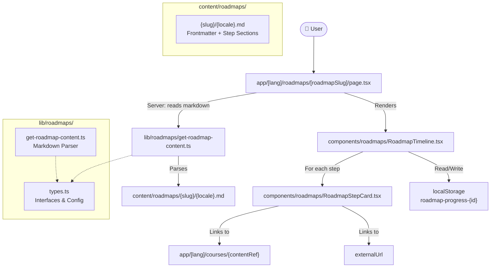
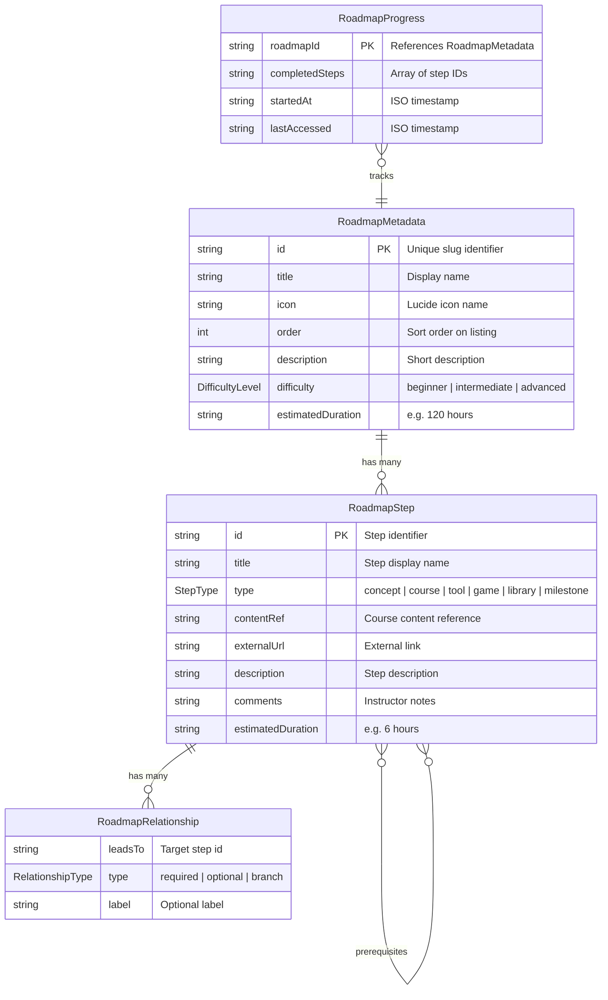
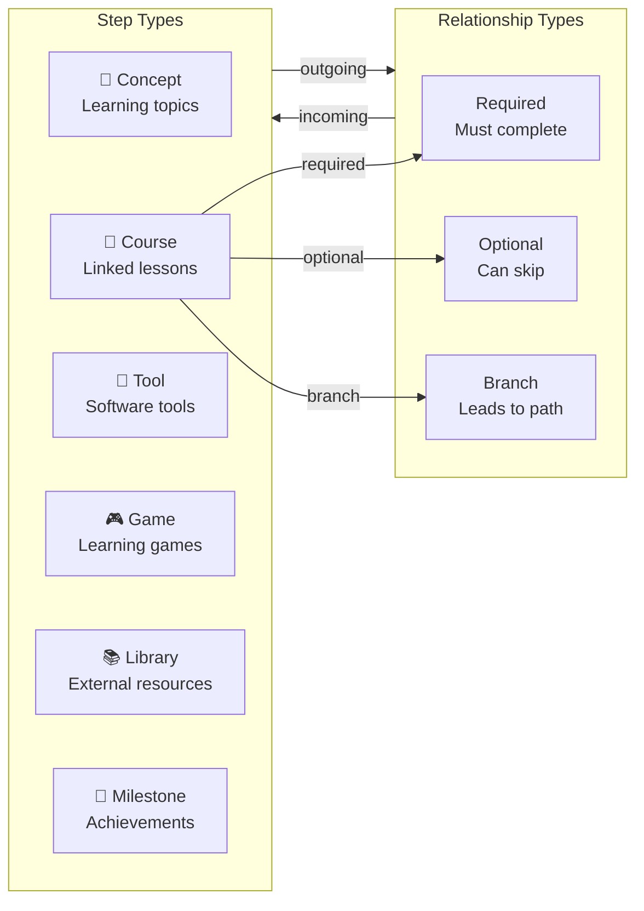
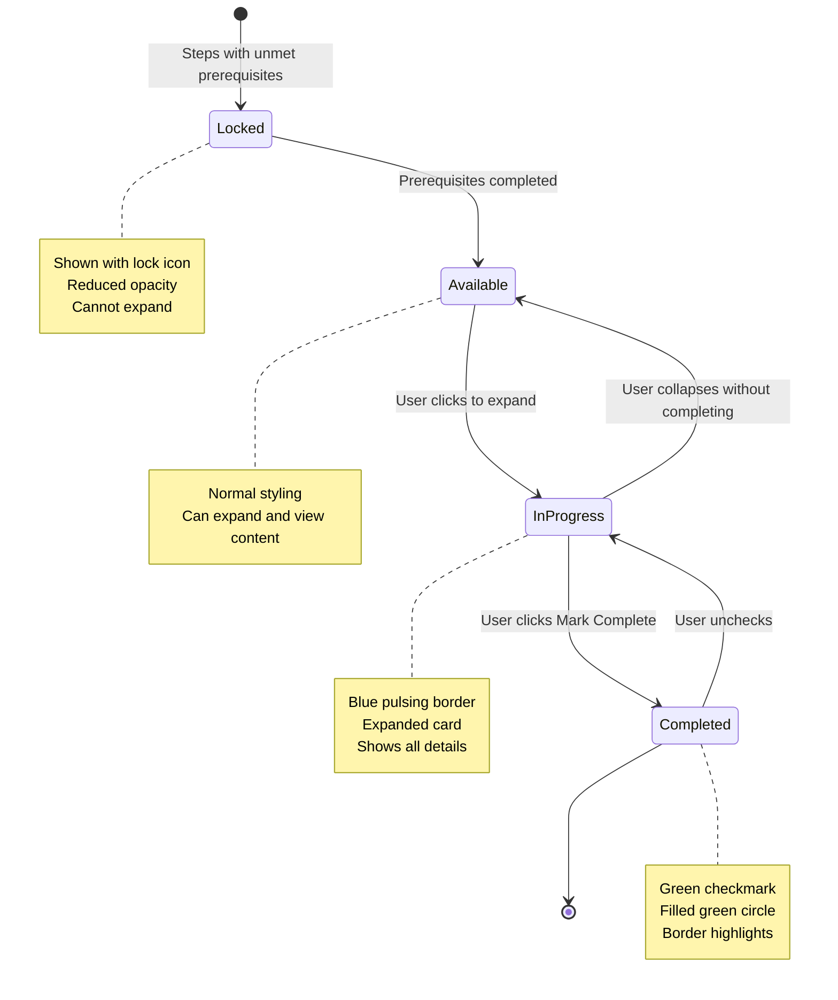
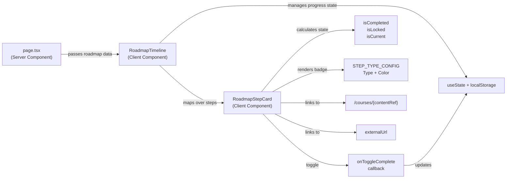
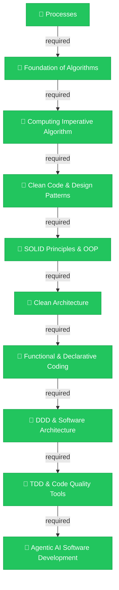

# 🗺️ Roadmaps System

> **Roadmaps** provide structured, sequential learning paths that guide students from foundational concepts to advanced topics. Each roadmap is a curated sequence of steps with prerequisites, progress tracking, and links to related courses.

---

## 📖 Table of Contents

1. [Overview](#1-overview)
2. [System Architecture](#2-system-architecture)
3. [Data Model](#3-data-model)
4. [Roadmap Content Format](#4-roadmap-content-format)
5. [Step Types and Relationships](#5-step-types-and-relationships)
6. [Progress Tracking](#6-progress-tracking)
7. [Component Architecture](#7-component-architecture)
8. [Adding New Roadmaps](#8-adding-new-roadmaps)
9. [Current Roadmaps](#9-current-roadmaps)

---

## 1. Overview

Roadmaps are a core learning feature of NUniversity. They present a visual, step-by-step progression through a topic area — connecting courses, concepts, tools, and milestones into a cohesive journey.

### Key Features

| Feature | Description |
|---|---|
| **Sequential Learning** | Steps with prerequisites enforce a logical order |
| **Progress Tracking** | Client-side localStorage persistence per roadmap |
| **Step State Management** | Locked → Available → In-Progress → Complete lifecycle |
| **Content Linking** | Each step links to a course, external URL, or stands alone |
| **Multilingual** | Roadmap content is locale-aware (`en`, `pt`, `es`) |
| **Interactive UI** | Expandable cards, animated timeline, progress bar |

### URL Patterns

| Page | URL |
|---|---|
| Roadmap listing | `/{lang}/roadmaps` |
| Individual roadmap | `/{lang}/roadmaps/{roadmapSlug}` |

---

## 2. System Architecture



### File Structure

```
├── lib/roadmaps/
│   ├── types.ts                          # TypeScript interfaces & config
│   └── get-roadmap-content.ts            # Server-side markdown parser
├── content/roadmaps/
│   └── {roadmap-slug}/
│       ├── en.md                         # English content
│       ├── pt.md                         # Portuguese content
│       └── es.md                         # Spanish content
├── components/roadmaps/
│   ├── RoadmapTimeline.tsx               # Main timeline view
│   └── RoadmapStepCard.tsx               # Individual step card
└── app/[lang]/roadmaps/
    ├── page.tsx                          # Roadmap listing
    └── [roadmapSlug]/page.tsx            # Roadmap viewer
```

---

## 3. Data Model



### Type Definitions

```typescript
// lib/roadmaps/types.ts

type StepType = 'concept' | 'course' | 'tool' | 'game' | 'library' | 'milestone'
type RelationshipType = 'required' | 'optional' | 'branch'
type DifficultyLevel = 'beginner' | 'intermediate' | 'advanced'

interface RoadmapStep {
  id: string
  title: string
  type: StepType
  contentRef?: string | null       // "course-slug/lesson-slug"
  externalUrl?: string             // "https://..."
  description: string
  prerequisites: string[]          // Step IDs required before this
  conditionals: string[]           // Conditional prerequisites
  comments: string                 // Instructor notes shown in card
  ideas: string[]                  // Practice ideas
  relationships: RoadmapRelationship[]
  estimatedDuration?: string
}

interface RoadmapMetadata {
  id: string
  title: string
  description: string
  icon: string
  order: number
  difficulty: DifficultyLevel
  estimatedDuration: string
  steps: RoadmapStep[]
}

interface RoadmapProgress {
  roadmapId: string
  completedSteps: string[]
  startedAt: string
  lastAccessed: string
}
```

### Step Type Colors

| Type | Color | Badge |
|---|---|---|
| `concept` | Blue (`bg-blue-500`) | Concept |
| `course` | Green (`bg-green-500`) | Course |
| `tool` | Purple (`bg-purple-500`) | Tool |
| `game` | Yellow (`bg-yellow-500`) | Game |
| `library` | Indigo (`bg-indigo-500`) | Library |
| `milestone` | Red (`bg-red-500`) | Milestone |

---

## 4. Roadmap Content Format

Roadmap content is stored as Markdown files with custom `## Step:` headers. The file uses YAML frontmatter for metadata and a custom step-based format for the learning path.

### File Location

```
content/roadmaps/{roadmap-slug}/{locale}.md
```

### Full Example

````markdown
---
id: intro-to-software-engineering
title: "Introduction to Software Engineering"
description: "Complete learning path from fundamental concepts to advanced software development practices."
icon: "Map"
order: 1
difficulty: "beginner"
estimatedDuration: "120 hours"
---

## Step: Processes
- id: processes
- type: course
- contentRef: processes-flowchart/01-what-are-processes
- description: Theoretical foundations of processes and flowcharts.
- prerequisites: []
- conditionals: []
- comments: Understanding processes is fundamental to all software engineering.
- ideas: ["Create a flowchart for your morning routine", "Map the process of ordering food"]
- estimatedDuration: 4 hours
- relationships:
  - leadsTo: foundation-of-algorithms
    type: required

## Step: Foundation of Algorithms
- id: foundation-of-algorithms
- type: course
- contentRef: algorithm-foundations/01-what-are-algorithms
- description: Algorithm foundations and quality principles without code.
- prerequisites: ["processes"]
- conditionals: []
- comments: No code yet - focus on thinking algorithmically.
- ideas: ["Solve logic puzzles using step-by-step thinking"]
- estimatedDuration: 6 hours
- relationships:
  - leadsTo: computing-imperative-algorithm
    type: required
````

### Frontmatter Fields

| Field | Type | Required | Description |
|---|---|---|---|
| `id` | string | Yes | Unique identifier (slug) |
| `title` | string | Yes | Display name |
| `description` | string | Yes | Short description for listing |
| `icon` | string | Yes | Lucide icon name |
| `order` | number | Yes | Sort order on listing page |
| `difficulty` | string | Yes | `beginner`, `intermediate`, or `advanced` |
| `estimatedDuration` | string | Yes | Total duration estimate |

### Step Fields

| Field | Type | Required | Description |
|---|---|---|---|
| `id` | string | Yes | Unique step identifier |
| `title` | string | From header | Step name (after `## Step:`) |
| `type` | string | Yes | One of the `StepType` values |
| `contentRef` | string | No | Course reference (`course/lesson`) |
| `externalUrl` | string | No | External link URL |
| `description` | string | Yes | Step description |
| `prerequisites` | array | Yes | Step IDs required first |
| `conditionals` | array | Yes | Conditional prerequisites |
| `comments` | string | No | Instructor notes |
| `ideas` | array | No | Practice ideas |
| `estimatedDuration` | string | No | Duration estimate |
| `relationships` | array | No | Outgoing step connections |

### Relationships Format

Each relationship is a nested block under `- relationships:`:

```yaml
- relationships:
  - leadsTo: target-step-id
    type: required
    label: "Optional label"
```

### Content Resolution

The `contentRef` field links steps to courses using the format `course-slug/lesson-slug`. The system resolves this to `/{locale}/courses/{course-slug}/{lesson-slug}`.

If `externalUrl` is set, it takes precedence over `contentRef` for the link target.

---

## 5. Step Types and Relationships



### Step Types

| Type | Description | Typical Use |
|---|---|---|
| `concept` | A theoretical concept to learn | Fundamentals, theory |
| `course` | Links to a course lesson | Hands-on learning |
| `tool` | A tool to learn and use | IDE, CLI, framework |
| `game` | A learning game | Vocabulary, quizzes |
| `library` | External resource to read | Documentation, articles |
| `milestone` | Achievement checkpoint | End of a section |

### Relationship Types

| Type | Behavior | UI |
|---|---|---|
| `required` | Must complete source before target unlocks | Blue badge |
| `optional` | Target is available without completing source | Purple badge with "(optional)" |
| `branch` | Source leads to multiple possible paths | Purple badge |

### Prerequisites vs Relationships

- **Prerequisites** (`prerequisites` array): Gate access — a step is **locked** until all prerequisites are completed
- **Relationships** (`relationships` array): Define the visual flow — which steps appear as "next steps" in the card

A step can have prerequisites that differ from its relationships, allowing flexible path design.

---

## 6. Progress Tracking



### Storage

Progress is stored in **localStorage** under the key `roadmap-progress-{roadmapId}`:

```typescript
// localStorage schema
{
  "roadmapId": "intro-to-software-engineering",
  "completedSteps": ["processes", "foundation-of-algorithms"],
  "startedAt": "2026-01-15T10:30:00.000Z",
  "lastAccessed": "2026-03-01T14:22:00.000Z"
}
```

### State Logic

| State | Condition |
|---|---|
| **Locked** | At least one prerequisite is not in `completedSteps` |
| **Available** | All prerequisites are completed, step not in `completedSteps` |
| **InProgress** | User has expanded the card (UI state, not persisted) |
| **Completed** | Step ID is in `completedSteps` array |

### Completion Calculation

```typescript
completionPercentage = Math.round(
  (progress.completedSteps.length / roadmap.steps.length) * 100
)
```

### Reset

Users can reset all progress via the "Reset" button, which clears `completedSteps` and refreshes timestamps.

---

## 7. Component Architecture



### RoadmapTimeline (`components/roadmaps/RoadmapTimeline.tsx`)

**Type:** Client Component (`'use client'`)

**Responsibilities:**
- Loads and persists progress to localStorage
- Computes step states (locked, available, current, completed)
- Renders header with stats (duration, steps, difficulty, progress)
- Renders animated progress bar
- Maps steps to `RoadmapStepCard` components
- Handles reset and completion celebration

**Props:**

| Prop | Type | Description |
|---|---|---|
| `roadmap` | `RoadmapMetadata` | Full roadmap data from server |
| `lang` | `Locale` | Current locale |
| `dict` | `any` | Translation dictionary |

### RoadmapStepCard (`components/roadmaps/RoadmapStepCard.tsx`)

**Type:** Client Component (`'use client'`)

**Responsibilities:**
- Renders timeline node (circle with status icon)
- Renders expandable card with step details
- Shows type badge, duration, description
- Displays comments, ideas, prerequisites, relationships
- Provides "Go to Course" link when `contentRef` is set
- Provides "Mark as Complete" toggle button

**Props:**

| Prop | Type | Description |
|---|---|---|
| `step` | `RoadmapStep` | Step data |
| `index` | `number` | Position in timeline |
| `isCompleted` | `boolean` | Whether step is done |
| `isLocked` | `boolean` | Whether step is inaccessible |
| `isCurrent` | `boolean` | Whether step is the active one |
| `onToggleComplete` | `(stepId: string) => void` | Completion toggle callback |
| `lang` | `Locale` | Current locale |
| `dict` | `any` | Translation dictionary |

---

## 8. Adding New Roadmaps

### Step 1: Create the Content Directory

```bash
mkdir content/roadmaps/my-new-roadmap
```

### Step 2: Create the Markdown File

Create `content/roadmaps/my-new-roadmap/en.md`:

````markdown
---
id: my-new-roadmap
title: "My New Roadmap"
description: "A brief description of what this roadmap covers."
icon: "BookOpen"
order: 2
difficulty: "intermediate"
estimatedDuration: "40 hours"
---

## Step: First Topic
- id: first-topic
- type: course
- contentRef: my-course/01-first-lesson
- description: Description of the first topic.
- prerequisites: []
- conditionals: []
- comments: Notes for the learner.
- ideas: ["Practice idea 1", "Practice idea 2"]
- estimatedDuration: 5 hours
- relationships:
  - leadsTo: second-topic
    type: required

## Step: Second Topic
- id: second-topic
- type: concept
- description: Description of the second topic.
- prerequisites: ["first-topic"]
- conditionals: []
- comments: Build on the first topic.
- ideas: ["Explore related concepts"]
- estimatedDuration: 3 hours
- relationships: []
````

### Step 3: Add Translations (Optional)

Create `pt.md` and `es.md` with translated frontmatter and descriptions. The step IDs, types, and content references should remain consistent across locales.

### Step 4: Verify

Run the dev server and navigate to `/{lang}/roadmaps` to see the new roadmap listed.

```bash
npm run dev
```

### Content Guidelines

| Guideline | Detail |
|---|---|
| **Step IDs** | Use kebab-case (`my-topic`), must be unique within the roadmap |
| **Prerequisites** | Reference step IDs that exist in the same roadmap |
| **contentRef** | Format is `course-slug/lesson-slug`, course must exist in `content/courses/` |
| **Order** | Steps render in the order they appear in the Markdown file |
| **Duration** | Use consistent format (`X hours`) for display in the stats grid |
| **First step** | Should have `prerequisites: []` to be immediately accessible |

---

## 9. Current Roadmaps

| Roadmap | Slug | Difficulty | Duration | Steps | Languages |
|---|---|---|---|---|---|
| Introduction to Software Engineering | `intro-to-software-engineering` | Beginner | 120 hours | 10 | `en`, `pt` |

### Introduction to Software Engineering — Step Sequence



| # | Step | Type | Duration | Prerequisites |
|---|---|---|---|---|
| 1 | Processes | Course | 4 hours | — |
| 2 | Foundation of Algorithms | Course | 6 hours | processes |
| 3 | Computing Imperative Algorithm | Course | 10 hours | foundation-of-algorithms |
| 4 | Clean Code & Design Patterns | Course | 8 hours | computing-imperative-algorithm |
| 5 | SOLID Principles & OOP | Course | 9 hours | clean-code-design-patterns |
| 6 | Clean Architecture | Course | 7 hours | solid-principles-oop |
| 7 | Functional & Declarative Coding | Course | 6 hours | clean-architecture |
| 8 | DDD & Software Architecture | Course | 10 hours | functional-declarative-coding |
| 9 | TDD & Code Quality Tools | Course | 8 hours | ddd-software-architecture |
| 10 | Agentic AI Software Development | Course | 10 hours | tdd-code-quality |

---

## 📄 License

© 2026 NUniversity. All Rights Reserved.
