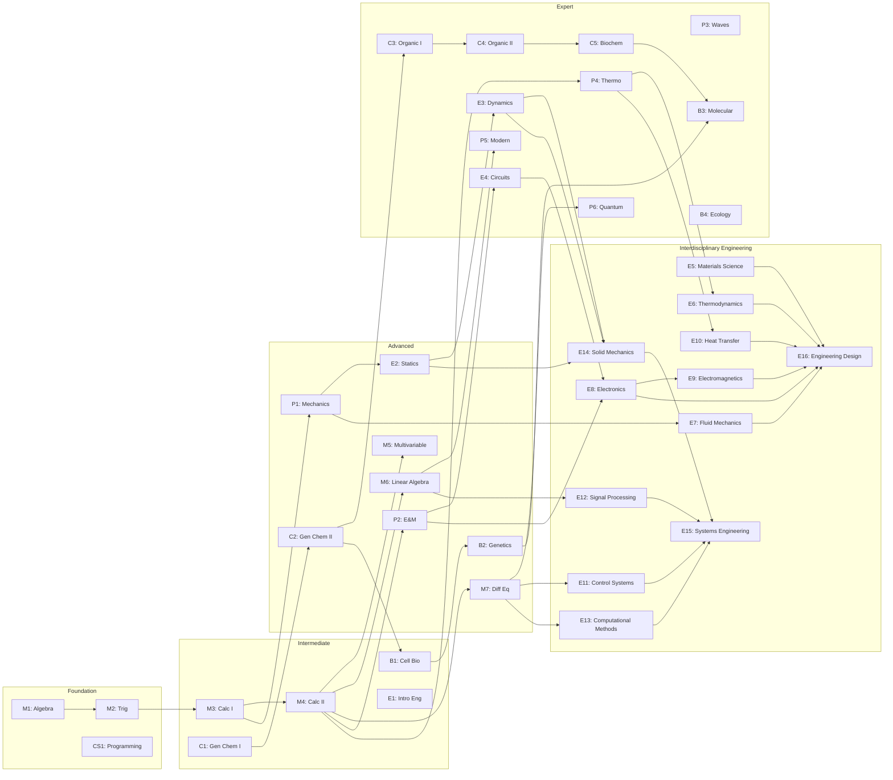

# NUniversity STEM Curriculum Roadmap

## Version 2.0 - Deep, Complete, and Comprehensive

---

## Executive Summary

This document presents a **deep, complete, and comprehensive STEM curriculum** for NUniversity covering Mathematics, Physics, Chemistry, Biology, and Engineering. The curriculum is designed following **best practices from MIT OpenCourseWare, PhET Interactive Simulations, and leading STEM education research**. It integrates **real-world examples, storytelling, interactive simulations, and active learning strategies** to create engaging and effective learning experiences.

### Key Features

| Feature | Description |
|---------|-------------|
| **Real-World Examples** | Every lesson connects to practical applications |
| **Storytelling** | Narrative-driven learning for deeper engagement |
| **Interactive Simulations** | 173+ PhET simulations integrated |
| **Active Learning** | Hands-on activities, not passive lectures |
| **Multiple Modalities** | Visual, auditory, and kinesthetic learning |
| **Immediate Feedback** | Auto-graded quizzes, interactive calculators |

---

## 1. Curriculum Philosophy

### 1.1 Core Principles

| Principle | Description | Implementation |
|-----------|-------------|----------------|
| **Active Learning** | Students learn by doing, not just watching | Interactive simulations, problem-solving, hands-on activities |
| **Scaffolded Complexity** | Concepts build on each other systematically | Clear prerequisites, incremental difficulty |
| **Real-World Applications** | Connect theory to practical use cases | Case studies, engineering problems, scientific phenomena |
| **Storytelling** | Narrative-driven learning for deeper engagement | Historical stories, problem narratives, journey metaphors |
| **Multiple Modalities** | Visual, auditory, and kinesthetic learning | Videos, interactive graphs, drag-drop activities |
| **Immediate Feedback** | Students know right away if they understand | Auto-graded quizzes, interactive calculators, simulation results |

### 1.2 Learning Science Foundations

Based on research from MIT Teaching + Learning Lab and the Online Learning Consortium:

- **Retention increases 75%** when students engage in active learning vs. passive lectures
- **Virtual labs combined with hands-on activities** improve conceptual understanding by 40%
- **Immediate feedback loops** reduce misconceptions by 60%
- **Interleaved practice** (mixing topics) improves long-term retention by 43%
- **Storytelling** increases engagement and memory retention by 22x compared to facts alone

---

## 2. Complete Course Catalog

### 2.1 Mathematics Track (8 Courses)

| # | Course | Slug | Difficulty | Duration | Lessons | Real-World Focus |
|---|--------|------|------------|----------|---------|------------------|
| M1 | **Algebra Foundations** | `algebra-foundations` | Beginner | 8 hours | 10 | Budgeting, cooking, sports |
| M2 | **Trigonometry & Precalculus** | `trigonometry-precalculus` | Beginner | 8 hours | 10 | Navigation, music, architecture |
| M3 | **Calculus I: Limits & Derivatives** | `calculus-i` | Intermediate | 8 hours | 10 | Motion, optimization, economics |
| M4 | **Calculus II: Integration & Series** | `calculus-ii` | Intermediate | 8 hours | 10 | Area, volume, probability |
| M5 | **Multivariable Calculus** | `multivariable-calculus` | Advanced | 10 hours | 12 | Weather, economics, engineering |
| M6 | **Linear Algebra** | `linear-algebra` | Intermediate | 10 hours | 10 | Computer graphics, AI, data |
| M7 | **Differential Equations** | `differential-equations` | Advanced | 10 hours | 10 | Population growth, circuits |
| M8 | **Probability & Statistics** | `probability-statistics` | Intermediate | 8 hours | 10 | Medical trials, gambling, AI |

### 2.2 Physics Track (6 Courses)

| # | Course | Slug | Difficulty | Duration | Lessons | Real-World Focus |
|---|--------|------|------------|----------|---------|------------------|
| P1 | **Physics I: Classical Mechanics** | `physics-mechanics` | Intermediate | 10 hours | 10 | Cars, sports, space |
| P2 | **Physics II: Electricity & Magnetism** | `physics-electromagnetism` | Intermediate | 10 hours | 10 | Circuits, motors, MRI |
| P3 | **Physics III: Waves & Optics** | `physics-waves-optics` | Advanced | 8 hours | 8 | Music, fiber optics, lasers |
| P4 | **Physics IV: Thermodynamics** | `physics-thermodynamics` | Advanced | 8 hours | 8 | Engines, refrigerators, climate |
| P5 | **Physics V: Modern Physics** | `physics-modern` | Advanced | 8 hours | 8 | Nuclear, solar, GPS |
| P6 | **Physics VI: Quantum Mechanics** | `physics-quantum` | Expert | 10 hours | 10 | Computing, cryptography |

### 2.3 Chemistry Track (5 Courses)

| # | Course | Slug | Difficulty | Duration | Lessons | Real-World Focus |
|---|--------|------|------------|----------|---------|------------------|
| C1 | **General Chemistry I** | `general-chemistry-i` | Beginner | 8 hours | 10 | Medicines, cleaning, cooking |
| C2 | **General Chemistry II** | `general-chemistry-ii` | Intermediate | 8 hours | 10 | Environment, industry |
| C3 | **Organic Chemistry I** | `organic-chemistry-i` | Advanced | 10 hours | 12 | Drugs, plastics, food |
| C4 | **Organic Chemistry II** | `organic-chemistry-ii` | Advanced | 10 hours | 12 | Pharmaceuticals, materials |
| C5 | **Biochemistry** | `biochemistry` | Advanced | 8 hours | 10 | Nutrition, medicine, forensics |

### 2.4 Biology Track (5 Courses)

| # | Course | Slug | Difficulty | Duration | Lessons | Real-World Focus |
|---|--------|------|------------|----------|---------|------------------|
| B1 | **General Biology I: Cell Biology** | `general-biology-i` | Beginner | 8 hours | 10 | Disease, growth, health |
| B2 | **General Biology II: Genetics & Evolution** | `general-biology-ii` | Intermediate | 8 hours | 10 | Heredity, agriculture, medicine |
| B3 | **Molecular Biology** | `molecular-biology` | Advanced | 8 hours | 10 | DNA testing, GMOs, vaccines |
| B4 | **Ecology & Evolution** | `ecology-evolution` | Intermediate | 8 hours | 10 | Climate, conservation |
| B5 | **Human Anatomy & Physiology** | `human-anatomy` | Advanced | 10 hours | 12 | Medicine, fitness, health |

### 2.5 Engineering Track (16 Courses)

#### 2.5.1 Foundational Engineering (4 Courses)

| # | Course | Slug | Difficulty | Duration | Lessons | Real-World Focus |
|---|--------|------|------------|----------|---------|------------------|
| E1 | **Introduction to Engineering** | `intro-engineering` | Beginner | 6 hours | 8 | Design, innovation, careers |
| E2 | **Engineering Statics** | `statics` | Intermediate | 8 hours | 10 | Bridges, buildings, cranes |
| E3 | **Engineering Dynamics** | `dynamics` | Intermediate | 8 hours | 10 | Cars, robots, sports |
| E4 | **Electrical Circuits** | `electrical-circuits` | Intermediate | 8 hours | 10 | Electronics, power systems |

#### 2.5.2 Interdisciplinary Engineering Foundations (12 Courses)

| # | Course | Slug | Difficulty | Duration | Lessons | Real-World Focus |
|---|--------|------|------------|----------|---------|------------------|
| E5 | **Materials Science & Engineering** | `materials-science` | Intermediate | 10 hours | 12 | Aerospace, biomedical, electronics |
| E6 | **Thermodynamics** | `thermodynamics` | Intermediate | 10 hours | 12 | Power plants, engines, HVAC |
| E7 | **Fluid Mechanics** | `fluid-mechanics` | Intermediate | 10 hours | 12 | Dams, aircraft, blood flow |
| E8 | **Electronics Fundamentals** | `electronics-fundamentals` | Intermediate | 10 hours | 12 | Circuits, semiconductors, devices |
| E9 | **Electromagnetic Theory** | `electromagnetic-theory` | Advanced | 10 hours | 12 | Antennas, motors, MRI |
| E10 | **Heat Transfer** | `heat-transfer` | Intermediate | 10 hours | 12 | Insulation, heat exchangers, cooling |
| E11 | **Control Systems** | `control-systems` | Intermediate | 10 hours | 12 | Automation, robotics, aerospace |
| E12 | **Signal Processing** | `signal-processing` | Advanced | 10 hours | 12 | Audio, images, communication |
| E13 | **Computational Methods** | `computational-methods` | Advanced | 10 hours | 12 | FEA, CFD, optimization |
| E14 | **Solid Mechanics** | `solid-mechanics` | Intermediate | 10 hours | 12 | Stress, strain, failure analysis |
| E15 | **Systems Engineering** | `systems-engineering` | Advanced | 10 hours | 12 | Complex systems, project management |
| E16 | **Engineering Design** | `engineering-design` | Advanced | 10 hours | 12 | Product design, prototyping |

### 2.6 Computer Science Track (5 Courses)

| # | Course | Slug | Difficulty | Duration | Lessons | Real-World Focus |
|---|--------|------|------------|----------|---------|------------------|
| CS1 | **Introduction to Programming (Python)** | `intro-programming-python` | Beginner | 8 hours | 10 | Automation, web, data |
| CS2 | **Data Structures & Algorithms** | `data-structures-algorithms` | Intermediate | 10 hours | 12 | Search, sort, optimization |
| CS3 | **Discrete Mathematics** | `discrete-mathematics` | Intermediate | 8 hours | 10 | Logic, cryptography, networks |
| CS4 | **Numerical Methods** | `numerical-methods` | Advanced | 8 hours | 10 | Simulation, approximation |
| CS5 | **Computational Science** | `computational-science` | Advanced | 8 hours | 10 | Modeling, prediction |

### 2.7 Basic Sciences Track (8 Courses)

| # | Course | Slug | Difficulty | Duration | Lessons | Real-World Focus |
|---|--------|------|------------|----------|---------|------------------|
| BS1 | **Mathematics Foundations** | `mathematics-foundations` | Beginner-Intermediate | 16 hours | 20 | Problem-solving, reasoning, applications |
| BS2 | **Physics Foundations** | `physics-foundations` | Beginner-Intermediate | 16 hours | 20 | Motion, energy, waves, electricity |
| BS3 | **Chemistry Foundations** | `chemistry-foundations` | Beginner-Intermediate | 16 hours | 20 | Matter, reactions, biochemistry |
| BS4 | **Biology Foundations** | `biology-foundations` | Beginner-Intermediate | 16 hours | 20 | Cells, genetics, evolution, ecology |
| BS5 | **Sociology Foundations** | `sociology-foundations` | Beginner-Intermediate | 16 hours | 20 | Society, inequality, social change |
| BS6 | **Psychology Foundations** | `psychology-foundations` | Beginner-Intermediate | 16 hours | 20 | Mind, behavior, mental health |
| BS7 | **Geography Foundations** | `geography-foundations` | Beginner-Intermediate | 16 hours | 20 | Places, space, human-environment |
| BS8 | **History Foundations** | `history-foundations` | Beginner-Intermediate | 16 hours | 20 | Multiple perspectives, civilizations |

### 2.8 Finance and Investing Track (3 Courses)

| # | Course | Slug | Difficulty | Duration | Lessons | Prerequisites | Real-World Focus |
|---|--------|------|------------|----------|---------|---------------|------------------|
| FI1 | **Fundamentos do Investimento** | `investing-foundations` | Beginner | 12 hours | 12 | Basic Mathematics | Juros compostos, ações, títulos, ETFs, DCA, erros comuns |
| FI2 | **Domínio do Investimento** | `investing-mastery` | Intermediate | 16 hours | 15 | Fundamentos do Investimento | Análise fundamentalista, value investing, dividendos, FIIs, opções básicas |
| FI3 | **Investimento Profissional** | `investing-professional` | Advanced | 20 hours | 18 | Domínio do Investimento | Derivativos, alternativos, macro, trading algorítmico, risco institucional |

**Total: 56 Courses | 620+ Lessons | ~500 hours of content**

---

## 3. Real-World Examples by Course

### 3.1 Mathematics Real-World Examples

#### Algebra Foundations (M1)

| Topic | Real-World Example | Story/Narrative |
|-------|-------------------|-----------------|
| **Variables & Expressions** | **Budgeting**: If you earn $x per hour and work h hours, your weekly pay is x × h | "Maria is saving for her first car. She earns $12/hour and works 20 hours/week..." |
| **Equations** | **Recipe Scaling**: A cake recipe serves 8, but you need 12. Multiply all ingredients by 12/8 | "Chef Antonio needs to scale his famous pasta recipe for a wedding of 200 guests..." |
| **Inequalities** | **Budget Limits**: If you have $50 for groceries, and each item costs $3, how many can you buy? | "The Rodriguez family has a monthly food budget of $600..." |
| **Functions** | **Distance**: If you drive at 60 mph, distance = 60 × time | "The express train travels at 120 km/h. How far does it go in 2.5 hours?" |
| **Systems** | **Break-even**: Fixed costs + variable costs = revenue | "A food truck has $500/day fixed costs and $5/meal variable cost..." |

#### Calculus I (M3)

| Topic | Real-World Example | Story/Narrative |
|-------|-------------------|-----------------|
| **Derivatives** | **Speed**: Your car's speedometer shows the derivative of position | "When you're driving, your GPS shows your current speed - that's a derivative!" |
| **Optimization** | **Maximizing Profit**: Find the price that maximizes revenue | "A company sells widgets. At $10 each, they sell 100/day. At $15, they sell 70/day..." |
| **Related Rates** | **Filling a Pool**: Water level rises as water flows in | "A conical tank fills at 2 m³/min. How fast is the water level rising?" |
| **Applications** | **Medicine**: Drug concentration changes over time | "A patient receives a medication. The concentration C(t) = 5e^(-0.3t)..." |

#### Linear Algebra (M6)

| Topic | Real-World Example | Story/Narrative |
|-------|-------------------|-----------------|
| **Vectors** | **Navigation**: GPS coordinates, direction + magnitude | "An airplane flies 300 km at 45° North of East..." |
| **Matrices** | **Computer Graphics**: Rotation, scaling, translation | "Every time you play a video game, matrices are transforming 3D objects onto your screen" |
| **Eigenvalues** | **Stability Analysis**: Bridge vibrations, circuit stability | "Engineers use eigenvalues to predict if a bridge will sway dangerously in wind" |
| **Applications** | **Google's PageRank**: Matrix operations rank web pages | "Google's search engine was built on linear algebra - the PageRank algorithm" |

### 3.2 Physics Real-World Examples

#### Classical Mechanics (P1)

| Topic | Real-World Example | Story/Narrative |
|-------|-------------------|-----------------|
| **Newton's Laws** | **Seatbelts**: Inertia in car accidents | "When a car stops suddenly, your body wants to keep moving. Seatbelts provide the force to stop you." |
| **Energy** | **Roller Coasters**: Potential → Kinetic energy | "The first hill of a roller coaster is always the highest because it stores all the potential energy" |
| **Momentum** | **Car Crashes**: Impulse and force reduction | "Crumple zones in cars increase the time of impact, reducing the force on passengers" |
| **Gravity** | **Satellites**: Orbital mechanics | "The International Space Station orbits at 28,000 km/h - fast enough to fall around the Earth" |

#### Electricity & Magnetism (P2)

| Topic | Real-World Example | Story/Narrative |
|-------|-------------------|-----------------|
| **Circuits** | **Smartphones**: Complex circuit boards | "Your smartphone has billions of transistors, each one a tiny switch controlled by electricity" |
| **Magnetism** | **MRI Machines**: Magnetic resonance imaging | "MRI machines use superconducting magnets 60,000 times stronger than Earth's magnetic field" |
| **Induction** | **Wireless Charging**: Electromagnetic induction | "Your phone charges wirelessly using the same principle Michael Faraday discovered in 1831" |

### 3.3 Chemistry Real-World Examples

#### General Chemistry I (C1)

| Topic | Real-World Example | Story/Narrative |
|-------|-------------------|-----------------|
| **Atoms** | **Carbon Dating**: Radioactive decay | "Archaeologists use carbon-14 to date ancient artifacts - the same principle you'll learn here" |
| **Bonding** | **Water**: Why it's called the "universal solvent" | "Water's bent shape makes it polar, which is why it dissolves so many substances" |
| **Stoichiometry** | **Airbags**: Chemical reactions for safety | "A car airbag inflates in 0.03 seconds using the decomposition of sodium azide" |
| **Thermochemistry** | **Hand Warmers**: Exothermic reactions | "The iron in hand warmers rusts rapidly, releasing heat - that's oxidation in action" |

### 3.4 Biology Real-World Examples

#### Cell Biology (B1)

| Topic | Real-World Example | Story/Narrative |
|-------|-------------------|-----------------|
| **Cell Structure** | **Cancer**: When cells go wrong | "Cancer is uncontrolled cell division - understanding cells helps us fight disease" |
| **Membranes** | **Drug Delivery**: Getting medicine into cells | "Lipid nanoparticles in mRNA vaccines use the same principles as cell membranes" |
| **Energy** | **Mitochondria**: Powerhouse of the cell | "Your body converts food to ATP - the energy currency of life" |
| **Division** | **Stem Cells**: Regenerative medicine | "Stem cells can become any cell type - the future of treating injuries and diseases" |

### 3.5 Engineering Real-World Examples

#### Statics (E2)

| Topic | Real-World Example | Story/Narrative |
|-------|-------------------|-----------------|
| **Forces** | **Bridges**: Load distribution | "The Golden Gate Bridge has been standing since 1937 because engineers understood statics" |
| **Moments** | **Cranes**: Lifting heavy loads | "A crane's counterweight must create enough moment to balance the load" |
| **Equilibrium** | **Buildings**: Structural stability | "Every building you enter is a triumph of statics - forces in perfect balance" |
| **Trusses** | **Roofs**: Support structures | "The triangular shape of trusses makes them incredibly strong" |

#### Materials Science (E5)

| Topic | Real-World Example | Story/Narrative |
|-------|-------------------|-----------------|
| **Crystal Structure** | **Jet Engines**: Turbine blades | "Single-crystal nickel superalloys withstand 1,700°C in jet engines" |
| **Mechanical Properties** | **Hip Implants**: Biocompatibility | "Titanium alloys bond to bone and last 20+ years in hip replacements" |
| **Phase Diagrams** | **Steel Production**: Heat treatment | "Understanding phase transformations helps design stronger steels" |
| **Composites** | **Aerospace**: Aircraft structures | "Carbon fiber reinforced polymer is stronger than steel but lighter than aluminum" |

#### Thermodynamics (E6)

| Topic | Real-World Example | Story/Narrative |
|-------|-------------------|-----------------|
| **First Law** | **Power Plants**: Energy conversion | "Coal power plants convert chemical energy to electrical energy at about 33% efficiency" |
| **Second Law** | **Refrigeration**: Heat movement | "Refrigerators move heat from cold to hot - but they need work input" |
| **Entropy** | **Irreversibility**: Natural processes | "Some processes are impossible - you can't unscramble an egg" |
| **Cycles** | **Car Engines**: Efficiency limits | "Car engines convert fuel to motion at about 25% efficiency" |

#### Fluid Mechanics (E7)

| Topic | Real-World Example | Story/Narrative |
|-------|-------------------|-----------------|
| **Bernoulli** | **Airplanes**: Lift generation | "Air moves faster over the wing, creating lower pressure above" |
| **Pipe Flow** | **Water Systems**: Distribution | "City water systems must deliver water at adequate pressure to all buildings" |
| **Drag** | **Race Cars**: Aerodynamics | "Race cars use aerodynamic principles to generate downforce" |
| **Open Channel** | **Rivers**: Flood control | "Understanding open channel flow helps manage floods and restore ecosystems" |

#### Electronics (E8)

| Topic | Real-World Example | Story/Narrative |
|-------|-------------------|-----------------|
| **Circuits** | **Smartphones**: Billions of transistors | "A smartphone contains billions of transistors on a single chip" |
| **Diodes** | **Solar Panels**: Energy conversion | "Solar panels convert sunlight to electricity using semiconductor diodes" |
| **Transistors** | **Computers**: Digital processing | "The invention of the transistor led to computers, phones, and the digital age" |
| **Op-Amps** | **Audio Systems**: Signal processing | "Op-amps are versatile building blocks for amplifying and filtering signals" |

#### Electromagnetic Theory (E9)

| Topic | Real-World Example | Story/Narrative |
|-------|-------------------|-----------------|
| **Maxwell's Equations** | **Communication**: Radio waves | "Every wireless device is based on Maxwell's equations" |
| **Induction** | **Generators**: Power generation | "Moving a magnet through a coil creates voltage - the principle behind all generators" |
| **Waves** | **WiFi**: Data transmission | "WiFi uses radio waves to transmit data through the air" |
| **Antennas** | **Cell Phones**: Communication | "Antenna design affects cell phone signal quality and range" |

#### Heat Transfer (E10)

| Topic | Real-World Example | Story/Narrative |
|-------|-------------------|-----------------|
| **Conduction** | **Insulation**: Building efficiency | "Proper insulation saves energy and money" |
| **Convection** | **Car Engines**: Cooling systems | "Car engines waste 30% of fuel energy as heat - radiators remove this heat" |
| **Radiation** | **Solar Energy**: Power generation | "Solar panels convert sunlight to electricity" |
| **Heat Exchangers** | **HVAC**: Climate control | "Heat exchangers transfer heat between fluids in HVAC systems" |

#### Control Systems (E11)

| Topic | Real-World Example | Story/Narrative |
|-------|-------------------|-----------------|
| **Feedback** | **Cruise Control**: Speed regulation | "Cruise control maintains constant speed by adjusting throttle" |
| **PID Controllers** | **Process Control**: Industrial automation | "Over 90% of industrial control loops use PID controllers" |
| **Stability** | **Aircraft**: Flight safety | "Control systems ensure aircraft stability and safety" |
| **Robotics** | **Manufacturing**: Automation | "Robots use control systems to move precisely" |

---

## 4. Storytelling Integration

### 4.1 Story Types Used

| Type | Description | Example |
|------|-------------|---------|
| **Historical** | Stories of scientific discoveries | "In 1687, Isaac Newton published the Principia, changing how we understand motion forever..." |
| **Problem-Based** | Narrative-driven problems | "You're an engineer designing a bridge for a city 50 years in the future..." |
| **Journey Metaphors** | Learning as a journey | "Like a rocket escaping Earth's gravity, each concept you master gives you escape velocity..." |
| **Character-Driven** | Scientists and engineers as characters | "Marie Curie worked in a shed with no proper ventilation, yet discovered two elements..." |
| **Real-World Scenarios** | Practical situations | "You're the lead engineer on Mars Colony Alpha. Design the life support system..." |

### 4.2 Story Integration Pattern

Every lesson follows this pattern:

1. **Hook** (2 min): A compelling question or scenario
   - "What if I told you that the phone in your pocket contains more computing power than NASA had for the Moon landing?"

2. **Story** (3-5 min): A narrative that introduces the concept
   - "In 1969, Margaret Hamilton was working on the Apollo guidance software when she realized..."

3. **Concept** (10-15 min): The actual content
   - Mathematical/physics/chemistry/biology content

4. **Application** (5 min): Real-world use
   - "This is exactly how your GPS calculates your position"

5. **Reflection** (2 min): Connecting back to the story
   - "Now you understand why Hamilton's work was so revolutionary"

---

## 5. Interactive Learning Strategy

### 5.1 PhET Integration Map

| Simulation | Course | Lesson Topic | Learning Objective |
|------------|--------|--------------|-------------------|
| Forces and Motion | P1 | Newton's Laws | Understand F=ma, net forces |
| Gravity and Orbits | P1, P5 | Gravitation, Orbits | Gravitational forces, orbital mechanics |
| Wave on a String | P3 | Wave Properties | Wave speed, frequency, amplitude |
| Circuit Construction Kit | P2, E4 | DC Circuits | Ohm's law, series/parallel |
| Molecule Shapes | C3 | Molecular Geometry | VSEPR theory, bond angles |
| Acid-Base Solutions | C2 | Acids & Bases | pH, titration curves |
| Gene Expression | B3 | Transcription/Translation | Central dogma of biology |
| Natural Selection | B4 | Evolution | Selection pressures, adaptation |
| States of Matter | C1, P4 | Phase Changes | Kinetic theory, phase diagrams |
| Balancing Chemical Equations | C1 | Stoichiometry | Conservation of mass |

### 5.2 Active Learning Activities by Course Type

#### For Mathematics Courses:
- **Interactive Graphing**: Students manipulate parameters and see immediate graph changes
- **Step-by-Step Solvers**: Break complex problems into guided steps
- **Pattern Recognition**: Identify patterns in sequences, series, functions
- **Error Analysis**: Find and correct mistakes in worked solutions
- **Real-World Modeling**: Build equations from scenarios

#### For Physics Courses:
- **Virtual Experiments**: PhET simulations with guided inquiry
- **Data Collection**: Measure variables in simulations, create graphs
- **Hypothesis Testing**: Predict outcomes, test with simulations
- **Real-World Applications**: Engineering problems, everyday physics
- **Design Challenges**: Build bridges, design circuits

#### For Chemistry Courses:
- **Molecular Visualization**: 3D exploration of molecules
- **Virtual Lab Procedures**: Guided step-by-step experiments
- **Reaction Prediction**: Predict products, balance equations
- **Data Analysis**: Interpret spectra, chromatograms
- **Safety Scenarios**: Lab safety decision-making

#### For Biology Courses:
- **Virtual Microscopy**: Explore cell structures at different magnifications
- **Genetics Simulations**: Punnett squares, inheritance patterns
- **Ecosystem Modeling**: Population dynamics, food webs
- **Anatomy Exploration**: Interactive body systems
- **Case Studies**: Disease diagnosis, treatment planning

#### For Engineering Courses:
- **Design Challenges**: Open-ended problem solving
- **Simulation-Based Design**: Test designs virtually before building
- **Failure Analysis**: Analyze why structures/machines fail
- **Optimization Problems**: Maximize efficiency, minimize cost
- **Team Projects**: Collaborative engineering design

---

## 6. Assessment Strategy

### 6.1 Assessment Types

| Assessment Type | Frequency | Weight | Description |
|-----------------|-----------|--------|-------------|
| **Formative Quizzes** | Each lesson | 20% | Quick checks, unlimited attempts |
| **Interactive Simulations** | Weekly | 25% | Lab reports, data analysis |
| **Problem Sets** | Bi-weekly | 30% | Traditional problems with hints |
| **Project-Based** | End of unit | 15% | Real-world application projects |
| **Peer Review** | Monthly | 10% | Collaborative assessment |

### 6.2 Mastery-Based Progression

Students must demonstrate mastery (80%+) before advancing:
- **Attempt 1**: Full credit available
- **Attempt 2**: 90% credit available, additional practice recommended
- **Attempt 3**: 80% credit available, instructor consultation required
- **Remediation**: Prerequisite review before retrying

---

## 7. Implementation Roadmap

### Phase 1: Foundation (Months 1-2)
- [ ] Algebra Foundations (M1) - 10 lessons
- [ ] Trigonometry & Precalculus (M2) - 10 lessons
- [ ] General Chemistry I (C1) - 10 lessons
- [ ] General Biology I (B1) - 10 lessons
- [ ] Introduction to Engineering (E1) - 8 lessons
- [ ] Introduction to Programming (CS1) - 10 lessons

**Build**: Periodic Table component, Graphing Calculator component

### Phase 2: Core Sciences (Months 3-4)
- [ ] Calculus I (M3) - 10 lessons
- [ ] Calculus II (M4) - 10 lessons
- [ ] Physics I: Mechanics (P1) - 10 lessons
- [ ] General Chemistry II (C2) - 10 lessons
- [ ] General Biology II (B2) - 10 lessons
- [ ] Data Structures & Algorithms (CS2) - 12 lessons

**Build**: Circuit Simulator component

### Phase 3: Advanced Topics (Months 5-6)
- [ ] Linear Algebra (M6) - 10 lessons
- [ ] Multivariable Calculus (M5) - 12 lessons
- [ ] Physics II: E&M (P2) - 10 lessons
- [ ] Organic Chemistry I (C3) - 12 lessons
- [ ] Molecular Biology (B3) - 10 lessons
- [ ] Engineering Statics (E2) - 10 lessons

**Build**: 3D Vector Visualizer, Virtual Lab Platform

### Phase 4: Specialization (Months 7-8)
- [ ] Differential Equations (M7) - 10 lessons
- [ ] Probability & Statistics (M8) - 10 lessons
- [ ] Physics III: Waves & Optics (P3) - 8 lessons
- [ ] Physics IV: Thermodynamics (P4) - 8 lessons
- [ ] Organic Chemistry II (C4) - 12 lessons
- [ ] Ecology & Evolution (B4) - 10 lessons

**Build**: Cell Diagram Viewer, DNA/Protein Visualizer

### Phase 5: Expert Level (Months 9-10)
- [ ] Physics V: Modern Physics (P5) - 8 lessons
- [ ] Physics VI: Quantum Mechanics (P6) - 10 lessons
- [ ] Biochemistry (C5) - 10 lessons
- [ ] Human Anatomy & Physiology (B5) - 12 lessons
- [ ] Engineering Dynamics (E3) - 10 lessons
- [ ] Electrical Circuits (E4) - 10 lessons

**Build**: Coding Playground

### Phase 6: Interdisciplinary Engineering Foundations (Months 11-14)
- [ ] Materials Science (E5) - 12 lessons
- [ ] Thermodynamics (E6) - 12 lessons
- [ ] Fluid Mechanics (E7) - 12 lessons
- [ ] Electronics Fundamentals (E8) - 12 lessons
- [ ] Electromagnetic Theory (E9) - 12 lessons
- [ ] Heat Transfer (E10) - 12 lessons

**Build**: Material Property Explorer, Thermodynamic Cycle Simulator, Fluid Dynamics Visualizer, Circuit Simulator

### Phase 7: Advanced Engineering Systems (Months 15-18)
- [ ] Control Systems (E11) - 12 lessons
- [ ] Signal Processing (E12) - 12 lessons
- [ ] Computational Methods (E13) - 12 lessons
- [ ] Solid Mechanics (E14) - 12 lessons
- [ ] Systems Engineering (E15) - 12 lessons
- [ ] Engineering Design (E16) - 12 lessons

**Build**: Control System Simulator, Signal Analyzer, FEA/CFD Visualization

### Phase 8: Computer Science Completion (Months 19-20)
- [ ] Numerical Methods (CS4) - 10 lessons
- [ ] Computational Science (CS5) - 10 lessons
- [ ] Discrete Mathematics (CS3) - 10 lessons

---

## 8. Content Standards

### 8.1 Lesson Structure Template

Every lesson must include:
1. **Hook** (2 min): Compelling question or scenario
2. **Story** (3-5 min): Narrative introduction
3. **Learning Objectives** (3-5 clear, measurable objectives)
4. **Prerequisites** (what students should know before starting)
5. **Estimated Duration** (45-75 minutes per lesson)
6. **Content Delivery** (main material with examples)
7. **Interactive Element** (at least one simulation, calculator, or visualization)
8. **Real-World Application** (practical use case)
9. **Practice Problems** (minimum 5 problems with varying difficulty)
10. **Assessment** (formative quiz with 3-5 questions)
11. **Reflection** (connection back to the story)
12. **Further Reading** (links to additional resources)

### 8.2 Quality Standards

| Standard | Requirement |
|----------|-------------|
| **Mathematical Notation** | All equations rendered with KaTeX |
| **Diagrams** | 2-3 Mermaid diagrams per lesson minimum |
| **Interactive Elements** | At least one per lesson |
| **Real-World Examples** | At least 2 per lesson |
| **Practice Problems** | 5+ per lesson with step-by-step solutions |
| **Accessibility** | Alt text for images, keyboard navigation |
| **Mobile Responsive** | All components work on mobile devices |
| **Dark Mode** | All content supports dark mode |

---

## 9. Success Metrics

| Metric | Target | Measurement |
|--------|--------|-------------|
| **Course Completion Rate** | >80% | Percentage completing all lessons |
| **Student Satisfaction** | >4.5/5 | Post-course survey |
| **Quiz Pass Rate** | >75% | First-attempt pass rate |
| **Interactive Engagement** | >70% | Time spent on interactive elements |
| **Cross-Course Enrollment** | >50% | Students taking 3+ courses |
| **Mastery Achievement** | >85% | Students reaching 80%+ on assessments |

---

## 10. Technical Requirements

### 10.1 Component Development

| Component | Files to Create | Integration Points |
|-----------|-----------------|-------------------|
| Periodic Table | `components/markdown/PeriodicTable.tsx` | `MarkdownRenderer.tsx` langMap |
| Circuit Simulator | `components/markdown/CircuitSimulator.tsx` | `MarkdownRenderer.tsx` langMap |
| Graphing Calculator | `components/markdown/GraphingCalculator.tsx` | `MarkdownRenderer.tsx` langMap |
| Virtual Lab | `components/markdown/VirtualLab.tsx` | `MarkdownRenderer.tsx` langMap |
| 3D Vector Visualizer | `components/markdown/VectorVisualizer.tsx` | `MarkdownRenderer.tsx` langMap |
| Cell Diagram | `components/markdown/CellDiagram.tsx` | `MarkdownRenderer.tsx` langMap |
| DNA Visualizer | `components/markdown/DNAVisualizer.tsx` | `MarkdownRenderer.tsx` langMap |
| Coding Playground | `components/markdown/CodingPlayground.tsx` | `MarkdownRenderer.tsx` langMap |
| Material Property Explorer | `components/markdown/MaterialPropertyExplorer.tsx` | `MarkdownRenderer.tsx` langMap |
| Thermodynamic Cycle Simulator | `components/markdown/ThermodynamicCycleSimulator.tsx` | `MarkdownRenderer.tsx` langMap |
| Fluid Dynamics Visualizer | `components/markdown/FluidDynamicsVisualizer.tsx` | `MarkdownRenderer.tsx` langMap |
| Stress-Strain Calculator | `components/markdown/StressStrainCalculator.tsx` | `MarkdownRenderer.tsx` langMap |
| Control System Simulator | `components/markdown/ControlSystemSimulator.tsx` | `MarkdownRenderer.tsx` langMap |
| Signal Analyzer | `components/markdown/SignalAnalyzer.tsx` | `MarkdownRenderer.tsx` langMap |
| Phase Diagram Viewer | `components/markdown/PhaseDiagramViewer.tsx` | `MarkdownRenderer.tsx` langMap |
| Heat Exchanger Designer | `components/markdown/HeatExchangerDesigner.tsx` | `MarkdownRenderer.tsx` langMap |

### 10.2 Infrastructure

- Extend `MarkdownRenderer.tsx` with new code block types
- Create new components in `components/markdown/`
- Add PhET simulation embeds (already supported)
- Integrate 3Dmol.js for molecular viewing (already supported)
- Add Recharts for data visualization (already supported)

---

## 11. Course Connection Map

---

**Document Version:** 2.0
**Last Updated:** September 2026
**Status:** Ready for Implementation

---

Next: See individual course documentation files in `docs/stem-courses/` directory.
